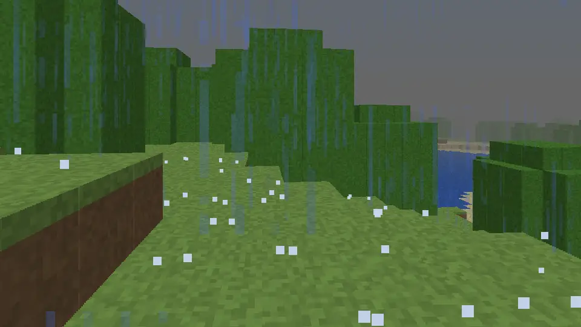
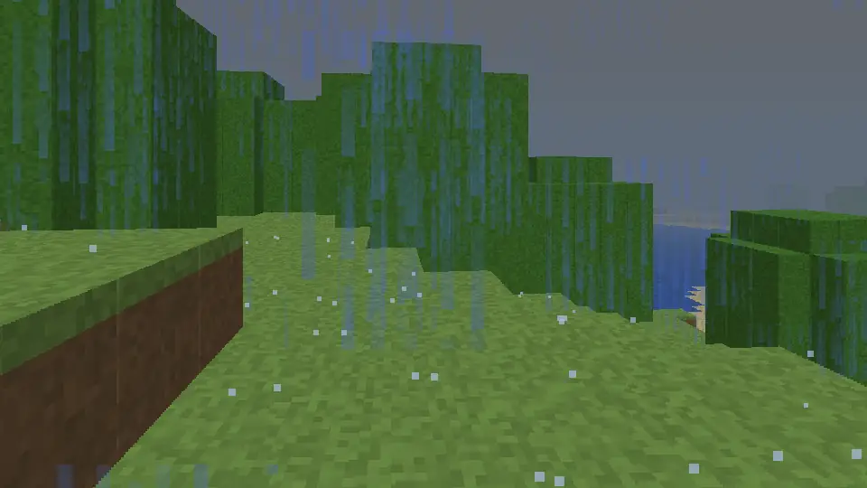
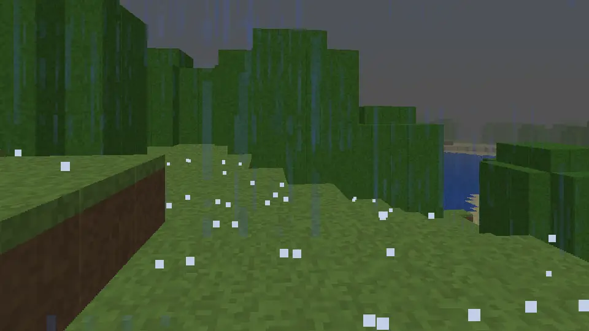
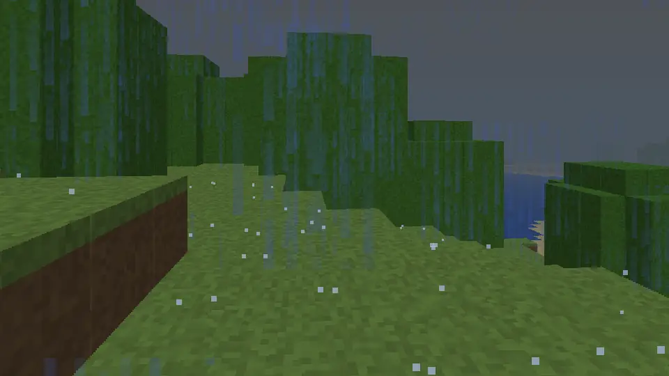
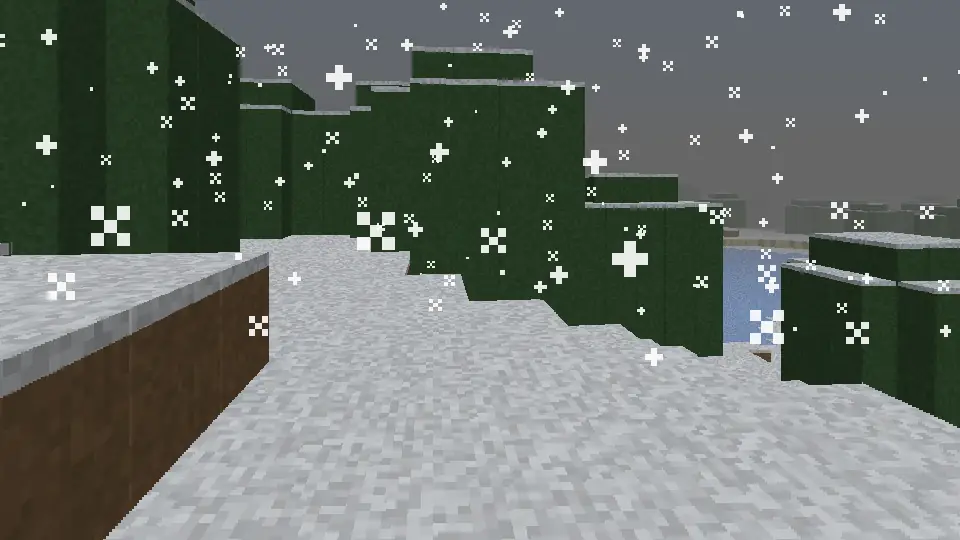
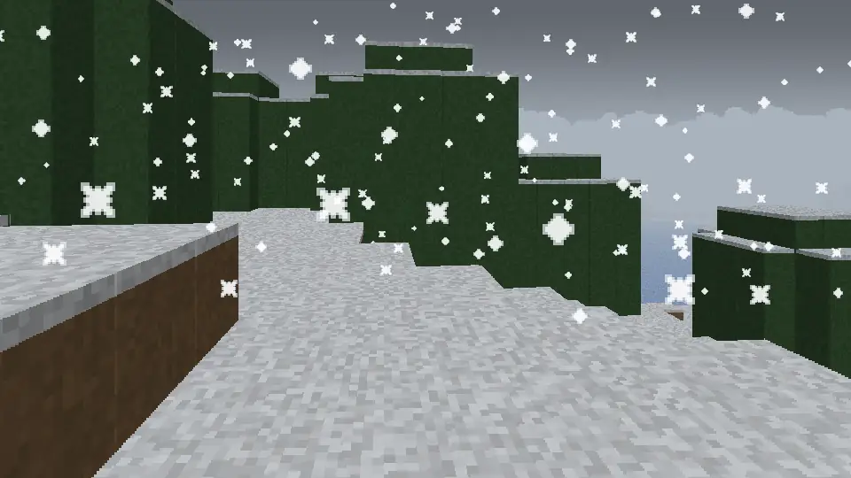
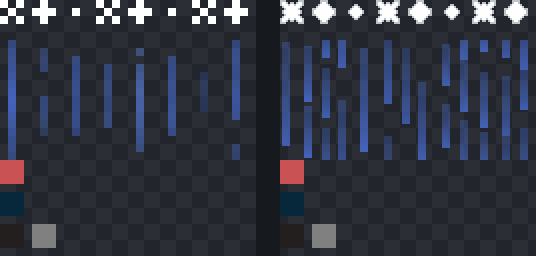
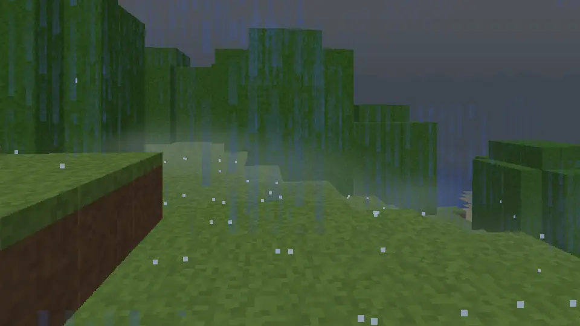
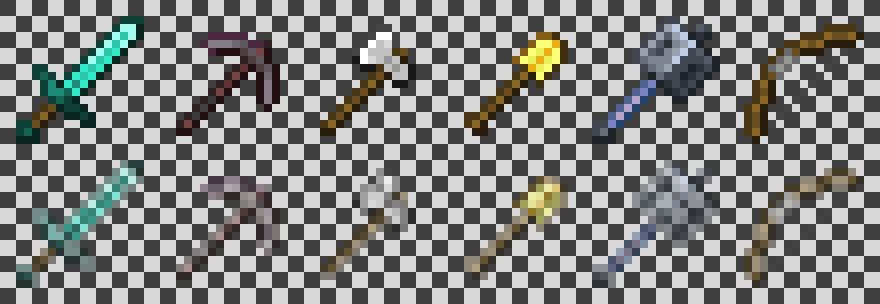

# Pack documentation

What each pack in this repo does, how to use it, and how to configure it.

> **Keep this file up to date.** Any change to a pack's behavior, commands or `config.js` must update this file in the same commit. `npm run check` fails if a pack, command, config option or `### How to use` section is missing from this file (see [Keeping this file current](#keeping-this-file-current)).
>
> **This file is also the players' documentation.** The [Our realm](https://mc.nish.software/realm/) page on mc.nish.software is generated from it (in the `nishant/hosting` repo: `cd minecraft && node tools/pack-docs.mjs`). Every pack section is published, plus the sections marked `<!-- on the site -->`. Write in plain American English, and quote in-game text and ids exactly as the code has them (in backticks), even where the game text is British (`Distance travelled`). See [Publishing to mc.nish.software](#publishing-to-mcnishsoftware).

## Contents

- [Common to all packs](#common-to-all-packs)
  - [Requirements](#requirements)
  - [Installing from mc.nish.software](#installing-from-mcnishsoftware)
  - [Installing on a Realm](#installing-on-a-realm)
  - [Commands](#commands)
  - [Two ways to configure](#two-ways-to-configure)
  - [Updating a pack](#updating-a-pack)
  - [Formatting codes](#formatting-codes)
- [Realm Help — `help_bp`](#realm-help--help_bp)
- [Realm Settings — `settings_bp`](#realm-settings--settings_bp)
- [Welcome Message — `welcome_bp`](#welcome-message--welcome_bp)
- [Low Durability Warning — `durability_bp`](#low-durability-warning--durability_bp)
- [AFK + Smart Sleep — `afk_bp`](#afk--smart-sleep--afk_bp)
- [Stats & Leaderboards — `stats_bp`](#stats--leaderboards--stats_bp)
- [Realm News & Tips — `news_bp`](#realm-news--tips--news_bp)
- [Creeper Guard — `guard_bp`](#creeper-guard--guard_bp)
- [Phantom Opt-out — `phantom_bp`](#phantom-opt-out--phantom_bp)
- [Right-click Harvest — `harvest_bp`](#right-click-harvest--harvest_bp)
- [Farm Loader — `farm_bp`](#farm-loader--farm_bp)
- [Quick Stack & Sort — `stash_bp`](#quick-stack--sort--stash_bp)
- [Chest Finder — `find_bp`](#chest-finder--find_bp)
- [Land Claims — `claims_bp`](#land-claims--claims_bp)
- [Death Point — `death_bp`](#death-point--death_bp)
- [Hotbar Refill — `refill_bp`](#hotbar-refill--refill_bp)
- [Coordinates HUD — `hud_bp`](#coordinates-hud--hud_bp)
- [Mob Health — `mobhp_bp`](#mob-health--mobhp_bp)
- [Elytra HUD — `elytra_bp`](#elytra-hud--elytra_bp)
- [Realm Mail — `mail_bp`](#realm-mail--mail_bp)
- [Nicknames — `nick_bp`](#nicknames--nick_bp)
- [Daily Quests — `quests_bp`](#daily-quests--quests_bp)
- [Milestones — `milestones_bp`](#milestones--milestones_bp)
- [Community Goals — `goals_bp`](#community-goals--goals_bp)
- [Fast Leaf Decay — `leaves_bp`](#fast-leaf-decay--leaves_bp)
- [Lag Cleanup — `cleanup_bp`](#lag-cleanup--cleanup_bp)
- [Chairs — `chairs_bp`](#chairs--chairs_bp)
- [Townsfolk — `npc_bp`](#townsfolk--npc_bp)
- [Crowns — `crowns_bp`](#crowns--crowns_bp)
- [Merchant Caravan — `caravan_bp`](#merchant-caravan--caravan_bp)
- [Story Questlines — `saga_bp`](#story-questlines--saga_bp)
- [Guilds & Reputation — `guilds_bp`](#guilds--reputation--guilds_bp)
- [Bounty Board — `bounty_bp`](#bounty-board--bounty_bp)
- [Champions — `elite_bp`](#champions--elite_bp)
- [Skills — `skills_bp`](#skills--skills_bp)
- [Parties — `party_bp`](#parties--party_bp)
- [Titles & Trails — `titles_bp`](#titles--trails--titles_bp)
- [Relics — `relics_bp`](#relics--relics_bp)
- [Field Journal — `journal_bp`](#field-journal--journal_bp)
- [Fishing 2.0 — `fishing_bp`](#fishing-20--fishing_bp)
- [Treasure Maps & Riddles — `maps_bp`](#treasure-maps--riddles--maps_bp)
- [Waystones & Inns — `waystone_bp`](#waystones--inns--waystone_bp)
- [Expeditions — `expedition_bp`](#expeditions--expedition_bp)
- [Town Projects — `town_bp`](#town-projects--town_bp)
- [Weather Almanac — `weather_bp`](#weather-almanac--weather_bp)
- [Regional Weather — `climate_bp`](#regional-weather--climate_bp)
- [Storm Chasing — `storm_bp`](#storm-chasing--storm_bp)
- [Tornadoes — `tornado_bp`](#tornadoes--tornado_bp)
- [Rainbows & the Pot of Gold — `rainbow_bp`](#rainbows--the-pot-of-gold--rainbow_bp)
- [Aurora & Shooting Stars — `night_bp`](#aurora--shooting-stars--night_bp)
- [Meteor Strikes — `meteor_bp`](#meteor-strikes--meteor_bp)
- [Blood Moon & Harvest Moon — `moon_bp`](#blood-moon--harvest-moon--moon_bp)
- [Realistic Rain — `rain_rp`](#realistic-rain--rain_rp)
- [Rain Extras — `rain_bp`](#rain-extras--rain_bp)
- [Realm Skies — `sky_rp`](#realm-skies--sky_rp)
- [Translucent Tools — `translucent_rp`](#translucent-tools--translucent_rp)
- [Bundling packs into one](#bundling-packs-into-one)
- [How the packs work together](#how-the-packs-work-together)
- [Troubleshooting](#troubleshooting)
- [Keeping this file current](#keeping-this-file-current)
- [Publishing to mc.nish.software](#publishing-to-mcnishsoftware)

---

## Common to all packs

### Requirements

| | |
|---|---|
| Minecraft | Bedrock **1.21.100+** (`min_engine_version`) |
| Script API | `@minecraft/server` **2.1.0**, `@minecraft/server-ui` **2.0.0** (stable) |
| Experiments | **None.** Only stable APIs are used, so no experimental toggles are needed on the Realm |
| Cheats | **Not required** for any command (`cheatsRequired: false`) |
| Achievements | Any non-Marketplace behavior pack turns off achievements for the world (that's how Bedrock works) |

### Installing from mc.nish.software
<!-- on the site -->

The realm runs everything as one pack, **Realm Bundle**, and that is the download to pick. To install or update it:

1. **Download** the latest Realm Bundle `.mcpack` from [mc.nish.software/realm](https://mc.nish.software/realm/) on the device you play on (Windows, phone or tablet) and open it. Minecraft starts and imports it as "Realm Bundle".
2. **Open the realm's settings** (the pencil next to the realm), go to **Behavior Packs**, find Realm Bundle under **Available** and activate it. Minecraft uploads it to the realm.
3. **Join** once the realm restarts. The welcome popup and the `/realm:` commands mean it's running.

**Updating:** download and open the newer version, then check that the realm's active Realm Bundle shows the new version. If it still shows the old one, deactivate it and activate it again so the new version uploads. Nothing is lost: in-game settings and stats are stored in the world. Version numbers are the build date and time in UTC (`YYYY.MMDD.HHMM`, without leading zeros, so 5 January at 09:05 is `2026.105.905`), so every build is higher than the last, which Minecraft needs to treat it as an update.

**Standalone packs:** four packs are never in the Realm Bundle and are made to run next to it: [Realistic Rain](#realistic-rain--rain_rp), [Realm Skies](#realm-skies--sky_rp) and [Translucent Tools](#translucent-tools--translucent_rp) (resource packs) and [Rain Extras](#rain-extras--rain_bp) (a behavior pack). Download each from its card under **Standalone packs** and open it, then in the realm's settings activate Realistic Rain, Realm Skies and Translucent Tools under **Resource Packs**, at the top of the list, and Rain Extras under **Behavior Packs**, next to the Realm Bundle. Players get them automatically when they join. Realm Skies draws the tornadoes, rainbows, aurora, shooting stars, meteors, sandstorms, blizzards, moon fogs and trails of the bundle's sky packs: without it those still happen, but you can't see them.

**Only some features?** Every feature is also its own pack, downloaded from its card or the "one at a time" list under the Realm Bundle download, and activated the same way. Use **either** the Realm Bundle **or** single packs, never both: the same commands would be registered twice and fail to load. (The standalone packs above aren't in the bundle, so they go with either.) Switching between them starts the features' in-game settings over (welcome and news text, tips, settings from `/realm:config`, per-player choices, remembered chests, zones and farms); stats on the scoreboard are kept. Single packs use ordinary version numbers (`1.0.0`) that go up whenever that pack changes.

### Installing on a Realm

For whoever builds the packs from this repo:

1. Build the packs with `npm run build` (one `dist/<folder>.mcpack` per pack), or `npm run bundle -- --all` for a single bundle.
2. Open the `.mcpack` on a device with Minecraft. It imports automatically.
3. Go to **Play → Realms → ✏️ Edit Realm → Behavior Packs** and move the pack from **Available** to **Active**. A resource pack (`rain_rp`, `sky_rp`, `translucent_rp`) goes under **Resource Packs** instead, at the top of the active list.
   *Another way:* download the Realm world, activate the pack under the world's **Behavior Packs**, and upload the world again.
4. Rejoin. Commands are registered when the world loads.

> ⚠️ Activate **either** the individual packs **or** a bundle that contains them, never both. Otherwise every command is registered twice, and the duplicate commands fail to load. Standalone packs (listed in `tools/standalone.json`, like `rain_bp`) are never in a bundle: activate them next to it.

### Commands

- **Every command starts with `/realm:`**, e.g. `/realm:welcome`, `/realm:stats`. Type `/realm` to see all of them in autocomplete, or run `/realm:help` for a page that explains each one, with usage.
- All packs share the `realm` namespace because Bedrock requires **one command namespace per add-on**. A bundle is one add-on, so if packs used different namespaces, only the first pack's commands would register and the rest would show as "unknown command". `npm run check` and the bundler both enforce this.
- **Everyone** commands work for all players. **Ops** commands (permission level `GameDirectors`) only work for, and are only shown to, operators.

### Two ways to configure

| | Where | Who | Takes effect | Notes |
|---|---|---|---|---|
| **In-game, every pack** | `/realm:config` ([Realm Settings](#realm-settings--settings_bp)), or an item named `Realm Settings` | Operators | Immediately | The options that make sense to change live, in every installed pack: switches, numbers and choices. Saved in the world, and overrides `config.js`. **Reset a pack to defaults** goes back to `config.js` |
| **In-game, per player** | `/realm:prefs`, and toggles such as `/realm:durability`, `/realm:phantoms`, `/realm:rain` | Every player, for themselves | Immediately | Overrides the realm's value for that player only |
| **In-game editors** | `/realm:welcome_edit`, `/realm:news_edit`, `/realm:news_tips`, `/realm:stats_sidebar` | Operators | Immediately | Texts, tips and the sidebar. Saved in the world, and overrides `config.js` |
| **`config.js`** | `packs/<folder>/scripts/config.js` | Whoever builds the pack | After rebuilding and re-applying the pack | Defaults for all of the above, and the options that have no in-game editor: lists, texts, tick intervals and command permissions |

### Updating a pack

1. Edit the pack.
2. **Increase `header.version`** in its `manifest.json`, e.g. `[1, 0, 0]` → `[1, 0, 1]`. If you don't, devices keep using their cached copy. (Bundles do this automatically.)
3. `npm run build`, then re-import and re-apply the pack.

### Formatting codes
<!-- on the site -->

Text that operators edit in game (the welcome popup, news, tips) supports these codes:

| Code | Effect |
|---|---|
| `\n` | New line, in the welcome and news **body** only (not in titles, the button or tips). The in-game text boxes are one line, so type a literal `\n` |
| `\|` | New line in text pasted with `/realm:news_body` or `/realm:news_add` (chat commands drop the backslash of `\n`, which then shows as a plain `n`) |
| `%` | Doesn't show: Minecraft takes it for a formatting code. Write `percent` instead |
| `§0`–`§9`, `§a`–`§f` | Colors: `§a` green, `§b` aqua, `§c` red, `§e` yellow, `§6` gold, `§7` gray |
| `§l` `§o` `§r` | Bold, italic, reset |

---

## Realm Help — `help_bp`

One help page for every realm command: how each feature works, and each command with its usage.

### How to use

1. Run `/realm:help`. A **Realm help** menu lists every feature installed on this realm, with its commands under its name.
2. Tap **All commands** to see every command with its usage on one page, or tap a feature for its how-to steps and its commands. **Back** returns to the menu.
3. Jump straight to a page with `/realm:help <feature>`, for example `/realm:help stash` or `/realm:help find`, or `/realm:help all` for every command. Chat autocompletes the feature names.
4. **Operators** also see the operator-only commands and steps, marked `(operators)`.

### What players see

- Only features that are installed show up: each pack answers when the help asks, so a realm running a few single packs gets help for just those.
- Usages follow the usual notation: `<name>` must be typed, `[name]` is optional.
- The text is the same as on mc.nish.software/realm: it's generated from this file.

### Commands

| Command | Who | What it does |
|---|---|---|
| `/realm:help [feature]` | Everyone | Opens the help menu, or the page for `feature` (`afk`, `chairs`, `durability`, `farm`, `find`, `guard`, `harvest`, `news`, `phantom`, `rain`, `settings`, `stash`, `stats`, `welcome`) or `all` |

### Configuration (`scripts/config.js` → `CONFIG`)

| Option | Default | Description |
|---|---|---|
| `answerTicks` | `10` | Ticks to wait for the installed packs to answer before the help opens (20 = 1 s) |
| `showOpsToEveryone` | `false` | Show operator-only commands and steps to everyone. Operators can change it in game with `/realm:config` |

### Saved data

| Key | Scope | Contents |
|---|---|---|
| `help:cfg` | World | Settings changed in `/realm:config` (`showOpsToEveryone`) |

### How it works

- `scripts/catalog.js` holds every pack's summary, `### How to use` steps and Commands table from this file, converted to Minecraft formatting. `node tools/help-catalog.mjs` writes it (and bumps this pack's patch version once per commit); `npm run check` fails when it's out of date.
- `/realm:help` sends the script event `realm:help_ping`. Every other pack answers `realm:help_pong` with its folder name, and the help lists the packs that answered within `answerTicks`. Script events cross pack boundaries without imports, so the packs stay independent, and work the same in the Realm Bundle and as single packs.

---

## Realm Settings — `settings_bp`

Change the packs' settings in game: operators set them for everyone with `/realm:config`, and every player picks their own preferences with `/realm:prefs`.

### How to use

1. Run `/realm:prefs` to open **My preferences**: one form with your own choices from every installed pack, such as whether you get durability warnings, phantoms or the rain extras, what sneak-tapping a chest does, and whether chat announces you going AFK. Every switch is named for what it does: on means **Enabled**. Change what you like and tap **Save**. A summary pops up with how many changes were saved and each one as before -> after, for example `1 change saved` and `Phantom Opt-out > Phantoms near me: Enabled -> Disabled` (chat gets the same). Tap **Back to my preferences** to change more, or **Done**.
2. Your choices are remembered. `/realm:durability`, `/realm:phantoms` and `/realm:rain` flip the same switches as the form.
3. **Operators:** run `/realm:config`, or use any item renamed `Realm Settings` on an anvil (a stick works). Pick a pack, change its settings (switches, sliders and lists) and tap **Save**. They apply right away for everyone. A summary pops up with how many changes were saved and each one as before -> after, such as `Storm wind volume: 70% -> 50%`; tap **Back to Realm Settings** for another pack, or **Done**. A setting shown as text with `(change in config.js, then restart the world)` can only be changed there.
4. **Operators:** **Reset a pack to defaults**, at the bottom of the menu, puts one pack's settings back to its `config.js` values after asking. Players' own preferences are kept.

### What players see

- Only installed packs are listed: each pack answers when the menu asks, as with `/realm:help`. Rain Extras is listed too when it runs next to the Realm Bundle.
- Each setting has a `!` icon: hover over it or tap it for what the setting does, its default and, for a slider, its range.
- Volumes and other 0 to 1 settings are sliders in percent (`Storm wind volume (%)`, 0 to 100 in steps of 5), and settings in fractional steps, such as Chairs' seat reach (1 to 5 blocks in 0.5s), are lists of their exact values: Bedrock's sliders only stop on whole numbers. A setting you don't touch is saved exactly as it was.
- Tapping **Save** without changing anything says `No changes`.
- Switches read the same everywhere: the setting is named for what it does, the switch on means **Enabled**, and chat says `Enabled` or `Disabled`. Lists show plain choices, such as `Open the menu` or `Only in protected zones`.
- A preference set to what the realm has follows the realm: if an operator changes that setting later, you get the new value. A preference set to something else stays yours.
- If a pack doesn't confirm a change within half a second, the summary counts it as not saved (`1 change saved, 1 not saved`) and that line says `not saved, the pack didn't answer. Try again`; a value the pack refuses says why.
- Players who aren't operators and use an item named `Realm Settings` are pointed to `/realm:prefs`.

### Commands

| Command | Who | What it does |
|---|---|---|
| `/realm:prefs` | Everyone | Opens **My preferences**: your own choices from every installed pack, in one form |
| `/realm:config` | Ops | Opens **Realm Settings**: every installed pack's settings for everyone, then **Reset a pack to defaults**. Using an item named `Realm Settings` opens it too (`itemName`) |

### What each pack offers

| Pack | `/realm:config` (for everyone) | `/realm:prefs` (each player) |
|---|---|---|
| Realm Help | `showOpsToEveryone` | |
| Welcome Message | `showOnce`, `chat`, `screenTitle` (the same switches as `/realm:welcome_edit`) | Welcome popup when I join |
| Low Durability Warning | `warnPercent`, `criticalPercent`, `maxUsesForWarning`, `chatOnCritical`; `checkIntervalTicks` is shown, restart only | Low-durability warnings (`/realm:durability`) |
| AFK + Smart Sleep | `afkMinutes`, `announce`, `sleep.enabled`, `sleep.percent`, `sleep.countOtherDimensions`, `sleep.requiredTicks` | Announce when I go AFK |
| Stats & Leaderboards | `sidebarCycleSeconds`, `leaderboardSize` | |
| Realm News & Tips | `tipsEnabled` and `tipIntervalMinutes` (the same values as `/realm:news_tips` → **Settings**), `awayNoticeHours` | |
| Creeper Guard | `mode`, `defaultRadius` | |
| Phantom Opt-out | `defaultOff` (shown as **Phantoms for new players**) | Phantoms near me (`/realm:phantoms`) |
| Right-click Harvest | `requireHoe`, `damageHoe`, `replantCostsSeed` | |
| Farm Loader | `defaultRadius`, `maxAreas`; `everyoneCanAdd` is shown, restart only | |
| Quick Stack & Sort | `sneakTap`, `sortHotbar`, `stashGear`, `stashNamedItems`, `cooldownTicks` | When I sneak-tap a container (`Open the menu`, `Sort it right away` or `Nothing (opens as usual)`); My inventory sort includes my hotbar |
| Chest Finder | `liveScanRadius`, `maxResults`, `highlightSeconds` | |
| Chairs | `maxReach`; `cleanupTicks` is shown, restart only | |
| Rain Extras | `defaultOff` (shown as **Rain extras for new players**), `stormFog.enabled`, `haze.enabled`, `mist.enabled`, `drips.enabled`, `wind.enabled`, `wind.inThunder`, `wind.inRain`, `stormSound.enabled`, `stormSound.volume`, `roof.enabled`, `roof.volume`, `roof.muffleRain` | Rain extras (fog, haze, mist, drips and sounds) (`/realm:rain`) |

Everything else (lists such as crops, `keepItems` and container types, texts such as name tag prefixes, tick intervals, and command permissions) stays in `config.js`.

### Configuration (`scripts/config.js` → `CONFIG`)

| Option | Default | Description |
|---|---|---|
| `answerTicks` | `10` | Ticks to wait for the installed packs to answer, and for each change to be confirmed (20 = 1 s) |
| `itemName` | `Realm Settings` | Operators who use an item with exactly this name (renamed on an anvil) open `/realm:config`. `""` turns it off |

### Saved data

None in this pack. Each pack saves its own settings, so they stay with that pack and still apply when Realm Settings is removed:

| Key | Scope | Contents |
|---|---|---|
| `<prefix>:cfg` (`afk:cfg`, `stash:cfg`, …) | World | JSON of the settings changed in `/realm:config` that differ from `config.js` |
| `<prefix>:pref` (`afk:pref`, `stash:pref`, `welcome:pref`) | Player | JSON of the player's own preferences that differ from the realm's |
| `durability:off`, `phantom:off`, `rain:off` | Player | The existing switches, kept so nobody's earlier choice is lost |
| `news:tipSettings`, `welcome:settings` | World | Shared with `/realm:news_tips` and `/realm:welcome_edit`, so both menus show the same values |

### How it works

- Every other behavior pack has a `scripts/settings.js` that lists what can change in game. The pack reads those options through it (`get(key)`: the world's saved value over `config.js`; `getFor(player, key)`: the player's own value over the world's), so a change applies on the next use, with no restart.
- The packs never import each other. This pack sends the script event `realm:cfg_ping` (`{id, player}`), and each pack answers `realm:cfg_schema` with its options and their current values (`{id, pack, title, part, parts, options}`), split into parts under the 2048-character limit of a script event message. Saving sends `realm:cfg_set` (`{id, pack, key, value, player?}`) and resetting `realm:cfg_reset` (`{id, pack}`). The pack checks the value (type, range, choices), ignores keys it doesn't have, saves it and answers `realm:cfg_ack` (`{id, pack, key, ok, value, error?}`), which is what the save summary reports.
- An option can carry `invert` (a switch stored as `off` but shown as **Enabled**, so no label is a double negative) and `names` (readable words for a list's choices). Labels name what the setting does, never "Turn off ...".
- In-game text is plain ASCII: Bedrock draws a whole line in a smaller fallback font when it holds a character like `…`, `–`, `•` or an emoji, which is why `/realm:help` once looked different in `/help`. `npm run check` (`tools/check-ascii.mjs`) fails on any other character in pack code, and `tools/help-catalog.mjs` converts the docs' typography when it builds the help.
- The part of `settings.js` that does this is the same in every pack: it's copied from `tools/settings-shared.js` by `node tools/sync-settings.mjs`, and `npm run check` fails if a copy is missing or out of date.
- Operators with cheats on could send the same script events with `/scriptevent`; that does nothing an operator can't do in the menu.

---

## Welcome Message — `welcome_bp`

Shows a popup when a player joins the Realm. Operators can edit the popup in-game.

### How to use

1. Join the realm. The welcome popup appears after about 2 seconds; tap its button (`Let's go!` by default) to close it.
2. Run `/realm:welcome` any time to see it again. Don't want the popup when you join? Disable **Welcome popup when I join** in `/realm:prefs`.
3. **Operators:** run `/realm:welcome_edit`, change the title, body or button text and the switches, then submit. Players see the new text on their next join (with "show once" on, each player sees it one more time, unless you turn off "Show it again to players who've seen it" for a typo fix). `/realm:welcome_reset` asks first, then goes back to the pack's default text.

### What players see

- About 2 seconds after joining (`delayTicks`), a popup appears with a title, body text and one close button.
- If the player is still loading, or has chat or their inventory open, the game rejects the popup. The pack retries every second for up to 30 seconds.
- Respawning after death does **not** show it. Only joining does.

### Commands

| Command | Who | What it does |
|---|---|---|
| `/realm:welcome` | Everyone | Shows the welcome message to yourself (preview). Ignores `showOnce` |
| `/realm:welcome_edit` | Ops | Opens an editor: title, body, button text, and toggles for show once, chat copy, big on-screen title and "Show it again to players who've seen it" (on by default; turn it off for a quiet fix). If chat or the inventory stays open, it retries for about 20 s and then says so once |
| `/realm:welcome_reset` | Ops | Asks `Reset the welcome message?` first, then discards in-game edits and goes back to the `config.js` defaults |

Every save from `/realm:welcome_edit` counts as a new revision. With **show once** turned on, everyone sees the edited message one more time.

### Placeholders

| Placeholder | Replaced with |
|---|---|
| `{player}` | The joining player's name |
| `{online}` | Number of players online |

### Configuration (`scripts/config.js` → `DEFAULTS`)

These are defaults. Once an op saves with `/realm:welcome_edit`, the saved values win until `/realm:welcome_reset`. The switches `showOnce`, `chat` and `screenTitle` are also in `/realm:config`, saved in the same place, so both menus always show the same values. Each player can disable the popup on join for themselves in `/realm:prefs` (`/realm:welcome` still shows it).

| Option | Default | In-game? | Description |
|---|---|---|---|
| `title` | `§l§6Welcome to the Realm!` | ✅ | Popup title |
| `body` | Greeting + 3 rules + a pointer to `/realm:help` + online count | ✅ | Popup body. Supports placeholders and formatting |
| `button` | `§lLet's go!` | ✅ | Close button text |
| `showOnce` | `false` | ✅ | `true` = only once per player, shown again after each edit (unless the edit turns that off). `false` = every join |
| `chat` | `false` | ✅ | Also post the title + body in that player's chat |
| `screenTitle` | `false` | ✅ | Also flash the title as big on-screen text |
| `delayTicks` | `40` | ❌ | Ticks after spawn before the first try (20 ticks = 1 s). Not editable in game, so a new value here always applies, edits or not |

### Saved data

| Key | Scope | Contents |
|---|---|---|
| `welcome:settings` | World | JSON of in-game edits |
| `welcome:revision` | World | Increases on every save or reset |
| `welcome:seen` | Player | Last revision the player saw (used by `showOnce`) |
| `welcome:pref` | Player | JSON `{ popup: false }` when the player turned the popup on join off in `/realm:prefs` |

---

## Low Durability Warning — `durability_bp`

Warns players before a tool, weapon or armor piece breaks.

### How to use

1. Nothing to set up: hold or wear any tool, weapon or armor piece. At **10%** durability left a yellow warning appears above the hotbar with a soft chime; at **3%** a red "about to break!" warning, an anvil sound and the same line in chat.
2. Repair the item (Mending, an anvil) or swap it before it breaks. A repaired item warns again the next time it runs low.
3. Don't want the warnings? Run `/realm:durability` to turn them off for yourself; run it again to turn them back on. The same switch is in `/realm:prefs`. The choice is remembered.

### What players see

| Level | When | Shows |
|---|---|---|
| **Warning** | ≤ `warnPercent` (10%) left | Yellow message above the hotbar: `! Diamond Pickaxe is low: 141/1561 (9.0%)` + soft "pling" |
| **Critical** | ≤ `criticalPercent` (3%) left | Red message `! Diamond Pickaxe is about to break!` above the hotbar **and in chat** (`chatOnCritical`) + anvil sound |

- Checks the **main hand, offhand, helmet, chestplate (including elytra), leggings and boots** every `checkIntervalTicks`.
- Warns **once per level**. It only warns again when the item drops to the next level.
- A different kind of item in that slot, emptying the slot, or a repair (Mending, anvil, grindstone) resets it. Another item of the same kind that's just as worn doesn't warn again.
- Each **hotbar slot** is tracked separately, so switching to another worn tool warns for that one too.
- Items without durability (blocks, torches, …) are ignored.
- Named items use their custom name (e.g. `Excalibur is low`).
- The [Coordinates HUD](#coordinates-hud--hud_bp) steps aside for 3 seconds so the warning stays readable.

### Commands

| Command | Who | What it does |
|---|---|---|
| `/realm:durability` | Everyone | Enables or disables warnings **for yourself**. Remembered between sessions. Chat says `Low-durability warnings: Disabled. Run /realm:durability again to enable them.` |

### Configuration (`scripts/config.js` → `CONFIG`)

| Option | Default | Description |
|---|---|---|
| `warnPercent` | `10` | Warning level, in % of durability left |
| `criticalPercent` | `3` | Critical level, in % left |
| `maxUsesForWarning` | `0` | If > 0, never warn while more than this many uses are left, even under the % (useful for netherite). `0` = off |
| `chatOnCritical` | `true` | Also post critical warnings in chat |
| `checkIntervalTicks` | `10` | How often to check (20 = 1 s). Read when the world starts, so `/realm:config` only shows it |

Operators can change `warnPercent`, `criticalPercent`, `maxUsesForWarning` and `chatOnCritical` in game with `/realm:config`; they apply at the next check.

### Saved data

| Key | Scope | Contents |
|---|---|---|
| `durability:off` | Player | `true` when the player turned warnings off (`/realm:durability` or `/realm:prefs`) |
| `durability:cfg` | World | Settings changed in `/realm:config` |

---

## AFK + Smart Sleep — `afk_bp`

Marks idle players as AFK, and skips the night without waiting for them.

### How to use

1. **Going AFK:** just stop playing. After 5 minutes your name shows `[AFK]` and chat says so. To go AFK right away (so the night can be skipped without you), run `/realm:afk`.
2. **Coming back:** move or look around. Chat says you're back and, after 30 seconds or more, how many minutes you were marked AFK. Rather chat didn't announce you? Disable **Announce when I go AFK** in `/realm:prefs`.
3. **Skipping the night:** get in a bed. Players who are AFK, and players in the Nether or the End, aren't waited for. While anyone is in bed, Overworld players see how many are asleep out of how many are needed, above the hotbar, and, when only 1 to 3 counted players are still up, who they are (`Zzz 1/2 sleeping - awake: Sam`). Once everyone needed is in bed, it's morning within about 8 seconds, and rain or thunder stops.

### AFK detection

A player counts as **active** when they do any of these:

| Signal | Notes |
|---|---|
| Movement keys or stick | Checks the actual movement input, so being pushed by water streams, pistons or minecarts **doesn't** count. Tiny stick input (< 10%, controller drift) is ignored |
| Turning the camera | More than 0.5° |
| Breaking, placing, interacting with blocks or entities | |
| Using an item, hitting a block or entity | |
| Jumping or sneaking, changing hotbar slot | |

After `afkMinutes` (5) with none of these:

- The name above the player's head becomes `[AFK] Name` (`nameTagPrefix`). The prefix goes in front of whatever the name tag already shows, so a nickname or title from [Nicknames](#nicknames--nick_bp) stays.
- The player gets the `afk` tag (`tag`). Other packs and commands can use it, e.g. `@a[tag=!afk]`.
- Chat shows `Name is now AFK` (`announce`).

Any activity brings them back, with `Name is back (AFK 12m)` in chat (minutes since being marked AFK; left out under 30 seconds). Sleeping players are never marked AFK. Leftover AFK names or tags are cleared when a player rejoins, and after a script reload.

### Smart sleep (night skip)

Checked every second while at least one player is in bed:

1. **Counted players** = everyone asleep, plus every non-AFK player in the Overworld (also those in the Nether/End if `sleep.countOtherDimensions` is on).
2. **Needed** = `ceil(counted × sleep.percent / 100)`, at least 1.
3. While anyone is in bed, Overworld players see `Zzz 1/2 sleeping - awake: Sam (1 AFK ignored)` above the hotbar. The names show when 1 to 3 counted players are awake. The [Coordinates HUD](#coordinates-hud--hud_bp) steps aside for it.
4. **If vanilla's own rule already covers it**, i.e. enough players are asleep to meet the `playerssleepingpercentage` gamerule counting *everyone*, the pack does nothing and lets vanilla skip the night. That's always the case when nobody is AFK and everyone is in bed. Doing both would race, and the second skip would land a full day later.
5. Otherwise, once enough players have been asleep for `sleep.requiredTicks` (about 8 s, and never less than about 7 s, so vanilla's ~5 s skip always comes first):
   - **At night:** moves to the **next morning**. Absolute time moves forward, so the day counter (`showdaysplayed`) stays correct. The weather clears too.
   - **During a daytime thunderstorm:** only clears the weather. The game doesn't let packs read the weather, so the pack remembers the last change it saw (saved, so it survives a restart); a storm that started before the pack was installed isn't cleared.
   - Chat shows `Good morning! (1 AFK player skipped)`.

Lying in bed counts as activity, so a player who waits in bed for a long night isn't marked AFK when they get up.

This works **alongside** the vanilla `playerssleepingpercentage` gamerule: vanilla handles everything it can, and this pack only covers what vanilla wouldn't, such as nights blocked by AFK players or by players in other dimensions.

### Commands

| Command | Who | What it does |
|---|---|---|
| `/realm:afk` | Everyone | Marks you AFK right away. Anything you do in the next 3 seconds (closing chat, the camera settling) is ignored. After that, move to come back. With announcements off (`announce`, or yours in `/realm:prefs`), only you get a confirmation |

### Configuration (`scripts/config.js` → `CONFIG`)

| Option | Default | Description |
|---|---|---|
| `afkMinutes` | `5` | Minutes without input before a player is marked AFK |
| `announce` | `true` | Post AFK / back messages in chat |
| `nameTagPrefix` | `§7[AFK]§r ` | Shown before the name above the player's head |
| `tag` | `afk` | Tag added while AFK. The Stats pack's `afkTag` must match |
| `sleep.enabled` | `true` | Skip the night when enough non-AFK players are in bed |
| `sleep.percent` | `100` | % of counted players that must be asleep |
| `sleep.countOtherDimensions` | `false` | Also count non-AFK players in the Nether/End (who can't sleep), like vanilla |
| `sleep.requiredTicks` | `160` | How long enough players must be asleep before skipping (20 = 1 s). Values below `140` are raised to `140`, so vanilla's ~100-tick skip always comes first |

Operators can change `afkMinutes`, `announce` and every `sleep.` option in game with `/realm:config`; they apply within a second. Each player can stop chat announcing them in `/realm:prefs`. With `announce` off, nobody is announced.

### Saved data

| Key | Scope | Contents |
|---|---|---|
| `afk:cfg` | World | Settings changed in `/realm:config` |
| `afk:pref` | Player | JSON `{ announce: false }` when the player turned their announcements off in `/realm:prefs` |
| `afk:thunder` | World | `true` while the last Overworld weather change seen was a thunderstorm (for clearing a daytime storm) |

AFK state itself isn't saved: it's kept in memory and resets on rejoin. While a player is AFK, their name tag and the `afk` tag are changed.

### Known limits

- Being fully AFK while in a vehicle with no input still counts as AFK, which is intended.
- Name-tag changes may clash with other packs that also change player name tags. [Nicknames](#nicknames--nick_bp) keeps the prefix in step (its `afkPrefix` must match `nameTagPrefix`).

---

## Stats & Leaderboards — `stats_bp`

Tracks player stats as scoreboards, with leaderboard menus and an optional sidebar.

### How to use

1. Play: stats count on their own (playtime and distance, except while AFK; deaths; mob and player kills; blocks mined and placed; elytra distance; joins).
2. Run `/realm:stats` and pick **My stats** to see every stat, with your rank (`#2 of 7`) in each one you've scored in, and the date you first joined (UTC), or **Leaderboards** and a stat to see the top 10.
3. **Operators:** `/realm:stats_sidebar <stat>` shows one stat on everyone's sidebar. Use a stat ID (`playtime`, `deaths`, `mobkills`, `pvpkills`, `mined`, `placed`, `travelled`, `flown`, `joins`), for example `/realm:stats_sidebar travelled`, `cycle` to rotate through all of them every 30 seconds, or `off`.

### Stats

| ID (for `/realm:stats_sidebar`) | Label | How it's counted |
|---|---|---|
| `playtime` | Playtime | +1 min per 60 s online. Paused while the player has the `afkTag` tag |
| `deaths` | Deaths | Player deaths |
| `mobkills` | Mob kills | Non-player entities killed by the player (arrows count for the shooter) |
| `pvpkills` | Player kills | Other players killed |
| `mined` | Blocks mined | Blocks broken by the player. Essentials+ tree felling and vein mining only count the first block |
| `placed` | Blocks placed | Blocks placed by the player |
| `travelled` | `Distance travelled` | Blocks moved, not gliding, measured every second. Includes walking, swimming, boats and minecarts. Not counted while AFK, so a water stream or minecart loop doesn't climb the board |
| `flown` | Elytra distance | Blocks moved while gliding |
| `joins` | Times joined | Each join |

- Movement faster than `maxSpeed` blocks/s is treated as a teleport and not counted. Respawning isn't counted either.
- Each stat is the scoreboard objective **`stats_<id>`** (e.g. `stats_deaths`). Scores are stored under the player's **name** (a "fake player" participant), not the player entity. Bedrock shows offline entity participants as "Player Offline", so this keeps real names on leaderboards and the sidebar when people are offline.
- Vanilla commands work too, e.g. `/scoreboard players list "Steve"`.
- If someone changes their gamertag, their stats start again under the new name, and the old name stays on the leaderboard.
- Scores from the first Stats pack (v1.0.0, before the Realm Bundle), which stored them on the player entity, move to the name automatically the next time that player joins. Until then they're hidden from the menus, and the vanilla sidebar may still show them as "Player Offline".
- First-joined date is saved per player, from the first join after the pack was added.

### Commands

| Command | Who | What it does |
|---|---|---|
| `/realm:stats` | Everyone | Opens **Realm Stats**: **My stats** (every stat with your rank `#2 of 7`, plus first-joined date) or **Leaderboards** (pick a stat to see the top 10, `leaderboardSize`, with your own position underneath if you're outside it) |
| `/realm:stats_sidebar <stat>` | Ops | Shows a stat on everyone's sidebar. `<stat>` is a stat ID, **`cycle`** (rotates through every stat every 30 seconds, `sidebarCycleSeconds`) or **`off`** |

### Configuration (`scripts/config.js` → `CONFIG`)

| Option | Default | Description |
|---|---|---|
| `afkTag` | `afk` | Playtime isn't counted while a player has this tag. Must match the AFK pack's `tag`. `""` = always count |
| `leaderboardSize` | `10` | Number of players on a leaderboard |
| `sidebarCycleSeconds` | `30` | Seconds per stat in `cycle` mode |
| `maxSpeed` | `100` | Faster movement (blocks/s) counts as a teleport and isn't added to distance |

Operators can change `leaderboardSize` and `sidebarCycleSeconds` in game with `/realm:config`. A new cycle length applies from the next second.

### Saved data

| Key | Scope | Contents |
|---|---|---|
| `stats_playtime`, `stats_deaths`, `stats_mobkills`, `stats_pvpkills`, `stats_mined`, `stats_placed`, `stats_travelled`, `stats_flown`, `stats_joins` | World scoreboard | The stats, one participant per player name. **Kept** when switching between the individual pack and a bundle |
| `stats:sidebar` | World | Current sidebar mode (`<stat>` / `cycle`) |
| `stats:firstJoin` | Player | First join time (ms since epoch) |
| `stats:cfg` | World | Settings changed in `/realm:config` |

### Resetting stats

Use vanilla commands (cheats needed):

- `/scoreboard players reset * stats_deaths` resets one stat for everyone.
- `/scoreboard players reset "Steve" stats_deaths` resets it for one player.
- `/scoreboard objectives remove stats_deaths` removes the stat entirely.

 The pack recreates missing objectives automatically.

---

## Realm News & Tips — `news_bp`

A news popup that operators edit in-game, a "welcome back" notice, and rotating chat tips.

### How to use

1. When there's news, it pops up about 5 seconds after you join, after the welcome popup. Tap `Got it` to close it. If you're online when it's posted, chat says `Realm news updated. Run /realm:news to read it.`
2. Missed it, or want to read it again? Run `/realm:news`.
3. Tips appear in chat every 20 minutes while someone is online, starting with `[Tip]`.
4. **Operators:** `/realm:news_edit` writes the news. Minecraft's text boxes hold only 100 characters each, so the body is split over at least 10 boxes (1,000 characters) that are joined in order with nothing between them; type `\n` for a new line. Easier for a long message: paste it into chat as `/realm:news_body "<text>"`, with `|` for each new line, and the editor opens with every box filled in; check the title and tap **Save**. Chat has a length limit too, so for a message longer than one paste, paste it in parts: the first part with `/realm:news_body` (close the editor that opens, or just keep chat open), each next part with `/realm:news_add "<text>"`, then run `/realm:news_edit` to check and save the whole draft. Parts are joined exactly as pasted, so end a part on a space or start the next one with one. Leave "Pop up for everyone on their next join" on to announce it, or turn it off for a quiet fix such as a typo. `/realm:news_tips` adds, edits or deletes tips, posts the next one now, changes how often they're posted (5 to 120 minutes) or turns them off.

### News popup

- When an op saves news with **"Pop up for everyone on their next join"** checked, every player sees it **once** on their next join, and everyone online gets `Realm news updated. Run /realm:news to read it.` in chat. Reading it with `/realm:news` counts, so a player who already read it isn't shown the popup again.
- The popup is timed after the welcome popup (`delayTicks` = 5 s). If another popup is still open, it waits up to about 90 s.
- If it still can't show, chat says `There's new Realm news! Run /realm:news to read it.` (on the same line after the "welcome back" notice, if there is one), and the player sees the popup on their next join instead.
- Saving **unchecked** is a quiet edit (e.g. a typo fix). Players who already saw the news don't see it again.
- An empty body means no news.

### "Welcome back"

Players returning after at least `awayNoticeHours` (12 h) get `Welcome back! You were away 3d 5h.` It appears at the top of the news popup if there's unseen news, otherwise in chat. Last-seen time is refreshed every minute while online.

### Tips

- A tip from the list is posted in chat every `tipIntervalMinutes` (20), as `[Tip] …` (`tipPrefix`), only while someone is online.
- The default tips cover the realm's other add-ons (tree felling, vein mining, the Waypoint Menu) and these packs (`/realm:stats`, `/realm:afk`, `/realm:help`, the Quick Stack & Sort sneak-tap and `/realm:find`). A world that already saved its own tips keeps them; add the new ones with `/realm:news_tips`.
- Opening **+ Add a tip** and saving it empty changes nothing. Only a real change saves the list, and from then on the saved list is used instead of `config.js`.

### Commands

| Command | Who | What it does |
|---|---|---|
| `/realm:news` | Everyone | Shows the current news, which also counts as having seen its popup |
| `/realm:news_edit` | Ops | Editor: title, the body in 100-character parts (at least 10, joined in order), and the "pop up on next join" toggle. If you have a draft from `/realm:news_body` or `/realm:news_add`, it shows the draft instead of the saved news, with a toggle to discard it. **Save** saves the news and clears the draft; closing the editor keeps the draft. If chat stays open for about 20 s, it says it couldn't open |
| `/realm:news_body "<text>"` | Ops | Starts a news draft from pasted text (chat takes more than a form's 100-character boxes) and opens the editor with it split over the boxes. Put the text in double quotes, use `|` for new lines (chat drops the backslash of `\n`), and `'` rather than `"` inside it |
| `/realm:news_add "<text>"` | Ops | Adds pasted text to the end of your draft, for news longer than chat lets you paste at once. Doesn't open the editor; it says how long the draft is now (10,000 characters at most). `|` is a new line here too |
| `/realm:news_tips` | Ops | Tips menu: **+ Add a tip**, **Settings** (on/off, interval 5–120 min in steps of 5), **Post the next tip now**, or tap a tip to edit or delete it |

### Configuration (`scripts/config.js`)

`DEFAULTS` are starting values that ops can change in-game. Of the `CONFIG` options, `awayNoticeHours` is in `/realm:config`; the others can only be changed in the file.

| Option | Default | In-game? | Description |
|---|---|---|---|
| `news.title` | `§l§bRealm News` | ✅ `/realm:news_edit` | News popup title |
| `news.body` | *(empty)* | ✅ `/realm:news_edit` | News text. Empty = no news |
| `tips` | 5 tips about the realm's add-ons and commands | ✅ `/realm:news_tips` | Starting tip list |
| `tipIntervalMinutes` | `20` | ✅ `/realm:news_tips` → Settings, or `/realm:config` | Minutes between tips |
| `tipsEnabled` | `true` | ✅ `/realm:news_tips` → Settings, or `/realm:config` | Post tips at all |
| `delayTicks` | `100` | ❌ | Ticks after joining before showing the news (after the welcome popup's `40`) |
| `awayNoticeHours` | `12` | ✅ `/realm:config` | Minimum time away for the welcome-back notice. `0` = never |
| `tipPrefix` | `§b[Tip]§r ` | ❌ | Text before each tip in chat |

### Saved data

| Key | Scope | Contents |
|---|---|---|
| `news:news` | World | JSON `{ title, body }` |
| `news:revision` | World | Increases on each announced save |
| `news:tips` | World | JSON list of tips, once edited in-game |
| `news:tipSettings` | World | JSON `{ enabled, intervalMinutes }`, from `/realm:news_tips` or `/realm:config` |
| `news:cfg` | World | Other settings changed in `/realm:config` (`awayNoticeHours`) |
| `news:seen` | Player | Last revision the player saw |
| `news:lastSeen` | Player | Last time online (ms since epoch) |
| `news:draft` | Player | Unsaved news body from `/realm:news_body` and `/realm:news_add`, until it's saved or discarded in the editor |

---

## Creeper Guard — `guard_bp`

Creepers still hurt, but their explosions break no blocks, so nobody comes home to a crater. TNT is left alone.

### How to use

1. Nothing to set up: a creeper that explodes still damages and knocks back players and mobs, but the ground and your builds stay intact.
2. Run `/realm:guard` to see the mode, which blasts are covered and any protected zones.
3. **Operators:** to keep creeper craters in the wild and protect only bases, set the mode to `zones` in `/realm:config` (or `mode` in `config.js`), then stand in a base and run `/realm:guard_add <name> [radius]` (for example `/realm:guard_add home 64`). `/realm:guard_remove <name>` removes a zone.

### What players see

- **`everywhere` mode (default):** every blast from a listed source (`sources`, creepers by default) hurts and knocks back as usual but breaks no blocks.
- **`zones` mode:** blocks inside a zone are kept; the rest of the blast breaks blocks as in vanilla. A creeper at the edge of a zone breaks only the part of its crater that lies outside.
- Charged creepers are covered too. TNT, beds in the Nether or End, respawn anchors and end crystals are never touched, because they aren't listed (beds and anchors have no source entity at all).
- Unlike the `mobGriefing` gamerule, this changes nothing else: villagers still farm, sheep still eat grass (the Wool Farm guide needs that) and endermen still pick up blocks.

### Commands

| Command | Who | What it does |
|---|---|---|
| `/realm:guard` | Everyone | Shows whether the spot you're standing on is protected (and by which zone), then the mode, the covered blast sources and the zones |
| `/realm:guard_add <name> [radius]` | Ops | Protects a sphere around you, `radius` 8–256 blocks (default 64, `defaultRadius`). Names use letters, digits, `_` and `-`, up to 24, and must be unique whatever their case (`home` and `Home` are the same zone). Only matters in `zones` mode |
| `/realm:guard_remove <name>` | Ops | Removes a zone (any case) |

### Configuration (`scripts/config.js` → `CONFIG`)

| Option | Default | Description |
|---|---|---|
| `mode` | `everywhere` | `everywhere`: listed blasts never break blocks. `zones`: only inside the zones from `/realm:guard_add` |
| `sources` | `["minecraft:creeper"]` | Exploding entity types to neutralize. Add `minecraft:fireball` (ghast fireballs) or `minecraft:wither_skull` if wanted |
| `defaultRadius` | `64` | Zone radius in blocks when `/realm:guard_add` is given none |

Operators can change `mode` and `defaultRadius` in game with `/realm:config`; a new mode applies to the next explosion. `sources` stays in `config.js`.

### Saved data

| Key | Scope | Contents |
|---|---|---|
| `guard:zones` | World | JSON list of zones `{ name, dim, x, y, z, radius }`, up to 100 |
| `guard:cfg` | World | Settings changed in `/realm:config` |

### How it works

The pack listens to `world.beforeEvents.explosion`. When the exploding entity's type is in `sources`, it empties the list of blocks the blast will break (`everywhere`), or drops the blocks inside a zone from it (`zones`). It never cancels the explosion, which would also remove the damage and drops.

---

## Phantom Opt-out — `phantom_bp`

Lets each player disable phantoms for themselves. Phantoms come from not sleeping, and with smart sleep the night can be skipped without everyone in bed, so some players never need to sleep.

### How to use

1. Run `/realm:phantoms`, or disable **Phantoms near me** in `/realm:prefs`. Chat says `Phantoms near you: Disabled. Run /realm:phantoms again to enable them.` The choice is remembered.
2. Phantoms that spawn for you now vanish the moment they appear, with no drops. Everyone else's phantoms are untouched.
3. Run `/realm:phantoms` again to get them back (for phantom membranes, say).

### What players see

- Bedrock spawns phantoms at night, in small groups high above a player who hasn't slept for 3 or more in-game days. When the nearest player to a new phantom has phantoms off, and the phantom appeared at least `minHeightAbovePlayer` (10) blocks above them, it is removed on the spot.
- Every phantom in a group is checked the same way. If two players stand close together, only the nearest one's choice counts. Players in creative or spectator are skipped when looking for the nearest player, since phantoms never come for them.
- Phantoms from spawn eggs or `/summon` near a player are left alone, because they don't appear high overhead.
- Turning phantoms off doesn't reset the game's own "time since rest" counter. A player who turns them back on without sleeping may get phantoms that same night.

### Commands

| Command | Who | What it does |
|---|---|---|
| `/realm:phantoms` | Everyone | Enables or disables phantoms **for yourself**. Remembered between sessions |

### Configuration (`scripts/config.js` → `CONFIG`)

| Option | Default | Description |
|---|---|---|
| `defaultOff` | `false` | Start with phantoms off for players who never ran `/realm:phantoms` |
| `minHeightAbovePlayer` | `10` | Only remove phantoms that appear at least this many blocks above their nearest player, as natural spawns do |
| `searchRadius` | `64` | How far (blocks) to look for a new phantom's nearest player. Phantoms with no player this close are left alone |

Operators can change `defaultOff` in game with `/realm:config`. Players who already chose keep their choice.

### Saved data

| Key | Scope | Contents |
|---|---|---|
| `phantom:off` | Player | `true` when the player turned phantoms off, `false` when they turned them back on while `defaultOff` is `true`. Not set = `defaultOff`. Set by `/realm:phantoms` and `/realm:prefs` |
| `phantom:cfg` | World | Settings changed in `/realm:config` |

---

## Right-click Harvest — `harvest_bp`

Tap a ripe crop to harvest it and replant it in one go, so fields never need re-seeding.

### How to use

1. Tap (use) a fully grown crop with an empty hand or a hoe. It pops its normal drops and goes back to a seedling, with the break sound.
2. Unripe crops behave as in vanilla, and so does anything else in your hand: seeds still plant, bone meal still grows.
3. Sneak while tapping to skip the harvest for that tap.

### Crops

| Crop | Block id | Ripe when |
|---|---|---|
| Wheat | `minecraft:wheat` | `growth` = 7 |
| Carrots | `minecraft:carrots` | `growth` = 7 |
| Potatoes | `minecraft:potatoes` | `growth` = 7 |
| Beetroots | `minecraft:beetroot` | `growth` = 7 |
| Nether wart | `minecraft:nether_wart` | `age` = 3 |
| Cocoa | `minecraft:cocoa` | `age` = 2 (keeps the direction it faces) |

### What players see

- Drops come from the block's own Bedrock loot table, as if you had broken it with what's in your hand, so the counts match vanilla and a Fortune hoe raises carrot, potato and other yields.
- Only one harvest per tap. Holding the button down doesn't sweep a field.
- With `replantCostsSeed` on and no seed to spare, the bar above the hotbar says `No seed to replant it` and the spot is left empty.
- Villager farmers are unaffected, and a farm guide's water-flush harvest still works on the same field.
- Harvests don't count as **Blocks mined** in the Stats pack, because no block is broken.
- Where a tap is blocked, nothing is harvested: in someone else's [Land Claims](#land-claims--claims_bp) claim, and in adventure mode (which can't break blocks either).

### Configuration (`scripts/config.js` → `CONFIG`)

| Option | Default | Description |
|---|---|---|
| `crops` | the table above | Which blocks harvest: `block`, the growth `state`, its `ripe` value, the `seed` item a replant uses and the harvest `sound` |
| `requireHoe` | `false` | Only harvest when a hoe is held |
| `damageHoe` | `false` | A held hoe loses one durability per harvest (Unbreaking applies, and the hoe can break; never in creative) |
| `replantCostsSeed` | `false` | The replant uses one seed (or carrot, potato, wart, cocoa bean): from the drops, else from your inventory. With none, the crop is harvested and not replanted |

Operators can change `requireHoe`, `damageHoe` and `replantCostsSeed` in game with `/realm:config`; they apply to the next harvest. `crops` stays in `config.js`.

### Saved data

| Key | Scope | Contents |
|---|---|---|
| `harvest:cfg` | World | Settings changed in `/realm:config` |

### How it works

`world.beforeEvents.playerInteractWithBlock` cancels the tap when no other pack canceled it already, it is the first event of the press, the player isn't sneaking or in adventure mode, the hand is empty or holds a `*_hoe`, and the block is a listed crop at its ripe value. On the next tick the pack runs `loot spawn <center> mine <block> mainhand` as the player, then sets the crop's state back to 0. If `/loot` fails for a harvest, that harvest drops from a built-in table close to vanilla (without Fortune), and the first failure logs `[harvest] /loot failed`.

---

## Farm Loader — `farm_bp`

Keeps named farms loaded with Bedrock ticking areas, so crops grow, furnaces smelt and redstone runs while everyone is elsewhere.

### How to use

1. Run `/realm:farm` to see which farms are kept loaded: name, dimension, coordinates, size, who added it and when.
2. **Operators:** stand in the middle of a farm and run `/realm:farm_add <name> [radius]`, for example `/realm:farm_add kelp 2`. The chunks within that many chunks of you stay loaded, and chat confirms `Farm "kelp" stays loaded (radius 2 chunks, 3/10 used)`.
3. **Operators:** `/realm:farm_remove <name>` stops keeping it loaded, or tap **Remove** next to it in `/realm:farm`; the menu comes back afterwards, so you can remove another.

### What keeps running, and what doesn't

Bedrock rules, worth knowing before you add a farm:

- **Keeps running:** random ticks (crops, kelp, sugar cane, bamboo, cactus and trees grow), furnaces, smokers and blast furnaces, hoppers, redstone, pistons, observers and flowing water.
- **Doesn't:** mob spawning. Mobs only spawn near a player, so iron farms, mob farms and the slime farm still need someone nearby.
- **Costs performance:** every loaded chunk costs the realm. A radius of 2 chunks covers a circle about 5 chunks (80 blocks) across. Bedrock allows 10 ticking areas per world, and the pack refuses an 11th before the game does.
- The game keeps the ticking areas across realm restarts by itself. The pack only keeps the list for the menu.

### Commands

| Command | Who | What it does |
|---|---|---|
| `/realm:farm` | Everyone | Lists the loaded farms. Operators also get a **Remove** button for each |
| `/realm:farm_add <name> [radius]` | Ops (everyone if `everyoneCanAdd`) | Adds a ticking area centered on you, `radius` 1–4 chunks (default 2, `defaultRadius`). Names use letters, digits, `_` and `-`, up to 24, and must be unique |
| `/realm:farm_remove <name>` | Ops (everyone if `everyoneCanAdd`) | Stops keeping the farm loaded and removes it from the list |

### Configuration (`scripts/config.js` → `CONFIG`)

| Option | Default | Description |
|---|---|---|
| `everyoneCanAdd` | `false` | Let everyone add and remove farms, not just operators |
| `defaultRadius` | `2` | Radius in chunks when `/realm:farm_add` is given none |
| `maxAreas` | `10` | Most farms at once. Bedrock's limit is 10 ticking areas per world, including any made with `/tickingarea` by hand |

Operators can change `defaultRadius` and `maxAreas` in game with `/realm:config`. `everyoneCanAdd` sets who may run the commands, which is fixed when the world starts, so `/realm:config` only shows it.

### Saved data

| Key | Scope | Contents |
|---|---|---|
| `farm:areas` | World | JSON list of farms `{ name, dim, x, z, radius, by, at }` for the menu. The ticking areas themselves are saved by the game |
| `farm:cfg` | World | Settings changed in `/realm:config` |

### How it works

`/realm:farm_add` runs `tickingarea add circle <x> <y> <z> <radius> "<name>" true` in your dimension. If the game reports no success (for example, the world already has 10 ticking areas), the pack says so and saves nothing. `/realm:farm_remove` runs `tickingarea remove "<name>"`. A ticking area removed by hand with `/tickingarea remove` stays in the menu until it is removed there too.

---

## Quick Stack & Sort — `stash_bp`

Sneak-tap any chest, barrel or shulker box for a menu: sort it, lock it, quick stack into the storage that already holds each item (like Terraria), or sort your inventory.

### How to use

1. **Open the menu:** sneak and tap a chest, trapped chest, copper chest, barrel, shulker box or ender chest with an empty hand, or holding a tool, weapon or armor. It doesn't open; a **Quick Stack & Sort** menu does, with these buttons:
   - **Sort this chest** (or barrel, shulker box…): its stacks merge and sort, and the bar above the hotbar says `Sorted 31 stacks`.
   - **Lock this chest:** only you can open, sort or break it. Once it's yours, the button reads **Share or unlock**: share it with players who are online, stop sharing, or unlock it.
   - **Quick stack my inventory:** the same as `/realm:stash`, below.
   - **Sort my inventory:** the same as `/realm:sort`, below.
2. **Quick stack:** stand near your storage and run `/realm:stash`. Every item in your main inventory goes into a chest, copper chest or barrel within 8 blocks that already holds the same item. Your gear, shulker boxes, bundles, totems, maps and compasses stay with you. The bar says `Stashed 143 items into 3 chests`, and each container that got something sparkles.
3. **Sort your inventory:** run `/realm:sort`. Your main inventory is sorted; the hotbar stays as it is.
4. **Your way:** in `/realm:prefs`, choose what sneak-tapping a container does for you (`menu`, `sort` right away, or `off` so it just opens), and whether sorting your inventory includes your hotbar.
5. **Help:** run `/realm:stash_help` for a page that explains the menu, chest locks and every command with its usage. `/help realm:stash` and `/help realm:sort` also describe them.
6. **Operators:** sneak-tap someone else's locked container for **Remove the lock (operator)**. To switch chest locks off for the realm, disable **Chest locks** in `/realm:config` (existing locks are kept for when they're enabled again).

### What players see

- **The menu** shows how full the container is and how full your inventory is (`Barrel · 18 of 27 slots used`, `Your inventory · 22 of 27 slots used`), then the three buttons. Close it to do nothing. Holding anything other than gear (a block, a hopper, honeycomb) skips the menu, so sneak-placing a hopper on a chest or waxing a copper chest works as usual. To scrape a copper chest with an axe, don't sneak.
- **Ender chests** get the menu without **Sort this**: add-ons can't see inside an ender chest, so it can't be sorted or stashed into.
- **Sorting** merges partial stacks of the same item, then orders the slots by item id, the biggest stack first, with empty slots at the end. A chest with 3 partial stacks of cobblestone ends with 1 full stack plus the rest.
- Items with a custom name, lore or enchantments are never merged, only moved, and moving keeps every item exactly as it was: enchanted gear, named items, written books, filled maps, banners and shulker boxes with their contents.
- `/realm:stash` only takes from your main inventory (slots 9–35): never the hotbar, armor or offhand. It also leaves you your gear (anything with durability: tools, weapons, armor, elytra; `stashGear`), named items (`stashNamedItems`) and everything in `keepItems`: shulker boxes, bundles, the totem of undying, filled maps, compasses and clocks. A container that holds the item gets matching stacks topped up first, then its empty slots, nearest container first.
- **What receives stashes:** chests, trapped chests, copper chests and barrels (`stashTypes`). Placed shulker boxes don't: they're a kit you pick up and carry, so they only get the menu and sorting.
- Double chests (copper ones too) count once. Ender chests never receive anything. Containers in chunks that aren't loaded are never touched. Another player having the chest open is fine.
- Each player can sort or stash once per second (`cooldownTicks`). A menu button pressed sooner says `Too fast. Try again in a moment.`

#### Chest locks

- **Locking** (`locks`, enabled): the menu's **Lock this chest** (or barrel, copper chest, shulker box…) locks it to you; the bar says `Locked: only you can open this chest`. Both halves of a double chest are locked, and a chest added next to a locked one later is locked with it.
- **Someone else's locked container** doesn't open for anyone else: they see `Locked by Sam` above the hotbar. Their sneak-tap menu shows `Chest: locked by Sam.` with only the inventory buttons. They can't break it, `/realm:stash` never puts anything in it, and nobody else can place a hopper or a chest right next to it (a hopper could drain it; a chest could join it into a double chest).
- **Sharing:** **Share or unlock** lists the players online now (up to 10 per container, `maxShared`); a shared player can open, sort and break it like you, and sees `Locked by Sam, shared with Alex` in the menu. The same menu stops sharing or unlocks it.
- Explosions never break a locked container; the blast still hurts as usual.
- Each player can have up to 50 locked containers (`maxLocks`); a double chest counts once.
- Breaking a locked container (you can, as its owner) removes its lock.
- **What a lock can't stop:** a hopper (or hopper minecart) that was already under it before it was locked, a copper golem that takes from a locked copper chest, and pistons. Chest Finder still points to a locked chest that holds what you search for; it can't open it.
- Locks only show in the sneak-tap menu, so a player who chose `sort` or `off` for the sneak-tap in `/realm:prefs` locks nothing until they switch back to `menu`. Their own locks still hold.

### Commands

| Command | Who | What it does |
|---|---|---|
| `/realm:stash` | Everyone | Quick stack: puts your main inventory into chests and barrels within 8 blocks that already hold the same items, keeping your gear and carried items. Same as the menu's **Quick stack my inventory** |
| `/realm:sort` | Everyone | Sorts your inventory, slots 9–35. The hotbar is untouched, unless you turned that on in `/realm:prefs` (default off, `sortHotbar`). Same as the menu's **Sort my inventory** |
| `/realm:stash_help` | Everyone | Opens the help page: the sneak-tap menu, then each command with its usage and what it never touches |

None of them take parameters. The help page follows the settings in force, yours from `/realm:prefs` included; the `/help` description of `/realm:stash` follows `stashRadius` in `config.js`.

### Configuration (`scripts/config.js` → `CONFIG`)

| Option | Default | Description |
|---|---|---|
| `stashRadius` | `8` | Blocks around the player to look for containers (a 17 × 17 × 17 cube) |
| `containerTypes` | chest, trapped chest, copper chest (all 8: every stage, waxed or not), barrel, placed shulker boxes (all 17 colors) | Block ids that get the sneak-tap menu and can be sorted. Ender chests get the menu regardless and are never sorted or stashed into |
| `stashTypes` | chest, trapped chest, copper chest (all 8), barrel | Block ids that receive `/realm:stash`. Ids this game version doesn't have are skipped. Shulker boxes are left out on purpose |
| `sneakTap` | `"menu"` | What sneak-tapping a container with an empty hand or gear in it does: `"menu"` opens the menu, `"sort"` sorts it right away (no menu, no ender chests), `"off"` does nothing so it opens as usual. With `"menu"` or `"sort"`, sneak-tapping never opens it |
| `stashNamedItems` | `false` | `/realm:stash` also moves items with a custom name |
| `stashGear` | `false` | `/realm:stash` also moves gear: anything with durability (tools, weapons, armor, elytra, shields…) |
| `keepItems` | shulker boxes (17), bundles (17), `totem_of_undying`, `filled_map`, `compass`, `lodestone_compass`, `recovery_compass`, `clock` | Item ids `/realm:stash` never moves |
| `sortHotbar` | `false` | `/realm:sort` and the menu's **Sort my inventory** also sort the hotbar |
| `cooldownTicks` | `20` | Minimum time between sorts and stashes per player (20 = 1 s). Opening the menu, the help page or a lock button doesn't count |
| `locks` | `true` | Chest locks: the sneak-tap menu's **Lock this chest**. Disabled: no lock buttons and no lock is enforced; the locks are kept and apply again once it's enabled |
| `maxLocks` | `50` | Most containers one player can have locked at a time (a double chest counts once) |
| `maxShared` | `10` | Most players one locked container can be shared with |

Operators can change `sneakTap`, `sortHotbar`, `stashGear`, `stashNamedItems`, `cooldownTicks`, `locks` and `maxLocks` in game with `/realm:config`. Each player can choose their own `sneakTap` and `sortHotbar` in `/realm:prefs`, which wins over the realm's for them. `stashRadius` and the lists stay in `config.js`.

### Saved data

| Key | Scope | Contents |
|---|---|---|
| `stash:cfg` | World | Settings changed in `/realm:config` |
| `stash:pref` | Player | JSON of the player's own `sneakTap` and `sortHotbar` from `/realm:prefs` |
| `stash:lock:<dimension>:<x>,<y>,<z>` | World | One per locked block (both halves of a double chest): JSON `{ o, n, s, h? }`, the owner's id and name, the players it's shared with (`[{ i, n }]`), and `h: 1` on a double chest's second half so it counts once |

### How it works

- **Menu:** `world.beforeEvents.playerInteractWithBlock` cancels the tap when the player is sneaking, the hand is empty or holds an item with a `minecraft:durability` component, and the block is a listed container or an ender chest. On the next tick an `ActionFormData` from `@minecraft/server-ui` shows the menu; a player can have one open at a time. The chosen action re-reads the block, so a container broken while the menu was open is left alone.
- **Sort:** stacks are merged by changing the amount of the slot that stays (`ContainerSlot.amount`) and ordered with `swapItems`. Both are native moves, so no item is ever copied or re-created and nothing about it can be lost.
- **Stash:** one `dimension.getBlocks` query finds the `stashTypes` containers in the cube (loaded chunks only), and they are read a few per tick with `system.runJob`. Each main-inventory slot is then moved with `transferItem` into the nearest container holding that item, then the next.
- When both halves of a double chest report the whole 54 slots, the second half is recognized (same kind of chest, same contents, same facing, side by side; in a row of identical chests, counted from the row's end) and skipped. Copper chests of different stages count as the same kind.
- If `transferItem` ever hands a leftover back instead of leaving it in the slot, the pack puts it back, so nothing is lost.
- **Locks:** every lock is read into memory once and kept in step as it changes. `beforeEvents.playerInteractWithBlock` cancels opening someone else's locked container, and tapping a block with a hopper or chest in hand when the spot it would go is next to one (the stable API has no "before place" event, and placing starts with that tap). `beforeEvents.playerBreakBlock` cancels breaking it, and `beforeEvents.explosion` takes locked blocks out of the blast. A double chest's other half is found the same way as for stashing. A lock left where its block is gone some other way (a piston, a command) is removed when something is placed there.

---

## Chest Finder — `find_bp`

Answers "which chest has the iron?" for a shared base: it remembers what each container held the last time anyone opened it, and points you to it.

### How to use

1. Open chests as usual. The pack quietly remembers what's in them.
2. Run `/realm:find iron`, or just `/realm:find` while holding the item. A menu lists the containers that have it, nearest first, for example `Chest · 23 Iron Ingot` with `35 blocks NE · seen 2h ago` under it.
3. Tap a result: a column of particles marks that container for 10 seconds. Only you see it, and chat gives its coordinates.

### What players see

- **Matching:** the item id first. `/realm:find diamond` finds diamonds only, because an item is called exactly that. When nothing is called exactly what you typed, every item whose id contains it is listed: `/realm:find iron` finds iron ingots, iron blocks, raw iron, iron swords and so on. Type one word, or use `_` for a space: `/realm:find iron_ingot` (or quote it: `/realm:find "iron ingot"`).
- **Always current nearby:** containers within `liveScanRadius` (16 blocks) are read at search time, so a chest filled by hoppers that nobody ever opened is still found. Farther ones show what they held when last seen, hence `seen 2h ago`: hoppers and the copper golem sorter may have changed them since.
- Results in your dimension are sorted by distance; containers in other dimensions are listed after them, without a distance.
- Copper chests count, in every stage, waxed or not, and the result names the exact one (`Waxed Oxidized Copper Chest`), which helps tell them apart.
- A double chest (copper ones too) is listed once. A broken container disappears from the results. One that was removed some other way (an explosion, say) disappears the next time a search finds its spot loaded and empty.
- Only containers and their contents are remembered, never who opened them.

### Commands

| Command | Who | What it does |
|---|---|---|
| `/realm:find [item]` | Everyone | Searches remembered and nearby containers for `item` (any part of an item id), or for the item in your hand if you leave it out |

### Configuration (`scripts/config.js` → `CONFIG`)

| Option | Default | Description |
|---|---|---|
| `liveScanRadius` | `16` | Containers this close (blocks) are read live at search time, so nearby results are always current |
| `maxContainers` | `2000` | Most containers remembered; the ones seen longest ago are forgotten first |
| `maxResults` | `20` | Rows in the results menu |
| `highlightSeconds` | `10` | How long the particle column shows |
| `containerTypes` | chest, trapped chest, copper chest (all 8: every stage, waxed or not), barrel, placed shulker boxes (all 17 colors) | Block ids that are remembered and searched. Ids this game version doesn't have are skipped |

Operators can change `liveScanRadius`, `maxResults` and `highlightSeconds` in game with `/realm:config`; they apply to the next search.

### Saved data

| Key | Scope | Contents |
|---|---|---|
| `find:cfg` | World | Settings changed in `/realm:config` |
| `find:idx:0`, `find:idx:1`, … | World | The index as JSON shards under 30,000 characters each: `{ "<dimension>:<x>,<y>,<z>": { t: [[itemId, count], …], at: epochMs, b: blockId } }`, ids without the `minecraft:` prefix. Written at most once every 30 seconds, and whenever a player leaves |

### How it works

- **Remembering:** on `world.afterEvents.playerInteractWithBlock` with a listed container, its contents are counted per item id right away, again 10 seconds later, after the player has put things in or taken them out, and once more after a minute, for long sorting sessions. `playerBreakBlock` removes the entry. Empty containers aren't kept.
- **Searching:** one `dimension.getBlocks` query finds the containers within `liveScanRadius`, which are read a few per tick with `system.runJob`, then the whole index is matched in one pass and sorted by distance.
- **Double chests:** when both halves report the whole 54 slots, both are stored under the half with the smaller coordinates. Copper chests of different stages count as the same kind of chest. The halves are told apart from a neighboring double chest with the same contents by their facing and, in a row of identical chests, by counting from the row's end.

---

## Land Claims — `claims_bp`

Claim the land around your base so other players can't break, place or open anything there. **Off until an operator enables it**: until then `/realm:claim` only says so and nothing is protected.

### How to use

1. Once an operator has enabled land claims, stand in the middle of your base and run `/realm:claim`, then pick **Claim this land**. You get 33 × 33 blocks around you (default radius 16, `radius`), from the bottom of the world to the top, and green sparkles show its borders.
2. Inside it, only you and the players you share it with can break or place blocks, open chests, doors and furnaces, press buttons, pour buckets, or use armor stands and chest minecarts or boats. Anyone else sees `This land is claimed by Sam`.
3. **Share it:** `/realm:claim` → **My claim: 120, -340** → **Share with Alex** (players online now). The same menu stops sharing, shows its borders or removes the claim.
4. **Where are the borders?** `/realm:claim` → **Show claim borders** sparkles the edges of every claim near you for 10 seconds. Walking in or out of one says `Entering Sam's claim` / `Leaving Sam's claim` above the hotbar.
5. **Operators:** enable it in `/realm:config` → **Land Claims** → **Land claims**, and set the claim size and how many each player gets there. `/realm:claim` → **All claims (operator)** lists every claim to remove any of them.

### What players see

- **While disabled** (`enabled`, disabled by default): `/realm:claim` answers `Land claims are disabled on this realm. An operator can enable them in /realm:config (Land Claims).` and nothing is protected. Disabling it later keeps every claim; they apply again once it's enabled.
- **The menu** says whose land you're on and how many claims you have (`You have 1 of 2 claims`), then **Claim this land** (when you're on unclaimed land and have one left), **Show claim borders**, one **My claim** button per claim, and for operators **All claims (operator)**.
- **Claiming** is refused with a reason when you already have 2 (`maxClaims`), or when the new square would overlap another claim (`That would overlap Sam's claim (-16, 48 to 16, 80). Move further away.`). A claim keeps the size it was made with when operators change `radius` later.
- **What's protected** from everyone who isn't the owner or shared: breaking and placing blocks, tapping any block (chests, doors, trapdoors, buttons, levers, beds, crafting tables, buckets), and using the entities in `protectedEntities`. A block placed from outside onto the edge of a claim is refused too.
- **Explosions** break no blocks inside a claim (`protectExplosions`), whatever caused them; the damage is unchanged, and the part of the blast outside the claim breaks blocks as usual.
- **Operators** can't build in other players' claims unless **Operators can build in any claim** is enabled (`operatorsBypass`), so a realm where everyone is an operator still gets protection. They can always remove a claim.
- **What a claim doesn't stop:** mobs, hurting animals or pets, fire spreading, lava or water flowing in, pistons pushing blocks in from outside, and hoppers or minecarts pulling items across the border.

### Commands

| Command | Who | What it does |
|---|---|---|
| `/realm:claim` | Everyone | Opens the Land Claims menu: claim the land around you (default 33 × 33 blocks, `radius` 16), show nearby claim borders, share or remove your claims (default 2 each, `maxClaims`); operators also get every claim, to remove any. Only works once an operator has enabled land claims (default disabled, `enabled`) |

### Configuration (`scripts/config.js` → `CONFIG`)

| Option | Default | Description |
|---|---|---|
| `enabled` | `false` | Land claims for the whole realm. Disabled: `/realm:claim` only says so and nothing is protected; claims are kept |
| `radius` | `16` | How far a new claim reaches from where you stand, each way: 16 = 33 × 33 blocks, top to bottom (4–64 in game) |
| `maxClaims` | `2` | Most claims one player can have (1–10 in game) |
| `maxShared` | `10` | Most players one claim can be shared with |
| `protectExplosions` | `true` | Explosions break no blocks inside a claim |
| `operatorsBypass` | `false` | Operators can build, break and open things in anyone's claim |
| `protectedEntities` | `armor_stand`, `chest_minecart`, `hopper_minecart`, `chest_boat` | Entities only a claim's players can use inside it |
| `borderSeconds` | `10` | How long **Show claim borders** draws them |

Operators can change `enabled`, `radius`, `maxClaims`, `protectExplosions` and `operatorsBypass` in game with `/realm:config`. The rest stays in `config.js`. The realm has room for 500 claims in all.

### Saved data

| Key | Scope | Contents |
|---|---|---|
| `claims:c:<id>` | World | One per claim: JSON `{ id, o, n, dim, x, z, r, s }`, the owner's id and name, the dimension, the center, the radius and the players it's shared with (`[{ i, n }]`) |
| `claims:next` | World | The next claim id |
| `claims:cfg` | World | Settings changed in `/realm:config` |

### How it works

- Claims are read into memory once and kept in step as they change, so the checks below never read saved data.
- `beforeEvents.playerBreakBlock` and `beforeEvents.playerInteractWithBlock` are canceled inside someone else's claim. The tap is checked at the block and at the spot a block would be placed, since the stable API has no "before place" event and placing starts with that tap. `afterEvents.playerPlaceBlock` removes anything that still got placed. `beforeEvents.playerInteractWithEntity` is canceled for `protectedEntities`.
- `beforeEvents.explosion` takes the blocks inside claims out of the blast without canceling it.
- Once a second, each player's claim is looked up to say when they walk in or out of one.

---

## Death Point — `death_bp`

Tells you where you died once you respawn, and points you back there. The realm keeps inventories on death, so nothing is lying on the ground waiting for you: this is for finding your way back to where you were, say a cave you were exploring or a long trip through the Nether.

### How to use

1. Nothing to set up: when you respawn after dying, chat says `You died at 120, 64, -340 in the Overworld.`
2. Run `/realm:death` any time to see your last death point again, how far it is from where you stand and in which direction, for example `It's 245 blocks to the NE, 12 blocks down.`
3. Don't want the chat message? Disable **Tell me where I died** in `/realm:prefs`. `/realm:death` still works.
4. If an operator has enabled it, run `/realm:death_back` to teleport to your last death point, once per death. It only lands you somewhere safe to stand, and says so when there isn't such a place.
5. **Operators:** enable `/realm:death_back` in `/realm:config` → **Death Point** → **Teleport back to the death point (/realm:death_back)**. The same page turns the respawn message off for everyone.

### What players see

- **On respawn** (`announce`): `You died at 120, 64, -340 in the Overworld. Run /realm:death to see where that is from here.` A player who leaves on the death screen gets it when they next spawn.
- **`/realm:death`** shows the block you died in and its dimension, then the distance along the ground, rounded to whole blocks, with one of 8 directions (N, NE, E, SE, S, SW, W, NW; north is toward negative Z) and how far up or down. Within 2 blocks it says `You're standing on it.` In another dimension it says which one you're in, with no distance. When `/realm:death_back` is enabled it adds whether you can still use it for this death.
- **`/realm:death_back`** while disabled (`backEnabled`, disabled by default): `Teleporting back is disabled on this realm. An operator can enable it in /realm:config (Death Point). /realm:death still shows the way.`
- **`/realm:death_back`** while enabled looks for the nearest safe spot within 2 blocks sideways (`backSearchRadius`) and 8 blocks up or down (`backSearchHeight`) of the death point: two blocks of air (or grass, ferns or a dead bush) to stand in, on a block that isn't air, water, lava, magma, fire, a campfire, cactus, a berry bush, a wither rose, powder snow or pointed dripstone, with no lava or fire right beside it. It works across dimensions. Then:
  - it teleports you and says `Teleported back to your death point (120, 65, -340).` Once per death: a second try says `You already went back to this death point.`
  - with no safe spot (you died in lava, deep water, inside a wall or below the world) it says so and doesn't move you, and you can try again after the lava cools or the water is drained.
  - a death point far from every player isn't loaded: it's loaded for a moment (up to 5 seconds, `backLoadSeconds`) and the search runs then. If it can't be loaded it says so.
- `/realm:death_back` doesn't bring back dropped items or experience, and it isn't needed for them: the realm keeps inventories on death.

### Commands

| Command | Who | What it does |
|---|---|---|
| `/realm:death` | Everyone | Shows your last death point (x, y, z and dimension), with the distance and direction from where you stand, or which dimension it's in |
| `/realm:death_back` | Everyone, once an operator enables it | Teleports you to a safe spot at your last death point, once per death (default disabled, `backEnabled`). Refuses with a reason when there's no safe place to stand |

### Configuration (`scripts/config.js` → `CONFIG`)

| Option | Default | Description |
|---|---|---|
| `announce` | `true` | Tell players in chat where they died once they respawn. Each player can change it for themselves |
| `backEnabled` | `false` | `/realm:death_back` teleports players to their last death point, once per death |
| `backSearchRadius` | `2` | How far sideways (blocks) from the death point `/realm:death_back` looks for a safe place to stand (0 to 4 in game) |
| `backSearchHeight` | `8` | How far up and down (blocks) it looks (0 to 16 in game) |
| `backLoadSeconds` | `5` | How long `/realm:death_back` waits for a faraway death point to load before giving up |

Operators can change `announce`, `backEnabled`, `backSearchRadius` and `backSearchHeight` in game with `/realm:config`. `backLoadSeconds` stays in `config.js`. Each player can disable the respawn message for themselves in `/realm:prefs` (**Tell me where I died**).

### Saved data

| Key | Scope | Contents |
|---|---|---|
| `death:last` | Player | JSON `{ d, x, y, z, told, used }`: the dimension and block of the last death, whether the respawn message was sent and whether `/realm:death_back` was used for it |
| `death:pref` | Player | The player's choice for **Tell me where I died**, when it differs from the realm's |
| `death:areas` | World | JSON list of the temporary ticking areas `/realm:death_back` is using right now; any left after a restart are removed when the world loads |
| `death:cfg` | World | Settings changed in `/realm:config` |

### How it works

- `world.afterEvents.entityDie` saves the block a player died in; `world.afterEvents.playerSpawn` sends the message once.
- `/realm:death_back` checks the blocks around the death point with `Dimension.getBlock`, nearest first. When the death point isn't loaded, it runs `tickingarea add circle <x> <y> <z> 1 "death_back_<id>" true` in that dimension, checks again every 5 ticks until the blocks can be read, and removes the ticking area right after (`tickingarea remove`). While it's there it counts toward Bedrock's 10 ticking areas per world (see [Farm Loader](#farm-loader--farm_bp)); if all 10 are taken, `/realm:death_back` says it can't load the death point now.
- The teleport uses `Entity.tryTeleport` with `checkForBlocks`, so the game refuses it too if the spot became blocked meanwhile. It is marked used only after it succeeds.

---

## Hotbar Refill — `refill_bp`

When the stack in your hand runs out, or your tool breaks, the same slot is refilled from your inventory, so you keep building, eating or fighting without opening it.

### How to use

1. Nothing to set up: keep spare stacks and spare tools in your main inventory (above the hotbar). Place your last block, eat your last steak, throw your last snowball or ender pearl, or break your pickaxe, and a matching stack or tool from your inventory moves into that hotbar slot.
2. Don't want it? Run `/realm:refill` to disable it for yourself; run it again to enable it. The same switch is **Refill my hotbar** in `/realm:prefs`. The choice is remembered.
3. **Operators:** `/realm:config` → **Hotbar Refill** disables it for the whole realm, stops it replacing broken tools, or changes what new players start with.

### What players see

- **A stack runs out** (the last block placed, the last food eaten, the last snowball, egg, ender pearl or firework used, the last bone meal or seeds used on a block): the fullest stack in your main inventory that would have stacked with it moves into the same slot. "Would have stacked" means the same item with the same name, enchantments and other data, so a renamed stack never replaces a plain one, and the other way around.
- **A tool, weapon or other item with durability breaks** while you use it (mining, hitting, tilling, shearing, lighting, fishing; `refillTools`): a spare of the same item moves in, the one with the most uses left. Two rules keep your special gear where it is:
  - a spare with a name (renamed on an anvil) only replaces a broken tool with that same name;
  - a plain (unenchanted) tool is only replaced by a plain spare, so a Silk Touch or Fortune pickaxe isn't pulled out when an ordinary one breaks. A broken enchanted tool is replaced by the spare sharing the most of its enchantments (any spare of that item counts, enchanted or not), then the one with the most uses left.
- **Not refilled:** a stack you drop, move or put away by hand, armor and elytra you put on from the hotbar, a thrown trident, an item that turns into another (a bucket, a bowl, a glass bottle), slots other than the one in your hand, items locked in their slot, and anything when there's no match in the main inventory (the 27 slots above the hotbar; the other hotbar slots aren't used).
- The item is moved, not copied: it keeps its enchantments, name, lore, durability and everything else.
- Nothing is shown or played; the slot just fills.

### Commands

| Command | Who | What it does |
|---|---|---|
| `/realm:refill` | Everyone | Enables or disables hotbar refills **for yourself** (default enabled, `defaultOn`). Remembered between sessions. Chat says `Hotbar refill: Disabled. Run /realm:refill again to enable it.` |

### Configuration (`scripts/config.js` → `CONFIG`)

| Option | Default | Description |
|---|---|---|
| `enabled` | `true` | Hotbar refill for the whole realm. Disabled: nothing is refilled, whatever players chose |
| `refillTools` | `true` | Also replace a tool, weapon or other item with durability that breaks |
| `defaultOn` | `true` | Players get refills until they disable them for themselves |

Operators can change all three in game with `/realm:config`. Players who already chose keep their choice when `defaultOn` changes. Each player switches it for themselves with `/realm:refill` or **Refill my hotbar** in `/realm:prefs`.

### Saved data

| Key | Scope | Contents |
|---|---|---|
| `refill:pref` | Player | The player's choice from `/realm:refill` or `/realm:prefs`, when it differs from `defaultOn` |
| `refill:cfg` | World | Settings changed in `/realm:config` |

### How it works

- `world.afterEvents.playerInventoryItemChange` reports a hotbar slot going from an item to empty. Only the selected slot counts.
- A slot that empties within 3 ticks of a use counts as used up: placing a block (`playerPlaceBlock`), mining (`playerBreakBlock`), tapping a block or mob (`playerInteractWithBlock`, `playerInteractWithEntity`), hitting (`entityHitEntity`), or using, eating or releasing an item (`itemUse`, `itemCompleteUse`, `itemReleaseUse`). Moving items by hand fires none of these, which is how a deliberate move is told apart. Items that don't stack only come back when they broke: they had 2 uses or fewer left, or vanished while being used in hand.
- Two ticks later, if the slot is still empty, `Container.swapItems` swaps it with the chosen inventory slot. A native swap keeps the item exactly as it was.

---

## Coordinates HUD — `hud_bp`

Your own coordinates, the direction you're facing and the day and time, on the bar above the hotbar, for players who enable it. Handy for building, mapping and meeting up without opening a map.

### How to use

1. Run `/realm:hud`. Above your hotbar you now see `XYZ 120 64 -340  Facing NE  Day 12 at 6:30 AM`, updated as you move. Only you see yours.
2. Run `/realm:hud` again to hide it. The choice is remembered. The same switch is **Coordinates HUD above my hotbar** in `/realm:prefs`.
3. Only want the coordinates? Disable **HUD shows the day and time** in `/realm:prefs`.
4. **Operators:** `/realm:config` → **Coordinates HUD** disables it for the whole realm (for servers that play without coordinates), shows it to new players from the start, or switches the facing to 4 directions.

### What players see

- **Coordinates** are the block your feet are in, as in the game's own coordinates. **Facing** is one of 8 directions, `N`, `NE`, `E`, `SE`, `S`, `SW`, `W`, `NW` (`eightWay`; 4 directions when disabled); north is toward negative Z.
- **Day and time** (`showTime`): the in-game day, counted from 1, and the time on a 12-hour clock in 10-minute steps, with sunrise at 6:00 AM and noon at 12:00 PM (an in-game day lasts 20 minutes, so 10 in-game minutes pass in about 8 seconds).
- Off for every player until they enable it (`defaultOn`). While an operator has disabled it for the realm (`enabled`), nobody sees it and `/realm:hud` says `The coordinates HUD is disabled on this realm.`
- It updates at most twice a second (`intervalTicks`), and only when the text changes, or every 2 seconds (`refreshTicks`) so it doesn't fade while you stand still.
- **Sharing the bar with other packs:** the same bar also shows other packs' short messages: low-durability warnings, `Sorted 31 stacks` and other Quick Stack & Sort results, entering or leaving a claim, the Chairs reminder, AFK and others. The HUD can't see them, so a message is replaced by the HUD as soon as the HUD's text changes (within half a second while you walk) or after 2 seconds when you stand still. The low-durability warning's red line also goes to chat, so it isn't lost. [Mob Health](#mob-health--mobhp_bp) asks the HUD to wait 2 seconds after each hit, so the health stays readable, and so do [Daily Quests](#daily-quests--quests_bp) progress notes. While you glide, the [Elytra HUD](#elytra-hud--elytra_bp) keeps the bar to itself; the coordinates come back a second or two after you land. Other packs can do the same (see How it works).

### Commands

| Command | Who | What it does |
|---|---|---|
| `/realm:hud` | Everyone | Shows or hides your coordinates, facing and the day and time above the hotbar, **for yourself** (default hidden, `defaultOn`). Remembered between sessions. Says so when an operator has disabled it for the realm (`enabled`) |

### Configuration (`scripts/config.js` → `CONFIG`)

| Option | Default | Description |
|---|---|---|
| `enabled` | `true` | The HUD for the whole realm. Disabled: nobody sees it, whatever they chose |
| `defaultOn` | `false` | Show the HUD to players who never ran `/realm:hud` |
| `showTime` | `true` | Show the day and time after the coordinates. Each player can change it for themselves |
| `eightWay` | `true` | Facing in 8 directions; `false` shows `N`, `E`, `S` and `W` only |
| `intervalTicks` | `10` | How often (ticks) the HUD updates. 10 is the fastest it goes (twice a second). Read when the world starts |
| `refreshTicks` | `40` | Send an unchanged HUD again after this many ticks, so the bar doesn't fade |

Operators can change `enabled`, `defaultOn`, `showTime` and `eightWay` in game with `/realm:config`; `intervalTicks` is fixed when the world starts, so `/realm:config` only shows it. `refreshTicks` stays in `config.js`. Each player chooses **Coordinates HUD above my hotbar** (`/realm:hud`) and **HUD shows the day and time** in `/realm:prefs`; a player who never chose follows `defaultOn` and `showTime`.

### Saved data

| Key | Scope | Contents |
|---|---|---|
| `hud:pref` | Player | JSON of the player's choices (HUD shown, day and time) that differ from the realm's |
| `hud:cfg` | World | Settings changed in `/realm:config` |

### How it works

- Every `intervalTicks`, for each player with the HUD on, the pack builds the text from the player's location, `getRotation()` (the yaw), `world.getDay()` and `world.getTimeOfDay()`, and calls `onScreenDisplay.setActionBar` only if it changed or `refreshTicks` have passed.
- Another pack that puts a message on the bar can send the script event `realm:actionbar` with `{"player":"<player id>","ticks":40}`; the HUD then leaves that player's bar alone for that many ticks (up to 200) and redraws right after. Mob Health, Elytra HUD and Daily Quests do this; the packs never import each other.
- Turning the HUD off clears the bar right away.

---

## Mob Health — `mobhp_bp`

Hit a mob and its name and health show above your hotbar, so you know how close it is to going down.

### How to use

1. Nothing to set up: hit a mob with anything, or shoot it, and the bar above your hotbar shows something like `Zombie  14/20 ||||||||||` with the bar in color. Only you see it.
2. Don't want it? Run `/realm:mobhp` to hide it for yourself; run it again to show it. The same switch is **Show the health of mobs I hit** in `/realm:prefs`. The choice is remembered.
3. **Operators:** `/realm:config` → **Mob Health** disables it for the whole realm, shows players' health too when one player hurts another, changes the bar length, or changes what new players start with.

### What players see

- **Name:** the mob's name tag if it has one, otherwise its name in the game's language (`Zombie`, `Iron Golem`).
- **Health** after the hit, rounded up to whole points, out of its maximum (`14/20`; 2 points are one heart), then a bar of 10 `|` characters (`barLength`): green above half health, yellow above a quarter, red below that, with the lost part in dark gray. A killing blow shows `0/20`.
- Shown for melee hits and for arrows, tridents and other projectiles you fired, every time the mob is hurt by you.
- **Other players** only when an operator enabled **Show players' health too** (`players`, disabled by default): then hurting a player shows their name and health the same way.
- Enabled for every player until they disable it (`defaultOn`). While an operator has disabled it for the realm (`enabled`), nobody sees it.
- The health uses the bar above the hotbar, like other packs' short messages. With the [Coordinates HUD](#coordinates-hud--hud_bp) on, the HUD waits 2 seconds (`holdTicks`) after each hit before it draws itself again.

### Commands

| Command | Who | What it does |
|---|---|---|
| `/realm:mobhp` | Everyone | Shows or hides the health of mobs you hit, **for yourself** (default shown, `defaultOn`). Remembered between sessions. Chat says `Mob health: Disabled. Run /realm:mobhp again to show it.` |

### Configuration (`scripts/config.js` → `CONFIG`)

| Option | Default | Description |
|---|---|---|
| `enabled` | `true` | Mob health for the whole realm. Disabled: nobody sees it, whatever they chose |
| `defaultOn` | `true` | Players see it until they disable it for themselves |
| `players` | `false` | Also show a player's health when you hurt another player |
| `barLength` | `10` | How many `\|` characters make up the bar (5 to 20 in game) |
| `holdTicks` | `40` | How long (ticks) the Coordinates HUD leaves the health on the bar before drawing itself again |

Operators can change `enabled`, `defaultOn`, `players` and `barLength` in game with `/realm:config`. `holdTicks` stays in `config.js`. Each player switches it for themselves with `/realm:mobhp` or **Show the health of mobs I hit** in `/realm:prefs`; players who already chose keep their choice when `defaultOn` changes.

### Saved data

| Key | Scope | Contents |
|---|---|---|
| `mobhp:pref` | Player | The player's choice from `/realm:mobhp` or `/realm:prefs`, when it differs from `defaultOn` |
| `mobhp:cfg` | World | Settings changed in `/realm:config` |

### How it works

- `world.afterEvents.entityHurt` gives the hurt mob and the damage source. When the damaging entity (the shooter, for a projectile) is a player with it on, the pack reads the mob's `minecraft:health` component and sets that player's action bar, with the mob's name as a translated text so it reads in each player's language.
- After each one it sends the script event `realm:actionbar` with `{"player":"<id>","ticks":40}`, which the Coordinates HUD understands. Without the HUD nothing listens and nothing happens.

---

## Elytra HUD — `elytra_bp`

While you glide, the bar above the hotbar shows your speed, height, how much durability your elytra has left and how many firework rockets you carry.

### How to use

1. Put on an elytra and glide. Above the hotbar you see something like `31.4 blocks/s  Y 142  Elytra 87%  Rockets 12`, updated 4 times a second.
2. Don't want it? Run `/realm:elytra`, or disable **Elytra HUD while gliding** in `/realm:prefs`. Chat says `Elytra HUD: Disabled. Run /realm:elytra again to enable it.` The choice is remembered.
3. **Operators:** to turn it off for everyone, disable **Elytra HUD** in `/realm:config` → **Elytra HUD**. The same page sets when durability turns red.

### What players see

- **Speed** in blocks per second (your total speed, diving included), **Y** (your height), **Elytra** durability left in percent and **Rockets**: firework rockets in your inventory and offhand.
- Durability shows green, yellow at 30 percent or less, and red at 10 percent or less (`lowPercent`). An elytra stops working at 1 durability left, which shows as 0%.
- The bar only shows while you're gliding and fades a moment after you land. Nothing is shown, and nothing is checked, for players who aren't gliding.
- With the [Coordinates HUD](#coordinates-hud--hud_bp) on, it pauses while you glide, so the two don't take turns on the bar; your coordinates come back a second or two after you land.
- Other messages above the hotbar (low durability warnings, claim borders, the sleep count) can briefly swap places with it while you glide.

### Commands

| Command | Who | What it does |
|---|---|---|
| `/realm:elytra` | Everyone | Enables or disables the gliding HUD **for yourself** (enabled by default). Remembered between sessions. Works while the HUD is enabled for the realm (default enabled, `enabled`) |

### Configuration (`scripts/config.js` → `CONFIG`)

| Option | Default | Description |
|---|---|---|
| `enabled` | `true` | The gliding HUD for the whole realm. Disabled: nobody sees it and `/realm:elytra` says so |
| `intervalTicks` | `5` | Ticks between HUD updates while gliding (5 = 4 times a second) |
| `lowPercent` | `10` | Elytra durability left (percent) at or below which it shows in red (1 to 50 in game) |

Operators can change `enabled` and `lowPercent` in game with `/realm:config`; `intervalTicks` shows there but is read when the world starts, so change it in `config.js`. Each player can disable the HUD for themselves in `/realm:prefs` (**Elytra HUD while gliding**), the same switch as `/realm:elytra`.

### Saved data

| Key | Scope | Contents |
|---|---|---|
| `elytra:pref` | Player | JSON `{ "off": true }` when the player disabled the HUD for themselves. Set by `/realm:elytra` and `/realm:prefs` |
| `elytra:cfg` | World | Settings changed in `/realm:config` |

### How it works

Every `intervalTicks` the pack looks at each player's `isGliding`. For gliding players who haven't disabled it, it reads `getVelocity()` (blocks per tick, times 20), their Y, the chest slot's durability through the equippable component, and counts rockets in the inventory and offhand, then writes the line with `onScreenDisplay.setActionBar`.

While it shows, it also sends the script event `realm:actionbar` with `{"player":"<id>","ticks":30}` (renewed every 10 ticks; `ticks` is at least 3 times `intervalTicks`), the same request Mob Health makes, so the Coordinates HUD leaves that player's bar alone until they stop gliding. Without the HUD nothing listens.

---

## Realm Mail — `mail_bp`

Write letters to anyone who has played on the realm, online or not. Letters to offline players wait in their inbox, and they're told about them when they join. Letters carry words only: for items, see the [Player Mailroom](https://mc.nish.software/mailroom/) build.

### How to use

1. Run `/realm:mail` and pick **Write a letter**. Choose who it's for (everyone who has joined since the pack was added, with `(online)` after the ones playing now), type a subject and the letter, and press **Send**. Type `\n` in the letter for a new line.
2. If they're online, they see `New letter from Sam: "Hello!". Read it with /realm:mail` in chat. If not, the letter waits: the next time they join, chat says `You have 2 unread letters: /realm:mail`.
3. **Read your letters:** `/realm:mail` → **Inbox**. New letters are marked `[New]`. Open one to read it, then **Reply** or **Delete** it. **Delete all read letters** clears out the rest.
4. **See what you sent:** `/realm:mail` → **Sent** shows your recent letters and whether each was read yet.
5. Don't want the chat line on joining? Disable **Unread letters notice on join** in `/realm:prefs`.
6. **Operators:** `/realm:config` → **Realm Mail** sets how many letters an inbox holds, how many are kept in Sent, the wait between letters, and whether players are told about unread letters on joining.

### What players see

- **The menu** says how many unread letters you have, then **Inbox** (`3 letters, 1 unread`), **Write a letter** and **Sent**.
- **Writing:** the recipient list holds every player who has joined since the pack was added (up to 400, `maxRoster`; the ones seen longest ago are forgotten first). The subject is shortened to 40 characters (`subjectLength`) and the letter to 600 (`bodyLength`); chat says `(It was shortened to fit.)` when that happens. An empty letter brings the form back with `Write something in the letter first.` A letter without a subject gets `(no subject)`.
- **Waiting between letters:** each player can send one letter every 10 seconds (`sendCooldownSeconds`); sending sooner says `Wait 4 more seconds before sending another letter.`
- **Full inboxes:** an inbox holds 50 letters (`inboxLimit`). When a letter arrives in a full inbox, the oldest letters its owner has already read are dropped to make room. If every letter in it is still unread, the letter isn't sent and the writer sees `Alex's mailbox is full of unread letters. Try again once they've read some.`
- **Reading** a letter shows who sent it and when (`3h ago (2026-10-06 14:05 UTC)`), and marks it read. **Reply** opens the letter form with the sender picked and the subject `Re: ...`.
- **Sent** keeps your last 30 letters (`sentLimit`), each marked `read`, `not read yet` or `deleted` (by the recipient). **Remove from Sent** removes your copy only; the recipient keeps theirs.
- **No items:** letters can't carry items, because an item's full data can't be stored safely by an add-on. To send items, use the [Player Mailroom](https://mc.nish.software/mailroom/) build (the mail menu points to `mc.nish.software/mailroom`).

### Commands

| Command | Who | What it does |
|---|---|---|
| `/realm:mail` | Everyone | Opens Realm Mail: your **Inbox** (read, reply, delete; default 50 letters each, `inboxLimit`), **Write a letter** to any player who has joined, even offline, and **Sent** (your last 30 letters, `sentLimit`) |

### Configuration (`scripts/config.js` → `CONFIG`)

| Option | Default | Description |
|---|---|---|
| `inboxLimit` | `50` | Most letters one inbox holds. A new letter in a full inbox drops the oldest read letters first; if all are unread, it isn't sent (10–200 in game) |
| `sentLimit` | `30` | Most letters kept in each player's Sent list; the oldest drop off first. `0` keeps none (0–100 in game) |
| `subjectLength` | `40` | Longest subject, in characters |
| `bodyLength` | `600` | Longest letter, in characters |
| `notifyOnJoin` | `true` | Players with unread letters get `You have 2 unread letters: /realm:mail` in chat on joining |
| `notifyDelaySeconds` | `8` | Seconds after joining before that line, so it comes after the welcome and news popups |
| `sendCooldownSeconds` | `10` | Seconds a player waits between two letters. `0` = no wait (0–120 in game) |
| `maxRoster` | `400` | Most players remembered as recipients; the ones seen longest ago are forgotten first. Their letters stay |

Operators can change `inboxLimit`, `sentLimit`, `notifyOnJoin` and `sendCooldownSeconds` in game with `/realm:config`. Each player can switch the join notice off or on for themselves with **Unread letters notice on join** in `/realm:prefs`, which follows `notifyOnJoin` until they choose. The rest stays in `config.js`.

### Saved data

| Key | Scope | Contents |
|---|---|---|
| `mail:l:<id>` | World | One per letter: JSON `{ id, f, fn, t, tn, s, b, at, r, di, ds }`, the writer's and recipient's ids and names, subject, letter, when it was sent (ms), read, deleted from the inbox, removed from Sent. Removed once both the recipient deleted it and it left the writer's Sent list |
| `mail:next` | World | The next letter id |
| `mail:roster` | World | JSON list of players who have joined: `[{ i, n, t }]`, id, name and last join (ms), newest first, up to `maxRoster` |
| `mail:pref` | Player | JSON of the player's own `joinNotice` choice from `/realm:prefs` |
| `mail:cfg` | World | Settings changed in `/realm:config` |

### How it works

- Each letter is its own small world property (a few hundred bytes up to about 2 KB), so no property comes near the 32 KB limit however many letters a player keeps. The realm holds up to 5,000 letters in all. Letters are read into memory once and kept in step as they change.
- The roster is updated on every join (`afterEvents.playerSpawn` with `initialSpawn`), so a player who changes their gamertag shows under the new name. Letters are addressed by player id, so they still arrive.
- The unread notice is sent `notifyDelaySeconds` after joining. A letter to someone online reaches them straight away with a chat line and a sound.
- The forms are `ActionFormData` and `ModalFormData` from `@minecraft/server-ui`.

---

## Nicknames — `nick_bp`

Pick a nickname and a color to show above your head instead of your gamertag. Chat, the player list and death messages still show gamertags: the stable Script API can't change chat. With [Titles & Trails](#titles--trails--titles_bp), the title a player wears shows in gray on a line under the name, with or without a nickname.

### How to use

1. Run `/realm:nick`, type a nickname (3 to 16 letters A-Z, digits, spaces or `_`), pick a color and tap **Save**. It shows above your head right away, with your gamertag in gray underneath.
2. Run `/realm:nick` again to change it, or enable **Remove my nickname** there to show your gamertag again. Your nickname stays when you leave, die or the realm restarts.
3. Wear a title from `/realm:titles` (the Titles & Trails pack) and it shows in gray on its own line under your name, whether or not you have a nickname. Choose **None** there to take it off.
4. **Operators:** `/realm:nick` → **Players' nicknames (operator)** lists every saved nickname; tap one to clear it, even for players who are offline. To turn nicknames off for everyone, disable **Nicknames** in `/realm:config` → **Nicknames**.

### What players see

- **Above your head:** your nickname in the color you picked, and your gamertag in gray on a second line (`showGamertag`), so everyone still knows who is who. With the AFK pack, an AFK player's tag reads `[AFK] Nickname`. A title from Titles & Trails adds one more gray line under that, and shows under the plain gamertag for players without a nickname.
- **Chat still shows your gamertag**, and so do the player list, death messages, `/realm:` command messages and other packs' messages. The stable Script API has no chat events, so a pack can't change the name in chat.
- **Rules:** 3 to 16 characters: letters A-Z, digits, spaces and `_` (spaces at the ends are trimmed, repeated spaces become one). A nickname can't be another player's gamertag or nickname, whatever the case: the form says `Alex is someone else's gamertag.` or `Sam already has that nickname.` and opens again.
- **Colors:** White, Gray, Red, Dark red, Gold, Yellow, Green, Dark green, Aqua, Dark aqua, Blue, Light purple, Dark purple.
- **Operators** clearing a nickname see `Cleared Nick (Gamertag).`; the player, if online, gets `An operator cleared your nickname.`
- **While nicknames are disabled** (`enabled`): `/realm:nick` answers `Nicknames are disabled on this realm. An operator can enable them in /realm:config (Nicknames).`, everyone shows their gamertag, and saved nicknames come back once it's enabled again. Titles still show under the gamertag.

### Commands

| Command | Who | What it does |
|---|---|---|
| `/realm:nick` | Everyone | Set, change or remove your nickname and its color, shown above your head (3 to 16 letters, digits, spaces or `_`). Operators also get every saved nickname, to clear any of them. Works while nicknames are enabled (default enabled, `enabled`) |

### Configuration (`scripts/config.js` → `CONFIG`)

| Option | Default | Description |
|---|---|---|
| `enabled` | `true` | Players can set nicknames. Disabled: everyone shows their gamertag; nicknames are kept |
| `showGamertag` | `true` | Show the gamertag in gray on a second line under the nickname |
| `afkTag` | `afk` | The tag the AFK pack gives AFK players. Keep it the same as AFK `tag` |
| `afkPrefix` | `§7[AFK]§r ` | Shown before a nickname while the player has `afkTag`. Keep it the same as AFK `nameTagPrefix` |

Operators can change `enabled` and `showGamertag` in game with `/realm:config`; name tags update within half a second. `afkTag` and `afkPrefix` stay in `config.js`.

### Saved data

| Key | Scope | Contents |
|---|---|---|
| `nick:p:<player id>` | World | One per nicknamed player: JSON `{ n, c, g }`, the nickname, its color code and the player's gamertag when last seen (for the operators' list) |
| `nick:cfg` | World | Settings changed in `/realm:config` |

### How it works

- The nickname is the player's `nameTag` (`§<color><nickname>§r`, then `\n§7<gamertag>`, then `\n§7<title>` when the player has the tag `realm_title:<title>`). Bedrock forgets a player's name tag when they leave, so it's set again whenever a player spawns.
- Twice a second the pack compares each nicknamed player's name tag with what it should be and sets it again if it differs. That undoes the AFK pack, which writes `[AFK] Gamertag` and then the bare gamertag to the same name tag, while keeping its `[AFK]` prefix for players with the `afk` tag. The same check picks up a title being put on or taken off, and puts the plain gamertag back once a player has neither a nickname nor a title.
- Nicknames are read into memory once and kept in step as they change.

---

## Daily Quests — `quests_bp`

Every player gets three quests a day, such as mining coal, defeating zombies, harvesting wheat or traveling 1,000 blocks, each with a reward of XP levels or items. New quests come at midnight UTC.

### How to use

1. Play: about 10 seconds after you join, chat lists today's quests, for example `New daily quests: Mine 12 coal ore, Defeat 10 zombies, Travel 1,000 blocks.` They count as you play; nothing to start.
2. A note above the hotbar shows your progress at each quarter (`Quest: Mine 12 coal ore 6/12`). Finishing one says `Quest complete: Mine 12 coal ore! Reward: 16 Torch` in chat and gives the reward.
3. Run `/realm:quests` to see today's quests with progress bars, their rewards and the time until new ones (`New quests in 5h 12m`).
4. Don't want the progress notes? Disable **Quest progress notes** in `/realm:prefs`.
5. **Operators:** `/realm:config` → **Daily Quests** sets the hour new quests come (UTC), how many each player gets, and whether creative mode counts. The quests themselves and their rewards are the `pool` in `config.js`.

### What players see

- **Each day** (from `resetHourUtc`, 0 = midnight UTC) every player gets 3 quests (`questsPerDay`) picked at random from the `pool`, each of a different kind where possible. Players get different quests. Joining with quests left says `You have 2 daily quests to finish: /realm:quests`; a new day while playing lists the new quests in chat.
- **Quest kinds**, and what counts:
  - **Mine:** breaking the listed blocks. Blocks a player placed lately (the last 10,000 placed on the realm, since it last started) don't count, so placing and breaking the same block doesn't work.
  - **Defeat:** killing the listed mobs (any mob when none are listed). Arrows and tridents count for the shooter.
  - **Harvest:** breaking a fully grown crop (wheat, carrots, potatoes, beetroot, nether wart, cocoa), or a melon or pumpkin, from `crops`. Tapping a grown crop so it resets, as the Right-click Harvest pack does, counts too. Crops you planted yourself count once grown; a melon or pumpkin block you placed doesn't.
  - **Place:** placing blocks.
  - **Travel:** blocks moved any way (walking, swimming, riding, flying), added every 5 seconds. Teleports (faster than `maxSpeed`) and respawning don't count.
  - **Eat:** finishing eating any food.
  - **Fish:** fish caught with a fishing rod (cod, salmon, tropical fish, pufferfish by default). Fish you drop from your inventory next to your hook don't count.
- **Progress notes** appear above the hotbar at a quarter, half and three quarters of a quest (`progressNotes`). With the [Coordinates HUD](#coordinates-hud--hud_bp) on, the HUD waits 2 seconds so the note stays readable (the pack sends `realm:actionbar`, like Mob Health).
- **Rewards** go into your inventory; what doesn't fit drops at your feet, and the chat line says so. XP levels are added to your level. Finishing all of them says `All of today's quests are done. New ones in 5h 12m.`
- **Other packs hear about it:** finishing a quest sends `realm:quest_done`, so [Guilds & Reputation](#guilds--reputation--guilds_bp) gives reputation for it. Without other packs nothing changes.
- **Creative mode** makes no progress (`skipCreative`).
- **The menu** (`/realm:quests`) shows `1 of 3 done today. New quests in 5h 12m.`, then each quest with a bar, `6/12`, and its reward; finished ones are marked `[Done]`.

### Commands

| Command | Who | What it does |
|---|---|---|
| `/realm:quests` | Everyone | Shows today's quests (default 3, `questsPerDay`) with your progress and rewards, and the time until new ones (default midnight UTC, `resetHourUtc`) |

### Configuration (`scripts/config.js` → `CONFIG`)

| Option | Default | Description |
|---|---|---|
| `resetHourUtc` | `0` | New quests every day at this hour, UTC (0–23). Changing it can hand out new quests early once |
| `questsPerDay` | `3` | Quests each player gets per day (1–5 in game). Applies from the next day |
| `progressNotes` | `true` | A note above the hotbar at each quarter of a quest |
| `skipCreative` | `true` | Players in creative mode make no progress |
| `maxSpeed` | `100` | Movement faster than this (blocks per second) is a teleport and doesn't count for travel quests |
| `crops` | wheat, carrots, potatoes, beetroot (`growth` 7), nether wart (`age` 3), cocoa (`age` 2), melon, pumpkin | What counts for harvest quests: `{ block, state, ripe }`, the block, its growth state and fully grown value; without `state`, any break counts |
| `pool` | 16 quests (below) | The quests to pick from: `{ id, kind, count, label, targets?, reward: { levels?, item?, amount? } }`. `kind` is `mine`, `kill`, `harvest`, `place`, `travel`, `eat` or `fish`; `targets` lists the block, mob, crop, food or fish ids that count (leave it out for any). Keep each `id` when editing: progress is saved by it |

The default `pool`:

| Quest | Reward |
|---|---|
| Mine 64 stone (stone, cobblestone, deepslate, andesite, diorite, granite, tuff) | 2 levels |
| Mine 12 coal ore | 16 torches |
| Mine 8 iron ore | 3 levels |
| Chop 32 logs (any wood, crimson and warped stems) | 4 apples |
| Defeat 10 zombies (husks, drowned and zombie villagers too) | 3 levels |
| Defeat 8 skeletons (strays and bogged too) | 16 arrows |
| Defeat 5 creepers | 4 levels |
| Defeat 8 spiders (cave spiders too) | 8 string |
| Defeat 25 mobs of any kind | 3 levels |
| Harvest 32 grown crops | 16 bone meal |
| Harvest 24 wheat | 6 bread |
| Place 64 blocks | 2 levels |
| Travel 1,000 blocks | 2 levels |
| Travel 3,000 blocks | 4 golden carrots |
| Eat 5 meals | 1 level and 4 cookies |
| Catch 5 fish | 3 levels |

Operators can change `resetHourUtc`, `questsPerDay`, `progressNotes` and `skipCreative` in game with `/realm:config`. Each player can switch the progress notes for themselves with **Quest progress notes** in `/realm:prefs`, which follows `progressNotes` until they choose. `pool`, `crops` and `maxSpeed` stay in `config.js`.

### Saved data

| Key | Scope | Contents |
|---|---|---|
| `quests:day` | Player | JSON `{ d, q }`: the day number and today's quests, `[{ id, p, done }]` (pool id, progress, finished) |
| `quests:pref` | Player | JSON of the player's own `progressNotes` choice from `/realm:prefs` |
| `quests:cfg` | World | Settings changed in `/realm:config` |

### How it works

- The day number counts days since 1970 from `resetHourUtc`; when a player's saved day is older, they get new quests the next time anything checks them (joining, the once-a-second loop, any progress).
- **Mine** and **harvest** use `afterEvents.playerBreakBlock` (its `brokenBlockPermutation` tells a grown crop); **place** uses `afterEvents.playerPlaceBlock`, which also remembers the spot so mining it again doesn't count; **defeat** uses `afterEvents.entityDie` with the killer from its damage source; **eat** uses `afterEvents.itemCompleteUse` for items with a food component.
- **Harvest by tapping:** `beforeEvents.playerInteractWithBlock` notes a tap on a grown crop, and 3 ticks later the crop is checked again: if it's the same crop at its first stage, it was harvested.
- **Fish:** a fishing hook belongs to the player nearest to it when it appears, and its place is followed every 2 ticks. An item that appears within 3 blocks of where a hook was in the last second is that player's catch, once per hook, unless it appears within 1 block of the player's head, where items dropped from the inventory appear. There is no "caught a fish" event in the stable API, so this is how a catch is recognized.
- **Travel** adds the distance moved each second while a travel quest is open, as the Stats pack measures it.
- The quests are saved on the player whenever they progress.
- Finishing a quest sends the script event `realm:quest_done` `{ player: player.id, pack: "quests_bp", id, label, kind }`, the same event Story Questlines, Bounty Board, Treasure Maps, Fishing 2.0, Expeditions and Town Projects send for their quest-like things.

---

## Milestones — `milestones_bp`

Realm achievements in tiers: play 1, 10 and 100 hours, mine 1,000, 10,000 and 100,000 blocks, travel a million blocks and more. Unlocks are announced in chat, and anyone can look at anyone's progress.

### How to use

1. Play: milestones count on their own. Reaching one tells everyone in chat, for example `Sam reached a milestone: Miner II (Mine 10,000 blocks)`, with a sound.
2. Run `/realm:milestones` to see yours: each milestone with the tier you have, a progress bar toward the next one and what it takes (`Mine 100,000 blocks`).
3. Pick **Another player's milestones** to see anyone who has played since the pack was added, online or not.
4. **Operators:** to keep unlocks out of public chat, disable **Announce unlocks to everyone** in `/realm:config` → **Milestones**; then only the player is told. The milestones and their tiers are `milestones` in `config.js`.

### What players see

- **The milestones** (`milestones`), each with three tiers, numbered I, II, III:

  | Milestone | Counts | Tiers |
  |---|---|---|
  | Regular | Hours played | 1, 10, 100 |
  | Miner | Blocks mined | 1,000, 10,000, 100,000 |
  | Builder | Blocks placed | 1,000, 10,000, 100,000 |
  | Explorer | Blocks traveled (not gliding) | 10,000, 100,000, 1,000,000 |
  | Aviator | Blocks flown with an elytra | 10,000, 100,000, 1,000,000 |
  | Monster Hunter | Mobs defeated | 100, 1,000, 10,000 |
  | Unlucky | Deaths | 10, 50, 100 |
  | Loyal | Times joined | 10, 100, 365 |

- **Counting** follows the Stats pack's rules: playtime and distance pause while a player has the `afk` tag (`afkTag`), teleports (faster than `maxSpeed`) and respawns don't add distance, and arrows count for the shooter.
- **With the Stats pack** installed, a milestone uses the larger of the Stats pack's number and this pack's own count, so players who had stats before Milestones was added get credit for them. Without it, this pack's own count is used.
- **Unlocking** is checked every 10 seconds (`checkSeconds`), and when you open the menu. Unlocking several at once gives one line: `Sam reached milestones: Miner I (Mine 1,000 blocks), Builder I (Place 1,000 blocks)`. The player hears a level-up sound and everyone else a chime.
- **The first check** after the pack is added (or a player's first join) tells only that player what they already have, `Milestones you already have: Regular I (Play 1 hour), ...`, so a veteran's history doesn't flood chat.
- **The menu** says `5 of 24 unlocked`, then each milestone: its tier (`Miner II`, `next: Miner III`), a bar and `12,345 / 100,000`, or `(every tier)` once all are done.

### Commands

| Command | Who | What it does |
|---|---|---|
| `/realm:milestones` | Everyone | Shows your milestones with progress toward the next tier, and **Another player's milestones** for anyone who has played since the pack was added. Unlocks are announced to everyone (default enabled, `announce`) |

### Configuration (`scripts/config.js` → `CONFIG`)

| Option | Default | Description |
|---|---|---|
| `announce` | `true` | Unlocks are announced in chat to everyone online. Disabled: only the player who unlocked it is told |
| `checkSeconds` | `10` | Seconds between checks for new unlocks |
| `afkTag` | `afk` | Playtime and distance aren't counted while a player has this tag. Must match the AFK pack's `tag`. `""` = always count |
| `maxSpeed` | `100` | Movement faster than this (blocks per second) is a teleport and isn't counted as distance |
| `milestones` | the 8 above | `{ id, stat, name, tiers }`: `stat` is one of `playtime` (in hours), `mined`, `placed`, `travelled`, `flown`, `mobkills`, `pvpkills`, `deaths`, `joins`; `tiers` the amount for each tier, lowest first. Keep each `id` when editing: unlocks are saved by it |

Operators can change `announce` in game with `/realm:config`. The rest stays in `config.js`.

### Saved data

| Key | Scope | Contents |
|---|---|---|
| `milestones:p:<player id>` | World | One per player, so anyone's milestones show while they're offline: JSON `{ n, c, g }`, their name, this pack's own counts per stat (playtime in minutes) and the tiers unlocked per milestone id |
| `milestones:cfg` | World | Settings changed in `/realm:config` |

The Stats pack's scoreboards (`stats_mined` and the rest) are only read, never written.

### How it works

- Counting uses the same events as the Stats pack: `afterEvents.playerBreakBlock`, `playerPlaceBlock`, `entityDie`, `playerSpawn` (joins), and a once-a-second loop for playtime and distance (gliding counts as elytra distance).
- The Stats pack's numbers are read from its scoreboard objectives `stats_<stat>`, where scores are kept under each player's name. The packs don't import each other: without those objectives, the pack uses its own counts only.
- Counts are kept in memory and saved every `checkSeconds` and whenever a player leaves.

---

## Community Goals — `goals_bp`

Shared goals for the whole realm, like 10,000 cobblestone for the Colosseum. Operators set the item, the amount and the chest it goes into; everyone donates from their inventory, and chat cheers each quarter of the way.

### How to use

1. Run `/realm:goals` to see the realm's goals, each with how far along it is (`Colosseum: 23 percent`, `2,340 / 10,000 Cobblestone`).
2. Pick a goal, then **Donate from my inventory**: every matching item you carry (hotbar included) goes into the goal's chest, up to what the goal still needs. Chat says `You gave 320 Cobblestone to Colosseum.`
3. The goal's page shows a progress bar, where its chest is, what you gave and the top contributors.
4. At 25, 50 and 75 percent everyone sees it in chat, and when a goal is reached chat thanks its top contributors.
5. **Operators:** place a chest or barrel for the donations, look at it and run `/realm:goals_add <item> <amount> [name]`, for example `/realm:goals_add cobblestone 10000 Colosseum`. In a goal's page, **Mark finished** stops donations early, **Link to the block I'm looking at** moves the goal to another container (one that no other open goal collects into), and **Remove this goal** deletes it (the items stay in its chest).

### What players see

- **The menu** lists the goals still open, oldest first, then **Finished goals** when there are any. Operators also get **Add a goal (operator)**, which explains `/realm:goals_add`.
- **Donating** moves stacks of the goal's item from anywhere in your inventory into the goal's container, as if you'd shift-clicked them. Only what the goal still needs is taken: the rest of a stack stays with you. Items with a custom name are never donated (`keepNamedItems`), so a named tool stays yours; `You only have Diamond Sword with a custom name, and those are never donated.` Items locked in their slot stay too.
- **A full container** stops the donation: `The goal's chest at 120, 64, -340 (overworld) is full, so the rest stayed with you. An operator needs to empty it or link a bigger one.` What already went in still counts.
- **The container must be loaded:** someone has to be near it (the same area as you, usually). Otherwise: `The goal's chest at 120, 64, -340 (overworld) isn't loaded. Go closer to it and try again.` If it was broken: `The goal's chest ... is gone. Ask an operator to link the goal to a new one.`
- **Announcements** (`announce`): a new goal (`New community goal: Colosseum, 10,000 Cobblestone. Donate with /realm:goals`), and `Community goal Colosseum: 50 percent there (5,000 / 10,000 Cobblestone). /realm:goals to help` at each quarter. Reaching the goal finishes it and says `Community goal Colosseum reached: 10,000 Cobblestone! Top contributors: Sam 4,200, Alex 3,100, Kim 900. Thanks, everyone!`; with announcements disabled, only the donor who finished it sees that.
- **A goal's page** shows the bar and `2,340 / 10,000 (23 percent)`, where its chest is, `You gave: 320`, and the top 5 contributors (`topContributors`).
- **Only donations count:** items put into the chest by hand, or by hoppers, don't add to the goal, and items taken out don't lower it. An operator can lock the chest with Quick Stack & Sort so only they can take from it; donations still go in.

### Commands

| Command | Who | What it does |
|---|---|---|
| `/realm:goals` | Everyone | Lists the community goals with their progress; pick one to donate from your inventory and see the top contributors (default 5, `topContributors`). Operators can mark a goal finished, move it to another container or remove it there |
| `/realm:goals_add <item> <amount> [name]` | Ops | Adds a goal collected into the chest, barrel or other container you're looking at (within 8 blocks, `linkDistance`): `item` is the item id, `amount` 1 to 1,000,000, `name` up to 32 characters (default: the item's name). Up to 30 goals at a time, finished ones included (`maxGoals`) |

### Configuration (`scripts/config.js` → `CONFIG`)

| Option | Default | Description |
|---|---|---|
| `announce` | `true` | New goals and progress at 25, 50, 75 and 100 percent are announced in chat to everyone |
| `linkDistance` | `8` | How far away (blocks) the container an operator looks at can be |
| `maxGoals` | `30` | Most goals at a time, finished ones included |
| `topContributors` | `5` | Players listed under "Top contributors" (3–20 in game) |
| `keepNamedItems` | `true` | Items with a custom name are never donated |

Operators can change `announce`, `topContributors` and `keepNamedItems` in game with `/realm:config`. The rest stays in `config.js`.

### Saved data

| Key | Scope | Contents |
|---|---|---|
| `goals:g:<id>` | World | One per goal: JSON `{ id, n, item, target, got, dim, x, y, z, c, by, at, done, m }`, its name, item id, target and progress, the container's dimension and position, contributions by player id (`{ "<id>": [name, amount] }`), who added it and when, whether it's finished, and the last quarter announced |
| `goals:next` | World | The next goal id |
| `goals:cfg` | World | Settings changed in `/realm:config` |

### How it works

- `/realm:goals_add` finds the container with `getBlockFromViewDirection` and stores its position; the goal is linked to that block, so a double chest counts as one container.
- Donating goes through the player's 36 inventory slots and moves each matching stack with the native `Container.transferItem`, which fills matching stacks in the container first, then empty slots. When a goal needs fewer than a whole stack, a copy of that many goes in with `addItem` and the stack is reduced by what went in. Progress is counted from what actually left the inventory, so nothing is counted twice or lost.
- Goals are read into memory once and kept in step as they change.

---

## Fast Leaf Decay — `leaves_bp`

Chop a tree and its leaves fall within a few seconds instead of hanging in the air for minutes, dropping the usual saplings, sticks and apples. Leaves you placed yourself are never touched.

### How to use

1. Chop down a tree as usual, log by log or all at once with a sneak-break (Bedrock Essentials+ tree felling).
2. About a second after the last log breaks, the leaves that no longer reach a log start breaking on their own, a few at a time, with their normal drops. Pick up the saplings and apples underneath.
3. Leaves still held by another tree's logs stay, as in vanilla. So do leaves you placed, sheared ones included.
4. **Operators:** to go back to vanilla leaf decay, disable **Fast leaf decay** in `/realm:config` → **Fast Leaf Decay**. The same page sets how many leaves break per tick.

### What players see

- After a player breaks a log, natural leaves nearby that are now more than 6 steps (`logDistance`) from any log, counted through leaves the way vanilla counts, break within a few seconds: `leavesPerTick` (6) per tick across the realm, in a random order so a canopy thins out evenly. A 120-leaf oak canopy is gone in about a second.
- Each leaf breaks as if broken by hand: the leaves' own drops (saplings, sticks, apples from oak and dark oak), particles and sound. Fortune and shears don't apply, as with vanilla decay.
- Leaves placed by a player (`persistent_bit`) never break, but like in vanilla they still link other leaves to a log.
- **Tree felling (Bedrock Essentials+):** a sneak-break that fells a whole tree is checked once, from the log you broke: the pack follows the trunk's now-empty column up to 32 blocks (`fellHeight`) to find the canopy. Logs broken close together within a second (`delayTicks`) are checked together too, so chopping a tree log by log costs one check.
- Breaking the bottom log of a tree that still stands changes nothing: the logs above still hold the leaves.
- Only logs broken by players start a check. Trees burned down or removed by commands decay at vanilla speed, and so does anything in a chunk that unloads first.

### Commands

None. The pack works by itself once installed.

### Configuration (`scripts/config.js` → `CONFIG`)

| Option | Default | Description |
|---|---|---|
| `enabled` | `true` | Leaves decay quickly after a log is broken. Disabled: vanilla speed |
| `delayTicks` | `20` | Ticks to wait after a log breaks before checking (20 = 1 second), so a felled tree or a tree chopped log by log is checked once |
| `leavesPerTick` | `6` | Most leaves that break per tick, across the realm (1–20 in game) |
| `logDistance` | `6` | Leaves stay while a log is this many steps away or closer, through leaves (vanilla: 6) |
| `searchDepth` | `16` | How far (steps through leaves) from a broken log one check looks |
| `maxBlocks` | `3000` | Most blocks one check reads. Leaves past it count as held by a log, so nothing that might still be attached breaks |
| `fellHeight` | `32` | How far up the pack follows an empty trunk column to find a felled tree's canopy |

Operators can change `enabled` and `leavesPerTick` in game with `/realm:config`; they apply to the next broken log. The rest stays in `config.js`.

### Saved data

| Key | Scope | Contents |
|---|---|---|
| `leaves:cfg` | World | Settings changed in `/realm:config` |

Checks and the leaves waiting to break are kept in memory only: after a restart, leftovers decay at vanilla speed.

### How it works

- `world.afterEvents.playerBreakBlock` notes each broken log (`*_log`, `*_wood`, stripped or not). Logs within 10 blocks of a waiting check join it; a check starts once no log has joined for `delayTicks`, or after 10 seconds at most.
- Each check runs as a `system.runJob` job, spread over ticks, one at a time. It starts from the leaves next to the broken logs and up their empty trunk columns, follows connected leaves up to `searchDepth` steps (at most `maxBlocks` reads), then measures each leaf's distance to a log through leaves. A leaf next to a log, an unloaded block, or anything the check didn't read counts as held, so the pack only ever errs toward leaving leaves alone.
- Natural leaves with no log within `logDistance` are queued; each tick up to `leavesPerTick` of them are checked again (still natural leaves?) and broken with `setblock <x> <y> <z> air destroy`, which gives the normal drops.
- Disabling the pack drops any waiting checks and queued leaves.

---

## Lag Cleanup — `cleanup_bp`

When too many dropped items pile up (a broken farm, a big explosion), the realm warns everyone and clears them 30 seconds later, so the server doesn't lag. Renamed, enchanted and rare items, items right next to a player and a player's death drops are kept.

### How to use

1. Nothing to set up. If more than 500 dropped items (`threshold`) lie around, chat says `Clearing 612 dropped items in 30 s: pick up what you need`. Pick up anything you want to keep.
2. 30 seconds later they're removed, and chat says `Cleared 580 dropped items. (32 kept: renamed, rare, enchanted, or near a player or a recent death)`.
3. Items renamed on an anvil, enchanted items, shulker boxes, elytra, nether stars, totems, enchanted books and the other items in `keepItems`, items within 4 blocks of a player (`nearPlayerRadius`), and items within 8 blocks of where a player died in the last 5 minutes (`keepDeathDropsMinutes`) are never cleared.
4. Run `/realm:cleanup` to see how many dropped items there are in each dimension.
5. **Operators:** `/realm:cleanup` opens a menu to clear now, clear after a warning, or call off a coming cleanup. Change the threshold, timing and what's kept in `/realm:config` → **Lag Cleanup**, or disable **Automatic cleanup** there.

### What players see

- Every 60 seconds (`checkSeconds`) the pack counts the dropped items a cleanup would remove (not the kept ones) in the Overworld, Nether and End together. A stack counts once, however many items it holds. Only loaded chunks (near players) count. Kept items don't count, so a big pile of kept items can't start a cleanup that clears nothing, again and again.
- **Above the threshold:** `Clearing 612 dropped items in 30 s: pick up what you need` in chat (`warnSeconds`; 0 clears at once, without a warning). When the time is up, every dropped item that isn't kept is removed and chat says how many: `Cleared 580 dropped items.`, with how many were kept.
- **Kept:** items with a custom name, enchanted items, items whose id is in `keepItems`, (`keepNearPlayers`) items within `nearPlayerRadius` blocks of any player, so the pile you're standing in and the items a farm drops next to you stay, and items within 8 blocks of where a player died in the last `keepDeathDropsMinutes` minutes, so a player running back for their things finds them (the game itself removes dropped items after 5 minutes). Death points are remembered in memory only: after a restart, older deaths aren't known. Everything else goes.
- **`/realm:cleanup` for everyone:** `Dropped items: 312 (Overworld 300, Nether 12, End 0).` and `280 of them would be cleared, the others are kept.`, then whether a cleanup is coming (`Clearing in 18 s.`), the threshold and how often it counts, or `Automatic cleanup is disabled.`
- **`/realm:cleanup` for operators:** the same counts in a menu, with **Clear now** (no warning; chat says `Sam cleared 580 dropped items.`), **Clear in 30 s** (warns everyone first) and, while one is coming, **Call off the coming cleanup** (chat says `The dropped item cleanup was called off.`). Disabling **Automatic cleanup** also calls off one that's coming.
- Experience orbs, arrows and mobs are never touched.

### Commands

| Command | Who | What it does |
|---|---|---|
| `/realm:cleanup` | Everyone | Shows the dropped items in each dimension and when they're cleared (above 500, `threshold`, counted every 60 s, `checkSeconds`). Operators get a menu to clear them now, clear after a 30 s warning (`warnSeconds`) or call off a coming cleanup |

### Configuration (`scripts/config.js` → `CONFIG`)

| Option | Default | Description |
|---|---|---|
| `enabled` | `true` | Clear dropped items automatically when there are too many. Disabled: only operators' `/realm:cleanup` clears them |
| `threshold` | `500` | Dropped items in all dimensions together that start a cleanup (100–5000 in game) |
| `checkSeconds` | `60` | Seconds between counts (10–600 in game) |
| `warnSeconds` | `30` | Seconds between the chat warning and the clearing; 0 = no warning (0–120 in game) |
| `keepNearPlayers` | `true` | Keep items lying near a player |
| `nearPlayerRadius` | `4` | Blocks around each player where items are kept (1–16 in game) |
| `keepDeathDropsMinutes` | `5` | Keep items within 8 blocks of where a player died for this many minutes after the death; `0` = don't (0–30 in game) |
| `keepItems` | `shulker_box`, `minecraft:elytra`, `minecraft:nether_star`, `minecraft:totem_of_undying`, `minecraft:dragon_egg`, `minecraft:beacon`, `minecraft:heavy_core`, `minecraft:enchanted_book` | Item ids never cleared. An entry matches any id ending with it, so `shulker_box` covers every color. Renamed and enchanted items are always kept as well |

Operators can change `enabled`, `threshold`, `checkSeconds`, `warnSeconds`, `keepNearPlayers`, `nearPlayerRadius` and `keepDeathDropsMinutes` in game with `/realm:config`; they apply from the next count. `keepItems` stays in `config.js`.

### Saved data

| Key | Scope | Contents |
|---|---|---|
| `cleanup:cfg` | World | Settings changed in `/realm:config` |

A coming cleanup is kept in memory only: a restart during the warning calls it off.

### How it works

- Once a second the pack checks whether a count is due; a count is one `getEntities({ type: "minecraft:item" })` per dimension, and a look at each item's stack to leave out the kept ones.
- Player deaths come from `afterEvents.entityDie` (players only); the last 50 death points are kept in memory.
- Clearing reads the items again, skips any picked up meanwhile, and removes the rest with `Entity.remove()` (no drops, nothing left behind) in a `system.runJob` job, 50 at a time.

---

## Chairs — `chairs_bp`

Sit on any stair or bottom slab, which makes the furnished houses on mc.nish.software feel lived in.

### How to use

1. Tap a stair or a bottom slab with an empty hand, standing within 2.5 blocks of it. You sit on it, facing away from the stair's back.
2. Sneak to stand up (on touch screens, the dismount button). The bar above the hotbar reminds you when you sit.
3. Run `/realm:sit` to sit down right where you stand.

### What players see

- Works on every stair that isn't upside down and every bottom slab, in any wood or stone: oak, stone brick and quartz stairs alike. Upside-down stairs, top slabs and double slabs (copper ones included) do nothing.
- The two blocks above the seat must be air, so you can't sit with your head in a ceiling.
- One player per seat: tapping a taken seat says `Someone is already sitting there`.
- Breaking the stair or slab stands its rider up. Seats nobody sits on vanish within a second.
- You can still use blocks and items while seated. The AFK pack still marks a seated, idle player as AFK, and sitting adds nothing to the Stats pack's distance.

### Commands

| Command | Who | What it does |
|---|---|---|
| `/realm:sit` | Everyone | Sits you down where you stand (on the ground). Sneak to stand up |

### Configuration (`scripts/config.js` → `CONFIG`)

| Option | Default | Description |
|---|---|---|
| `blocks` | `["*_stairs", "*_slab"]` | What can be sat on, `*` as a wildcard. Stairs must not be upside down and slabs must be bottom slabs |
| `maxReach` | `2.5` | Farthest the seat may be from the player's feet, in blocks |
| `cleanupTicks` | `20` | How often (ticks) empty seats, and seats whose block is gone, are removed |
| `seatHeight` | `0.25` | Height of the seat above the bottom of the block. Raise or lower it in steps of `0.05` if players sit too high or too low |

Operators can change `maxReach` in game with `/realm:config`. `cleanupTicks` is fixed when the world starts, so `/realm:config` only shows it.

### Saved data

| Key | Scope | Contents |
|---|---|---|
| `chairs:cfg` | World | Settings changed in `/realm:config` |

Seats are entities and are cleaned up; any left over from before a restart are removed as soon as their chunk loads.

### The seat entity

`entities/seat.json` defines `realm:seat`: not spawnable naturally, summonable, a tiny collision box, no gravity or collision, not pushable, immune to all damage, no AI, and a `minecraft:rideable` with one seat for players. The pack has no resource pack, so the game has no model for it and draws nothing. If a seat ever shows up under a player, a `chairs_rp` resource pack with an empty model is the fix.

### How it works

- `world.beforeEvents.playerInteractWithBlock` cancels the tap when it is the first event of the press, the hand is empty, the player isn't sneaking or already riding, the block can be sat on, the two blocks above are air and the seat is within `maxReach`.
- On the next tick the pack spawns `realm:seat` in the block, turns the player to face away from a stair's back (its `weirdo_direction` state; slabs keep your facing) and adds them as its rider.
- Every `cleanupTicks`, seats without a rider, and block seats whose stair or slab is gone, are removed.

---

## Townsfolk — `npc_bp`

Eight named townsfolk that operators place around town: Mara the Cartographer, Old Tobin the Fisherman, Warden Reyes, Elsie the Innkeeper, Mayor Bram, Quill the Trader, Ida the Relicsmith and Sol the Sky-reader. They turn to face you as you walk up, mutter to themselves now and then, go home at night and come back at dawn, and greet you depending on the time of day and the weather. Tap one to talk: the menu lists what the realm's other packs offer at that NPC, such as Quill's market from [Crowns](#crowns--crowns_bp), the stories of [Story Questlines](#story-questlines--saga_bp) or Sol's forecast from the [Weather Almanac](#weather-almanac--weather_bp). The townsfolk are the game's own NPC entities, so operators can give each one any of the game's NPC skins.

### How to use

1. Run `/realm:npc` to see who lives on the realm and where: each townsfolk with the distance and direction from you, like `Mara the Cartographer - 240m NE (cartographer)`.
2. Walk up to one. They turn to face you, and now and then say something above their head (`Where did I leave my compass?`).
3. Tap them to talk. The menu greets you (`Mara: "Morning, Steve! The light's perfect for surveying."`) and lists what they can do for you, then **Who lives here?** (where everyone is) and **Goodbye**. What's on the list depends on which packs the realm has: Quill opens the **Market**, for example.
4. At night, townsfolk with a home go there; they're back at their post at dawn.
5. **Operators:** stand where an NPC should live, face the way it should look back, and run `/realm:npc_add <id>` (`mara`, `tobin`, `reyes`, `elsie`, `bram`, `quill`, `ida`, `sol`). To pick a skin, sneak and tap the NPC in creative mode: that opens the game's NPC editor (only the skin matters; the name comes from `config.js`). Set where it sleeps with `/realm:npc_home <id>` (run it at its post to clear the home), list everyone with `/realm:npc_list`, and remove the nearest NPC with `/realm:npc_remove`. `/realm:config` → **Townsfolk** switches the turning, idle lines and night routine.

### What players see

- **The NPCs** show their name in yellow and their trade in gray above their heads (`Mara the Cartographer`). They can't be hurt, pushed away or led off: one that's moved is put back at its spot.
- **Turning:** a townsfolk turns, in steps, toward the nearest player within 8 blocks (`faceRange`), and back to the way it was placed when nobody is near.
- **Idle lines:** every 30 to 60 seconds (`idleMinSeconds`, `idleMaxSeconds`), if a player is within 12 blocks (`idleRange`), the NPC's name turns into a line for 3 seconds (`speechSeconds`), like a speech bubble. Mostly its own chatter, sometimes a remark about the time of day or the weather.
- **Greetings** in the menu fit the moment: morning, day, evening or night, or the rain or a thunderstorm (in the Overworld). `{player}` in a line is your name.
- **Night routine:** from dusk (time 13000, `nightStart`) to just before sunrise (23000, `nightEnd`), a townsfolk with a home is at home instead of its post (`nightRoutine`). It moves instantly, when the spot it's going to is loaded.
- **The menu:** title is the NPC's name, then a greeting, then the offers from other packs in their order, **Who lives here?**, and **Goodbye**. Who lives here? lists every placed townsfolk with distance and direction, nearest first (`in the Nether` for another dimension).
- **The default townsfolk** (ids are fixed; other packs and the stories use them):

  | id | Name | Roles |
  |---|---|---|
  | `mara` | Mara the Cartographer | `cartographer` |
  | `tobin` | Old Tobin the Fisherman | `fisher`, `questgiver` |
  | `reyes` | Warden Reyes | `warden`, `guildmaster`, `questgiver` |
  | `elsie` | Elsie the Innkeeper | `innkeeper` |
  | `bram` | Mayor Bram | `mayor`, `questgiver` |
  | `quill` | Quill the Trader | `merchant` |
  | `ida` | Ida the Relicsmith | `relicsmith`, `questgiver` |
  | `sol` | Sol the Sky-reader | `skymage` |

  Roles decide what other packs offer: `merchant` (the market of [Crowns](#crowns--crowns_bp)), `questgiver` (stories, [Story Questlines](#story-questlines--saga_bp) picks by NPC id), `skymage` (the forecast, [Weather Almanac](#weather-almanac--weather_bp)), and `guildmaster` (`guilds_bp`), `cartographer` (`maps_bp`), `fisher` (`fishing_bp`), `innkeeper` (`waystone_bp`), `mayor` (`town_bp`), `warden` (`bounty_bp`), `relicsmith` (`relics_bp`).
- **A missing NPC comes back:** if a townsfolk isn't where it belongs while a player has been within 24 blocks of that spot for about 6 seconds (`respawnRange`), it's found again by its tags or spawned again there. A spawned-again NPC has the default skin until an operator picks one again. Each townsfolk exists once: any second copy is removed when its chunk loads.

### Commands

| Command | Who | What it does |
|---|---|---|
| `/realm:npc` | Everyone | Lists the townsfolk on the realm with their distance and direction from you, and their roles |
| `/realm:npc_add <id>` | Operators | Places that townsfolk where you stand, facing you (moves it there if it's already placed) |
| `/realm:npc_remove` | Operators | Removes the nearest townsfolk within 5 blocks (`removeRange`) and forgets its spot |
| `/realm:npc_home <id>` | Operators | Where that townsfolk goes at night (time 13000 to 23000, `nightStart`/`nightEnd`); in the same dimension as its post. Run it within 2 blocks of the post to clear the home |
| `/realm:npc_list` | Operators | Every placed townsfolk with its coordinates, dimension, home and whether it's loaded, and the ids not placed yet |

### Configuration (`scripts/config.js` → `CONFIG`)

| Option | Default | Description |
|---|---|---|
| `enabled` | `true` | Townsfolk turn to face players, say idle lines and go home at night. Taps and the menu work either way |
| `faceRange` | `8` | Townsfolk turn toward the nearest player within this many blocks. `0` = never turn |
| `idleRange` | `12` | An idle line is only said while a player is within this many blocks |
| `idleMinSeconds` | `30` | Shortest time between an NPC's idle lines, in seconds |
| `idleMaxSeconds` | `60` | Longest time between an NPC's idle lines, in seconds |
| `speechSeconds` | `3` | How long an idle line stays above the NPC |
| `nightRoutine` | `true` | Townsfolk with a home go there at night and back to their post at dawn |
| `nightStart` | `13000` | Night starts at this time of day (ticks; 13000 = dusk) |
| `nightEnd` | `23000` | Night ends at this time of day (23000 = just before sunrise) |
| `removeRange` | `5` | How far `/realm:npc_remove` looks, in blocks |
| `respawnRange` | `24` | A missing NPC is spawned again once a player has been this close to its spot for a few seconds |
| `townsfolk` | the 8 above | `{ id, name, title, roles, greetings: { morning, day, evening, night, rain, thunder }, idle }`: the name (yellow) and title (gray) above the NPC, its roles, and its lines. `{player}` in a line is the player's name. Keep the ids: saved spots, tags and other packs use them. An id removed here removes that NPC when its chunk loads |

Operators can change `enabled`, `faceRange`, `idleMinSeconds`, `idleMaxSeconds` and `nightRoutine` in game with `/realm:config` (**Townsfolk**). The rest stays in `config.js`.

### Saved data

| Key | Scope | Contents |
|---|---|---|
| `npc:list` | World | JSON `[{ id, dim, x, y, z, yaw, eid, home? }]`: each placed townsfolk's post, the way it faces, its entity id and its home `{ x, y, z }` |
| `npc:weather` | World | The Overworld weather from the last change (`Clear`, `Rain` or `Thunder`), for weather greetings; scripts can't read the weather |
| `npc:cfg` | World | Settings changed in `/realm:config` |

### How it works

- Each townsfolk is a vanilla `minecraft:npc` with the tags `realm:npc`, `realm:npc_id:<id>`, `realm:npc_role:<role>` (one per role) and `realm:npc_owner:npc_bp`. Its `nameTag` is its name.
- **One of each:** the saved entity id is the real one (entity ids stay the same across loads). An NPC entity of this pack that loads (`afterEvents.entityLoad`, and a check of loaded NPCs every 10 seconds) is removed if its townsfolk isn't placed any more, or if the saved one is loaded too; if the saved one isn't loaded, the newcomer takes over. A townsfolk whose entity isn't loaded, while its spot is loaded and a player has been near it for 3 checks 2 seconds apart, is looked for by its tags and otherwise spawned again.
- **Every 10 ticks** each loaded townsfolk is teleported back if it's more than 1.5 blocks from where it belongs (post, or home at night), and otherwise turned up to 45 degrees toward the nearest player with a teleport in place (`rotation`).
- **Taps** (`beforeEvents.playerInteractWithEntity`) on an NPC with `realm:npc_owner:npc_bp` are canceled, except an operator sneaking in creative mode, who gets the game's NPC editor. Then the offer round: `realm:npc_talk` `{ req, player, npc, roles, name }` goes out, `realm:npc_offer` `{ req, pack, key, label, order? }` answers are collected for 4 ticks, the menu lists them by `order` (default 50) then label, and a pick sends `realm:npc_choose` `{ player, npc, pack, key }` to the pack that offered it. `realm:npc_talk` also tells quest packs the player talked to that NPC. NPCs of other packs (the [Merchant Caravan](#merchant-caravan--caravan_bp)'s traders) carry their own owner tag and are left to them.
- **Weather** can't be read by scripts, so the pack remembers the last `afterEvents.weatherChange` in the Overworld.

---

## Crowns — `crowns_bp`

The realm's currency. Crowns are paid by other packs (quests, bounties, stories and more), earned by selling harvest, loot and ores at the market, and spent on supplies there or on rare goods from the [Merchant Caravan](#merchant-caravan--caravan_bp). Everyone gets a small bonus for their first visit of each day, can pay other players, and can see who's richest. The market is Quill the Trader's: tap a merchant from [Townsfolk](#townsfolk--npc_bp) and pick **Market**.

### How to use

1. Run `/realm:crowns` to see your balance, your rank and the top 10.
2. Log in each day for the daily bonus: `+5 Crowns (Daily login bonus. Balance: 25)` in chat, once per UTC day.
3. To sell or buy, find Quill the Trader (`/realm:npc` says where), tap them and pick **Market**. **Sell** lists what you carry that the market buys; pick one and slide how many. **Buy** lists the supplies for sale.
4. Pay a friend with `/realm:crowns_pay <player> <amount>`, for example `/realm:crowns_pay Steve 25`.
5. **Operators:** `/realm:crowns_give <player> <amount>` gives Crowns (a negative amount takes them). `/realm:config` → **Crowns** sets the daily bonus, the starting balance, whether the market is open and whether `/realm:crowns_market` opens it anywhere. Prices are the `sell` and `buy` lists in `config.js`.

### What players see

- **Balance:** `/realm:crowns` opens a menu with `Your balance: 120 Crowns`, `Rank: #3 of 12` and the top 10 (`topCount`), you in green. With the market open anywhere, it has a **Market** button.
- **Getting Crowns:** any pack can pay into the `crowns` scoreboard; packs say so in chat, like `+25 Crowns (Bounty: Gerald the Unexploded)`. New players start with `startBalance` (default 0). The daily bonus (default 5, `dailyBonus`) comes about 10 seconds after your first join of each UTC day, or when a new UTC day starts while you play.
- **Paying:** `/realm:crowns_pay` takes one online player and a whole amount from 1 to 100,000 (`maxPay`). You can't pay yourself or send more than you have. You see `You paid 25 Crowns to Steve. Balance: 75`; they see `+25 Crowns (from Alex. Balance: 125)`.
- **The market** (tap a townsfolk with the `merchant` role, `merchantRole`, and pick **Market**):
  - **Sell** shows only what you have enough of, like `Wheat: 64` / `8 for 1 Crown`. A slider picks how many, in whole lots; chat says `+8 Crowns (Sold 64 Wheat. Balance: 108)`. It counts your main inventory and hotbar (not armor or the offhand), and counts again when you confirm, so nothing sells twice. Storm Glass and Relic Shards are recognized by their lore; plain prismarine crystals and amethyst shards aren't bought, and relics never are.
  - **Buy** lists supplies with their price; a slider picks how many lots (up to 16, and what you can afford). Chat says `-6 Crowns (Bought 8 Bread. Balance: 102)`; what doesn't fit in your inventory drops at your feet.
- **`/realm:crowns_market`:** opens the market when `marketAnywhere` is enabled; otherwise it says `The market is at Quill the Trader: tap them to trade.`
- **Default prices.** The market buys:

  | Item | Crowns |
  |---|---|
  | Wheat, bone, string, coal, copper ingot, lapis lazuli | 1 per 8 |
  | Carrot, potato, beetroot, melon slice, sugar cane, rotten flesh, redstone | 1 per 16 |
  | Pumpkin, cod, salmon, gunpowder, leather | 1 per 4 |
  | Iron ingot | 3 each |
  | Gold ingot | 4 each |
  | Relic Shard | 4 each |
  | Emerald | 5 each |
  | Storm Glass | 15 each |
  | Diamond | 25 each |

  It sells: 4 bread for 3, 4 steak (cooked beef) for 5, 16 torches for 2, 16 arrows for 4, 16 bone meal for 3, an empty map for 8, a lead for 6, a name tag for 20 and a saddle for 25.

### Commands

| Command | Who | What it does |
|---|---|---|
| `/realm:crowns` | Everyone | Your balance, rank and the top 10 (`topCount`) |
| `/realm:crowns_pay <player> <amount>` | Everyone | Pays one online player from your balance (1 to 100,000, `maxPay`) |
| `/realm:crowns_market` | Everyone | Opens the market if it's open anywhere (disabled by default, `marketAnywhere`); otherwise tells you to visit Quill the Trader (`merchantName`) |
| `/realm:crowns_give <player> <amount>` | Operators | Gives Crowns to the players picked (`@a` works); a negative amount takes them, down to 0 |

### Configuration (`scripts/config.js` → `CONFIG`)

| Option | Default | Description |
|---|---|---|
| `startBalance` | `0` | Crowns a player gets the first time they join with this pack installed |
| `dailyBonus` | `5` | Crowns for each player's first visit of each UTC day. `0` = none |
| `marketEnabled` | `true` | The market is open: merchants offer it, and `/realm:crowns_market` works where allowed |
| `marketAnywhere` | `false` | `/realm:crowns_market` opens the market anywhere; when `false` it points players to the merchant |
| `merchantRole` | `"merchant"` | The townsfolk role that offers the market (Quill the Trader has it) |
| `merchantName` | `"Quill the Trader"` | Who `/realm:crowns_market` sends players to |
| `maxPay` | `100000` | Most Crowns one `/realm:crowns_pay` can send |
| `topCount` | `10` | How many players the top list shows |
| `sell` | 24 items (above) | What the market buys: `{ item, per, price, name?, lore? }`, `per` items for `price` Crowns. With `lore`, only items whose first lore line is exactly that; without it, only items with no lore |
| `buy` | 9 items (above) | What the market sells: `{ item, amount, price, name? }`, `amount` items for `price` Crowns |

Operators can change `dailyBonus`, `startBalance`, `marketAnywhere` and `marketEnabled` in game with `/realm:config` (**Crowns**). The rest stays in `config.js`.

### Saved data

| Key | Scope | Contents |
|---|---|---|
| `crowns` | Scoreboard | Every player's balance. Any pack may add to it or spend from it; operators can also use `/scoreboard players` |
| `crowns:joined` | Player | `true` once the starting balance was given |
| `crowns:bonus` | Player | The UTC day number (days since 1970) of the last daily bonus |
| `crowns:names` | World | JSON `{ scoreboard id: name }` of up to 800 players, so the top list shows names of players who are offline |
| `crowns:cfg` | World | Settings changed in `/realm:config` |

### How it works

- Balances are the `crowns` scoreboard (display name `Crowns`), so other packs pay and charge without this pack: they add to the objective and say so in chat. This pack only reads it for the menu, and writes it for payments, the bonus and the market.
- **The market offer:** on `realm:npc_talk` with the `merchant` role, the pack answers `realm:npc_offer` with **Market** (`order` 10); on `realm:npc_choose` for it, it opens the market for that player.
- **Selling** removes items slot by slot from the inventory container after counting again; items with a `relic:id` property are never counted.
- The daily bonus is checked 10 seconds after joining and once a minute for everyone online.

---

## Merchant Caravan — `caravan_bp`

Once a week a merchant caravan comes to town: three traders and their pack llamas set up at one of the arrival spots operators picked, stay for 40 real minutes (about two in-game days) and sell rare goods for [Crowns](#crowns--crowns_bp): a Mending book, a totem, music discs, armor trims, pottery sherds, golden apples, Storm Glass and more, a different selection each visit and only a few of each. They also buy Storm Glass and Relic Shards. Chat announces when the caravan arrives and when it leaves, and `/realm:caravan` tells you when the next one comes.

### How to use

1. Run `/realm:caravan` to see when the next caravan comes (`The next merchant caravan comes in 3d 5h (Saturday 18:00 UTC), and stays 40m.`) or, while it's here, where it is (`at Market Square (120, -45), 240m NE of you. It leaves in 23m.`).
2. When it arrives, chat says `A merchant caravan has arrived at Market Square (120, -45)! It stays 40m. Tap a trader to buy rare goods for Crowns.` Go there.
3. Tap any trader. The shop lists this visit's goods with their price and how many are left; pick one and choose how many. Chat confirms: `-60 Crowns (Caravan: bought 1 Enchanted Book (Mending))`.
4. Have Storm Glass or Relic Shards? Pick **Sell to the caravan** in the shop.
5. Five minutes before it leaves, chat warns you; then it packs up and is gone until next time.
6. **Operators:** stand where the caravan should set up and run `/realm:caravan_spot [name]` (for example `/realm:caravan_spot "Market Square"`); add a few and each visit picks one at random. `/realm:caravan_spot_remove` removes the nearest one. `/realm:caravan_call` brings the caravan now. `/realm:config` → **Merchant Caravan** sets how often it comes, which day, the hour, how long it stays and how many goods it brings. The goods are `goods` in `config.js`.

### What players see

- **When:** every 7 days (`everyDays`) at 18:00 UTC (`hourUtc`). The day is counted from 1 January 1970, a Thursday, shifted by `offsetDays`: with 7 days, `0` is Thursday and the default `2` is Saturday. If nobody is online when it's due, it comes when someone joins within 24 hours (`lateHours`) and stays its full time. The first caravan after installing the pack is the next one due.
- **Where:** at a random one of the operators' spots (`/realm:caravan_spot`). With no spots, it comes to world spawn, on the surface. Arrival happens even far from everyone: the traders appear once a player comes near enough for the spot to load. The caravan places and breaks no blocks.
- **The caravan:** three traders (`traders`: Zahir the Spice Merchant, Old Marisol and Fennick the Peddler), one at the spot and the others about 3 blocks to the sides where there's room, with their names in gold. Two pack llamas (`llamas`, `Caravan Llama`) come along and are brought back if they stray more than 10 blocks. Traders turn to face the nearest player within 8 blocks (`faceRange`), can't be hurt, and go back to their place if pushed.
- **The shop:** `You have 140 Crowns. The caravan leaves in 23m.`, then one button per good (`Enchanted Book (Mending)` / `60 Crowns, 1 left`, or `Sold out`), **Sell to the caravan** and **Goodbye**. Stock is shared: what one player buys, others can't. A purchase can be up to 16 at once, as far as the stock and your Crowns go. Goods that don't fit in your inventory drop at your feet.
- **Selling to the caravan:** Storm Glass for 18 Crowns and Relic Shards for 5 Crowns each (`buys`), recognized by their lore; better than the market's prices.
- **Leaving:** `The merchant caravan leaves in 5m.` (`warnMinutes`), then `The merchant caravan has packed up and left. Next visit in 6d 23h.` Traders and llamas are removed; any that were in an unloaded chunk are removed when it loads.
- **Default goods** (each visit picks 8, `stockSize`; price in Crowns, then stock per visit): Enchanted Book (Mending) 60, 1; Enchanted Book (Unbreaking III) 30, 2; Totem of Undying 80, 1; Heart of the Sea 45, 1; 2 Golden Apples 20, 3; Enchanted Golden Apple 150, 1; Name Tag 12, 4; music discs Pigstep 40, Otherside 35 and Relic 35, 1 each; armor trims Silence 90, 1, Wayfinder 20, 2, Coast 20, 2 and Spire 40, 1; Netherite Upgrade 70, 1; Prize, Heart, Skull and Archer pottery sherds 8, 2 each; Sniffer Egg 40, 1; 2 Echo Shards 20, 2; 2 Nautilus Shells 8, 3; Storm Glass 25, 2; 2 Relic Shards 10, 4.

### Commands

| Command | Who | What it does |
|---|---|---|
| `/realm:caravan` | Everyone | When the next caravan comes (every 7 days at 18:00 UTC, `everyDays`, `hourUtc`), or where it is and when it leaves. Operators also see the arrival spots |
| `/realm:caravan_spot [name]` | Operators | Adds an arrival spot where you stand (up to 20); without a name it's `Spot 1`, `Spot 2`... |
| `/realm:caravan_spot_remove` | Operators | Removes the nearest arrival spot within 32 blocks (`removeRange`) |
| `/realm:caravan_call` | Operators | Brings the caravan now, for the usual stay (40 minutes, `stayMinutes`). It counts as the visit due most recently |

### Configuration (`scripts/config.js` → `CONFIG`)

| Option | Default | Description |
|---|---|---|
| `enabled` | `true` | Caravans come on their own schedule. `/realm:caravan_call` works either way |
| `everyDays` | `7` | A caravan comes every this many real days (1–30 in game) |
| `offsetDays` | `2` | Shifts the visit day: visit days are days since 1 January 1970 where (day - `offsetDays`) is a multiple of `everyDays`. With 7: 0 = Thursday, 1 = Friday, 2 = Saturday, 3 = Sunday. Changing the schedule can bring a caravan early once |
| `hourUtc` | `18` | The hour it arrives, UTC |
| `stayMinutes` | `40` | How long it stays, in real minutes (40 = two in-game days) |
| `lateHours` | `24` | If nobody is online when it's due, it comes when someone joins within this many hours, else that visit is skipped |
| `warnMinutes` | `5` | Chat warns this many minutes before it leaves. `0` = no warning |
| `stockSize` | `8` | Goods for sale per visit, picked at random from `goods` |
| `traders` | 3 names | One trader NPC per name (up to 6) |
| `llamas` | `2` | Pack llamas that come along |
| `faceRange` | `8` | Traders turn toward the nearest player within this many blocks. `0` = never |
| `respawnRange` | `24` | A missing trader is spawned again once a player has been this close to the caravan for a few seconds |
| `removeRange` | `32` | How far `/realm:caravan_spot_remove` looks, in blocks |
| `goods` | 24 goods (above) | What the traders may sell: `{ id, item, amount, price, stock, name?, nameTag?, lore?, enchant?: { id, level } }`. `amount` items per purchase for `price` Crowns, `stock` purchases per visit shared by everyone. Goods the game can't make (an unknown item, an enchantment it refuses) are skipped |
| `buys` | Storm Glass 18, Relic Shard 5 | What the traders buy: `{ item, name, lore, price }`, recognized by the exact first lore line |

Operators can change `enabled`, `everyDays`, `offsetDays`, `hourUtc`, `stayMinutes` and `stockSize` in game with `/realm:config` (**Merchant Caravan**). The rest stays in `config.js`.

### Saved data

| Key | Scope | Contents |
|---|---|---|
| `caravan:spots` | World | JSON `[{ name, dim, x, y, z }]`: the arrival spots |
| `caravan:visit` | World | JSON of the caravan while it's here: `{ v, until, spot, surface, placed, traders: [{ name, eid, at }], llamas, stock: [{ id, left }], warned }` |
| `caravan:last` | World | Arrival time (ms) of the last scheduled visit already handled |
| `caravan:cfg` | World | Settings changed in `/realm:config` |

### How it works

- Every 2 seconds the pack checks the schedule (only while someone is online), the time left and the caravan itself. Traders are spawned once the spot's chunk is loaded; at world spawn the height is found with `getTopmostBlock` then.
- Traders are vanilla `minecraft:npc` entities tagged `realm:npc`, `realm:npc_owner:caravan_bp`, `realm:caravan`, `realm:caravan_v:<visit>` and `realm:caravan_trader:<n>`; llamas (`minecraft:trader_llama`) are tagged `realm:caravan`, `realm:caravan_v:<visit>` and `realm:caravan_llama` and named, so they never despawn. The [Townsfolk](#townsfolk--npc_bp) pack leaves NPCs with another owner tag alone; this pack handles taps on its own (`beforeEvents.playerInteractWithEntity`, canceled except for an operator sneaking in creative mode).
- Any caravan entity from another visit, or found after the caravan left, is removed when its chunk loads (`afterEvents.entityLoad`, and a check of loaded entities every 10 seconds); so is a second copy of a trader. A trader that's missing while a player has been near for 6 seconds is found by its tags or spawned again.
- On arrival the pack sends `realm:sky_event` `{ kind: "caravan", dim, x, z, text }`, so packs that announce events can pick it up.
- Prices are paid from and into the `crowns` scoreboard directly, so the shop works with or without the Crowns pack (with it, players can see their balance). Enchanted books are made with the item's enchantable component.

---

## Story Questlines — `saga_bp`

Multi-chapter stories told by the realm's townsfolk. Each chapter starts with a conversation, gives you a few things to do (go somewhere, defeat something, bring something, keep watch in a storm), and ends when you report back, sometimes with a choice that changes how the story ends and which guild thanks you. Two stories come with it: **The Drowned Bell** (6 chapters, about 3 hours) and **The Cartographer's Last Map** (4 chapters). A tracker above the hotbar points the way, and `/realm:saga` is your story log. Needs the [Townsfolk](#townsfolk--npc_bp) pack: the stories are told through its NPCs.

### How to use

1. Tap **Old Tobin** (the fisherman) or **Mara the Cartographer** and pick `Story: The Drowned Bell` or `Story: The Cartographer's Last Map`. Read the pages with **Next**, then pick **Accept** (or **Not now**: you can come back any time).
2. Chat lists the chapter's objectives. Do them in any order; `/realm:saga` shows them with your progress, and the tracker above the hotbar points to the next place to go (`Drowned Bell: Lighthouse NE 240m`).
3. When everything is done, chat says `[Story] The Drowned Bell: chapter 1 is done. Go back to Old Tobin.` Tap that NPC and pick `Story: The Drowned Bell` (`Chapter 1 done: report back`) to hear how it ends and get the reward. Some chapters end with a choice: pick carefully, it changes the story's ending.
4. The next chapter is told by the NPC chat names (`Next: talk to Warden Reyes for chapter 2, The Drowned Choir.`). Tapping the NPC mid-chapter shows your objectives and lets you hear the chapter again.
5. In a party (the [Parties](#parties--party_bp) pack), mates within 64 blocks on the same chapter share progress for defeating, keeping watch in a storm and reaching places.
6. Don't want the tracker? Disable **Story tracker** in `/realm:prefs`.
7. **Operators:** the stories need three places: stand on each one and run `/realm:saga_place lighthouse`, `/realm:saga_place sunken_bell` and `/realm:saga_place old_chapel` (`/realm:saga_place` alone lists them). Pick a lighthouse on the coast, a spot in the sea with a **bell** block placed underwater (players ring it in chapter 5, and the Bell Warden comes there in chapter 6), and an old chapel or ruin. Until a place is set, its chapter says `ask an operator to set place lighthouse` and operators online get a hint. `/realm:saga_reset <player>` starts a player's stories over; `/realm:config` → **Story Questlines** has the switches.

### What players see

- **Offers at the townsfolk:** an NPC with something for you shows `Story: The Drowned Bell` among its buttons (later chapters add a second line, `Chapter 2: The Drowned Choir`). There are three kinds: the intro of the next chapter (from the chapter's NPC), `Chapter 3 done: report back` (from the NPC you report to), and a reminder while you're working on it.
- **Dialogues** are a few short pages from the NPC (`Chapter 2 of 6: The Drowned Choir` on top). Closing one is the same as **Not now**; nothing is lost.
- **Objectives**, and what counts:
  - **Talk:** tap the NPC (`Ask Warden Reyes what the night watch heard`).
  - **Reach:** stand within the radius of a place (across, height doesn't matter): an operator's place, or a spot a set distance from world spawn.
  - **Deliver:** tap the NPC with the items in your inventory: they take what you have (up to what's still needed) and keep count, so you can bring them in several trips. `You give Ida the Relicsmith 12 Iron Ingot (12/24).` Renamed items are never taken.
  - **Collect:** have the items in your inventory (`Have 8 paper`); they aren't taken.
  - **Defeat:** kill the mobs (`Defeat 12 drowned`). Story champions (the **Bell Warden**) come when you're within 32 blocks of their place.
  - **Interact:** tap (use) a block near a place, such as the sunken bell, 3 times.
  - **Keep watch (survive):** stand outdoors, with nothing over your head, during a thunderstorm, near the place, for the number of seconds (`Keep watch outdoors at the lighthouse in a thunderstorm 40/120 s`). Only overworld thunderstorms count; the log says `Wait for a thunderstorm.` until one comes.
  - **Mine** and **fish** count blocks broken and things caught with a rod (not used by the two stories, but available for new ones).
- **Progress notes:** chat says `[Story] Defeat 12 drowned: done.` for each objective; for counts of 4 or more, a note above the hotbar shows each quarter (`Drowned Bell: Defeat 12 drowned 6/12`).
- **The tracker** (every 2 seconds, while the chapter has somewhere to be): `Drowned Bell: Lighthouse NE 240m`, `here` once you're in range, `in the Nether` from another dimension, or `ask an operator to set place sunken_bell`. With several stories going, it follows the chapter you accepted last. With the [Coordinates HUD](#coordinates-hud--hud_bp) on, the HUD steps aside for it (the pack sends `realm:actionbar`).
- **Rewards** at the end of each chapter: XP levels and items (`[Story] Chapter complete: The Storm Vigil! Reward: 5 levels`), Crowns (`+150 Crowns (Story: The Drowned Bell)`, on the [Crowns](#crowns--crowns_bp) scoreboard), and, through other packs when they're installed, a relic ([Relics](#relics--relics_bp)), a title ([Titles & Trails](#titles--trails--titles_bp)), a `story` page in the [Field Journal](#field-journal--journal_bp) and guild reputation ([Guilds & Reputation](#guilds--reputation--guilds_bp)). Those packs announce their own rewards; without them, those parts are skipped.
- **Creative mode** makes no progress (`skipCreative`).

The stories:

| Story | Chapter | Told by → report to | Objectives | Reward |
|---|---|---|---|---|
| The Drowned Bell | 1. Salt and Silence | Old Tobin | Climb to the `lighthouse`; ask Warden Reyes | 3 levels, 8 cooked cod |
| | 2. The Drowned Choir | Warden Reyes | Defeat 12 drowned; catch 5 things with a rod | 4 levels, 40 Crowns, 16 arrows, Wardens reputation |
| | 3. The Storm Vigil | Old Tobin | Keep watch outdoors within 48 blocks of the `lighthouse` in a thunderstorm for 120 s | 5 levels, title `Stormwatcher`, journal |
| | 4. Iron and Sea-Glass | Ida the Relicsmith | Bring Ida 24 iron ingots and 12 prismarine shards. **Choice:** `Silence the bell` (Wardens) or `Recast the bell` (Wayfarers) | 5 levels, 60 Crowns |
| | 5. The Sunken Bell | Ida the Relicsmith | Dive to the `sunken_bell`; strike a bell within 8 blocks of it 3 times | 5 levels, 2 golden apples |
| | 6. The Bell Warden | Mayor Bram → Old Tobin | Defeat the champion **The Bell Warden** (a drowned) at the `sunken_bell`. The ending depends on the chapter 4 choice | 10 levels, 150 Crowns, relic `tide_boots`, title `Bellkeeper`, journal, 40 reputation with the guild of your choice |
| The Cartographer's Last Map | 1. Pins in an Old Map | Mara the Cartographer | Have a compass and 8 paper | 2 levels, an empty map, 8 bread |
| | 2. Three Pins | Mara | Reach 3 spots 24 blocks wide: 900 east and 700 north of world spawn, 1,100 west and 200 north, 150 east and 1,200 south | 6 levels, 60 Crowns, journal |
| | 3. The Old Chapel | Mara | Find the `old_chapel`; ask Sol the Sky-reader | 5 levels, journal |
| | 4. The Last Map | Mara | Bring Mara a filled map. **Choice:** `Share it with the realm` (Wayfarers) or `Keep the wild places wild` (Growers) | 8 levels, 100 Crowns, relic `compass_echoes`, title `Cartographer`, journal |

### Commands

| Command | Who | What it does |
|---|---|---|
| `/realm:saga` | Everyone | Your story log: stories in progress with the current chapter and each objective's progress and direction, stories you can start (and who starts them), finished stories, and the choices you made. **Read** buttons replay a chapter's intro |
| `/realm:saga_place [name]` | Operators | Sets a story place (`lighthouse`, `sunken_bell`, `old_chapel`) where you stand. Without a name, lists the places, where they are, who set them and which stories use them |
| `/realm:saga_reset <player>` | Operators | Starts the player's stories over: progress, finished chapters and choices. Rewards already given are kept |

### Configuration (`scripts/config.js` → `CONFIG`)

| Option | Default | Description |
|---|---|---|
| `enabled` | `true` | Stories can be started and make progress. Disabled, the story log still opens (`Stories are paused by an operator`) but nothing counts and NPCs offer nothing |
| `tracker` | `true` | The story tracker above the hotbar, for players who haven't chosen in `/realm:prefs` |
| `partyShare` | `true` | Party mates on the same chapter share progress for defeat, survive and reach objectives |
| `partyRange` | `64` | How close (blocks) a party mate must be to share progress |
| `skipCreative` | `true` | Players in creative mode make no story progress |
| `opHints` | `true` | Tell operators online when a player's chapter needs a place nobody has set (at most every 10 minutes per place) |
| `championFallback` | `true` | When no [Champions](#champions--elite_bp) pack answers a story champion request within 3 seconds, spawn the story's mob itself: named, with health boost, resistance and strength |
| `championRetrySeconds` | `120` | Seconds before a story champion is asked for again at the same place, once the last one is gone |
| `offerOrder` | `20` | Where story offers sit among an NPC's buttons (lower is higher up; other offers default to 50) |

Operators can change `enabled`, `tracker`, `partyShare`, `partyRange`, `skipCreative`, `opHints`, `championFallback` and `championRetrySeconds` in game with `/realm:config`. Each player can switch the tracker for themselves with **Story tracker** in `/realm:prefs`, which follows `tracker` until they choose. `offerOrder` stays in `config.js`.

**The stories** are data in `scripts/stories.js`:

- `STORIES`: each story is `{ id, title, short, giver, chapters }` (`short` is the tracker's name, `giver` the NPC id that starts it). Each chapter is `{ id, title, npc?, end?, intro, objectives, outro, choices?, reward?, rep? }`: `npc` tells the intro (default: the giver), `end` hears the report (default: `npc`). `intro` and `outro` are lists of pages; a page is text, or `{ text, when: { flag: value } }` to show it only after a choice set that flag.
- Objectives: `{ type, label, ... }` with `talk` (`npc`), `reach` (`place`, `at: { dim?, x, z }` or `offset: { x, z }` from world spawn, `radius` 16, `mark` for the tracker), `deliver` (`npc`, `item`, `count`), `collect` (`item`, `count`), `defeat` (`mobs`, `count`; or `champion: { tag, mob, name, trait?, warn? }` with a `place`, `radius` 32), `interact` (`blocks`, `count`, `place`, `radius` 8), `survive` (`seconds`, optional `place` and `radius` 48), `mine` (`blocks`, `count`), `fish` (`items`, `count`).
- `choices`: `[{ id, label, set: { flag: value }, rep: [{ guild, amount }], reply: [pages] }]`, shown as buttons on the outro's last page. `reward`: `{ levels, items: [{ item, amount }], crowns, relic, title, journal: { entry, label } }`. `rep` on a chapter: `[{ guild, amount, when? }]`, given when it's finished.
- `PLACES`: the place names operators can set, and what the tracker calls them. `NPC_NAMES`: how the text names each NPC id.
- Keep every `id` when editing: progress is saved by story, chapter and choice id. A chapter removed from under a player is offered again from the next chapter they haven't finished.

### Saved data

| Key | Scope | Contents |
|---|---|---|
| `saga:p` | Player | JSON `{ s: { <story id>: { dn, a, cur, o, t, f, ch, fin? } } }`: finished chapter ids, whether the current chapter is accepted, its id and objective progress, when it was accepted, the story's flags, the choice id picked per chapter, and when the story was finished |
| `saga:places` | World | JSON `{ <name>: { dim, x, y, z, by } }`: the places operators set, and who set them |
| `saga:weather` | World | The overworld weather at the last change: `Clear`, `Rain` or `Thunder`. The stable Script API can't read the current weather |
| `saga:pref` | Player | JSON of the player's own `tracker` choice from `/realm:prefs` |
| `saga:cfg` | World | Settings changed in `/realm:config` |

### How it works

- **Townsfolk:** the pack answers the Townsfolk pack's `realm:npc_talk` with `realm:npc_offer` (`Story: <title>`, keys `start:`, `end:` and `info:` plus the story id) for the NPC ids its chapters use, and opens its dialogues on `realm:npc_choose`. The same `realm:npc_talk` counts talk objectives and takes deliveries, before the offers are worked out, so delivering the last item lets you report back in the same tap.
- **Counting:** `entityDie` (killer from the damage source) for defeat, `playerBreakBlock` for mine (blocks placed lately don't count), `playerInteractWithBlock` (first tap only) for interact, a fishing hook followed as in Daily Quests for fish. Once a second a loop checks reach (distance across), collect (inventory count), and survive: overworld weather is `Thunder` (from `weatherChange`, saved as `saga:weather`) and `getTopmostBlock` over the player is no higher than 1 block above their feet.
- **Champions:** within 32 blocks of a champion objective's place the pack sends `realm:champion_spawn` `{ dim, x, y, z, mob, name, tag }` (once per `championRetrySeconds`, and not while one with that tag is within 96 blocks). If none appears within 3 seconds and `championFallback` is on, it spawns the mob itself, tagged `saga:champion`, and removes leftovers when the world loads. A `realm:champion_slain` with the story's tag (or the fallback's death) credits the killer, the helpers, everyone within 32 blocks on that objective, and their party mates.
- **Party sharing** reads the `realm_party:<code>` tag: mates with the same tag, in the same dimension, within `partyRange`, whose current chapter is the same, get the same objective's progress (each player once per event).
- **Finishing a chapter** gives the reward and sends `realm:quest_done` `{ player, pack: "saga_bp", id: "<story>:<chapter>", label, kind: "story" }`, `realm:rep_add` for the choice's and chapter's reputation, `realm:relic_give`, `realm:title_unlock` and `realm:journal` (page `story`). Crowns go straight onto the `crowns` scoreboard.
- **Operator hints:** once a second the loop looks for chapters waiting on an unset place and tells operators online, at most every 10 minutes per place.
- Progress is saved on the player whenever it changes.

---

## Guilds & Reputation — `guilds_bp`

Four guilds you rise through by playing: the Miners, the Growers, the Wardens (combat) and the Wayfarers (exploration and the sea). Finished quests and bounties earn reputation with the guild they suit, and so do plain mining, farming, fighting and traveling, a little at a time. Each guild has five ranks from Initiate to Master; higher ranks unlock more of the guild's shop (paid in Crowns), a small perk at Journeyman, and the titles `Expert Miner` and `Master Miner` (and so on) for the [Titles & Trails](#titles--trails--titles_bp) pack.

### How to use

1. Play: mining ores, harvesting grown crops, defeating monsters and traveling slowly earn reputation with the Miners, Growers, Wardens and Wayfarers. Finished [Daily Quests](#daily-quests--quests_bp), [Story Questlines](#story-questlines--saga_bp) chapters and [Bounty Board](#bounty-board--bounty_bp) bounties earn more, with a chat line such as `+10 Miners rep (Mine 12 coal ore)`.
2. Rank up: chat says `Miners' Guild: you are now a Journeyman! (300 rep)`, with any new perk and new shop stock. Reaching Expert or Master is announced to everyone and unlocks a title.
3. Run `/realm:guilds` to see your rank in all four guilds, a bar to the next rank (`Journeyman at 300 (120 to go)`), each guild's perk and your Crowns. Its buttons open each guild's shop.
4. In a shop, tap an item to buy it with Crowns. Gray items need a higher rank, shown under them (`[Expert]`).
5. Talk to a guildmaster (the [Townsfolk](#townsfolk--npc_bp) pack's Warden Reyes) and pick **Guild hall** for the same menu.
6. Don't want the reputation lines in chat? Disable **Reputation notes in chat** in `/realm:prefs`.
7. **Operators:** `/realm:config` → **Guilds & Reputation** sets whether plain play earns reputation and how much, whether the perks are on, and the rank they need. Ranks, shops, titles and quest rewards are in `config.js`.

### What players see

- **Ranks** (`ranks`): Initiate (0 rep), Member (100), Journeyman (300), Expert (700), Master (1,500), separately in each guild.
- **Reputation from quests** (`realm:quest_done` from any pack): 10 for a daily quest (`questRep`), 30 for a story chapter, 25 for a bounty, 20 for a treasure map or tournament, 15 for a town project, 30 for a finished expedition. Kinds go to guilds as in `kindGuild`: mining and placing blocks to the Miners, harvesting and eating to the Growers, defeating mobs, bounties and expeditions to the Wardens, traveling, fishing and treasure to the Wayfarers. A quest that names a guild goes to that guild; anything else (a story chapter or town project without one) is shared evenly between all four.
- **Reputation from other packs** (`realm:rep_add`) can add or take away reputation, for example a story choice. Reputation never drops below 0.
- **Reputation from plain play** (`passive`), quietly: 1 Miners rep per 10 ores mined (`ores`; ores you placed lately don't count), 1 Growers rep per 25 grown crops harvested, broken or tapped (`crops`), 1 Wardens rep per 10 hostile mobs defeated (`hostile`), 5 Wardens rep for defeating or helping to defeat a [champion](#champions--elite_bp), and 1 Wayfarers rep per 500 blocks traveled any way (teleports don't count). Creative and spectator mode earn nothing here.
- **Perks** (`perks`), from Journeyman (`perkRank`) in that guild:

  | Guild | Perk |
  |---|---|
  | Miners | Mining 20 ores within 60 seconds gives Haste I for 30 seconds |
  | Growers | A 25% chance of one extra crop when you harvest a grown crop |
  | Wardens | Strength I for 10 seconds after you defeat, or help to defeat, a champion |
  | Wayfarers | Sprinting 200 blocks gives Speed I for 20 seconds |

  A perk that starts says so above the hotbar (`Miners' Guild: Haste I for 30s`).
- **Titles:** reaching Expert and Master (`titleRanks`) unlocks `Expert Miner` / `Master Miner`, `Expert Grower`, `Expert Warden`, `Expert Wayfarer` and so on, which players pick in the Titles pack.
- **Reputation earned while offline** (a bounty paid out after you left) is added when you next join: `+25 Wardens rep (while you were away)`.
- **The shops** (`shops`), one item per rank in each guild by default:

  | Rank | Miners | Growers | Wardens | Wayfarers |
  |---|---|---|---|---|
  | Initiate | 32 torches, 8 | 16 bone meal, 6 | 32 arrows, 10 | 8 bread, 6 |
  | Member | Iron pickaxe, 40 | 8 golden carrots, 30 | Iron sword, 30 | Empty map, 20 |
  | Journeyman | 4 TNT, 60 | 4 cherry saplings, 40 | Shield, 40 | 4 ender pearls, 60 |
  | Expert | Diamond pickaxe, 200 | 2 golden apples, 120 | Totem of Undying, 300 | Saddle, 80 |
  | Master | Netherite scrap, 400 | Sniffer egg, 400 | Trident, 500 | Heart of the Sea, 300 |

  Prices are in [Crowns](#crowns--crowns_bp). Buying says `-40 Crowns (Miners' Guild: 1 Iron Pickaxe)` in chat; what doesn't fit in your inventory drops at your feet.

### Commands

| Command | Who | What it does |
|---|---|---|
| `/realm:guilds` | Everyone | Your rank, reputation and progress to the next rank in all four guilds, their perks (from Journeyman, `perkRank`), and buttons for each guild's shop |

### Configuration (`scripts/config.js` → `CONFIG`)

| Option | Default | Description |
|---|---|---|
| `guilds.miners.name`, `guilds.miners.member` | `"Miners' Guild"`, `"Miner"` | The guild's name, and the word its titles and scoreboard use (`Master Miner`, `Miners Rep`) |
| `guilds.growers.name`, `guilds.growers.member` | `"Growers' Guild"`, `"Grower"` | The same for the Growers |
| `guilds.wardens.name`, `guilds.wardens.member` | `"Wardens' Guild"`, `"Warden"` | The same for the Wardens |
| `guilds.wayfarers.name`, `guilds.wayfarers.member` | `"Wayfarers' Guild"`, `"Wayfarer"` | The same for the Wayfarers |
| `ranks` | Initiate 0, Member 100, Journeyman 300, Expert 700, Master 1500 | The ranks, `{ name, rep }`, lowest first; the first needs 0 |
| `titleRanks` | `[4, 5]` | Ranks (1 = the first) that unlock a title (`realm:title_unlock`) |
| `perkRank` | `3` | Rank each guild's perk needs (3 = Journeyman) |
| `announceRanks` | `[4, 5]` | Reaching these ranks is announced to everyone |
| `questRep.mine`, `questRep.kill`, `questRep.harvest`, `questRep.place`, `questRep.travel`, `questRep.eat`, `questRep.fish` | `10` each | Reputation for a finished daily quest of that kind |
| `questRep.story` | `30` | For a story chapter |
| `questRep.bounty` | `25` | For a bounty |
| `questRep.treasure`, `questRep.tournament` | `20` each | For a treasure map or a tournament |
| `questRep.town` | `15` | For a town project |
| `questRep.expedition` | `30` | For a finished expedition |
| `questRep.other` | `10` | For any other kind |
| `kindGuild.mine`, `kindGuild.place` | `"miners"` | The guild those quest kinds count for |
| `kindGuild.harvest`, `kindGuild.eat` | `"growers"` | |
| `kindGuild.kill`, `kindGuild.bounty`, `kindGuild.expedition` | `"wardens"` | |
| `kindGuild.travel`, `kindGuild.fish`, `kindGuild.treasure` | `"wayfarers"` | Kinds not listed are shared between all four guilds, unless the quest names a guild |
| `passive.enabled` | `true` | Plain play earns reputation |
| `passive.oresPerRep` | `10` | Ores mined per Miners rep |
| `passive.cropsPerRep` | `25` | Grown crops harvested per Growers rep |
| `passive.killsPerRep` | `10` | Hostile mobs defeated per Wardens rep |
| `passive.championRep` | `5` | Wardens rep for defeating or helping to defeat a champion |
| `passive.blocksPerRep` | `500` | Blocks traveled per Wayfarers rep |
| `ores` | coal, iron, copper, gold, redstone, lapis, diamond, emerald ores (and deepslate), nether gold, quartz, ancient debris | What counts as an ore |
| `crops` | wheat, carrots, potatoes, beetroot (`growth` 7), nether wart (`age` 3), cocoa (`age` 2), melon, pumpkin | Grown crops, `{ block, state?, ripe?, drop }`: growth state and fully grown value (none: any break counts), and the extra item the Growers' perk adds |
| `hostile` | 34 hostile mobs (zombies, skeletons, spiders, creepers, illagers, Nether and End mobs...) | Mobs that count for the Wardens |
| `perks.enabled` | `true` | Apply the perks |
| `perks.miners.ores` | `20` | Ores within `perks.miners.seconds` for Haste I |
| `perks.miners.seconds` | `60` | |
| `perks.miners.hasteSeconds` | `30` | How long the Haste lasts |
| `perks.growers.extraChance` | `0.25` | Chance of one extra crop |
| `perks.wardens.strengthSeconds` | `10` | Seconds of Strength I after a champion |
| `perks.wayfarers.sprintBlocks` | `200` | Blocks sprinted for Speed I (not counted while it's on) |
| `perks.wayfarers.speedSeconds` | `20` | How long the Speed lasts |
| `shops.miners`, `shops.growers`, `shops.wardens`, `shops.wayfarers` | 5 items each (above) | Each guild's shop, `{ item, amount, price, rank }`: `rank` (1 = the first) unlocks it |
| `npcRole` | `"guildmaster"` | NPCs with this role offer the **Guild hall** |
| `maxSpeed` | `100` | Movement faster than this (blocks per second) is a teleport and doesn't count as travel |

Operators can change `passive.enabled`, `passive.oresPerRep`, `passive.cropsPerRep`, `passive.killsPerRep`, `passive.blocksPerRep`, `perks.enabled` and `perkRank` in game with `/realm:config`. Each player can switch the reputation lines in chat with **Reputation notes in chat** in `/realm:prefs` (`repNotes`, on until they choose). The rest stays in `config.js`.

### Saved data

| Key | Scope | Contents |
|---|---|---|
| `rep_miners`, `rep_growers`, `rep_wardens`, `rep_wayfarers` | Scoreboards | Each player's reputation with that guild |
| `guilds:prog` | Player | JSON `{ o, c, k, b }`: ores, crops, kills and blocks counted toward the next point of plain-play reputation (saved every 30 seconds) |
| `guilds:pending` | World | JSON `{ playerId: { guild: amount } }`: reputation earned while offline, added when they join (up to 300 players) |
| `guilds:cfg` | World | Settings changed in `/realm:config` |
| `guilds:pref` | Player | JSON of the player's own `repNotes` choice from `/realm:prefs` |

### How it works

- Reputation is a scoreboard per guild, so any pack, `/scoreboard` or a sidebar can read it. Shops spend the `crowns` scoreboard directly, with or without the [Crowns](#crowns--crowns_bp) pack.
- It listens for `realm:quest_done` `{ player, kind?, guild?, label }`, `realm:rep_add` `{ player, guild, amount, reason }` and `realm:champion_slain` `{ player?, helpers }`. For a player who isn't online, the reputation waits in `guilds:pending`.
- Rank-ups send `realm:title_unlock` `{ player, title, from: "guilds_bp" }` for the ranks in `titleRanks`.
- Plain play uses `afterEvents.playerBreakBlock` (ores and grown crops; a placed ore or melon is remembered, the last 5,000, so breaking it again earns nothing), a tap on a grown crop that resets it 3 ticks later (the [Right-click Harvest](#right-click-harvest--harvest_bp) pack), `afterEvents.entityDie` with a player as the killer, and the distance moved each second. Sprinting is read from the player's `isSprinting`.
- Perk notes above the hotbar send `realm:actionbar` first, so the [Coordinates HUD](#coordinates-hud--hud_bp) steps aside.
- The **Guild hall** is an offer in the [Townsfolk](#townsfolk--npc_bp) offer round: it answers `realm:npc_talk` for NPCs with the `guildmaster` role and opens on `realm:npc_choose`.

---

## Bounty Board — `bounty_bp`

A lectern at spawn with realm-wide bounties that change every day: named [champions](#champions--elite_bp) to hunt down, with a hint where they were last seen (`Gerald the Unexploded - last seen near 1240, -380 (NE of here, about 900 blocks)`), and cull bounties such as `Defeat 30 drowned` that everyone works on together. Rewards are paid in [Crowns](#crowns--crowns_bp), and bounties also count as finished quests and Wardens reputation for [Guilds & Reputation](#guilds--reputation--guilds_bp).

### How to use

1. Tap the bounty board (a lectern near spawn) to see today's bounties, or run `/realm:bounty` anywhere (it also says where the board is). You don't need to accept anything: every bounty is open to everyone.
2. **Champion targets:** head the way the board says. When you come within 64 blocks of the spot, the target appears, and chat says `A champion stirs nearby: Gerald the Unexploded`. Whoever defeats it gets 100 Crowns; everyone who hit it in its last 30 seconds, and the killer's [party](#parties--party_bp) mates within 64 blocks, get 30 Crowns each. Chat tells everyone: `[Bounty] Steve claimed the bounty on Gerald the Unexploded! (with 2 helpers)`.
3. **Cull bounties:** every mob of the right kind that anyone defeats counts (`Bounty: Defeat 30 drowned 12/30` above your hotbar). When the count is reached, everyone who defeated at least one gets 40 Crowns.
4. Talk to a warden (the [Townsfolk](#townsfolk--npc_bp) pack's Warden Reyes) and pick **Bounties** for the same list.
5. Don't want the cull progress notes? Disable **Bounty progress notes** in `/realm:prefs`.
6. **Operators:** look at a lectern within 6 blocks and run `/realm:bounty_board` to make it a board (`/realm:bounty_board_remove` makes it an ordinary lectern again; breaking it does too). To put a book on a board, sneak and tap it in creative mode. `/realm:config` → **Bounty Board** sets the hour new bounties come, how many, the target distances and the rewards. Champion targets need the [Champions](#champions--elite_bp) pack.

### What players see

- **Each day** (from `resetHourUtc`, 0 = midnight UTC) the board posts 4 bounties (`count`): 2 champion targets (`champions`) and the rest cull bounties picked from `culls`. Unfinished bounties expire, and a target from an earlier day disappears. Chat tells online players: `[Bounty] New bounties are posted: Gerald the Unexploded, Mortimer the Rattling, Defeat 30 drowned, Defeat 5 witches. See them with /realm:bounty`.
- **Champion targets** have a name from `names` and an epithet that suits the mob (`targets`): `Gerald the Unexploded` is a creeper, `Edna the Unwashed` a zombie. Each has a random champion trait as well. Its spot is 300 to 1,200 blocks (`minDistance`, `maxDistance`) from the first board in the overworld, in a random direction, never within 64 blocks of the world spawn (`avoidSpawn`).
- **Where it appears:** when a player comes within 64 blocks (`spawnDistance`) of the spot, the Champions pack spawns it on the surface there (a drowned if the spot is water). It is never put next to a build: if a scan of the 9 x 9 columns around the spot (from the surface down 4 blocks) finds anything player-made (planks, glass, chests, barrels, signs, beds, torches, lanterns, doors, fences, wool, concrete, glazed terracotta, crafting tables, furnaces, stairs, bricks and the like), it tries places 16 to 40 blocks around, and after 6 tries moves the spot 100 to 200 blocks away; the board shows the new place.
- **The hint** follows the target: once it has appeared, `last seen near` is updated whenever it has moved more than 16 blocks. On the board, directions are from the board (`NE of here`); with `/realm:bounty` and from a warden, from you (`NE of you`).
- **If a target dies with no player involved** (lava, a fall) or vanishes, it appears again when someone comes near (after 5 minutes for one that died).
- **Rewards:** for a champion target, 100 Crowns to the killer (`rewards.champion`) and 30 to each helper (`rewards.helper`): players who hit it in its last 30 seconds and the killer's party mates within 64 blocks. For a cull bounty, 40 Crowns (`rewards.cull`) to everyone who defeated at least one. Payment says `+100 Crowns (Bounty: Gerald the Unexploded)` in chat; players who are offline by then are paid when they next join. The killer also gets a finished quest (worth 25 Wardens reputation in the Guilds pack) plus 15 Wardens reputation (`rewards.killerRep`); helpers and cull contributors get 5 (`rewards.helperRep`), and cull contributors a finished quest too.
- **The board** shows `New bounties in 5h 12m.`, then each bounty: champion targets in red with the hint and the reward, claimed ones as `[Claimed by Steve]`, cull bounties with a bar, `12/30` and how many were yours, finished ones as `[Done]`.

### Commands

| Command | Who | What it does |
|---|---|---|
| `/realm:bounty` | Everyone | Shows today's bounties (default 4, `count`) with directions from you, where the board is, and the time until new ones (default midnight UTC, `resetHourUtc`) |
| `/realm:bounty_board` | Operators | Makes the lectern you are looking at (within 6 blocks) a bounty board |
| `/realm:bounty_board_remove` | Operators | Makes the bounty board you are looking at an ordinary lectern again |

### Configuration (`scripts/config.js` → `CONFIG`)

| Option | Default | Description |
|---|---|---|
| `enabled` | `true` | Post new bounties every day. Disabled, no new bounties are posted and no targets spawn |
| `resetHourUtc` | `0` | New bounties every day at this hour, UTC (0 to 23). Unfinished bounties expire then |
| `count` | `4` | Bounties each day |
| `champions` | `2` | How many of them are champion targets; the rest are cull bounties. Needs the Champions pack and a board in the overworld |
| `minDistance` | `300` | Champion targets are at least this many blocks from the board... |
| `maxDistance` | `1200` | ...and at most this many |
| `spawnDistance` | `64` | A target appears when a player comes this close to its spot |
| `avoidSpawn` | `64` | Never put a target spot within this many blocks of the world spawn |
| `rewards.champion` | `100` | Crowns for the player who defeats a champion target |
| `rewards.helper` | `30` | Crowns for each helper |
| `rewards.cull` | `40` | Crowns for everyone who helped finish a cull bounty |
| `rewards.killerRep` | `15` | Wardens reputation for the killer (`realm:rep_add`), on top of the finished quest |
| `rewards.helperRep` | `5` | Wardens reputation for each helper and cull contributor |
| `names` | 20 names (Gerald, Morwen, Bartholomew...) | First names for champion targets |
| `targets` | creeper, zombie, skeleton, spider, husk, stray, each with 3 or 4 epithets | The mobs targets can be, `{ mob, epithets }` |
| `culls` | 10 (below) | Cull bounties to pick from, `{ id, label, count, mobs }` |
| `npcRole` | `"warden"` | NPCs with this role offer **Bounties** |

The default `culls`: 40 zombies (husks and zombie villagers count), 30 drowned, 30 skeletons (strays and bogged count), 30 spiders (cave spiders count), 20 creepers, 5 witches, 10 phantoms, 10 endermen, 25 slimes, 15 pillagers or vindicators.

Operators can change `enabled`, `resetHourUtc`, `count`, `champions`, `minDistance`, `maxDistance`, `spawnDistance`, `rewards.champion`, `rewards.helper` and `rewards.cull` in game with `/realm:config`. Each player can switch the cull progress notes for themselves with **Bounty progress notes** in `/realm:prefs` (`notes`). The rest stays in `config.js`.

### Saved data

| Key | Scope | Contents |
|---|---|---|
| `bounty:boards` | World | JSON list of boards, `[{ d, x, y, z }]` (dimension and lectern position) |
| `bounty:day` | World | JSON `{ d, list }`: the day number and today's bounties. Champion targets: `{ id, t: "c", name, trait, mob, dim, x, z, lx, lz, s, done, by }` (spot, last seen, spawned, claimed by); cull bounties: `{ id, t: "k", label, count, mobs, p, who, done, by }` (progress and each player's kills) |
| `bounty:pending` | World | JSON `{ playerId: crowns }`: rewards for players who were offline, paid when they join |
| `bounty:cfg` | World | Settings changed in `/realm:config` |
| `bounty:pref` | Player | JSON of the player's own `notes` choice from `/realm:prefs` |

### How it works

- **Boards:** `beforeEvents.playerInteractWithBlock` cancels a tap on a registered lectern and opens the board (unless an operator sneaks in creative mode). `/realm:bounty_board` uses `getBlockFromViewDirection` (6 blocks). Boards whose lectern is gone are forgotten when their chunk is loaded.
- **Targets** are spawned by the Champions pack: when a player is near, this pack checks the spot (once every 2 seconds, only when the chunk is loaded) and sends `realm:champion_spawn` `{ dim, x, y, z, mob, trait, name, tag: "realm:bounty:<id>" }`. Two seconds later it looks for the tagged champion; if it isn't there, it tries again a minute later. On load it sends `realm:help_ping` and listens for the Champions pack's `realm:help_pong`; without it, the board posts only cull bounties.
- **Claims** come from `realm:champion_slain` with the bounty's tag: its `player` is the killer and `helpers` the helpers; party mates are players with the same `realm_party:<code>` tag. Then it sends `realm:quest_done` `{ kind: "bounty" }` and `realm:rep_add` `{ guild: "wardens" }`, and pays from the `crowns` scoreboard directly, with or without the Crowns pack.
- **Culls** count `afterEvents.entityDie` with a player as the killer (arrows count for the shooter).
- Every 10 seconds, champions tagged with a bounty that is claimed or from an earlier day are removed, so old targets don't linger.

---

## Champions — `elite_bp`

About one in 40 monsters that spawn in the overworld at night becomes a champion: a named, tougher monster with a trait, such as `Gerald the Stormcaller`, who calls lightning in thunderstorms. Champions stay until someone deals with them, and defeating one drops Relic Shards and a burst of XP. A Blood Moon makes them three times as common, and the [Bounty Board](#bounty-board--bounty_bp) sends players after named ones.

### How to use

1. Play at night: when a champion appears within 48 blocks of you, chat says `A champion stirs nearby: Gerald the Stormcaller`. Champions have a red name over their head.
2. Fight it like any monster, but expect more: it takes less damage, has more health and has a trait (below). Friends can help: everyone who hit it in its last 30 seconds is a helper.
3. Defeat it for 1 to 3 Relic Shards and about 20 XP orbs. Chat says `You defeated Gerald the Stormcaller! (Champions defeated: 3)`; helpers get `Gerald the Stormcaller is defeated. You helped.`
4. Run `/realm:champions` to see the champions within 64 blocks of you, which way they are and how far (`Gerald the Stormcaller NE, 23m`), and how many you have defeated.
5. Don't want the chat line when one appears? Disable **Champion alerts in chat** in `/realm:prefs`.
6. **Operators:** `/realm:champions_spawn` spawns a champion 3 blocks in front of you (add a trait, such as `/realm:champions_spawn stormcaller`, or leave it out for a random one). `/realm:config` → **Champions** sets the chance, the Blood Moon multiplier, the most at once, night-only and open-sky-only, and the alert radius.

### What players see

- **Who becomes a champion:** a zombie, husk, drowned, zombie villager, skeleton, stray, spider, creeper or witch (`mobs`) that spawns on its own in the overworld, with a 2.5% chance (`chance`), at night (`nightOnly`), under the open sky (`surfaceOnly`, so caves and dark-room mob farms don't make them), while fewer than 8 champions are loaded (`maxAlive`). No other natural champion appears within 48 blocks of one for 10 minutes (`areaSpacing`, `areaCooldownMinutes`).
- **Blood Moon:** while the [Blood Moon & Harvest Moon](#blood-moon--harvest-moon--moon_bp) pack says a Blood Moon is up, the chance is three times higher (`bloodMoonMultiplier`).
- **The name** is a first name and the trait, in red: `§cGerald the Stormcaller`. A champion the Bounty Board asks for has the bounty's name instead (`Gerald the Unexploded`).
- **Every champion** has Resistance I (`resistanceLevel`), 8 extra health from Health Boost II (`healthBoostLevel`; Absorption instead on a mob that ignores Health Boost) and Fire Resistance, so daylight doesn't burn it (`fireResistance`). Named mobs don't despawn, so a champion stays until it's defeated.
- **The traits:**

  | Trait | What it does |
  |---|---|
  | Stormcaller | In thunderstorms, calls lightning down 1.5 to 3 blocks from a player within 16 blocks, every 6 to 10 seconds (`traits.stormcaller`) |
  | Frostbound | Each of its hits gives Slowness II for 4 seconds (`traits.frostbound.slownessSeconds`) |
  | Vampiric | Heals half the damage it deals (`traits.vampiric.healShare`). Also has Speed I |
  | Splitting | Leaves 3 copies when it dies (`traits.splitting.copies`): baby zombies (or baby husks, drowned, zombie villagers) for the zombie kind, the same mob at half health otherwise. The copies are ordinary mobs. Also has Speed I |
  | Shielded | Resistance IV until it has been hit 5 times (`traits.shielded.hits`), then the shield breaks with a glass sound and `The shield of Gerald the Shielded breaks!` |

  Creepers are never Frostbound or Vampiric (they don't hit). Speed I goes to the traits in `speedTraits`.
- **Lightning is safe for builds:** a strike never lands within 64 blocks of the world spawn (`avoidSpawn`) or where a scan of the 9 x 9 columns around the spot (from the surface down 4 blocks) finds something player-made (planks, glass, chests, barrels, signs, beds, torches, lanterns, doors, fences, wool, carpet, concrete, glazed terracotta, crafting tables, furnaces, stairs, slabs, bricks and the like). There it only rumbles. Fire a strike starts within 2 blocks is put out a moment later.
- **Drops:** 1 to 3 Relic Shards (`shards.min`, `shards.max`; amethyst shards named `Relic Shard` with the lore `Bring 8 to a relicsmith`) and 20 XP orbs (`xpOrbs`), but only when a player hit it in its last 30 seconds (`helperSeconds`) or killed it: a champion that dies in lava or a fall on its own drops nothing special.
- **Killer and helpers:** the player who landed the killing blow is the killer (or, if something else finished it, the player who hit it last). Every other player who hit it in its last 30 seconds is a helper. The [Bounty Board](#bounty-board--bounty_bp) and [Guilds & Reputation](#guilds--reputation--guilds_bp) reward both.

### Commands

| Command | Who | What it does |
|---|---|---|
| `/realm:champions` | Everyone | Lists the champions within 64 blocks of you, with direction and distance, and how many you have defeated |
| `/realm:champions_spawn [trait]` | Operators | Spawns a champion 3 blocks in front of you (where you stand if that's blocked), with the trait you name (`stormcaller`, `frostbound`, `vampiric`, `splitting`, `shielded`) or a random one, even when `maxAlive` champions are already loaded |

### Configuration (`scripts/config.js` → `CONFIG`)

| Option | Default | Description |
|---|---|---|
| `enabled` | `true` | Champions appear on their own. Disabled, only `/realm:champions_spawn` and other packs (the Bounty Board) make them |
| `chance` | `0.025` | Chance a hostile mob spawning in the overworld becomes a champion (2.5%) |
| `bloodMoonMultiplier` | `3` | The chance is multiplied by this during a Blood Moon |
| `maxAlive` | `8` | No new natural champions while this many are loaded. Operators and other packs can still spawn more |
| `nightOnly` | `true` | Natural champions only at night (time of day 13000 to 23000) |
| `surfaceOnly` | `true` | Natural champions only under the open sky (nothing above the mob's head) |
| `areaSpacing` | `48` | No other natural champion within this many blocks of one that appeared lately... |
| `areaCooldownMinutes` | `10` | ...for this many minutes |
| `mobs` | zombie, husk, drowned, zombie villager, skeleton, stray, spider, creeper, witch | Mobs that can become champions |
| `names` | 30 names (Gerald, Morwen, Bartholomew...) | First names champions get at random |
| `traits.stormcaller.range` | `16` | A Stormcaller strikes near a player within this many blocks |
| `traits.stormcaller.minSeconds` | `6` | Shortest time between strikes |
| `traits.stormcaller.maxSeconds` | `10` | Longest time between strikes |
| `traits.frostbound.slownessSeconds` | `4` | Seconds of Slowness II each Frostbound hit gives |
| `traits.vampiric.healShare` | `0.5` | Share of the damage it deals that a Vampiric champion heals |
| `traits.splitting.copies` | `3` | Copies a Splitting champion leaves when it dies |
| `traits.shielded.hits` | `5` | Hits before a Shielded champion's Resistance IV breaks |
| `speedTraits` | `["vampiric", "splitting"]` | Traits that also give Speed I |
| `resistanceLevel` | `1` | Resistance level every champion has (0 = none) |
| `healthBoostLevel` | `2` | Health Boost level every champion has (4 health per level); Absorption of the same level on a mob that ignores it |
| `fireResistance` | `true` | Champions don't burn in daylight or fire |
| `shards.min` | `1` | Fewest Relic Shards a champion drops |
| `shards.max` | `3` | Most Relic Shards a champion drops |
| `xpOrbs` | `20` | XP orbs a champion drops |
| `helperSeconds` | `30` | Players who hit a champion this many seconds or less before it died are helpers |
| `announceRadius` | `48` | Players within this many blocks get a chat line when a champion appears (0 = none) |
| `avoidSpawn` | `64` | Stormcaller lightning never lands within this many blocks of the world spawn |

Operators can change `enabled`, `chance`, `bloodMoonMultiplier`, `maxAlive`, `nightOnly`, `surfaceOnly` and `announceRadius` in game with `/realm:config`. Each player can switch the chat alerts off for themselves with **Champion alerts in chat** in `/realm:prefs`. The rest stays in `config.js`.

### Saved data

| Key | Scope | Contents |
|---|---|---|
| `elite:name` | Entity (each champion) | Its plain name, `Gerald the Stormcaller` |
| `elite:hits` | Entity (each champion) | Hits taken, for the Shielded trait |
| `elite:kills` | Player | Champions this player has defeated |
| `elite:weather` | World | The overworld weather from the last change (scripts can't read the weather) |
| `elite:moon` | World | The last state the Blood Moon pack sent (`blood`, `harvest` or `normal`) |
| `elite:cfg` | World | Settings changed in `/realm:config` |
| `elite:pref` | Player | JSON of the player's own `alerts` choice from `/realm:prefs` |

### How it works

- A champion is a vanilla mob with the tags `realm:champion` and `realm:champion_trait:<trait>` (plus any tag a pack asked for, such as `realm:bounty:<id>`), a name tag, and effects that last as long as the game allows (about 11 days), saved with the mob. Every 5 seconds, and when one loads, missing effects and names are put back.
- **New champions:** `afterEvents.entitySpawn` with the cause `Spawned` rolls the chance; a tick later the other rules are checked (our own spawns have their tags by then, so Splitting copies and requested champions are never converted again).
- **Traits:** `afterEvents.entityHurt` counts hits on champions (and remembers which players hit them, and when), and applies Frostbound and Vampiric when a champion is the attacker, ranged attacks included. Stormcallers are checked once a second while the last overworld weather change was to thunder (`afterEvents.weatherChange`, saved in `elite:weather`); lightning is a `minecraft:lightning_bolt` entity.
- **Death:** `afterEvents.entityDie` drops the shards and XP, spawns Splitting copies, and sends `realm:champion_slain` `{ player?, helpers, name, trait, mob, tag?, dim, x, y, z }` (`player` is left out when no player had a hand in it). The killer also gets a [Field Journal](#field-journal--journal_bp) entry (`realm:journal`, page `mobs`, entry `champion_<trait>`).
- **Other packs** ask for a champion with `realm:champion_spawn` `{ dim, x, y, z, mob?, trait?, name?, tag? }`: it spawns there (the chunk must be loaded) whether `enabled` is on or not, with the given name and tag. The Blood Moon pack's `realm:moon` `{ state }` switches the multiplier.
- The [Skills](#skills--skills_bp) pack gives extra combat XP for champions, and [Mob Health](#mob-health--mobhp_bp) shows their health like any mob's.

---

## Skills — `skills_bp`

Six skills grow as you play: Mining, Woodcutting, Farming, Fishing, Combat and Exploration. Each goes from level 1 to 50 with XP from what you already do (mining ores, chopping trees, harvesting grown crops, fishing, defeating mobs and exploring new land), and every 10 levels unlocks a small perk such as a chance of a double ore drop or a short burst of Speed. Playing near a party mate gives 10% more XP, and level 50 in a skill unlocks a title such as `Master Miner`.

### How to use

1. Play: XP counts by itself. Mine stone and ores, chop logs, harvest fully grown crops, catch things with a fishing rod, defeat mobs and travel to places you have never been. A note above the hotbar shows what you gained, for example `+5 Mining XP (level 3: 40/104)`.
2. On a level up the screen shows `Mining 12` with `Level up!`, and chat says `Mining is now level 12!`, plus any new perk (`New perk: 5% chance of a double ore drop.`).
3. Run `/realm:skills` to see every skill's level with a progress bar, then tap a skill for its total XP, how to gain it and its perks, unlocked (`[x]`) and still to come (`[ ]`).
4. Play near a friend in a party ([Parties](#parties--party_bp), `/realm:party`): while a party mate is within 64 blocks in the same dimension, you gain 10% more XP.
5. Reach level 50 to unlock a title for the [Titles & Trails](#titles--trails--titles_bp) pack: `Master Miner`, `Master Woodcutter`, `Master Farmer`, `Master Angler`, `Master Warrior` or `Master Explorer`.
6. Don't want the XP notes? Disable **Skill XP notes** in `/realm:prefs`.
7. **Operators:** `/realm:config` → **Skills** switches skills, perks and creative-mode XP, and sets the XP multiplier and the party bonus. XP per block, mob and catch, and the perks, are in `config.js`. Each skill's XP is a scoreboard (`skill_mining`, `skill_woodcutting`, `skill_farming`, `skill_fishing`, `skill_combat`, `skill_exploration`), so `/scoreboard` can show or change it.

### What players see

- **Levels:** every skill starts at level 1 and goes up to 50 (`maxLevel`). Going from level n to n + 1 takes `round(20 x n ^ 1.5)` XP (`xpBase`, `xpExponent`): 20 XP for level 2, about 2,200 XP in all for level 10, 13,400 for level 20 and 138,000 for level 50.
- **Where XP comes from:**
  - **Mining:** stone, deepslate, andesite, diorite, granite, tuff, calcite, blackstone, basalt and end stone give 1 XP; ores give more: coal and copper 3, redstone 4, iron 5, lapis 6, gold 7, diamond and emerald 15, nether quartz and nether gold 3, ancient debris 25 (`mining.blocks`). Blocks a player placed lately (the last 10,000 placed on the realm, remembered across restarts) give nothing, and neither do blocks a piston moved, so placing and breaking the same block doesn't work. Ores mined with Silk Touch give no XP (as in vanilla), since the ore block could be placed and mined again.
  - **Woodcutting:** 4 XP per log or stem of any tree, crimson and warped stems too (`woodcutting.xp`, `woodcutting.logs`). Logs placed lately don't count.
  - **Farming:** 3 XP for a fully grown wheat, carrot, potato, beetroot, nether wart or cocoa, 4 for a melon or pumpkin (`farming.crops`). Breaking it counts, and so does tapping it so it resets to its first stage, as the [Right-click Harvest](#right-click-harvest--harvest_bp) pack does.
  - **Fishing:** 12 XP for a fish, 25 for treasure (enchanted books, name tags, saddles, nautilus shells, bows, fishing rods) and 5 for junk (`fishing.fishXp`, `fishing.treasureXp`, `fishing.junkXp`).
  - **Combat:** 10 XP for a hostile mob, 2 for an animal, a golem or another peaceful mob, and more for big ones: Ender Dragon 1,000, Wither 600, Warden 300, Elder Guardian 150, Ravager 60, Evoker 40 (`combat.bosses`). A champion (a mob with the `realm:champion` tag, from the Champions pack) gives 5 times as much (`combat.championMultiplier`). Arrows and tridents count for the shooter.
  - **Exploration:** 4 XP for each chunk (a 16 x 16 area) you enter for the first time, in each dimension (`exploration.chunkXp`), and 1 XP for every 50 blocks you travel any way but teleporting (`exploration.blocksPerXp`) through chunks you haven't been in lately (not one of your last 128), so riding a rail loop or a water stream, or walking around your base, earns nothing after the first lap. At most 30 new chunks a minute give XP (`exploration.maxChunksPerMinute`), so a fast elytra flight doesn't skip levels; the rest are still remembered as explored.
- **Party bonus:** +10% XP (`partyBonus`) while a party mate (the [Parties](#parties--party_bp) pack's `realm_party:<code>` tag) is within 64 blocks (`partyRange`) in the same dimension.
- **XP notes** above the hotbar add up what you gained each second: `+5 Mining XP (level 3: 40/104)`, or `+3 Farming, +10 Combat XP` for several skills (`xpNotes`). Distance XP from walking is added quietly; new chunks show. With the [Coordinates HUD](#coordinates-hud--hud_bp) on, the HUD waits so the note stays readable (the pack sends `realm:actionbar`).
- **Perks** (`perks`, on while `perksEnabled`). Where a perk appears twice, the higher level replaces the lower:

  | Skill | Level 10 | Level 20 | Level 30 | Level 40 | Level 50 |
  |---|---|---|---|---|---|
  | Mining | 5% chance of a double ore drop | Haste I for 20s after mining 20 ores in a row | 10% double ore drop | Haste I for 30s after 12 ores in a row | 15% double ore drop |
  | Woodcutting | 5% chance of an extra log | 5% chance of an apple from a log | 10% extra log | 10% apple | 15% extra log |
  | Farming | 5% chance of an extra crop | 10% chance of extra seeds | 10% extra crop | 20% extra seeds | 15% extra crop |
  | Fishing | 5% chance of a second fish | +10% Fishing XP | 10% second fish | +20% Fishing XP | 15% second fish |
  | Combat | 5% chance of Strength I for 5s after a kill | +10% Combat XP | 10% Strength I for 5s | 10% chance of Regeneration I for 4s after a kill | 15% Strength I for 8s |
  | Exploration | +10% Exploration XP | Speed I for 10s when you enter a new chunk | +20% Exploration XP | Speed I for 20s | +30% Exploration XP |

  - A **double ore drop** drops one more of what the ore gives (coal, raw iron, a diamond...; 2 raw copper, 4 redstone or lapis, 3 gold nuggets), never with a Silk Touch tool, and never for ancient debris. Fortune doesn't change it.
  - **Ores in a row** means ores mined with at most 30 seconds between them (`mining.streakGapSeconds`); the note says `Ore streak! Haste I for 20s`.
  - **Extra crop** and **extra seeds** drop where the crop was: wheat and beetroot give their seeds, melons and pumpkins theirs; carrots, potatoes, nether wart and cocoa have no seeds to give.
  - A **second fish** drops at your feet (`Second catch!`); treasure and junk are never doubled.
  - Effects from perks show no particles.
- **Level 50** (`maxLevel`) in a skill unlocks its title (`masterTitles`) in [Titles & Trails](#titles--trails--titles_bp), and chat tells everyone `Ann reached Mining level 50 and is now a Master Miner!` (`announceMaster`). Players who reached it before Titles & Trails was installed get the title the next time they join.
- **The menu** (`/realm:skills`) shows `Total level: 47 of 300`, then a button per skill with its level and bar. A skill's page shows `Level 12 of 50`, the bar with `340/1,200 XP to level 13`, its total XP, how to gain XP, the chunks you have explored (Exploration), and every perk.
- **Creative mode** gains no XP and gets no perks (`skipCreative`), and neither does spectator mode.

### Commands

| Command | Who | What it does |
|---|---|---|
| `/realm:skills` | Everyone | Shows your six skills (levels 1 to 50, default `maxLevel`) with progress bars; tap one for its XP, how to gain it and its perks, unlocked and to come |

### Configuration (`scripts/config.js` → `CONFIG`)

| Option | Default | Description |
|---|---|---|
| `enabled` | `true` | Skills gain XP and perks work. Disabled: no XP, no perks; levels are kept |
| `skipCreative` | `true` | Players in creative mode gain no XP and get no perks |
| `maxLevel` | `50` | The highest level a skill can reach. Read when the world starts |
| `xpBase` | `20` | XP from level n to n + 1 is `round(xpBase x n ^ xpExponent)`. Read when the world starts |
| `xpExponent` | `1.5` | See `xpBase`. Read when the world starts |
| `xpMultiplier` | `1` | Every XP gain is multiplied by this (0.1 to 10 in game), before the party bonus and perks |
| `partyBonus` | `10` | Extra XP in percent while a party mate is within `partyRange` blocks in the same dimension (0 to 100) |
| `partyRange` | `64` | How near a party mate has to be for `partyBonus`, in blocks |
| `xpNotes` | `true` | A note above the hotbar as you gain XP, at most once a second |
| `perksEnabled` | `true` | Perks work. Disabled: levels still go up, perks do nothing |
| `announceMaster` | `true` | Tell everyone in chat when a player reaches `maxLevel` in a skill |
| `masterTitles.mining` | `Master Miner` | Title unlocked at `maxLevel` Mining (empty for none) |
| `masterTitles.woodcutting` | `Master Woodcutter` | Title unlocked at `maxLevel` Woodcutting |
| `masterTitles.farming` | `Master Farmer` | Title unlocked at `maxLevel` Farming |
| `masterTitles.fishing` | `Master Angler` | Title unlocked at `maxLevel` Fishing |
| `masterTitles.combat` | `Master Warrior` | Title unlocked at `maxLevel` Combat |
| `masterTitles.exploration` | `Master Explorer` | Title unlocked at `maxLevel` Exploration |
| `mining.blocks` | stone kinds 1, ores 3 to 25 (above) | Blocks that give Mining XP: `{ blocks, xp, drop?, amount? }`. `drop` (and `amount`, default 1) is what the double-drop perk adds; rows without it are never doubled |
| `mining.streakGapSeconds` | `30` | Ores mined at most this many seconds apart count as one streak, for the Haste perk |
| `woodcutting.logs` | every log, crimson and warped stems | Blocks that give Woodcutting XP |
| `woodcutting.xp` | `4` | XP per log |
| `farming.crops` | wheat, carrots, potatoes, beetroot (`growth` 7), nether wart (`age` 3), cocoa (`age` 2): 3 XP; melon, pumpkin: 4 XP | `{ block, state?, ripe?, xp, drop, seeds? }`: the crop, its growth state and fully grown value (without them, any break of a block not placed lately counts), its XP, what the extra crop perk drops and what the seeds perk drops |
| `fishing.fishXp` | `12` | XP for a fish |
| `fishing.treasureXp` | `25` | XP for a treasure |
| `fishing.junkXp` | `5` | XP for anything else caught |
| `fishing.fish` | cod, salmon, tropical fish, pufferfish | What counts as a fish (only fish are doubled by the second-catch perk) |
| `fishing.treasure` | enchanted book, name tag, saddle, nautilus shell, bow, fishing rod | What counts as treasure |
| `combat.xp` | `10` | XP for a mob not in `combat.passive` or `combat.bosses` |
| `combat.passiveXp` | `2` | XP for a mob in `combat.passive` |
| `combat.passive` | farm animals, fish, villagers, pets, golems, skeleton and zombie horses and other peaceful mobs | Mobs that give `combat.passiveXp` |
| `combat.bosses` | Ender Dragon 1,000, Wither 600, Warden 300, Elder Guardian 150, Ravager 60, Evoker 40 | `{ mob, xp }`: mobs with their own XP |
| `combat.championMultiplier` | `5` | A champion (tag `realm:champion`) gives this many times the XP |
| `combat.ignore` | armor stand, NPC, player, end crystal, boats, minecarts, painting, leash knot | Never give XP |
| `exploration.chunkXp` | `4` | XP for each chunk entered for the first time, per dimension |
| `exploration.blocksPerXp` | `50` | One XP for every this many blocks traveled through chunks you haven't been in lately (your last 128) |
| `exploration.maxChunksPerMinute` | `30` | At most this many new chunks a minute give XP; the rest are still remembered |
| `exploration.maxSpeed` | `100` | Movement faster than this (blocks per second) is a teleport: no distance XP |
| `exploration.maxAreas` | `4000` | Areas of 8 x 8 chunks remembered per player; past this the least recently visited are forgotten (and give XP again) |
| `perks.mining` | (table above) | Mining perks: `{ level, perk, chance?, seconds?, streak?, percent? }`. For each `perk` kind the highest unlocked row counts |
| `perks.woodcutting` | (table above) | Woodcutting perks |
| `perks.farming` | (table above) | Farming perks |
| `perks.fishing` | (table above) | Fishing perks |
| `perks.combat` | (table above) | Combat perks |
| `perks.exploration` | (table above) | Exploration perks |

Perk kinds: `doubleOre` (`chance`), `haste` (`streak`, `seconds`), `extraLog`, `apple`, `extraCrop`, `seeds`, `secondCatch` (`chance`), `strength`, `regen` (`chance`, `seconds`), `speed` (`seconds`) and `bonusXp` (`percent`, any skill).

Operators can change `enabled`, `skipCreative`, `xpMultiplier`, `partyBonus`, `partyRange`, `perksEnabled`, `announceMaster` and `xpNotes` in game with `/realm:config`; `maxLevel`, `xpBase` and `xpExponent` show there but only change in `config.js` (they move everyone's levels). Each player can switch the XP notes for themselves with **Skill XP notes** in `/realm:prefs`, which follows `xpNotes` until they choose. Everything else stays in `config.js`.

### Saved data

| Key | Scope | Contents |
|---|---|---|
| `skill_mining`, `skill_woodcutting`, `skill_farming`, `skill_fishing`, `skill_combat`, `skill_exploration` | Scoreboard | Each player's total XP in that skill; the level is worked out from it |
| `skills:map0`, `skills:map1`, ... | Player | Explored chunks: 21-character records (dimension, area x and z, a 64-bit map of the area's 8 x 8 chunks), up to 1,000 per property, least recently visited first |
| `skills:placed0`, `skills:placed1`, ... | World | Blocks placed (or moved by a piston) lately, the last 10,000: `<dimension letter>x,y,z` separated by `;`, 1,500 per property, saved every 30 seconds |
| `skills:pref` | Player | JSON of the player's own `xpNotes` choice from `/realm:prefs` |
| `skills:cfg` | World | Settings changed in `/realm:config` |

### How it works

- **Mining, woodcutting and farming** use `afterEvents.playerBreakBlock` (its `brokenBlockPermutation` tells a grown crop, and `itemStackBeforeBreak` a Silk Touch tool through its enchantable component). `afterEvents.playerPlaceBlock` remembers placed blocks so mining them again gives nothing, and `afterEvents.pistonActivate` marks every block a piston moves and the spots around it; a crop with a growth state counts even where seeds were planted, since it had to grow. **Tap harvests:** `beforeEvents.playerInteractWithBlock` notes a tap on a grown crop and checks it 3 ticks later, like Daily Quests.
- **Combat** uses `afterEvents.entityDie` with the killer from its damage source.
- **Fishing:** there is no "caught a fish" event in the stable API. A fishing hook belongs to the nearest player when it appears and is followed every tick. A catch is an item that appears within 2 blocks of the hook while the hook is reeled in (the hook goes within 4 ticks of the item appearing), from a hook that was in water and out for at least 1.5 seconds. An item that appears at a player's head (dropped, not caught) never counts, so dropping things next to your hook earns nothing. Items this pack drops itself are never taken for a catch.
- **Exploration** checks each player's chunk once a second, and remembers the last 128 chunks each player was in (in memory) for distance XP. Explored chunks are bits in maps of 8 x 8 chunks, kept in memory and saved every 30 seconds and when the player leaves.
- **Party bonus:** the pack looks for another online player with the same `realm_party:` tag in range (at most once a second per player). XP from other packs gets no party bonus.
- **Other packs** can give XP with the script event `realm:skill_xp` `{ player, skill, amount }` (`player` is the player id, `skill` one of `mining`, `woodcutting`, `farming`, `fishing`, `combat`, `exploration`); it is multiplied by `xpMultiplier` and the skill's `bonusXp` perk.
- **Level 50** sends `realm:title_unlock` `{ player, title, from: "skills_bp" }`, again each time the player joins (Titles & Trails ignores titles a player already has).

---

## Parties — `party_bp`

Team up with up to five friends. Party mates see each other's health, distance and direction above the hotbar, can send messages only the party reads, and share credit in packs that offer it, such as 10% more [Skills](#skills--skills_bp) XP while playing near each other. A party stays together when its members log off.

### How to use

1. Run `/realm:party` and tap **Start a party**, then pick a player from the list (nearest first) and tap **Invite**. Or type `/realm:party_invite Steve` (put a name with spaces in quotes: `/realm:party_invite "Some Name"`); that starts a party for you if you have none.
2. The invited player sees `[Party] Ann invited you to their party.` and joins with `/realm:party_accept`, or with the **Accept** button in `/realm:party`. An invite lasts 2 minutes.
3. While a mate is within 128 blocks in the same dimension, the bar above your hotbar shows them every 2 seconds: `Ann 18hp 40m NE | Bob 9hp 120m S` (health, distance in blocks, and which way to look). Don't want it? Disable **Party HUD** in `/realm:prefs`.
4. Talk to the party only: `/realm:party_chat "meet at the portal"` (in quotes for more than one word), or **Send a message** in `/realm:party`. Everyone in the party who is online sees `[Party] Ann: meet at the portal`.
5. Run `/realm:party` to see every member with their health and where they are (or `offline`), and to invite more players. The leader can also **Remove a member**. Leave with `/realm:party_leave` or **Leave the party**.
6. **Operators:** `/realm:config` → **Parties** switches parties on or off and sets the party size, how long invites last and the HUD's range.

### What players see

- **Party size:** at most 6 players, the leader included (`maxSize`). The player who starts the party leads it; when the leader leaves, the next member (one who is online, if any) leads, and chat says so. A party with nobody left is gone.
- **Who can invite:** any member, while the party has room. A player already in another party has to leave it first (`Bob is already in a party.`). Invites last 120 seconds (`inviteSeconds`); a newer invite replaces an older one.
- **The menu** (`/realm:party`) lists the party's code (like `K7QF`) and each member: `Ann (leader) 20hp 40m NE`, `you, 18hp`, `18hp, in the Nether` or `offline`. Buttons: **Invite players** (a dropdown of online players with their distance, nearest first), **Send a message**, **Remove a member** (leader only), **Leave the party**.
- **Offline members stay** in the party and show as `offline`; the HUD and messages skip them. A player removed while offline is out of the party when they next join.
- **The HUD** (`partyHud`, each player's own **Party HUD** in `/realm:prefs`) lists up to 4 mates (`hudMates`) within 128 blocks (`hudRange`) in your dimension, nearest first. When nobody is near it writes nothing, so other notes stay. With the [Coordinates HUD](#coordinates-hud--hud_bp) on, the HUD steps aside while the party line shows (the pack sends `realm:actionbar`).
- **Party chat** is only seen by the party. Color codes are removed, and messages are cut at 200 characters (`chatMaxLength`). Ordinary chat still goes to everyone: the stable Script API can't read or change chat.
- **Friendly fire:** party mates can still hurt each other. The stable Script API has no way to cancel damage before it happens, so this pack can't block it.
- **While parties are disabled** (`enabled`), the commands answer `Parties are disabled on this realm. An operator can enable them in /realm:config (Parties).` and the HUD stops; parties and their tags are kept.

### Commands

| Command | Who | What it does |
|---|---|---|
| `/realm:party` | Everyone | Your party: members with health, distance and direction, invite players (up to 6 in a party, default `maxSize`), send a party message, remove a member (leader), leave. Without a party: start one or accept an invite |
| `/realm:party_invite <player>` | Everyone | Invites an online player (gamertag or nickname; quote names with spaces) to your party, starting one if you have none. The invite lasts 120 seconds (default, `inviteSeconds`) |
| `/realm:party_accept` | Everyone | Joins the party you were last invited to |
| `/realm:party_leave` | Everyone | Leaves your party; the next member leads if you led it |
| `/realm:party_chat <message>` | Everyone | Sends a message only your party sees, as `[Party] Name: message`. Put it in double quotes for more than one word |

### Configuration (`scripts/config.js` → `CONFIG`)

| Option | Default | Description |
|---|---|---|
| `enabled` | `true` | Players can make and join parties. Disabled: the commands say so and the HUD stops; parties are kept |
| `maxSize` | `6` | Most players in a party, the leader included (2 to 12 in game) |
| `inviteSeconds` | `120` | An invite can be accepted for this many seconds |
| `partyHud` | `true` | The party HUD above the hotbar; each player can switch it in `/realm:prefs` |
| `hudRange` | `128` | The HUD lists mates within this many blocks, in the same dimension |
| `hudMates` | `4` | The HUD lists at most this many mates, nearest first |
| `chatMaxLength` | `200` | Longest party chat message, in characters |

Operators can change `enabled`, `maxSize`, `inviteSeconds`, `partyHud`, `hudRange` and `hudMates` in game with `/realm:config`. Each player can switch the HUD for themselves with **Party HUD** in `/realm:prefs`, which follows `partyHud` until they choose. `chatMaxLength` stays in `config.js`.

### Saved data

| Key | Scope | Contents |
|---|---|---|
| `party:data` | World | JSON `{ <code>: { l, m } }`: each party's leader (player id) and members as `[player id, gamertag when last seen]`, in joining order. Kept under 30,000 characters: if it grows past that, parties of one whose member is offline are forgotten |
| `realm_party:<code>` | Player tag | On every member while they're in that party, for other packs to read |
| `party:pref` | Player | JSON of the player's own `partyHud` choice from `/realm:prefs` |
| `party:cfg` | World | Settings changed in `/realm:config` |

Pending invites are kept in memory only: they end when the realm restarts.

### How it works

- Every member carries the tag `realm_party:<code>`. Other packs share credit by looking for players with the same tag in the same dimension within 64 blocks (the [Skills](#skills--skills_bp) party bonus does). The pack puts every online player's tag right when they join and every 2 seconds, so a tag left from a party they were removed from goes away.
- After any change (start, join, leave, remove) the pack sends the script event `realm:party_changed` `{ code }`.
- Parties are read into memory once and saved whenever they change. The HUD runs every 40 ticks; it's a few distance sums per member.
- `/realm:party_chat` takes one command argument, so a message of several words needs double quotes; the menu's **Send a message** box doesn't.

---

## Titles & Trails — `titles_bp`

Collect titles and wear one on a line under your name, like `Stormchaser` or `Master Miner`, and pick a particle trail that follows you as you move: a little rain cloud over your head, falling leaves, embers or sparkles. Some titles you earn by playing (travel far, stay up at night, stand out in thunderstorms); other packs give more, such as [Skills](#skills--skills_bp) at level 50.

### How to use

1. Play: three titles count up by themselves. `Wanderer` after traveling 10,000 blocks, `Night Owl` after 2 hours played at night, and `Stormchaser` after 10 minutes outdoors in thunderstorms. Each comes with a trail. Unlocking one says `New title unlocked: Stormchaser. Wear it with /realm:titles` in chat.
2. Run `/realm:titles` to see your title, your trail and how far along you are with each title to earn (`Wanderer: 3,400/10,000 blocks traveled`).
3. Tap **Choose a title** and pick one (or **None**). With the [Nicknames](#nicknames--nick_bp) pack installed, it shows in gray on a line under your name above your head.
4. Tap **Choose a trail** and pick one (or **None**). It follows you whenever you move. Trails need the Realm Skies resource pack (`sky_rp`) on the realm; without it nothing shows.
5. **Operators:** `/realm:titles_give Steve "Hero of the Realm"` gives a player a title, and `/realm:titles_give Steve trail:ember` a trail (players who are offline too, if they've played since the pack was added). `/realm:config` → **Titles & Trails** switches the built-in titles and trails and sets how often trails puff.

### What players see

- **Built-in titles** (`builtins`):

  | Title | How to earn it | Trail that comes with it |
  |---|---|---|
  | `Wanderer` | Travel 10,000 blocks, any way but teleporting (faster than `maxSpeed`), in any dimension | Falling leaves |
  | `Night Owl` | Play for 2 hours while it's night in the Overworld (from dusk to dawn, wherever you are) | Sparkles |
  | `Stormchaser` | Spend 10 minutes outdoors in the Overworld during a thunderstorm, with open sky above you (deserts and badlands don't count: no storm reaches the ground there) | Rain cloud |

- **Titles from other packs** arrive the same way, with the same chat line: [Skills](#skills--skills_bp) gives `Master Miner`, `Master Woodcutter`, `Master Farmer`, `Master Angler`, `Master Warrior` and `Master Explorer` at level 50. A title you already have is never announced twice.
- **Wearing a title:** you wear one at a time, or none. It shows under your name (and under the gamertag line, if you have a nickname) through the Nicknames pack. Titles are plain text up to 32 characters (`maxTitleLength`).
- **Trails:** `Rain cloud` (a small gray cloud with a drip, over your head), `Falling leaves`, `Embers` and `Sparkles` (behind you). Everyone sees them. A puff every 4 ticks (`trailTicks`) while you move, none while you stand still, are invisible (the Invisibility effect) or in spectator mode. At most 12 puffs at a time are shared by everyone (`trailBudget`), so a busy realm stays smooth.
- **The menu** (`/realm:titles`) shows `Title: Stormchaser`, `Trail: Rain cloud`, and each built-in title as `[x] Wanderer` when you have it or `[ ] Night Owl: 45/120 minutes played at night` while you're earning it. The title and trail lists mark the one you use with `(now)`.
- **Announcements:** with `announceUnlocks` on, everyone else sees `Ann unlocked the title Stormchaser!`.
- **While the pack is disabled** (`enabled`), trails stop and the built-in titles stop counting; titles from other packs and operators are still recorded, and worn titles stay.

### Commands

| Command | Who | What it does |
|---|---|---|
| `/realm:titles` | Everyone | Shows your title, trail and progress toward the built-in titles; choose the title under your name and the trail that follows you (a puff every 4 ticks while moving, default `trailTicks`) |
| `/realm:titles_give <player> <title>` | Ops | Gives a player a title (quote titles and names with spaces), or a trail with `trail:cloud`, `trail:leaves`, `trail:ember` or `trail:sparkle`. Works for offline players this pack has seen |

### Configuration (`scripts/config.js` → `CONFIG`)

| Option | Default | Description |
|---|---|---|
| `enabled` | `true` | Built-in titles count up and trails show. Disabled: neither; titles from other packs are still recorded and worn titles stay |
| `trails` | `true` | Trails follow the players who chose one |
| `trailTicks` | `4` | A trail puff every this many ticks while a player moves (2 to 20 in game; 20 ticks = 1 second) |
| `trailBudget` | `12` | At most this many trail puffs each time, shared by everyone |
| `announceUnlocks` | `false` | Tell everyone in chat when a player unlocks a title |
| `maxSpeed` | `100` | Movement faster than this (blocks per second) is a teleport and doesn't count for `Wanderer` |
| `maxTitleLength` | `32` | Longest title in characters; longer ones from other packs are cut |
| `builtins` | `Wanderer`, `Night Owl`, `Stormchaser` (above) | `{ title, stat, amount, trail? }`: `stat` is `distance` (blocks), `night` (seconds played at night) or `storm` (seconds outdoors in thunderstorms); `trail` is unlocked with the title |

Operators can change `enabled`, `trails`, `trailTicks`, `trailBudget` and `announceUnlocks` in game with `/realm:config`. `maxSpeed`, `maxTitleLength` and `builtins` stay in `config.js`.

### Saved data

| Key | Scope | Contents |
|---|---|---|
| `titles:p:<player id>` | World | One per player: JSON `{ n, t, r, tr, s }`, the gamertag when last seen, unlocked titles, unlocked trails, the chosen trail, and the built-in stats `{ d, n, w }` (blocks traveled, seconds at night, seconds in thunderstorms) |
| `realm_title:<text>` | Player tag | The title the player wears (at most one); the Nicknames pack shows it |
| `titles:weather` | World | The Overworld weather from the last change (`Clear`, `Rain` or `Thunder`) |
| `titles:cfg` | World | Settings changed in `/realm:config` |

### How it works

- Other packs unlock with the script events `realm:title_unlock` `{ player, title, from }` and `realm:trail_unlock` `{ player, trail, from }` (`player` is the player id; `trail` is `cloud`, `leaves`, `ember` or `sparkle`). The data is a world property per player, so an unlock for someone offline is kept for them. Repeats are ignored quietly.
- The chosen title is the player tag `realm_title:<text>`; only this pack sets or removes it. The [Nicknames](#nicknames--nick_bp) pack reads it.
- **Stats** are counted once a second and saved every minute and when the player leaves. The weather can't be read by scripts, so the pack follows `weatherChange` in the Overworld and keeps the last value in `titles:weather`, as Rain Extras does. Outdoors means the highest block above you is at most one block above your feet.
- **Trails** use `dimension.spawnParticle` with `realm:trail_cloud`, `realm:trail_leaves`, `realm:trail_ember` and `realm:trail_sparkle` from the Realm Skies resource pack, so every player nearby sees them. The pack checks every 2 ticks whether `trailTicks` have passed, then starts at a different player each time so the budget is shared fairly.

---

## Relics — `relics_bp`

Ten rare relics, each a named item with a power of its own: a staff that calls lightning in a thunderstorm, boots that speed you through the rain, a lamp that helps you mine, a pendant that saves you from fire. Relics come from adventures in other packs (champions, bounties, treasure maps, story chapters, caravans) or are forged from 8 Relic Shards at a relicsmith. Relics never break and stay with you when you die.

### How to use

1. Find relics: other packs hand them out as rewards, and champions drop **Relic Shards** (purple amethyst shards named `Relic Shard`). Getting one says `You received a relic: Storm Staff (Legendary). Use in a thunderstorm: lightning strikes what you look at.` in chat.
2. Keep a relic where it works: some in your main hand, some anywhere in your hotbar, boots and the lamp worn. Its lore says what it does; `/realm:relics` says where it works.
3. Bring 8 Relic Shards to a relicsmith (Ida the Relicsmith, from the [Townsfolk](#townsfolk--npc_bp) pack): tap her and pick **Relic forge**, then **Forge a relic**. You get a random relic you haven't had yet; rarer ones are less likely.
4. Run `/realm:relics` to see the relics you've found, what each does and how many are left to find.
5. Holding the Storm Meter shows the nearest storm cell above the hotbar. Don't want that? Disable **Storm Meter readout** in `/realm:prefs`.
6. **Operators:** `/realm:relics_give <player> <relic>` gives a relic. `/realm:config` → **Relics** enables or disables the abilities, sets the shards a forge takes, lets players forge anywhere, and sets whether relics wear out and whether the Storm Staff can strike players.

### What players see

- **The relics** (`relics`):

  | Relic | Item | Rarity | Where it works | What it does |
  |---|---|---|---|---|
  | Storm Staff (`storm_staff`) | Trident | Legendary | Main hand | Use it during a thunderstorm in the overworld: lightning strikes the mob or block you look at, up to 32 blocks away (`staffRange`). Cooldown 30 s |
  | Rain Charm (`rain_charm`) | Goat horn | Common | Hotbar or off hand | Regeneration I while you stand in the rain |
  | Tide Boots (`tide_boots`) | Blue leather boots | Rare | Worn | Dolphin's Grace and Speed I while you're in the rain |
  | Lantern of the Deep (`lantern_deep`) | Warped fungus on a stick | Common | Hotbar or off hand | Night Vision below y 0 |
  | Storm Meter (`storm_meter`) | Spyglass | Rare | Main hand | Shows `Storm Meter: Cell: 340m NE, strength 7/10` above the hotbar, or `No storm cell` |
  | Compass of Echoes (`compass_echoes`) | Lodestone compass | Rare | Main hand | Use it: chat says where the nearest champion is within 128 blocks (`compassRange`), e.g. `Compass of Echoes: a champion (Gerald the Unexploded) is 84m NE.` Cooldown 10 s |
  | Frost Band (`frost_band`) | Music disc (wait) | Rare | Hotbar or off hand | Your melee hits give Slowness I for 3 s |
  | Sun Pendant (`sun_pendant`) | Music disc (blocks) | Epic | Hotbar or off hand | When you catch fire: Fire Resistance for 10 s. Cooldown 120 s |
  | Miner's Lamp (`miners_lamp`) | Golden helmet | Common | Worn | Haste I below y 30 |
  | Wayfarer Boots (`wayfarer_boots`) | Chainmail boots | Common | Worn | Speed I while you sprint outdoors in the overworld |

- **A relic** has a colored name (green common, blue rare, purple epic, gold legendary) and lore: its rarity, what it does and its cooldown. Relics are kept when you die (`keepOnDeath`) and their durability is restored while you hold or wear them (`autoRepair`), so they never break. The Storm Staff is still a trident: it can be thrown, and then you have to pick it up.
- **"In the rain"** means in the overworld while it rains or thunders, with nothing 2 or more blocks over your head (leaves count as cover), and not on sand, terracotta, snow or ice, where it doesn't rain.
- **Effects** last about 10 seconds, are topped up while the condition holds and are removed within a second of it ending. A stronger or longer effect, such as a potion, is never shortened.
- **Too soon:** using a relic on cooldown says `Storm Staff: ready in 12s` above the hotbar. The Storm Staff out of a thunderstorm says `Storm Staff: it only answers in a thunderstorm`; within 64 blocks of world spawn (`avoidSpawn`) it says `Storm Staff: the sky won't strike this close to spawn`, so the town can't be set on fire. It doesn't strike players (`staffHitsPlayers`) or townsfolk; it hits what's behind them.
- **The forge** takes 8 shards (`shardsPerForge`) from anywhere in your inventory and gives a random relic you haven't had yet, picked by rarity: common 50, rare 30, epic 15, legendary 5 (`rarityWeights`). Once you've had all ten, any relic. Without shards it says `You need 8 Relic Shards to forge a relic. You have 3.`
- **`/realm:relics`** shows `Relics found: 3 of 10`, each relic you've had with its rarity, ability, cooldown and where it works (`- not with you` when it isn't in your inventory), then how many of each rarity are still to find. Opened from a relicsmith (or anywhere with `forgeAnywhere`), it has a **Forge a relic** button.
- **Gifts for players who are offline** (from another pack) wait and are handed over 5 seconds after they next join.
- The first time you get each relic, the [Field Journal](#field-journal--journal_bp) records it on its Relics page.

### Commands

| Command | Who | What it does |
|---|---|---|
| `/realm:relics` | Everyone | Lists the relics you've found and what they do. Forging needs a relicsmith unless operators allow it anywhere (default disabled, `forgeAnywhere`) |
| `/realm:relics_give <player> <relic>` | Operators | Gives the player a new relic: `storm_staff`, `rain_charm`, `tide_boots`, `lantern_deep`, `storm_meter`, `compass_echoes`, `frost_band`, `sun_pendant`, `miners_lamp` or `wayfarer_boots` |

### Configuration (`scripts/config.js` → `CONFIG`)

| Option | Default | Description |
|---|---|---|
| `enabled` | `true` | Relic abilities work. Disabled, relics are only keepsakes; the forge and the commands still work |
| `shardsPerForge` | `8` | Relic Shards it takes to forge one relic (1–64 in game) |
| `forgeAnywhere` | `false` | Players can forge from `/realm:relics` anywhere, not only at a relicsmith |
| `npcRole` | `"relicsmith"` | The townsfolk role that offers **Relic forge** |
| `keepOnDeath` | `true` | New relics stay with their owner on death (set when a relic is made) |
| `autoRepair` | `true` | A relic's durability is restored while it's held or worn, so it never breaks |
| `rarityWeights.common` | `50` | How likely the forge picks a common relic (relative to the others) |
| `rarityWeights.rare` | `30` | The same for rare relics |
| `rarityWeights.epic` | `15` | The same for epic relics |
| `rarityWeights.legendary` | `5` | The same for legendary relics |
| `staffRange` | `32` | How far the Storm Staff reaches (blocks) |
| `staffHitsPlayers` | `false` | The Storm Staff can strike players |
| `avoidSpawn` | `64` | No Storm Staff lightning within this many blocks of world spawn |
| `compassRange` | `128` | How far the Compass of Echoes looks for a champion (blocks) |
| `relics` | the 10 above | `{ id, name, item, rarity, where, cooldown, ability }` per relic. `id` is saved on items, so keep it. `item` must be an item that doesn't stack (relics carry data, which only those can); a stacking one is replaced with a brush. `where` is `hand`, `carry` (hotbar or off hand), `head` or `feet`. `cooldown` in seconds. `ability` is the lore text. The powers belong to the ids, so a new id would only be a keepsake |

Operators can change `enabled`, `shardsPerForge`, `forgeAnywhere`, `autoRepair` and `staffHitsPlayers` in game with `/realm:config`. Each player can switch the Storm Meter's readout with **Storm Meter readout** in `/realm:prefs`. The rest stays in `config.js`.

### Saved data

| Key | Scope | Contents |
|---|---|---|
| `relic:id` | Item | The relic's id, on the relic item itself |
| `relic:serial` | Item | A number unique to each relic made on this realm |
| `relics:found` | Player | JSON array of the relic ids the player has had |
| `relics:pref` | Player | The player's own **Storm Meter readout** choice |
| `relics:serial` | World | The last serial number handed out |
| `relics:pending` | World | JSON `{ playerId: { r, s } }`: relics and shards waiting for players who were offline |
| `relics:weather` | World | The overworld weather at the last change (`Clear`, `Rain` or `Thunder`); the stable Script API can't read it |
| `relics:cfg` | World | Settings changed in `/realm:config` |

Cooldowns are kept in memory, so a restart makes every relic ready again.

### How it works

- A relic is a vanilla item with a name, lore and the item dynamic property `relic:id`. Only items that don't stack can carry dynamic properties, which is why the relics are tools, armor, horns and discs. An anvil can rename any item but can't add the property, so a fake relic does nothing.
- Once a second each player's hotbar, off hand, head and feet are read (12 slots). Wanted effects are added for 210 ticks (Night Vision 400, so it doesn't flicker) when they're missing or run low, and removed when no longer wanted if they're still level I and no longer than that. A durability-damaged relic in hand or worn is mended (`autoRepair`). "In the rain" and "outdoors" use one `getTopmostBlock` over the player, only when a relic needs it.
- The Storm Staff and Compass of Echoes use `afterEvents.itemUse`. The staff aims with `getEntitiesFromViewDirection` (players, items, projectiles and townsfolk skipped) and falls back to `getBlockFromViewDirection`, then spawns `minecraft:lightning_bolt`. The compass finds the closest entity tagged `realm:champion` ([Champions](#champions--elite_bp)).
- The Frost Band and Sun Pendant use `afterEvents.entityHurt` (a melee hit by the player; fire, burning, lava or a campfire hurting the player). The pendant is also checked every second while the player is on fire.
- The Storm Meter shows the last `realm:storm_cell` report from [Storm Chasing](#storm-chasing--storm_bp) (sent every 2 s); without one in the last 5 seconds it says `No storm cell`. Weather comes from `weatherChange` and is saved as `relics:weather`.
- Other packs give relics and shards with the script events `realm:relic_give` `{ player, relic }` and `realm:shard_give` `{ player, amount }` (at most 640). A Relic Shard is `minecraft:amethyst_shard` named `Relic Shard` whose first lore line is `Bring 8 to a relicsmith`; that lore line is how the forge counts them. Townsfolk with the `relicsmith` role get the **Relic forge** offer in answer to `realm:npc_talk`, and `realm:npc_choose` opens the forge.
- The first time a player has a relic (given, forged, or seen in their hotbar or armor, for one traded to them), the pack sends `realm:journal` `{ page: "relics" }`.

---

## Field Journal — `journal_bp`

A journal that fills itself as you play: the mobs you've defeated, the places you've been, the fish you've caught, the weather and sky events you've seen, the relics you've had and the story chapters you've finished. Each page shows how complete it is, and finishing a page gives XP levels, Crowns and a title.

### How to use

1. Play: entries are added on their own. The first time you defeat a creeper, chat says `Journal: New entry in Mobs - Creeper`.
2. Run `/realm:journal` to open the journal: your overall completion, then a button per page with its progress (`Mobs 12/30 (40%)`). Open a page to see what you've found (`[x]`) and what's still missing (`[ ]`), with a short note on each mob you've met.
3. Find every entry on a page to finish it: chat says `Journal page complete: Mobs! Reward: 10 levels, the title Naturalist` and `+200 Crowns (Journal: Mobs)`.
4. Don't want a chat line for every entry? Disable **New journal entry notes** in `/realm:prefs`.
5. **Operators:** `/realm:config` → **Field Journal** enables or disables new entries, the page rewards and the entry notes. The pages, their entries and rewards, and how biomes are recognized are in `config.js`.

### What players see

- **Mobs** (30 entries): the first time you defeat each kind of mob (arrows and tridents count): zombie, husk, drowned, skeleton, stray, bogged, creeper, spider, cave spider, enderman, witch, slime, phantom, pillager, vindicator, guardian, silverfish, breeze, blaze, ghast, magma cube, wither skeleton, piglin, hoglin, shulker, cow, pig, sheep, chicken and rabbit. Each found mob shows a one-line note (`Silent until it hisses. Keep your distance.`). Other mobs you defeat are listed under "Also found". Reward: 10 levels, 200 Crowns, title **Naturalist**.
- **Places** (29 entries): the Overworld, the Nether and the End; below y 0 and below y -55; above y 200 and above y 300 (in the overworld); 1,000, 5,000 and 10,000 blocks from world spawn (`farDistances`); and biomes, recognized from the blocks around you (below). The page also shows your deepest and highest y and the farthest you've been from spawn. Reward: 10 levels, 200 Crowns, title **Explorer**.
- **Biomes** can't be read by a pack, so they're guessed from blocks (`biomes`): the surface block over you for Desert (sand, cactus or dead bushes, above y 66), Badlands (red sand or terracotta), Snowy lands (snow or ice), Jungle (jungle leaves), Mushroom Fields (mycelium), Cherry Grove (cherry leaves or pink petals), Swamp (mangrove or lily pads), Taiga (spruce leaves or podzol), Dark Forest, Savanna (acacia leaves) and Pale Garden; deep water under open sky for Ocean; the block under your feet for Lush Caves (moss, below y 50), Dripstone Caves, the Deep Dark (sculk, below y 0) and the four Nether biomes (crimson or warped nylium, soul sand or soil, basalt or blackstone). A build of the right blocks can count too.
- **Fish** (4 entries): cod, salmon, tropical fish and pufferfish caught with a fishing rod. Species from [Fishing 2.0](#fishing-20--fishing_bp) are listed under "Also found". Reward: 5 levels, 100 Crowns, title **Angler**.
- **Weather** (9 entries): rain and a thunderstorm (being in the overworld, not deep underground, while it happens), a storm cell ([Storm Chasing](#storm-chasing--storm_bp)), a tornado ([Tornadoes](#tornadoes--tornado_bp)), a rainbow ([Rainbows & the Pot of Gold](#rainbows--the-pot-of-gold--rainbow_bp)), a meteor ([Meteor Strikes](#meteor-strikes--meteor_bp)), an aurora ([Aurora & Shooting Stars](#aurora--shooting-stars--night_bp)), a Blood Moon and a Harvest Moon ([Blood Moon & Harvest Moon](#blood-moon--harvest-moon--moon_bp)). A sky event counts for everyone in its dimension within 256 blocks of it (`skyEventRadius`), or everyone there when it has no spot. Reward: 10 levels, 250 Crowns, title **Stormwatcher**.
- **Relics** (10 entries): the first time you have each relic from [Relics](#relics--relics_bp). Reward: 15 levels, 500 Crowns, title **Relic Keeper**.
- **Story**: the chapters you finish in [Story Questlines](#story-questlines--saga_bp), in order. It has no fixed list, so no completion.
- **Overall** completion counts every entry on the pages with a list. Rewards are given once per page; Crowns go on the shared `crowns` scoreboard ([Crowns](#crowns--crowns_bp)) and titles to [Titles & Trails](#titles--trails--titles_bp). Without those packs the levels are still given.
- **Entry notes**: the first one each session ends with `(/realm:journal)` so new players find the book.

### Commands

| Command | Who | What it does |
|---|---|---|
| `/realm:journal` | Everyone | Opens your journal: completion overall and per page, then each page's entries (default rewards, `pages`) |

### Configuration (`scripts/config.js` → `CONFIG`)

| Option | Default | Description |
|---|---|---|
| `enabled` | `true` | New entries are recorded. Disabled, nothing new is added; the journal can still be read |
| `notes` | `true` | A chat line for each new entry. Each player can choose in `/realm:prefs` |
| `rewards` | `true` | Finishing a page gives its reward |
| `skyEventRadius` | `256` | Players within this many blocks of an announced sky event get its Weather entry |
| `farDistances` | `[1000, 5000, 10000]` | Distances from world spawn (blocks, overworld) that are Places entries, `far_<distance>`; each needs an entry in the Places page |
| `pages` | 6 pages (above) | `{ id, label, entries, reward }` per page, in menu order. `entries`: `{ id, label, blurb? }` (keep each `id`: players' journals are saved by it). `reward`: `{ levels, crowns, title }`. Mob ids are the mob's id without `minecraft:`; fish ids are the fish item's |
| `biomes` | 18 rules (above) | How biomes are guessed: `{ entry, at, blocks, dim?, minY?, maxY? }`. `at` is `top` (the surface block over you, while you're near the surface) or `feet` (the block you stand on or in). The first rule that matches wins |

Operators can change `enabled`, `rewards` and `notes` in game with `/realm:config`. Each player can switch the entry notes for themselves with **New journal entry notes** in `/realm:prefs`, which follows `notes` until they choose. The rest stays in `config.js`.

### Saved data

| Key | Scope | Contents |
|---|---|---|
| `journal:data` | Player | JSON `{ e, l, r, lo, hi, far }`: entry ids found per page, labels of entries that aren't in `config.js` (up to 40 per page), pages already rewarded, deepest and highest y, farthest from spawn |
| `journal:pref` | Player | The player's own **New journal entry notes** choice |
| `journal:weather` | World | The overworld weather at the last change; the stable Script API can't read it |
| `journal:cfg` | World | Settings changed in `/realm:config` |

### How it works

- **Mobs:** `afterEvents.entityDie` with a player as the damaging entity.
- **Places, rain and thunder:** every 2 seconds each player's dimension, height and distance from world spawn are checked, plus one `getTopmostBlock` and two `getBlock` lookups for biomes (one more over deep water). Weather comes from `weatherChange` and is saved as `journal:weather`.
- **Fish:** a fishing hook belongs to the nearest player when it appears; an item that appears within 3 blocks of where a hook was in the last second is that player's catch (as [Daily Quests](#daily-quests--quests_bp) does).
- **Other packs** add entries with `realm:journal` `{ player, page, entry, label }` (pages `mobs`, `places`, `fish`, `weather`, `relics`, `story`). The pack also listens to `realm:sky_event` (only kinds on the Weather page) and `realm:moon` (`blood`, `harvest`: everyone in the overworld).
- Finishing a page adds the levels, adds Crowns to the `crowns` scoreboard and sends `realm:title_unlock` `{ player, title, from: "journal_bp" }`.

---

## Fishing 2.0 — `fishing_bp`

Every fish you catch with a rod becomes one of 40 species, from the common Atlantic Cod to the legendary Old Whiskers, with a size in cm and your name on it. Which species bite depends on the weather, the time of day and the water you fish in (ocean, river, frozen water, swamp, jungle or cave). Your fish log keeps your personal bests, the realm keeps the biggest fish of each species, and every Sunday evening there's a fishing tournament with Crowns for the top three. Old Tobin the fisherman, from [Townsfolk](#townsfolk--npc_bp), buys your fish.

### How to use

1. Fish with a rod as usual. When a cod, salmon, tropical fish or pufferfish comes up, it's a species: chat says `You caught a Storm Eel (82 cm)!`, with `New realm record!`, `Personal best!` or `New species for your log (12/40).` when it is one.
2. Fish in different places and weathers to find more: some only bite in thunderstorms, at night, at dawn, in caves, in frozen water, in swamps or in the jungle.
3. Run `/realm:fishing` to see your fish log: how many species you've caught out of 40, how many of each and your biggest. Species you haven't caught yet show as `???` with a hint, like `??? (Rare: thunderstorms)`.
4. Run `/realm:fishing_top` to see the realm's biggest fish of each species and who caught them.
5. Join the weekly tournament (Sundays at 18:00 UTC, for an hour): the biggest fish for its kind wins. Chat tells everyone 10 minutes before and when it starts.
6. Sell your fish: tap Old Tobin (or any NPC with the `fisher` role) and pick **Sell fish**. **Fish records** there shows the realm's records.
7. **Operators:** `/realm:fishing_tournament` starts a tournament now. `/realm:config` → **Fishing 2.0** switches the species and the tournament, sets the tournament's day, hour and length, and whether legendary catches are announced. The species themselves are the `species` list in `config.js`.

### What players see

- **A catch:** the fish that flies out of the water is named after its species in its rarity's color (white Common, green Uncommon, blue Rare, purple Epic, gold Legendary), with three lore lines: its size (`82 cm`), `Caught by Alex` and the date (`Oct 10, 2026`, UTC). Only cod, salmon, tropical fish and pufferfish change; junk and treasure stay as they are. A cod becomes one of the cod species, a salmon one of the salmon species, and so on. Fish with different sizes or catchers don't stack.
- **Which species:** among the species of that fish that can bite right there and then, rarer ones bite less often: Common 60, Uncommon 25, Rare 10, Epic 4 and Legendary 1 (`rarities`). Sizes lean small, so fish near the top of their range are rare.
- **Conditions** (a species with several must have all of them):
  - **Weather:** clear, rain or thunderstorms, in the Overworld (elsewhere counts as clear). The Rainbow Trout only bites in the first 10 minutes after rain stops.
  - **Time:** dawn (game time 23000 to 1000), day, dusk (11500 to 13500) and night.
  - **Place**, guessed from the blocks around the bobber, since the game doesn't tell packs the biome: **ocean** when at least 70% of the water level around it, up to 16 blocks away, is water (`oceanShare`), otherwise **rivers and lakes**; **frozen water** with ice or snow nearby; **swamps** with lily pads, mangrove roots or mud; **jungle** with jungle trees or bamboo nearby; **caves** when the water is below height 50 (`caveBelowY`) with blocks over it.
- **Chat:** `You caught a Storm Eel (82 cm)!`, plus `New realm record!` (the biggest of that species yet), `Personal best!` or `New species for your log (12/40).`, and `(Tournament: 2nd)` during a tournament. A level-up sound plays for a record or a new species. When someone catches a legendary fish, everyone else sees `Alex caught a legendary Old Whiskers (164 cm)!` (`announceLegendary`).
- **The fish log** (`/realm:fishing`): `Species caught: 12/40   Fish caught: 57`, the tournament line, then every species by rarity: caught ones as `Storm Eel x3, best 82 cm`, the others as `???` with their rarity and conditions. A button opens the realm records.
- **Realm records** (`/realm:fishing_top`, or **Fish records** at a fisher): each species' biggest fish, `Storm Eel: 160 cm by Alex, Oct 10, 2026`, and the tournament line: `Tournament on! Ends in 23m. Leader: ...` or `Next tournament: Sunday at 18:00 UTC (in 2d 5h).`
- **The tournament:** every week on `tournamentDay` (0 = Sunday) at `tournamentHourUtc` (18) UTC for `tournamentMinutes` (60). Chat says `A fishing tournament starts in 10m! Grab a rod.` 10 minutes before (`tournamentWarnMinutes`) and `The fishing tournament has begun! ... Prizes: 50, 30, 15 Crowns.` at the start. Each player's best fish counts, measured against its species' biggest size (an 82 cm Storm Eel is 46% of 180 cm), so a big Clownfish can beat a small Storm Eel. At the end chat lists the top three with their fish, and they get 50, 30 and 15 [Crowns](#crowns--crowns_bp) (`tournamentPrizes`): `+50 Crowns (Fishing tournament: 1st place)`. A winner who left before the end is paid the next time they join. If the realm was down when a tournament was due, it starts when the realm comes back, as long as it's still within the tournament's hour.
- **Selling** (tap an NPC with the `fisher` role, `npcRole`, and pick **Sell fish**): the menu lists the fish you carry with what each pays, and **Sell all**. A fish pays its rarity's price (Common 2, Uncommon 5, Rare 12, Epic 30, Legendary 80 Crowns) x (0.5 + its size / the species' biggest size), so a record-sized fish pays one and a half times the price. Chat says `+25 Crowns (Sold 3 fish)`. Only fish this pack named are bought: a renamed vanilla fish has no size lore. The [Crowns](#crowns--crowns_bp) market doesn't buy named fish.
- **Other packs:** each catch is a `fish` page entry in the [Field Journal](#field-journal--journal_bp) (`realm:journal`, the species id) and Fishing XP in [Skills](#skills--skills_bp) (5, 10, 25, 50 or 100 by rarity, `rarities`). Tournament prize winners finish a `tournament` quest for packs that count them. The tournament start is a `tournament` sky event, which News and the innkeeper of [Waystones & Inns](#waystones--inns--waystone_bp) remember.

The species:

| Species | Fish | Rarity | Size (cm) | Bites |
|---|---|---|---|---|
| Atlantic Cod | Cod | Common | 35-100 | anywhere, any time |
| Haddock | Cod | Common | 30-70 | ocean |
| Brook Perch | Cod | Common | 15-40 | rivers and lakes |
| Blind Cavefish | Cod | Common | 8-20 | caves |
| Lantern Perch | Cod | Uncommon | 15-45 | caves |
| Frostfin | Cod | Uncommon | 30-70 | frozen water |
| Bog Catfish | Cod | Uncommon | 40-120 | swamps |
| Rain Carp | Cod | Uncommon | 30-90 | rain or thunderstorms |
| Dawn Pike | Cod | Uncommon | 50-120 | dawn |
| Moonscale Cod | Cod | Rare | 40-110 | night |
| Storm Eel | Cod | Rare | 60-180 | thunderstorms |
| Abyssal Ling | Cod | Epic | 60-150 | caves |
| Old Whiskers | Cod | Legendary | 120-200 | night, swamps |
| Silver Salmon | Salmon | Common | 45-100 | anywhere, any time |
| River Salmon | Salmon | Common | 40-90 | rivers and lakes |
| Brook Trout | Salmon | Common | 20-50 | day, rivers and lakes |
| Sockeye Salmon | Salmon | Uncommon | 45-85 | rain or thunderstorms, rivers and lakes |
| Arctic Char | Salmon | Uncommon | 30-80 | frozen water |
| Dusk Grayling | Salmon | Uncommon | 25-55 | dusk |
| Tiger Trout | Salmon | Uncommon | 30-70 | jungle |
| Rainbow Trout | Salmon | Rare | 25-75 | first 10 minutes after rain stops |
| Ember Salmon | Salmon | Epic | 50-110 | clear skies, dusk |
| Jungle Arapaima | Salmon | Epic | 120-250 | jungle |
| Frost Monarch | Salmon | Legendary | 80-150 | night, frozen water |
| Clownfish | Tropical fish | Common | 6-12 | anywhere, any time |
| Blue Tang | Tropical fish | Common | 15-30 | day, ocean |
| Neon Tetra | Tropical fish | Common | 2-4 | jungle |
| Parrotfish | Tropical fish | Uncommon | 30-70 | ocean |
| Angelfish | Tropical fish | Uncommon | 10-25 | jungle or swamps |
| Glowtail | Tropical fish | Rare | 3-8 | caves |
| Thunder Betta | Tropical fish | Rare | 5-8 | thunderstorms |
| Sunburst Wrasse | Tropical fish | Rare | 15-40 | clear skies, day, ocean |
| Starlight Koi | Tropical fish | Epic | 30-80 | clear skies, night, rivers and lakes |
| Golden Koi | Tropical fish | Legendary | 40-90 | dawn, rivers and lakes |
| Pufferfish | Pufferfish | Common | 10-40 | anywhere, any time |
| Spiny Puffer | Pufferfish | Uncommon | 20-50 | ocean |
| Swamp Toadfish | Pufferfish | Uncommon | 15-35 | swamps |
| Moon Puffer | Pufferfish | Rare | 10-35 | night |
| Glacier Puffer | Pufferfish | Rare | 15-45 | frozen water |
| Stormblower | Pufferfish | Epic | 30-70 | thunderstorms |

### Commands

| Command | Who | What it does |
|---|---|---|
| `/realm:fishing` | Everyone | Your fish log: species caught out of 40, how many of each and your biggest, hints for the rest, and the tournament |
| `/realm:fishing_top` | Everyone | The realm's biggest fish of each species, who caught it and when, and the tournament |
| `/realm:fishing_tournament` | Operators | Starts a tournament now, for the usual length (default 60 minutes, `tournamentMinutes`) |

### Configuration (`scripts/config.js` → `CONFIG`)

| Option | Default | Description |
|---|---|---|
| `enabled` | `true` | Vanilla fish caught with a rod become a species with a size and the catcher's name |
| `announceLegendary` | `true` | Tell everyone in chat when someone catches a legendary fish |
| `rarities` | Common, Uncommon, Rare, Epic, Legendary | `{ id, label, weight, color, price, xp }` per rarity: how often it bites (60, 25, 10, 4, 1), the name's color code, the Crowns a fisher pays before the size factor (2, 5, 12, 30, 80) and the Fishing skill XP a catch gives (5, 10, 25, 50, 100) |
| `caveBelowY` | `50` | Water below this height with blocks over it is a cave |
| `oceanShare` | `0.7` | Share of the water level around the bobber (up to 16 blocks) that must be water for the ocean; less is rivers and lakes |
| `npcRole` | `"fisher"` | The NPC role whose NPCs buy fish and show the records |
| `tournamentEnabled` | `true` | Hold the weekly tournament |
| `tournamentDay` | `0` | Its day of the week, UTC: 0 = Sunday ... 6 = Saturday |
| `tournamentHourUtc` | `18` | The hour it starts, UTC |
| `tournamentMinutes` | `60` | How long it lasts, in minutes (10 to 180 in game) |
| `tournamentWarnMinutes` | `10` | Chat warns this many minutes before it starts (0 = no warning) |
| `tournamentPrizes` | `[50, 30, 15]` | Crowns for 1st, 2nd and 3rd place; add or remove numbers for more or fewer places |
| `species` | 40 species (above) | `{ id, name, item, rarity, min, max, weather?, time?, places?, afterRain? }`: the fish `item` it replaces, its size range in cm and its conditions: `weather` (`Clear`, `Rain`, `Thunder`), `time` (`day`, `night`, `dawn`, `dusk`), `places` (`ocean`, `river`, `frozen`, `swamp`, `jungle`, `cave`) and `afterRain` (only this many minutes after rain stops). Keep each `id` when editing: logs and records are saved by it. Keep one species without conditions for each fish item, or some catches stay vanilla |

Operators can change `enabled`, `announceLegendary`, `tournamentEnabled`, `tournamentDay`, `tournamentHourUtc` and `tournamentMinutes` in game with `/realm:config` (**Fishing 2.0**). The rest stays in `config.js`. There are no player preferences.

### Saved data

| Key | Scope | Contents |
|---|---|---|
| `fishing:log` | Player | JSON `{ speciesId: [count, best cm] }`: the player's fish log |
| `fishing:records` | World | JSON `{ speciesId: [cm, name, player id, time] }`: the realm's biggest fish of each species |
| `fishing:tourney` | World | JSON `{ s, e, en }` of the running tournament: start and end times and each player's best fish `[share of the species' biggest, name, species, cm, time]`. Cleared when it ends |
| `fishing:tmeta` | World | JSON `{ last, warned }`: the scheduled tournament starts already started and warned about |
| `fishing:owed` | World | JSON `{ player id: [Crowns, note, quest id] }`: prizes for winners who were offline, paid when they join |
| `fishing:weather` | World | The Overworld weather at the last change (`Clear`, `Rain` or `Thunder`): the stable Script API can't read the current weather |
| `fishing:rainEnd` | World | When rain last stopped (ms), for the Rainbow Trout |
| `fishing:cfg` | World | Settings changed in `/realm:config` |
| `crowns` | Scoreboard | Prizes and fish sales are added to the shared Crowns balance |

### How it works

- **Catches:** there is no "caught a fish" event in the stable API, so the pack recognizes one as [Daily Quests](#daily-quests--quests_bp) does: a fishing hook belongs to the player nearest to it when it appears, its place is followed every 2 ticks, and an unnamed item that appears within 3 blocks of where a hook was in the last second is that player's catch. One tick later (so other packs, like Daily Quests, see the vanilla fish first) the pack spawns the named fish at the same spot with the same velocity, so it still flies to the player, and removes the vanilla one.
- **Place:** one scan per catch, about 100 block reads: the water surface at the bobber, 48 samples at the water level 4 to 16 blocks around it (and the blocks above the nearer ones, for lily pads and snow), and the highest block of 12 columns 6 and 12 blocks away for trees and snow. Weather comes from `afterEvents.weatherChange`, saved so it survives a restart. Time of day is `world.getTimeOfDay()`.
- **Fish are recognized** for selling by their name (a known species in a rarity color) and their lore (`<size> cm`, `Caught by ...`), which an anvil can't add. The sell menu checks each slot again before taking the fish.
- **The tournament clock** checks every 5 seconds; the running tournament is saved, so it survives a restart and is finished on schedule. Prizes go into the `crowns` scoreboard; winners get `realm:quest_done` with `kind: "tournament"`.
- **Fishers:** on `realm:npc_talk` with the `fisher` role the pack answers `realm:npc_offer` with **Sell fish** (`order` 20) and **Fish records** (21).
- Events sent: `realm:journal` `{ page: "fish", entry: <species id> }` and `realm:skill_xp` `{ skill: "fishing" }` on every catch, `realm:quest_done` `{ kind: "tournament" }` for prize winners, `realm:sky_event` `{ kind: "tournament" }` at the start.

---

## Treasure Maps & Riddles — `maps_bp`

Buy a treasure map from Mara the Cartographer and follow its riddles across the land: each clue tells you which way to walk and roughly how far, and where it ends the next clue appears. After two or three clues, 800 to 2,000 blocks from where you bought the map, a chest lies buried. Hold the map and it tells you whether you're getting warmer. Finding the treasure pays Crowns, and the chest holds gold, iron, emeralds and sometimes a diamond or even a relic.

### How to use

1. Find Mara the Cartographer (or any NPC with the `cartographer` role, from [Townsfolk](#townsfolk--npc_bp)), tap her and pick **Buy a treasure map (50 Crowns)**. You get a piece of paper named `Treasure Map`, and chat reads the first clue, for example `"Walk toward the setting sun for about twelve hundred paces, and there the next riddle waits."`
2. Work out the direction: the North Star is north, the rising sun is east, the setting sun is west, and "with the North Star at your back" is south. A pace is a block.
3. Hold the map in your hand: every 2 seconds the line above the hotbar says `Warmer`, `Colder` or `Very warm`, with which clue you're on.
4. Get within 30 blocks of where the clue points and the next clue appears in chat and on the map. As you get close, the map also names what the spot looks like (`The spot lies among the trees.`).
5. On the last clue, once you're close, the map grows hot: the chest is buried nearby, 1 to 3 blocks down. Follow `Hot` to `Burning hot! Dig here.`; standing over it pays the Crowns. Then dig up the chest for the rest.
6. Lost the map, or the clue? Run `/realm:maps` for your hunt's clue, a new copy of the map, or to give the hunt up.
7. **Operators:** `/realm:maps_give <player>` gives a free map. `/realm:config` → **Treasure Maps & Riddles** sets the price, how far maps lead, how many hunts a player can have, the Crowns found, the distance from world spawn and the hints.

### What players see

- **Buying:** the cartographer's menu explains the hunt and the price (default 50 Crowns, `price`) and shows your balance. Chat says `-50 Crowns (Treasure map)` and `You bought a treasure map! The first clue: "..."`. You can follow one hunt at a time (`maxHunts`); with one going, the cartographer offers **Your treasure hunt** instead. Maps only show the Overworld.
- **The hunt:** the treasure is 800 to 2,000 blocks (`minDistance`, `maxDistance`) in a straight line from where you bought the map, in a random direction away from world spawn, reached in 2 or 3 legs (`legsMin`, `legsMax`) that wander a little sideways. Each clue is told from where you found the last one, so it points the right way from there.
- **Clues** come from `clues` and, for the last leg, `finalClues`, with `{dir}` from `directions` (8 compass points as riddles) and `{dist}` in words rounded to 100 blocks (`about twelve hundred`). Coming within 30 blocks (`legRadius`) of the end of a leg says `You found the next clue! (2 of 3) "..."` and rewrites the map. Within 96 blocks, once the place is loaded, chat says `The map's ink darkens: the spot lies ...`: on the warm sand, in the snow, among the trees, among the red rocks, on bare stone, high on the bare mountain, in the muddy marsh, where the land meets the water, out on the open water, high up in the hills or in the open fields.
- **The map** is paper named `Treasure Map` with the clue as lore, then `Clue 2 of 3` and `Map 4QZ` (its hunt). While you hold it (`warmth`): `Warmer` or `Colder` (compared with 2 seconds ago), `The map is quiet` when you haven't moved, `Very warm` within 40 blocks (`veryWarm`) of the next clue or the chest, and, near the chest, `Hot` (12 blocks) and `Burning hot! Dig here.` Holding a map from a finished or abandoned hunt says so.
- **The chest:** once you're within 48 blocks (`buryDistance`) of the treasure, the pack looks for a spot within 32 blocks (`searchRadius`) of it and buries a chest there, 1 to 3 blocks under natural ground: `The map grows hot in your hands. The treasure is buried close by: follow the warmth, then dig.` If there's no good spot there (water, a build, a cave), the treasure moves 60 to 120 blocks further and the map says `The map's ink shifts: the treasure isn't here after all.` with a new clue. After 4 tries the treasure is handed over directly (`You found the treasure, washed up and half buried!`).
- **Finding it:** standing within 3 blocks of the chest says `You found the treasure! The chest is buried right here, 1 to 3 blocks down: dig it up.` and pays 30 to 90 [Crowns](#crowns--crowns_bp) (`crownsMin`, `crownsMax`): `+40 Crowns (Treasure map)`. The map disappears. The chest holds what `loot` rolls: by default often gold and iron ingots, often emeralds or bottles o' enchanting, sometimes ender pearls, a diamond or two, a golden apple, a name tag or a saddle, and rarely a heart of the sea.
- **Other packs:** finding a treasure finishes a `treasure` quest (`realm:quest_done`), gives 10 Wayfarers reputation in [Guilds & Reputation](#guilds--reputation--guilds_bp) (`reputation`), 50 Exploration XP in [Skills](#skills--skills_bp) (`skillXp`) and the `treasure` page entry in the [Field Journal](#field-journal--journal_bp). One treasure in 10 (`relicChance`) also holds a relic from [Relics](#relics--relics_bp) (`relics`): `Something old and strange glints among the coins...`
- **Giving up** (`/realm:maps` → **Give up this hunt**) removes the hunt and its map; the Crowns aren't paid back. A chest that was already buried stays where it is.

**Treasure chests never touch builds.** A chest only replaces natural ground (grass, dirt, sand, gravel, clay, stone, snow, natural terracotta and the like), with natural ground above it. Before burying one, the pack checks the 9 x 9 columns around the spot, from 4 blocks over the ground to 4 below, and skips the spot if it finds anything a player likely made: planks, glass, chests, barrels, signs, beds, torches, lanterns, doors, fences, wool, carpet, concrete, glazed terracotta, bricks, slabs, stairs, crafting tables, furnaces, rails, farmland, paths, cobblestone and more. It never buries one within 64 blocks of world spawn (`avoidSpawn`), and skips columns it can't read. Packs can't read [Land Claims](#land-claims--claims_bp), so this check is what keeps chests out of claimed builds.

### Commands

| Command | Who | What it does |
|---|---|---|
| `/realm:maps` | Everyone | Your treasure hunt: the clue, the place once seen, which clue you're on; buttons for a new copy of the map and to give the hunt up |
| `/realm:maps_give <player>` | Operators | Gives the players picked (`@a` works) a free treasure map, starting where each one stands. Skips players outside the Overworld or already on as many hunts as allowed (default 1, `maxHunts`) |

### Configuration (`scripts/config.js` → `CONFIG`)

| Option | Default | Description |
|---|---|---|
| `price` | `50` | Crowns a treasure map costs at a cartographer (0 = free) |
| `npcRole` | `"cartographer"` | The NPC role whose NPCs sell treasure maps |
| `maxHunts` | `1` | Treasure hunts a player can have at once (1 to 3 in game) |
| `minDistance` | `800` | The treasure is at least this many blocks from where the map was bought |
| `maxDistance` | `2000` | ...and at most this many |
| `legsMin` | `2` | Fewest clues a hunt has |
| `legsMax` | `3` | Most clues a hunt has |
| `legRadius` | `30` | Coming this close (blocks, ignoring height) to the end of a leg reveals the next clue |
| `buryDistance` | `48` | The chest is buried once the player is this close to the treasure |
| `searchRadius` | `32` | How far from the planned spot the chest may be buried |
| `avoidSpawn` | `64` | Never bury a chest closer than this to world spawn |
| `warmth` | `true` | Show Warmer / Colder / Very warm above the hotbar while holding a Treasure Map |
| `veryWarm` | `40` | `Very warm` within this many blocks of the next clue or the chest |
| `plainHints` | `false` | `/realm:maps` also shows the plain direction and distance from where you stand, like `(W, about 1,000 blocks)` |
| `crownsMin` | `30` | Least Crowns found with a treasure |
| `crownsMax` | `90` | Most Crowns found with a treasure |
| `reputation` | `10` | Wayfarers reputation for a treasure |
| `skillXp` | `50` | Exploration skill XP for a treasure |
| `relicChance` | `0.1` | Chance (0 to 1) that a treasure also holds a relic |
| `relics` | `compass_echoes`, `wayfarer_boots`, `sun_pendant`, `rain_charm` | The relics a treasure can hold (Relics pack ids) |
| `loot` | 10 lines | What the chest holds: `{ item, min, max, chance }`, each line rolled on its own. Default: gold ingots 2-6 (80%), iron ingots 3-8 (70%), emeralds 1-5 (50%), diamonds 1-2 (25%), a golden apple (20%), ender pearls 1-3 (30%), bottles o' enchanting 3-8 (50%), a name tag (15%), a saddle (10%), a heart of the sea (3%). A chest that rolls nothing gets the first line |
| `directions` | 8 riddles | How N, NE, E, SE, S, SW, W and NW read in a clue: `toward the North Star`, `between the North Star and the rising sun`, `toward the rising sun`, `between the rising sun and the warm south wind`, `with the North Star at your back`, `between the warm south wind and the setting sun`, `toward the setting sun`, `between the setting sun and the North Star` |
| `clues` | 4 riddles | Clues for a leg that ends at another clue, with `{dir}` and `{dist}`, e.g. `Walk {dir} for {dist} paces, and there the next riddle waits.` |
| `finalClues` | 3 riddles | Clues for the last leg, e.g. `{dist} paces {dir}, and the X is beneath your feet.` |

Operators can change `price`, `maxHunts`, `minDistance`, `maxDistance`, `warmth`, `plainHints`, `crownsMin`, `crownsMax` and `avoidSpawn` in game with `/realm:config` (**Treasure Maps & Riddles**). The rest stays in `config.js`. There are no player preferences.

### Saved data

| Key | Scope | Contents |
|---|---|---|
| `maps:hunts` | Player | JSON list of the player's hunts: `{ id, dim, pts, leg, clue, place?, chest?, tries, t }`: the end of each leg (the last is the treasure), the leg being followed, its clue, what the spot looks like, where the chest was buried, failed chest spots and when the map was bought |
| `maps:cfg` | World | Settings changed in `/realm:config` |
| `crowns` | Scoreboard | The map's price is taken from, and the treasure's Crowns added to, the shared Crowns balance |

### How it works

- **The route** is planned when the map is bought: a random direction (retried up to 16 times to keep the treasure away from world spawn), a distance, and evenly spaced leg ends with a sideways wander of up to a quarter of a leg. Nothing is placed then: the far land isn't loaded yet.
- **Following:** once a second the pack checks each player with a hunt (Overworld only) against the end of their leg; the Warmer / Colder line runs every 2 seconds for players holding a map and sends `realm:actionbar` first, so the [Coordinates HUD](#coordinates-hud--hud_bp) steps aside. The place description reads the highest block at the leg's end (and 4 around it, for water).
- **Burying** is a search spread over time: at most 150 block reads every 10 ticks for all players together. It tries the planned spot, then rings 6, 12, 18, 24 and 30 blocks out, and for each candidate reads the ground, the blocks down to the chest, and the 9 x 9 columns around it (surface +4 to -4). The chest is placed with `Block.setType` and filled through its inventory component.
- **The map** is plain paper (no map mechanics) identified by its name and its last lore line, `Map <id>`; its lore is rewritten in the inventory when the clue changes, and it's taken away when the hunt ends.
- **Cartographers:** on `realm:npc_talk` with the `cartographer` role the pack answers `realm:npc_offer` with **Buy a treasure map** (`order` 20) and, during a hunt, **Your treasure hunt** (21).
- Events sent on finding a treasure: `realm:quest_done` `{ kind: "treasure" }`, `realm:rep_add` `{ guild: "wayfarers" }`, `realm:journal` `{ page: "places", entry: "treasure" }`, `realm:skill_xp` `{ skill: "exploration" }`, and sometimes `realm:relic_give`.

---

## Waystones & Inns — `waystone_bp`

Fast travel you build yourself. Put a sign saying `Waystone: <name>` next to a lodestone and tap the lodestone: it becomes a waystone. Everyone who finds it (by tapping it or walking up to it) can later travel there from any other waystone, for a few Crowns per 100 blocks after standing still for 10 seconds. Innkeepers, like Elsie from [Townsfolk](#townsfolk--npc_bp), rent beds that make the inn your respawn point and leave you Well Rested, and pass on the latest news.

### How to use

1. Make a waystone: place a lodestone, put a sign next to it (on it, beside it or on the block next to it, standing or on a wall) and write `Waystone: River Gate` on the sign. Then tap the lodestone with an empty hand. Chat says `You raised the waystone River Gate!`
2. Discover waystones by tapping them or walking within 4 blocks of one: `Waystone discovered: River Gate.`
3. To travel, tap any waystone with an empty hand. Pick a waystone you've discovered; each button shows how far it is and what it costs (`240m NE, 3 Crowns`).
4. Stand still for 10 seconds while the countdown runs above the hotbar (`Traveling to River Gate in 7...`). Moving more than a block or getting hurt cancels the trip. The screen fades and you arrive next to the other waystone; the trip is paid then.
5. Run `/realm:waystones` to list the waystones you've discovered and how far they are.
6. At an inn, tap the innkeeper: **Rent a bed** (10 Crowns) makes the inn your respawn point and gives you Well Rested; **Hear the news** tells what's happened lately (tornadoes, meteors, caravans...).
7. **Operators:** look at a waystone's lodestone or sign and run `/realm:waystones_remove` to remove it. `/realm:config` → **Waystones & Inns** sets who can make waystones, whether travel costs Crowns or XP levels and how much, the wait, travel between dimensions and from anywhere, and the inn's price and Well Rested time.

### What players see

- **Making a waystone:** an empty-hand tap on a lodestone with a `Waystone:` sign within one block (any of the 26 blocks around it, front or back of the sign) registers it under the name after `Waystone:` (up to 24 characters; color codes and other symbols are dropped). Any player can (`whoCanCreate`, or operators only). Names are unique: `There's already a waystone named River Gate.` A sign with nothing after `Waystone:` says `Write a name after Waystone: on the sign`, and a lodestone with no such sign says `Put a sign saying Waystone: <name> next to this lodestone, then tap it again to make a waystone.` The realm keeps at most 150 waystones (`maxWaystones`). Changing the sign later doesn't rename the waystone.
- **Discovering:** tapping a waystone or coming within 4 blocks of it (`discoverRadius`) adds it to your list, with a chime, and as a `places` entry in the [Field Journal](#field-journal--journal_bp) (`waystone_river_gate`). The one who makes a waystone discovers it at once.
- **Travel menu** (tap a waystone): `Where to? You have 42 Crowns.` and a button per discovered waystone, nearest first: `River Gate` / `240m NE, 3 Crowns`, or `Nether, 10 Crowns` for one in another dimension.
- **Cost:** 1 Crown per 100 blocks (`costPer100`), rounded up, at least 1 (`minCost`); 10 to another dimension (`crossDimensionCost`, or not offered with `crossDimension` disabled). With `currency` set to `levels`, trips cost XP levels instead. The cost is checked when you choose and taken when you arrive (`Paid 3 Crowns for the trip to River Gate.`).
- **The wait:** 10 seconds (`channelSeconds`, 0 = at once): `Traveling to River Gate in 10 seconds. Stand still.` in chat and a countdown above the hotbar. Moving more than 1 block, changing dimension or taking any damage cancels it: `You moved: the trip to River Gate is canceled.` Half a second before the jump the screen fades to dark blue and back.
- **Arriving:** you land beside the other waystone's lodestone, facing it, on a free spot with solid floor; if its surroundings aren't loaded yet you land on top of the lodestone and are moved beside it once they load. If you'd land inside a block, you're moved to a free spot.
- **A broken waystone:** breaking or blowing up its lodestone removes the waystone (`The waystone River Gate is gone.`). A lodestone that vanished another way (pistons, commands) is noticed when someone is within 96 blocks, or when someone arrives there. Trips on the way to it are canceled.
- **`/realm:waystones`:** lists your discovered waystones with distance and direction. You can't travel from the command unless `travelAnywhere` is enabled; then it opens the travel menu, priced from where you stand (or from the waystone you're standing at).
- **Inns** (tap an NPC with the `innkeeper` role, `npcRole`):
  - **Rent a bed** (10 [Crowns](#crowns--crowns_bp), `bedPrice`): your respawn point becomes the innkeeper's spot, until you sleep in a bed of your own, and you're Well Rested: Health Boost I (2 extra hearts) for 60 minutes (`wellRestedMinutes`), plus a moment of Saturation and Regeneration to fill them, all without particles. Chat says `-10 Crowns (A bed at the inn)` and `You rest at the inn. Well Rested: 2 extra hearts for 60 minutes.` Beds can only be rented in the Overworld. Dying ends Well Rested, like any effect.
  - **Hear the news:** the latest 6 (`newsKept`) sky events other packs announced, newest first, like `3h ago: A tornado tore across the land (240m NE of here)` or the event's own text: tornadoes, rainbows, meteors, blood and harvest moons, auroras, storms, caravans and fishing tournaments. Nothing yet: `Nothing new lately. Quiet times, and I'm not complaining.`

### Commands

| Command | Who | What it does |
|---|---|---|
| `/realm:waystones` | Everyone | Lists the waystones you've discovered, with distance and direction. With travel from anywhere enabled (default off, `travelAnywhere`), opens the travel menu instead |
| `/realm:waystones_remove` | Operators | Removes the waystone whose lodestone or sign you're looking at (within 8 blocks). The lodestone and sign stay |

### Configuration (`scripts/config.js` → `CONFIG`)

| Option | Default | Description |
|---|---|---|
| `whoCanCreate` | `"everyone"` | Who can make a waystone: `everyone` or `operators` |
| `currency` | `"crowns"` | What travel costs: `crowns` or `levels` (XP levels) |
| `costPer100` | `1` | Cost per 100 blocks, rounded up |
| `minCost` | `1` | The least a trip costs |
| `crossDimension` | `true` | Allow travel between waystones in different dimensions |
| `crossDimensionCost` | `10` | What a trip to another dimension costs (instead of the distance cost) |
| `channelSeconds` | `10` | Seconds to stand still before traveling (0 = at once) |
| `travelAnywhere` | `false` | `/realm:waystones` opens the travel menu anywhere |
| `discoverRadius` | `4` | Standing this close (blocks) to a waystone discovers it |
| `maxWaystones` | `150` | Most waystones the realm keeps |
| `npcRole` | `"innkeeper"` | The NPC role whose NPCs rent beds and tell the news |
| `bedPrice` | `10` | Crowns a bed at the inn costs (0 = free) |
| `wellRestedMinutes` | `60` | How long Well Rested (Health Boost I) lasts, in minutes; 0 = no Well Rested |
| `newsKept` | `6` | How many of the latest sky events the innkeeper remembers |

Operators can change `whoCanCreate`, `currency`, `costPer100`, `minCost`, `crossDimension`, `crossDimensionCost`, `channelSeconds`, `travelAnywhere`, `bedPrice` and `wellRestedMinutes` in game with `/realm:config` (**Waystones & Inns**). The rest stays in `config.js`. There are no player preferences.

### Saved data

| Key | Scope | Contents |
|---|---|---|
| `waystone:list` | World | JSON list of waystones: `{ i, n, d, x, y, z, by, t }` (id, name, dimension, lodestone position, who made it, when) |
| `waystone:next` | World | The next waystone id |
| `waystone:known` | Player | JSON list of the waystone ids the player discovered |
| `waystone:news` | World | JSON list of the latest sky events: `{ k, t, text?, d?, x?, z? }` (kind, when, text, dimension, place) |
| `waystone:cfg` | World | Settings changed in `/realm:config` |
| `crowns` | Scoreboard | Trips (with `currency` `crowns`) and beds are paid from the shared Crowns balance |

### How it works

- **Taps:** `beforeEvents.playerInteractWithBlock` with an empty hand on a lodestone (first event only); the work happens a tick later. The sign is read with the stable `minecraft:sign` block component (`getText`, front then back) on the 26 blocks around the lodestone.
- **Discovery** checks every online player against the waystones in their dimension once a second (distance math only, no block reads).
- **Removal:** `afterEvents.playerBreakBlock` and `afterEvents.blockExplode` on a registered lodestone; every 5 seconds up to 8 waystones within 96 blocks of a player are checked for their lodestone; arriving checks the one you traveled to.
- **The trip** is followed every 5 ticks: distance from where it started (over 1 block cancels) and `afterEvents.entityHurt`. Then `player.camera.fade`, the cost, and `player.teleport` with the destination dimension. The landing spot is checked for free feet and head room and a solid, safe floor (no lava, fire, magma, cactus, powder snow or water) on the 12 blocks around the lodestone at its height, one above and one below; 10 and 40 ticks after landing the pack checks again in case the area wasn't loaded. The countdown sends `realm:actionbar` first, so the [Coordinates HUD](#coordinates-hud--hud_bp) steps aside.
- **Inns:** on `realm:npc_talk` with the `innkeeper` role the pack answers `realm:npc_offer` with **Rent a bed** (`order` 20) and **Hear the news** (21). Renting finds the innkeeper (the nearest `minecraft:npc` with its `realm:npc_id:<id>` tag within 16 blocks) and sets the player's spawn point there with `Player.setSpawnPoint`. The news is every `realm:sky_event` the pack hears (the same kind twice within a minute counts once), kept in the world.
- Events sent: `realm:journal` `{ page: "places", entry: "waystone_<name>" }` on discovery.

---

## Expeditions — `expedition_bp`

Dungeon runs for you and your [party](#parties--party_bp). Pick a dungeon (the Crypt, the Drowned Vault or Frost Hollow), and a fresh dungeon is built for you deep underground: 6 to 8 rooms joined by corridors, with waves of mobs, a lever puzzle, a boss and a treasure chest. The clock runs from the moment you arrive; the fastest clears of each dungeon go on a leaderboard. Finishing pays [Crowns](#crowns--crowns_bp), Warden reputation in [Guilds & Reputation](#guilds--reputation--guilds_bp), a page in the [Field Journal](#field-journal--journal_bp) and sometimes a [relic](#relics--relics_bp). No structure files: every dungeon is generated from a random seed, and the ground is filled back in after each run, so the next one is new.

### How to use

1. Run `/realm:expedition` and pick a dungeon: **Crypt (Easy)**, **Drowned Vault (Normal)** or **Frost Hollow (Hard)**. Tap **Start**. If you're in a party, your party members within 32 blocks are asked `Ann is starting an expedition: Crypt (Easy). ... Join?` and have 20 seconds to tap **Join**. Without a party you go alone.
2. The screen fades and you arrive in the entry room, with the title `Crypt` and the clock running. The bar above the hotbar shows the dungeon, the time and what to do next, like `Crypt 2:41 | Room 3/7: defeat the wave (2 left)`.
3. Walk into each room. **Combat rooms** send 2 to 4 waves of the dungeon's mobs (`Wave 1 of 2!`); when the last one falls, the iron bars on the way out rise (`The bars rise. Onward!`). The **puzzle room** has four levers on red, blue, yellow and green wool, and signs with clues like `2 levers are on` and `RED and GREEN differ`; set the levers to fit every clue to open the bars (chat repeats the clues, and pulling a lever shows all four above the hotbar). In the **boss room** a named boss appears, like `The Crypt Lord`.
4. Defeat the boss: `Expedition complete` and your time fill the screen, everyone still in the dungeon is paid, and the treasure room opens. You have 30 seconds to empty the chest, then you're taken back to where you started.
5. To give up, run `/realm:expedition_leave` (or **Leave the expedition** in `/realm:expedition`): you go back to where you started. If you die in the dungeon you're out of the run, you respawn as usual and are then sent back to where you started, and the items you dropped are given back to you.
6. `/realm:expedition` → **Fastest clears** shows the top 10 times for each dungeon. Only one expedition runs at a time; while one is going, the menu says `An expedition is in progress (Ann's party, Crypt, 6:12)`.
7. **Operators:** stand somewhere far from spawn and from anyone's builds and mines, and run `/realm:expedition_site` once (or `/realm:expedition_site <x> <z>`). The dungeon is built deep underground at y -41 to -33 around that spot, and the site is refused if it's within 88 blocks of world spawn or if anything that isn't natural rock, ore, dirt, gravel, water, lava or cave plants is in the way. `/realm:expedition_reset` ends a run in progress and fills the dungeon back in. `/realm:config` → **Expeditions** sets the party size, the time limit, the time to collect the treasure and more.

### What players see

- **Dungeons** (from `dungeons`):

  | Dungeon | Difficulty | Mobs | Boss | Built of | Crowns |
  |---|---|---|---|---|---|
  | Crypt | Easy | zombies, skeletons | `The Crypt Lord` (wither skeleton, +40 health) | deepslate bricks, polished deepslate, soul lanterns | 40 |
  | Drowned Vault | Normal | drowned | `The Tide Keeper` (drowned, +60 health) | prismarine bricks, dark prismarine, lanterns | 60 |
  | Frost Hollow | Hard | strays | `The Frost Archer` (stray, +80 health) | packed ice, snow, blue ice, lanterns | 90 |

- **The layout** is new every run: 6 to 8 rooms (11 by 11 blocks, 5 high) along a winding path through a 3 by 3 grid, joined by short corridors 3 wide. The entry room comes first, then 2 to 4 combat rooms and the puzzle room in a random order, then the boss room and the treasure room. Each room is lit by four hanging lanterns. A sign in the entry room reads `Crypt / Clear each room / to open the bars`.
- **Waves:** a combat room starts when someone in the run walks in (`Something stirs in the dark...`). It sends difficulty + 1 waves (2 on Easy, 3 on Normal, 4 on Hard), each of 2 or 3 mobs plus 1 for every two players after the first. On Hard, mobs have Strength. The bars open when every mob of the last wave is dead.
- **The puzzle:** clue signs face the way you come in, the levers are behind them. The clues always have exactly one answer: the first gives how many levers are on, the rest say a lever is `on` or `off`, or that two levers `match` or `differ`. At least one lever is on in every answer. Getting it right says `Click. Something heavy moves behind the wall: the puzzle is solved!`
- **The boss** appears 2 seconds after someone enters its room, with its name as a title. Its extra health grows by half for each player after the first. On Normal it has Strength I, on Hard Strength II and Resistance I; it never burns. It carries the tag `realm:bounty:exp_<run>`.
- **Finishing:** the title `Expedition complete` with `Crypt cleared in 6:12`, chat to everyone `Ann, Bob cleared the Crypt (Easy) in 6:12.`, and `A new record!` or your place when you made the leaderboard. Each player still in the dungeon gets the dungeon's Crowns (`+40 Crowns (Expedition: Crypt)`), 15 Warden reputation (`rep`), the Journal page `expedition_crypt` under Places, a 10% chance at a relic (`relicChance`, one of `relics`), and counts as a finished quest of kind `expedition` for other packs. The treasure chest holds the dungeon's `loot`, a quarter more per extra player.
- **The time limit:** a run not finished within 20 minutes (`timeLimitMinutes`) fails: `Time's up! The Crypt wasn't cleared within 20 minutes.` Everyone is sent back.
- **Leaving:** `/realm:expedition_leave`, dying, leaving the game, or getting out of the dungeon any other way (a teleport, for example; you're out after 5 seconds outside it) all take you out of the run. Nobody can join a run after it starts. When the last player is out, the run fails and the dungeon is filled in. Anyone who leaves the game during a run is sent back to where they started when they next join.
- **The dungeon's blocks can't be broken** during a run (`The dungeon's blocks can't be broken.`), and blocks placed in it pop straight back out as items (`Blocks placed in the dungeon pop back out.`), so nobody digs around the doors and nothing is lost when it's filled in. Operators in creative mode can do both.
- **Death:** your items drop in the dungeon as usual, are collected right away and given back after you respawn (`returnItemsOnDeath`). Experience is lost as usual.
- **Above the hotbar** every second during a run: the dungeon, the clock and the current step. With the [Coordinates HUD](#coordinates-hud--hud_bp) on, the HUD steps aside (the pack sends `realm:actionbar`).

### Commands

| Command | Who | What it does |
|---|---|---|
| `/realm:expedition` | Everyone | Start an expedition with your party members nearby (up to 4 players, default `maxParty`), see how your run is going and leave it, or see the fastest clears of each dungeon |
| `/realm:expedition_leave` | Everyone | Leave your expedition and go back to where you started it |
| `/realm:expedition_site [x] [z]` | Operators | Sets where dungeons are built: where you stand, or at x z. Refused within 88 blocks of world spawn (default 64, `avoidSpawn`, plus half the dungeon) or where anything but natural underground blocks is in the way, with what and where |
| `/realm:expedition_reset` | Operators | Ends every expedition in progress (players are sent back) and fills the dungeon back in |

### Configuration (`scripts/config.js` → `CONFIG`)

| Option | Default | Description |
|---|---|---|
| `enabled` | `true` | New expeditions can start. Disabled: the menu only shows the fastest clears; a run in progress still finishes |
| `depth` | `-40` | Floor height of the dungeon; it fills from 1 block below to 7 above (y -41 to -33). Kept between -58 and -20 |
| `avoidSpawn` | `64` | The site's nearest dungeon edge must be at least this far from world spawn (flat distance), so a dungeon is never dug under the spawn town |
| `slots` | `1` | Expeditions that can run at the same time (1 to 3), each in its own dungeon: the first at the site, each next one `slotSpacing` blocks east |
| `slotSpacing` | `128` | Blocks between those dungeons (at least 64) |
| `maxParty` | `4` | Most players in one expedition, the leader included (1 to 4) |
| `partyRadius` | `32` | Party members within this many blocks of the leader are asked along |
| `confirmSeconds` | `20` | Seconds party members have to answer; no answer is a no |
| `timeLimitMinutes` | `20` | A run not finished in this many minutes fails |
| `exitSeconds` | `30` | Seconds after the boss falls before everyone is sent back, to collect the treasure |
| `returnItemsOnDeath` | `true` | Items dropped dying in a dungeon are given back after respawning (otherwise they'd be lost when the dungeon is filled in) |
| `leaderboardSize` | `10` | Fastest clears kept for each dungeon |
| `rep` | `15` | Warden reputation (Guilds) for each player who finishes |
| `relicChance` | `0.1` | Chance (0 to 1) that each player who finishes also gets a relic (Relics pack) |
| `relics` | `lantern_deep`, `miners_lamp`, `compass_echoes`, `frost_band`, `tide_boots` | The relics a finished run can give, one at random |
| `dungeons` | Crypt, Drowned Vault, Frost Hollow (above) | The dungeons: `{ id, name, difficulty, mobs, boss: { mob, name, health }, wall, floor, accent, light, door, crowns, loot: [{ item, min, max, chance }] }`. `difficulty` 1 to 3 sets the waves, the mobs' Strength and the boss's buffs; `health` is extra boss health in points; `accent` is the corner pillars, `light` the hanging lanterns, `door` the bars. Keep each `id`: the leaderboard and the Journal entry use it |

Default treasure (`loot`, each with its chance): **Crypt** 4–10 iron ingots, 2–6 gold ingots (80%), 4–12 bones, 1–2 diamonds (40%), a golden apple (40%), 4–10 bottles o' enchanting (80%), a name tag (25%). **Drowned Vault** 8–16 prismarine shards, 4–10 prismarine crystals (80%), 4–10 gold ingots, 1–3 diamonds (60%), 1–2 nautilus shells (50%), a heart of the sea (10%), 6–12 bottles o' enchanting (80%). **Frost Hollow** 2–5 diamonds, 4–12 emeralds, 1–3 golden apples (70%), an enchanted golden apple (5%), 8–16 blue ice (60%), 8–16 bottles o' enchanting.

Operators can change `enabled`, `slots`, `maxParty`, `timeLimitMinutes`, `exitSeconds`, `returnItemsOnDeath` and `relicChance` in game with `/realm:config`. The rest stay in `config.js`.

### Saved data

| Key | Scope | Contents |
|---|---|---|
| `expedition:site` | World | JSON `{ x, z, by, at }`: the site an operator set |
| `expedition:run:<slot>` | World | JSON `{ id, slot, dungeon, seed, x, y, z, leader, phase }` while a dungeon exists in that slot, so one cut short by a restart is filled in when the world starts again |
| `expedition:next` | World | The next run's number |
| `expedition:best` | World | JSON `{ <dungeon id>: [{ t, n, at }] }`: the fastest clears (milliseconds, the players' names, when) |
| `expedition:return` | Player | JSON `{ d, x, y, z, run }`: where to send the player back to, while they're on a run (or until they rejoin after one) |
| `expedition:cfg` | World | Settings changed in `/realm:config` |
| `realm:exp_mob`, `realm:exp_run:<id>`, `realm:bounty:exp_<id>` | Entity tags | On the dungeon's mobs (the last one on the boss only). Leftovers are removed when the world starts |
| `realm_exp_<slot>` | Ticking area | Keeps the dungeon loaded while it's built, played and filled in; removed afterward |

Runs themselves are kept in memory: a restart ends a run in progress (its players are sent back when they join, and the dungeon is filled in).

### How it works

- **Never near builds:** the dungeon is a sealed box 48 by 48 blocks and 9 high, deep underground. Before every run the box is checked with `Dimension.containsBlock` for any block that isn't natural (stone, deepslate, tuff, granite, diorite, andesite, ores, raw ore blocks, dirt, gravel, clay, water, lava, obsidian, magma, amethyst geodes, dripstone, lush cave plants, sculk), and the run is called off if there is one (operators are told what and where). `/realm:expedition_site` runs the same check where it can, halving the box until it finds the block. Every fill only replaces natural blocks and the dungeon's own, so even then nothing else is touched. The site must also be far from world spawn (`avoidSpawn`).
- **Building:** a ticking area (`tickingarea add`) keeps the box loaded. Once its chunks can be read, `Dimension.fillBlocks` (with a block filter) first fills the whole box with deepslate, sealing any caves, then carves the rooms, floors, corner pillars, corridors and closed bars, then places lanterns, signs, wool, levers and the chest. The work runs as a `system.runJob` job, a 16 by 16 column or one room per step, so the server never stalls. The same seed always gives the same layout.
- **Filling in:** after the run (or when it fails or an operator resets it) the chest is emptied, the dungeon's mobs and dropped items are removed, anything else in the box (a pet) and any player are moved to the surface, and the box is filled with deepslate again, replacing only natural blocks and the dungeon's own. The ticking area is removed. If the box can't be loaded, it's tried again after a restart or with `/realm:expedition_reset`, and no new run starts there until then.
- **The run** is checked twice a second: who is in which room, wave mobs left (mobs that leave the dungeon are removed), the boss (a `entityDie` for it finishes the run), the time limit, and players who left the dungeon. Lever pulls are read from `afterEvents.leverAction` and the levers' `open_bit` state.
- **Party members** are players with the same `realm_party:<code>` tag as the leader ([Parties](#parties--party_bp)), online, in the same dimension and within `partyRadius`.
- **Messages sent:** `realm:quest_done` `{ player, pack: "expedition_bp", id: "expedition_<dungeon>", label, kind: "expedition", guild: "wardens" }`, `realm:rep_add` `{ guild: "wardens" }`, `realm:journal` `{ page: "places", entry: "expedition_<dungeon>" }` and, by chance, `realm:relic_give`, for each player who finishes. Crowns go straight into the `crowns` scoreboard.

---

## Town Projects — `town_bp`

Grow the realm's towns together. Operators add a town; its mayor (Mayor Bram from [Townsfolk](#townsfolk--npc_bp), or any NPC with the `mayor` role) takes deliveries of materials for the town's projects: a well and a notice board, then lamp posts and a garden plot, a market stall and a dock, and finally a bell tower. When a project has everything it needs, it is built on the spot the operators chose, fireworks go up and the top contributors are paid in [Crowns](#crowns--crowns_bp). Finishing every project of a level raises the town: Settlement, Village, Town, City and Capital. This is separate from [Community Goals](#community-goals--goals_bp), which collect one item into a chest: town projects take several items, are delivered through the mayor, and build something.

### How to use

1. Find your town's mayor, tap them and pick **Town projects (Riverside)**. You see the town's level and this level's projects with progress bars.
2. Pick a project to see what it needs (`Oak Planks: 32 / 64 (you carry 20)`) and who has helped, then tap **Deliver what I have**. It takes what you carry of the needed items, up to what's still needed: partial deliveries count. Chat says `You delivered 20 Oak Planks, 4 Iron Ingot for Riverside's Dock. Now 52 percent.`
3. When the last item is in, everyone hears `Riverside finished its Dock! Top contributors: Ann 64, Bob 32. Thank you, everyone!`, the dock is built where the operators chose and fireworks rise over it. The top three contributors get 60, 35 and 20 Crowns, and everyone who helped gets reputation in [Guilds & Reputation](#guilds--reputation--guilds_bp) (if you're offline, it's waiting when you join).
4. When every project of a level is finished, the town levels up: `Riverside is now a Town (level 3)` on everyone's screen, with the new projects.
5. Run `/realm:town` anywhere to see the nearest town's level, projects, progress and contributors (**Other towns** lists the rest).
6. **Operators:** stand in the middle of a town and run `/realm:town_add Riverside` (quotes for a name with spaces). Then, for each project, stand where it should be built, facing the way it should face, and run `/realm:town_spot <project>` (`well`, `notice_board`, `lamps`, `garden`, `stall`, `dock`, `bell_tower`). A project finished before it has a spot waits, and operators are reminded when they join. `/realm:town_remove` removes the town you're in. `/realm:config` → **Town Projects** sets the town radius, announcements and more.

### What players see

- **Levels** (`levelNames`): 1 Settlement, 2 Village, 3 Town, 4 City, 5 Capital. A new town is a Settlement. Only the projects of the town's current level take deliveries.
- **Projects** (from `projects`):

  | Level | Project | Needs | Built |
  |---|---|---|---|
  | 1 | Well | 64 cobblestone, 8 oak logs, 1 bucket | A 5 by 5 cobblestone well set into the ground, with water, fence posts and an oak slab roof |
  | 1 | Notice Board | 32 oak planks, 3 oak signs | A planked board between two log posts, with three signs: the town's name and level, projects done, and its top three contributors (kept up to date) |
  | 2 | Lamp Posts | 16 oak fences, 4 lanterns | Four fence posts with lanterns, 4 blocks apart in a row ahead of the spot |
  | 2 | Garden Plot | 16 oak logs, 16 wheat seeds, 16 bone meal | A 5 by 5 plot edged with logs: farmland planted with wheat, carrots, potatoes and beetroot around a water block with a lily pad |
  | 3 | Market Stall | 32 oak planks, 8 white wool, 8 red wool, 2 barrels | A counter and two barrels under a striped red and white wool roof on fence posts |
  | 3 | Dock | 64 oak planks, 32 oak logs, 16 iron ingots | A plank deck 3 wide reaching 10 blocks out over the water, on log posts down to the bottom, with fence rails and two lanterns at the end |
  | 4 | Bell Tower | 128 stone bricks, 16 gold ingots, 16 iron ingots | A stone brick tower 3 by 3 and 8 high with a bell hanging under its roof and a lightning rod on top |

- **Delivering** takes the needed items from anywhere in your inventory, never more than still needed. Locked items stay, and so do items with a custom name (`keepNamedItems`). Items are used up by the project, not stored in a chest.
- **The mayor:** an NPC with the `mayor` role (`npcRole`) offers **Town projects (Riverside)** for the nearest town within 96 blocks (`townRadius`) of the player; with no town that close, the mayor doesn't offer it. With `deliverWithCommand` enabled, `/realm:town` also takes deliveries while you're within a town's radius.
- **Building:** every build starts at the spot where the operator stood and goes forward the way they faced. Builds only replace air, plants (grass, flowers, ferns, snow layers, bushes, mushrooms, vines), and for the well's water and the garden's farmland the grass or dirt they sit in, and for the dock, water. Anything else in the way (a build, a path, stone) is left alone and that block of the project is skipped; operators are told how many. If the spot isn't loaded, the project is built as soon as a player comes within 64 blocks of it. Chat says `Riverside's new Dock is built at 120, 63, -45.`
- **Structures instead:** a project with a `structure` id places that structure (saved by an operator with a structure block or `/structure save`) with its corner at the spot, turned to the way the operator faced (saved facing south), instead of the built-in design. It's placed as saved, replacing what's there. Without such a structure in the world, the built-in design is used.
- **Rewards** for each finished project: Crowns for the top contributors (`topCrowns`: 60, 35, 20), shown as `+60 Crowns (Dock, Riverside)`; for every contributor, `repPerProject` (10) reputation to the Growers when the project is mostly wood, crops and wool, or the Miners when it's mostly stone and metal, plus a finished quest of kind `town` for other packs. Contributors who are offline get theirs when they next join (`Town projects you helped with were finished while you were away. Thank you!`).
- **Announcements** (`announce`): finished projects, builds and level-ups go to everyone in chat, with fireworks (`fireworks`) and a title for level-ups. Disabled: only the contributors and the operators hear about it, and only players in the town see the level-up title.

### Commands

| Command | Who | What it does |
|---|---|---|
| `/realm:town` | Everyone | The nearest town's level, its projects with progress bars, what each still needs and who has helped. Delivering is at the town's mayor (or here, inside a town, with `deliverWithCommand`, default off) |
| `/realm:town_add <name>` | Operators | Adds a town centered where you stand. Towns must be at least 48 blocks apart (half of default 96, `townRadius`) |
| `/realm:town_spot <project>` | Operators | Sets where a project of the town you're in (within 96 blocks of its center, default, `townRadius`) is built: where you stand, facing the way you face. Builds it right away if it's already finished |
| `/realm:town_remove` | Operators | Removes the town you're in and its project progress, after asking. What's built stays standing |

### Configuration (`scripts/config.js` → `CONFIG`)

| Option | Default | Description |
|---|---|---|
| `announce` | `true` | Finished projects, builds and level-ups are announced to everyone in chat, with a title for a level-up |
| `fireworks` | `true` | Fireworks rise over a project when it's built |
| `deliverWithCommand` | `false` | `/realm:town` also takes deliveries while you're within a town's radius, without the mayor |
| `keepNamedItems` | `true` | Items with a custom name are never delivered |
| `townRadius` | `96` | How close to a town's center (blocks) its mayor answers and `/realm:town_spot`, `/realm:town_remove` and `deliverWithCommand` work. New towns must be at least half this far apart |
| `npcRole` | `"mayor"` | The townsfolk role that offers **Town projects** |
| `repPerProject` | `10` | Guild reputation for each contributor when a project is finished (Growers or Miners, by its materials) |
| `topCrowns` | `[60, 35, 20]` | Crowns for the first, second, third... contributor of each finished project |
| `levelNames` | Settlement, Village, Town, City, Capital | What a town is called at levels 1 to 5 |
| `projects` | 7 projects (above) | `{ id, name, level, needs: { <item id>: amount }, build, structure? }`. `level` 1 to 4 (finishing all of a level raises the town; a level without projects is skipped); `build` is `well`, `lamps`, `stall`, `bell_tower`, `dock`, `garden` or `notice_board`; `structure` is an optional saved structure to place instead. Keep each `id` (lowercase letters, digits, `_`): progress and spots are saved by it, and `/realm:town_spot` lists them |

Operators can change `announce`, `fireworks`, `deliverWithCommand`, `keepNamedItems`, `townRadius` and `repPerProject` in game with `/realm:config`. The rest stay in `config.js` (the project list is read when the world starts).

### Saved data

| Key | Scope | Contents |
|---|---|---|
| `town:t:<town>` | World | JSON `{ id, n, dim, x, y, z, lvl, spots, by, at }`: the town's name, center, level, and each project's build spot `{ x, y, z, f }` (`f`: 0 south, 1 west, 2 north, 3 east) |
| `town:p:<town>:<project>` | World | JSON `{ got, c, done, built }`: items delivered, contributors `{ <player id>: [name, amount] }`, finished and built. Past about 30,000 characters the smallest contributors are dropped |
| `town:owed` | World | JSON `{ <player id>: { cr, q } }`: Crowns and finished projects waiting for contributors who were offline |
| `town:cfg` | World | Settings changed in `/realm:config` |

### How it works

- **The mayor** is an offer in the [Townsfolk](#townsfolk--npc_bp) offer round: the pack answers `realm:npc_talk` for NPCs with the `npcRole` role with `realm:npc_offer` (key `town:<town id>`, order 30) and opens the town's menu on `realm:npc_choose`.
- **Builds** are placed block by block in code (no structure files needed), each block only after checking what's there. Spots that aren't loaded are checked every 5 seconds against where players are, and built when one is within 64 blocks. Fireworks are `minecraft:fireworks_rocket` entities.
- **Messages sent** to each contributor of a finished project: `realm:quest_done` `{ player, pack: "town_bp", id: "town_<town>_<project>", label, kind: "town", guild }` and `realm:rep_add` `{ player, guild, amount: repPerProject }`, with `guild` `growers` or `miners`. Crowns go straight into the `crowns` scoreboard.
- **Not Community Goals:** [Community Goals](#community-goals--goals_bp) is a realm-wide donation chest for one item; Town Projects belong to a town, need several items, go through the mayor and build something. They don't share data.

---

## Weather Almanac — `weather_bp`

Plans the overworld weather hours ahead, so the realm has a forecast: clear spells, rain and thunderstorms come and go on a schedule in real time, and anyone can look up what's coming with `/realm:weather` (or ask Sol the Sky-reader). Rain and storms last a realistic while, a clear spell always ends in rain or a storm, and rain can build into a thunderstorm.

### How to use

1. About 10 seconds after you first join each day (UTC), chat gives the day's forecast in one line, for example `Forecast: clear now, rain in about 25 minutes. More with /realm:weather`. Don't want it? Disable **Daily forecast in chat** in `/realm:prefs`.
2. Run `/realm:weather` to see the forecast for the next 3 hours: what the weather is now and how long it lasts, then every spell coming up with its start time (in UTC) and length, and a summary such as `Rain in 25 min, for about 12 min. Thunderstorm likely around 14:40 UTC.`
3. With the [Townsfolk](#townsfolk--npc_bp) pack, tap Sol the Sky-reader (or any townsfolk with the `skymage` role) and pick **Forecast** for the same.
4. Sleeping through rain or a thunderstorm ends it, as in vanilla: the sky clears and the plan carries on from there (the forecast updates).
5. **Operators:** `/realm:weather_set <clear|rain|thunder> <minutes>` starts that weather now for that many real minutes, and the plan carries on after it. Vanilla `/weather` doesn't stick while the almanac runs: it's put back within a second. `/realm:config` → **Weather Almanac** sets how long each kind of weather lasts and how likely thunder is, or disables the almanac to give the weather back to the game.

### What players see

- **The weather follows a plan**, 3 hours ahead (`horizonHours`), in real time:
  - **Clear** spells last 20 to 60 minutes (`clear.minMinutes`, `clear.maxMinutes`) and always end in rain, or, one time in ten (`thunderAfterClear`, 0.1), straight in a thunderstorm.
  - **Rain** lasts 8 to 20 minutes (`rain.minMinutes`, `rain.maxMinutes`), then clears, or builds into a thunderstorm 35% of the time (`thunderAfterRain`).
  - **Thunderstorms** last 6 to 12 minutes (`thunder.minMinutes`, `thunder.maxMinutes`), then clear, or ease back into rain half the time (`rainAfterThunder`).
  - Each length is picked at random between its shortest and longest.
- **The forecast** (`/realm:weather`, title `Weather Forecast`) starts with the summary line, then `Now: Rain, for about 12 min more (until 14:40 UTC).` and a `Coming up:` list such as `15:15 UTC  Thunderstorm, about 9 min (in 47 min)`. Times are real time in UTC, so they mean the same for everyone. The plan is saved in the world: after a restart it carries on where it was, skipping whatever the realm missed while it was closed.
- **The daily chat line** reads `Forecast: clear now, rain in about 25 minutes.`, `Forecast: rain now, clearing in about 12 minutes.` or `Forecast: thunderstorm now, easing to rain in about 8 minutes.` (`dailyForecast`; once per player per UTC day).
- **Sleeping:** when a night or a daytime thunderstorm is skipped by sleeping (vanilla's or [AFK + Smart Sleep](#afk--smart-sleep--afk_bp)'s), the rain or storm that was on is over and a new clear spell starts, so the forecast after waking is fresh. This matches vanilla, where sleeping clears the weather.
- **Other weather changes** (vanilla `/weather`, or another pack) are put back to the plan a second later. If something keeps changing it (more than 6 times in a minute), the almanac stops fighting it for the rest of that minute and the content log says so.

### Commands

| Command | Who | What it does |
|---|---|---|
| `/realm:weather` | Everyone | The forecast for the next 3 hours (`horizonHours`): the weather now and when it changes, every spell coming up, in real time (UTC) |
| `/realm:weather_set <clear\|rain\|thunder> <minutes>` | Operators | Starts that weather now for 1 to 1440 real minutes; the plan carries on after it. With the almanac disabled it just sets the weather, and the game's weather cycle takes over after |

### Configuration (`scripts/config.js` → `CONFIG`)

| Option | Default | Description |
|---|---|---|
| `enabled` | `true` | The almanac runs the overworld weather: it sets the `doWeatherCycle` gamerule to false and plays its plan. Disabled, it puts the gamerule back how it was before and the game's weather takes over |
| `horizonHours` | `3` | How far ahead the plan reaches, in real hours. The forecast shows this far |
| `clear.minMinutes` | `20` | Shortest clear spell, in real minutes |
| `clear.maxMinutes` | `60` | Longest clear spell, in real minutes |
| `rain.minMinutes` | `8` | Shortest rain, in real minutes |
| `rain.maxMinutes` | `20` | Longest rain, in real minutes |
| `thunder.minMinutes` | `6` | Shortest thunderstorm, in real minutes |
| `thunder.maxMinutes` | `12` | Longest thunderstorm, in real minutes |
| `thunderAfterClear` | `0.1` | Chance (0–1) a clear spell ends straight in a thunderstorm instead of rain |
| `thunderAfterRain` | `0.35` | Chance (0–1) rain builds into a thunderstorm instead of clearing |
| `rainAfterThunder` | `0.5` | Chance (0–1) a thunderstorm eases into rain instead of clearing |
| `dailyForecast` | `true` | A one-line forecast in chat the first time each player joins on a UTC day |
| `npcRole` | `skymage` | The [Townsfolk](#townsfolk--npc_bp) role that offers **Forecast** when tapped. Empty = no offer |

Operators can change `enabled`, every `.minMinutes` and `.maxMinutes`, `thunderAfterClear`, `thunderAfterRain`, `rainAfterThunder` and `dailyForecast` in game with `/realm:config` when Realm Settings is installed; length and chance changes apply from the next spell (the one on now keeps its length). Each player can switch the daily chat line for themselves with **Daily forecast in chat** in `/realm:prefs`, which follows `dailyForecast` until they choose. `horizonHours` and `npcRole` stay in `config.js`.

### Saved data

| Key | Scope | Contents |
|---|---|---|
| `weather:plan` | World | JSON `{ v: 1, s: [{ w, s, e }] }`: the plan, each spell's weather (`Clear`, `Rain` or `Thunder`) and its start and end (ms since 1970). The first one is now |
| `weather:weather` | World | The overworld weather at the last change. The stable Script API can't read the current weather |
| `weather:cycle` | World | The `doWeatherCycle` gamerule as it was before the almanac took over, put back when it's disabled. Not set while the almanac isn't running |
| `weather:day` | Player | The UTC day number of the player's last daily forecast |
| `weather:pref` | Player | JSON of the player's own `dailyForecast` choice from `/realm:prefs` |
| `weather:cfg` | World | Settings changed in `/realm:config` |

### How it works

- On start (and when enabled), the pack saves the `doWeatherCycle` gamerule and sets it to false, so the game never changes the weather on its own, then plays the plan's current spell with `Dimension.setWeather` (with the spell's remaining length, plus a minute, as the game's own fallback). Once a second it checks whether the current spell has ended; if so it plays the next one and plans further ahead, to `horizonHours`. Every 10 seconds it makes sure `doWeatherCycle` is still false.
- The plan is a chain: each spell's kind is picked from the one before it with the chances above, and its length at random between its shortest and longest. It's saved as `weather:plan` on every change.
- `weatherChange` in the overworld is checked against the plan. A change to clear within 10 seconds of anyone being in bed, or a jump in the time of day right after, is sleeping: the wet spell ends and a clear one starts. Any other mismatch is put back a second later (at most 6 times a minute).
- **Other packs:** whenever the plan changes, the pack sends `realm:weather_plan` `{ now, until, next: [{ weather, at }] }`: `now` is the current weather (`Clear`, `Rain` or `Thunder`), `until` when it ends and `at` when each later spell starts (ms since 1970), up to 24 spells. It sends the same in answer to `realm:weather_ask`. With the almanac disabled the answer is `{ now, until: 0, next: [], off: true }`, with `now` the last weather seen.
- **Townsfolk:** on `realm:npc_talk` with the `skymage` role it offers **Forecast** (`realm:npc_offer`, key `forecast`), and `realm:npc_choose` opens the forecast for that player.

### Known limits

- When the almanac first starts, it doesn't know the weather at that moment, so it starts from clear (or the last weather it saw) and sets that.
- `/weather` and other packs can't change the weather for long while it runs: use `/realm:weather_set`, or disable the almanac.
- The plan runs in real time; `/time` and sleeping don't move it, except that sleeping ends rain or a storm.

---

## Regional Weather — `climate_bp`

The weather depends on where you stand: when it rains, deserts and badlands get a sandstorm and snowy places a blizzard, and on the morning after rain a fog bank rolls in off lakes, rivers and the sea. Each player gets the condition of the ground around them, with its own fog and blowing sand or snow; sandstorms and blizzards also slow you down.

### How to use

1. **Sandstorm:** when it rains or storms and you're outdoors in a desert or badlands, the air turns tan, sand blows past you on the wind and you get Slowness I. Wear any helmet to keep the sand out of your eyes: no Slowness. Above the hotbar: `Sandstorm! A helmet keeps the sand out of your eyes.`
2. **Blizzard:** when it rains or storms and you're outdoors where snow or ice lies on top, it's a white-out with driving snow and Slowness I. Get under a roof, or within 4 blocks of a lit campfire, and it's gone. Above the hotbar: `Blizzard! Get under a roof or near a lit campfire.`
3. **Fog bank:** for 30 real minutes after rain ends, dawn (from sunrise to mid-morning) brings a low, pale fog when you're by water and below y 80. Above the hotbar: `A fog bank rolls in off the water.`
4. Run `/realm:climate`, or use the same switch in `/realm:prefs`, to disable the fog and particles for yourself (on a slower device, say). Slowness still applies. The choice is remembered.
5. **Operators:** add [Realm Skies](#realm-skies--sky_rp) under **Resource Packs**: the fogs and particles come from it, so without it only the Slowness happens. `/realm:config` → **Regional Weather** enables or disables each condition and the Slowness, sets the campfire distance and the fog bank window.

### What players see

- **Where:** decided once a second for each player in the overworld from the highest block over them and over one random column within 4 blocks: sand, red sand, sandstone, terracotta, cactus or dead bushes mean desert or badlands; snow, powder snow or ice mean a snowy place. The Script API can't read biomes, so this is a guess from the ground (as [Rain Extras](#rain-extras--rain_bp) does). Outdoors means nothing 2 or more blocks over your head.
- **Sandstorm** (rain or thunder, outdoors on desert ground): the `realm:sky_sandstorm` fog (tan, about 6 to 20 blocks of sight) and 2 bursts of blowing sand a second (`particlesPerSecond`) from upwind. The wind (`wind.speed`, 6 blocks a second) slowly turns (`wind.turnDegrees`, 2° a second), so the sand drifts from a different side over a few minutes. Slowness I without a helmet (`slowness`, `sandstorm.helmetProtects`).
- **Blizzard** (rain or thunder, outdoors on snow or ice): the `realm:sky_blizzard` white-out fog, driving snow from upwind, and Slowness I. A lit campfire or soul campfire within 4 blocks (`blizzard.campfireRadius`) or a roof ends it for you.
- **Fog bank** (no rain): from time 23000 (sunrise) to 2500 (mid-morning) (`fogbank.fromTime`, `fogbank.toTime`), within 30 real minutes of the last rain ending (`fogbank.minutesAfterRain`), outdoors, below y 80 (`fogbank.maxY`), with water within 6 blocks to the side (`fogbank.waterRadius`) and no more than 3 below your feet (`fogbank.waterBelow`): the `realm:sky_fogbank` fog and pale fog puffs on the ground around you, one a second.
- A condition lingers 3 seconds after you step out of it (`lingerSeconds`), so a patch of grass in a desert doesn't make it flicker. The note above the hotbar shows at most once every 2 minutes for each condition.
- **Slowness** is Slowness I for 2 seconds, renewed every second while you're in it, without particles. A stronger or longer Slowness (a potion) is left alone.
- The fogs and particles are only for the player they're for. Rain itself still comes from [Realistic Rain](#realistic-rain--rain_rp) and [Rain Extras](#rain-extras--rain_bp), which leave deserts and snowy places alone.
- The first time you're in each condition, the [Journal](#field-journal--journal_bp) records it on its weather page (`sandstorm`, `blizzard`, `fogbank`).

### Commands

| Command | Who | What it does |
|---|---|---|
| `/realm:climate` | Everyone | Enables or disables the sandstorm, blizzard and fog bank fog and particles **for yourself** (enabled by default). Slowness still applies. Remembered between sessions |

### Configuration (`scripts/config.js` → `CONFIG`)

| Option | Default | Description |
|---|---|---|
| `enabled` | `true` | Sandstorms, blizzards and fog banks happen. Disabled, the pack does nothing and clears its fogs |
| `slowness` | `true` | Sandstorms (without a helmet) and blizzards give Slowness I |
| `lingerSeconds` | `3` | Seconds a condition lingers after you step out of it |
| `particlesPerSecond` | `2` | Bursts of sand or snow per second around each player (fog bank puffs are half that) |
| `wind.speed` | `6` | Wind speed for the blowing sand and snow, in blocks per second |
| `wind.turnDegrees` | `2` | How fast the wind turns, in degrees per second |
| `sandstorm.enabled` | `true` | Rain or thunder over desert ground blows up a sandstorm for players outdoors |
| `sandstorm.helmetProtects` | `true` | Wearing any helmet keeps sandstorm Slowness away |
| `blizzard.enabled` | `true` | Rain or thunder over snow or ice is a blizzard for players outdoors |
| `blizzard.campfireRadius` | `4` | A lit campfire or soul campfire within this many blocks shelters you from the blizzard (1–8 in game) |
| `fogbank.enabled` | `true` | Low fog by the water at dawn after rain |
| `fogbank.minutesAfterRain` | `30` | Real minutes after the rain ends during which dawn brings a fog bank |
| `fogbank.fromTime` | `23000` | Dawn starts at this time of day (ticks; 23000 is sunrise) |
| `fogbank.toTime` | `2500` | Dawn ends at this time of day |
| `fogbank.maxY` | `80` | Fog banks only below this height |
| `fogbank.waterRadius` | `6` | Water must be within this many blocks to the side |
| `fogbank.waterBelow` | `3` | ... and no more than this many blocks below your feet |

Operators can change `enabled`, `slowness`, `sandstorm.enabled`, `sandstorm.helmetProtects`, `blizzard.enabled`, `blizzard.campfireRadius`, `fogbank.enabled`, `fogbank.minutesAfterRain` and `particlesPerSecond` in game with `/realm:config` when Realm Settings is installed. Each player switches the visuals for themselves with **Sandstorm, blizzard and fog bank visuals** in `/realm:prefs` (the same switch as `/realm:climate`). The other numbers stay in `config.js`.

### Saved data

| Key | Scope | Contents |
|---|---|---|
| `climate:weather` | World | The overworld weather at the last change: `Clear`, `Rain` or `Thunder`. The stable Script API can't read the current weather |
| `climate:dry` | World | When the last rain ended (ms since 1970), for fog banks |
| `climate:seen` | Player | Conditions already sent to the Journal, such as `sandstorm,blizzard` |
| `climate:pref` | Player | JSON of the player's own visuals choice from `/realm:climate` or `/realm:prefs` |
| `climate:cfg` | World | Settings changed in `/realm:config` |

### How it works

- `weatherChange` in the overworld keeps the weather (saved as `climate:weather`), and a change to clear after rain saves the time as `climate:dry`. The pack's loop only runs while it rains, during the fog bank window after rain, or while a player still has its fog; it runs twice a second and updates half of the players each time, so each player once a second.
- Each update: one `getTopmostBlock` over the player (outdoors, and the ground) and, in rain, one over a random column within 4 blocks. In a blizzard, a lit campfire is looked for with `Dimension.getBlocks` in the 9 x 9 x 9 blocks around the player every 3 seconds; for a fog bank, water with `Dimension.containsBlock` every 5 seconds. Both are single native calls.
- Fogs use `/fog @s push realm:sky_… climate_sky` and `/fog @s remove climate_sky`, so only this pack's fog entry is ever touched; joining clears it and the next update puts back what's needed. Particles use `Player.spawnParticle` with the wind in `variable.wx` and `variable.wz`, so only that player sees them.
- Slowness uses `addEffect("slowness", 40, { amplifier: 0, showParticles: false })`, skipped while a stronger or longer Slowness is on.
- The first time in each condition sends `realm:journal` `{ player, page: "weather", entry, label }` and the note above the hotbar sends `realm:actionbar` first, so the [Coordinates HUD](#coordinates-hud--hud_bp) steps aside.

### Known limits

- Biomes can't be read, so a sandstone roof or a snow-covered field counts as desert or snowy ground. Rain or thunder anywhere is a sandstorm or blizzard on that ground.
- Realm Skies has one fog for each condition, so the fog comes and goes in one step rather than rolling in by stages like the storm fog of Rain Extras.

---

## Storm Chasing — `storm_bp`

Thunderstorms get a storm cell: a heart of the storm that drifts with the wind, throwing lightning as it grows and fades. Chase it with a clock or the Storm Meter relic, and set out lightning rods: a rod lightning strikes becomes charged, and tapping it gives Storm Glass.

### How to use

1. In a thunderstorm, chat soon says `A storm cell is forming to the NE.` The cell forms 200 to 500 blocks from one of the players online, drifts 1 to 3 blocks a second and lasts 4 to 8 minutes.
2. Hold a clock and run `/realm:storm` for a reading: `Cell: 340m NE, strength 7/10`. Holding the Storm Meter relic ([Relics](#relics--relics_bp)) shows the reading all the time.
3. Near the cell, lightning lands every 3 to 8 seconds, more often as it grows. Watch out: it hurts. Getting within 64 blocks of the cell adds **Storm cell** to the Weather page of your [Field Journal](#field-journal--journal_bp).
4. Place lightning rods where the storm goes. When lightning strikes one you placed (the cell's, or ordinary storm lightning), it sparks blue and is charged. Tap a charged rod to collect 1 or 2 **Storm Glass**, and it can be charged again.
5. Don't want the chat line when a cell forms? Disable **Storm cell notes** in `/realm:prefs`.
6. **Operators:** `/realm:storm_cell` starts a cell 48 to 96 blocks from you during a thunderstorm; `/realm:storm_cell true` starts one even without a storm. `/realm:config` → **Storm Chasing** enables or disables the cells, their lightning and the chat line, and sets the wait between cells.

### What players see

- **One storm cell at a time**, in the overworld only. A thunderstorm's first cell forms 10 to 40 seconds after it starts, and after a cell passes the next one waits 60 seconds (`gapSeconds`). The cell ends when its time is up or the thunderstorm ends.
- **Strength** goes from 1 up to the cell's peak (5 to 10) halfway through its life, then back down. Strikes come every 8 seconds at strength 1 and every 3 at strength 10 (`strikeSecondsMax`, `strikeSecondsMin`), give or take a second.
- **Wind:** each cell drifts at its own speed (`minSpeed` to `maxSpeed`) in a direction that turns a few degrees a second (`turnPerSecond`), so it wanders.
- **Lightning** lands at a random spot within 30 blocks of the cell (`strikeRadius`), only where the world is loaded (around players). To keep builds from catching fire, a strike is skipped within 64 blocks of world spawn (`avoidSpawn`) and anywhere a check of the 9 x 9 columns around the spot (the surface and 4 blocks under it) finds a player-made block: planks, glass, chests, barrels, signs, beds, torches, lanterns, doors, fences, wool, carpet, concrete, glazed terracotta, crafting tables, furnaces, bricks, slabs, stairs, rails, redstone parts and the like.
- **Lightning rods:** the pack remembers rods players place (up to 200, `maxRods`). Half the time (`rodChance`) a strike goes to an uncharged rod within the cell's reach instead, even near spawn (a struck rod doesn't start fires). Any lightning within 3 blocks of a remembered rod charges it: a blue spark and a beacon hum, then a spark every 2 seconds while someone is within 48 blocks. Tapping a charged rod (with anything in hand) collects `You collect 2 Storm Glass from the lightning rod.` Tapping an uncharged one with an empty hand says `This lightning rod isn't charged. A lightning strike charges it.` The sparks come from [Realm Skies](#realm-skies--sky_rp); without it, the rods still charge.
- **Storm Glass** is prismarine crystals named `Storm Glass` with the lore `Charged by a lightning strike`. Other packs may buy or use it.
- **`/realm:storm`** without a clock in your hand says `Hold a clock to read the storm.`; with no cell (or outside the overworld), `No storm cell.`

### Commands

| Command | Who | What it does |
|---|---|---|
| `/realm:storm` | Everyone | With a clock in your hand: the storm cell's distance, direction and strength (`Cell: 340m NE, strength 7/10`) |
| `/realm:storm_cell [force]` | Operators | Starts a storm cell 48 to 96 blocks from you now (default, `commandMinDistance` to `commandMaxDistance`), replacing any other. Needs a thunderstorm unless `force` is `true`; a forced cell lasts its full time even if the weather clears |

### Configuration (`scripts/config.js` → `CONFIG`)

| Option | Default | Description |
|---|---|---|
| `enabled` | `true` | Thunderstorms in the overworld get a storm cell |
| `lightning` | `true` | The storm cell throws lightning. Disabled, it still drifts and can be read |
| `formNotes` | `true` | A chat line when a storm cell forms. Each player can choose in `/realm:prefs` |
| `gapSeconds` | `60` | Seconds after a cell passes before the next can form (0–3600 in game) |
| `minDistance` | `200` | A new cell forms at least this far from a random online player (blocks) |
| `maxDistance` | `500` | ...and at most this far |
| `minLifeSeconds` | `240` | Shortest a cell lasts (seconds) |
| `maxLifeSeconds` | `480` | Longest a cell lasts (seconds) |
| `minSpeed` | `1` | Slowest a cell drifts (blocks per second) |
| `maxSpeed` | `3` | Fastest a cell drifts (blocks per second) |
| `turnPerSecond` | `3` | How fast the wind turns, at most (degrees per second) |
| `strikeRadius` | `30` | Lightning lands within this many blocks of the cell |
| `strikeSecondsMin` | `3` | Seconds between strikes at strength 10 |
| `strikeSecondsMax` | `8` | Seconds between strikes at strength 1 |
| `avoidSpawn` | `64` | No lightning within this many blocks of world spawn (rods excepted) |
| `rodChance` | `0.5` | Chance a strike goes to an uncharged lightning rod near the cell, when there is one |
| `maxRods` | `200` | Lightning rods remembered; past this the oldest are forgotten |
| `glassMin` | `1` | Fewest Storm Glass from a charged rod |
| `glassMax` | `2` | Most Storm Glass from a charged rod |
| `journalRadius` | `64` | Players this close to the cell get the Field Journal's Storm cell entry |
| `commandMinDistance` | `48` | `/realm:storm_cell` puts the cell at least this far from the operator |
| `commandMaxDistance` | `96` | ...and at most this far |

Operators can change `enabled`, `lightning`, `gapSeconds` and `formNotes` in game with `/realm:config`. Each player can switch the chat line for themselves with **Storm cell notes** in `/realm:prefs`, which follows `formNotes` until they choose. The rest stays in `config.js`.

### Saved data

| Key | Scope | Contents |
|---|---|---|
| `storm:cell` | World | JSON of the current cell (`x`, `z`, `heading`, `speed`, `age`, `life`, `peak`, `forced`), saved every 10 seconds so it survives a restart during the storm |
| `storm:rods` | World | JSON `[[dimension, x, y, z, charged], ...]`: lightning rods players placed, and which are charged |
| `storm:weather` | World | The overworld weather at the last change; the stable Script API can't read it |
| `storm:pref` | Player | The player's own **Storm cell notes** choice |
| `storm:cfg` | World | Settings changed in `/realm:config` |

### How it works

- Weather comes from `weatherChange` (saved as `storm:weather`). Once a second the cell moves along its heading and counts down to its next strike; the cell itself is just a point, not an entity.
- A strike first checks the spot's column with `getTopmostBlock`: in an unloaded chunk that fails and the strike is skipped. Then the 9 x 9 build check (at most 405 block lookups, only when a strike is due), then `dimension.spawnEntity("minecraft:lightning_bolt")` on the surface.
- Rods are remembered from `afterEvents.playerPlaceBlock` and forgotten on `playerBreakBlock` (or when found missing). `afterEvents.entitySpawn` of a `minecraft:lightning_bolt` within 3 blocks of a rod charges it. A tap is `beforeEvents.playerInteractWithBlock`; on a charged rod it's canceled (so no block is placed against it) and the glass is given.
- Every 2 seconds the pack sends `realm:storm_cell` `{ dim, x, z, strength }` (`{ dim: null }` once the cell is gone), which the [Relics](#relics--relics_bp) Storm Meter shows, and `realm:journal` `{ page: "weather", entry: "storm_cell" }` to players within `journalRadius` (once per cell). A new cell sends `realm:sky_event` `{ kind: "storm_cell", dim, x, z }` that the journal (and [Realm News & Tips](#realm-news--tips--news_bp), if it listens) can pick up.

---

## Tornadoes — `tornado_bp`

Some thunderstorms spin up a tornado: a tall, swaying funnel of dust that wanders across open country for a couple of minutes, sweeping up mobs and dropped items and flinging players who get too close. It never breaks or places a single block, so builds are safe even when it passes right by them, and it leaves a few Storm Glass behind where it dies down. The funnel is drawn with particles from [Realm Skies](#realm-skies--sky_rp): without that resource pack the tornado still pulls, throws and warns, but you can't see it.

### How to use

1. When a thunderstorm starts, there's a chance (`chance`, 0.2) that a tornado touches down during it, 1 to 4 minutes in, somewhere 80 to 160 blocks from one of the players in the Overworld, on open grass, dirt or sand.
2. Anyone within 150 blocks gets a warning in chat, such as `§cTornado! 140m to the SW, moving NE.`, and hears a warning horn every 20 seconds while it lasts. Closer in you hear the wind roar and the storm rumble from its direction.
3. Run `/realm:tornado` any time to see where it is and which way it's heading, or `No tornado right now.`
4. Want a closer look? Mobs and items near the funnel circle it and get lifted; get within about 6 blocks and you're thrown a few blocks up and out, then float down with Slow Falling, so it's a ride, not a death trap. Creative and spectator players are left alone.
5. When it dies down (after 1.5 to 3 minutes), chat says `§7The tornado has died down.` and 2 to 5 **Storm Glass** lie on the ground at the end of its path. Go pick them up.
6. **Operators:** add [Realm Skies](#realm-skies--sky_rp) under **Resource Packs** so players can see the funnel. `/realm:tornado_spawn` makes a tornado 40 blocks in front of you right away, in any weather. `/realm:config` → **Tornadoes** enables or disables tornadoes in storms and sets the chance, the distance kept from spawn, the funnel's density and view distance, the pull radius and whether players are thrown.

### What players see

- **The funnel:** rings of spinning dust stacked 40 blocks (`height`) up from the ground, narrow at the bottom and about 11 blocks wide at the top, bending and swaying, with dirt and leaf bits flung out at its base. Each player within `viewDistance` (128) blocks gets their own copy (`rings`, 16 rings, half as many beyond 64 blocks; `density` scales both), so players far away cost nothing.
- **Where it goes:** it drifts 2 to 4 blocks a second (`speed`) on a slowly wandering heading, follows the ground over hills, and turns away rather than come within `avoidSpawn` (64) blocks of the world spawn. It may pass by builds: it never changes a block.
- **Pull:** mobs and dropped items within `pullRadius` (12) blocks of the funnel circle it, drift inward and rise up to `liftHeight` (8) blocks. Mobs get Slow Falling while they're in it, so pets, villagers and farm animals land safely. Townsfolk (`minecraft:npc`), armor stands, paintings, minecarts, boats and other packs' helper entities are never moved.
- **Players:** at the edge of the pull radius you feel a tug toward the funnel; within half of it you're thrown a few blocks up and sideways (at most once every 4 seconds), and get Slow Falling for `slowFallingSeconds` (6) seconds near the top of the throw. `throwPlayers` disabled leaves players alone.
- **Warnings and sounds:** within `warnDistance` (150) blocks, a chat warning once per tornado with its distance, direction and heading (`§cTornado! 140m to the SW, moving NE.`), and the raid horn every `hornEvery` (20) seconds. Within 100 blocks a deep thunder rumble every 6 s; within 48 blocks the roar of wind every 5 s. Sounds come from the tornado's direction.
- **When it ends:** chat says `§7The tornado has died down.` to everyone who was warned, and 2 to 5 (`stormGlass`) Storm Glass drop along the last part of its path: prismarine crystals named `Storm Glass` with the lore `Charged by a lightning strike`, the same item other packs use. A natural tornado dies down within 10 seconds once the thunderstorm ends.
- **Journal:** players who see it (within `viewDistance`) get the **Tornado** page in their journal (Journal pack), and the realm's news hears `A tornado touched down` (the `realm:sky_event` script event).

### Commands

| Command | Who | What it does |
|---|---|---|
| `/realm:tornado` | Everyone | Where the tornado is and where it's heading (`§cTornado! 140m to the SW, moving NE.`), or `No tornado right now.` |
| `/realm:tornado_spawn` | Operators | A tornado forms 40 blocks in front of you now, in any weather (one at a time). It lasts and drifts like a natural one, but doesn't end with the storm |

### Configuration (`scripts/config.js` → `CONFIG`)

| Option | Default | Description |
|---|---|---|
| `enabled` | `true` | Tornadoes form on their own during thunderstorms (`/realm:tornado_spawn` works either way) |
| `chance` | `0.2` | Chance (0-1) that a thunderstorm brings one tornado, rolled when the thunderstorm starts |
| `formAfter.min` | `60` | Earliest second after the thunderstorm starts that the tornado forms |
| `formAfter.max` | `240` | Latest second after the thunderstorm starts that the tornado forms |
| `lifetime.min` | `90` | Shortest life of a tornado, in seconds |
| `lifetime.max` | `180` | Longest life of a tornado, in seconds |
| `speed.min` | `2` | Slowest drift, blocks per second |
| `speed.max` | `4` | Fastest drift, blocks per second |
| `formDistance.min` | `80` | Closest it forms to the chosen player, in blocks |
| `formDistance.max` | `160` | Farthest it forms from the chosen player, in blocks |
| `avoidSpawn` | `64` | It never forms or travels closer than this many blocks to the world spawn |
| `viewDistance` | `128` | Players within this many blocks see the funnel (and get the journal page) |
| `height` | `40` | Height of the funnel, in blocks |
| `rings` | `16` | Rings of dust stacked up the funnel for each player near it (half as many beyond 64 blocks); each is redrawn every half second |
| `density` | `1` | Multiplies `rings` and the debris, 0.25 to 1.5: lower it if the funnel slows devices down |
| `pullRadius` | `12` | Mobs, items and players within this many blocks of the funnel are pulled in |
| `liftHeight` | `8` | Mobs and items are lifted up to this many blocks above the ground |
| `throwPlayers` | `true` | Players close to the funnel are thrown a few blocks and land with Slow Falling |
| `slowFallingSeconds` | `6` | Seconds of Slow Falling after being thrown |
| `warnDistance` | `150` | Players within this many blocks get the chat warning and the horn |
| `hornEvery` | `20` | Seconds between warning horns; `0` = no horn |
| `stormGlass.min` | `2` | Fewest Storm Glass dropped where it dies down |
| `stormGlass.max` | `5` | Most Storm Glass dropped where it dies down |
| `sounds.wind` | `"elytra.loop"` | The wind roar near the funnel (within 48 blocks) |
| `sounds.rumble` | `"ambient.weather.thunder"` | The rumble within 100 blocks, played low |
| `sounds.horn` | `"raid.horn"` | The warning horn |

Operators can change `enabled`, `chance`, `avoidSpawn`, `density`, `pullRadius`, `throwPlayers`, `viewDistance` and `rings` in game with `/realm:config` when Realm Settings is installed. The other numbers stay in `config.js`.

### Saved data

| Key | Scope | Contents |
|---|---|---|
| `tornado:weather` | World | The overworld weather at the last change: `Clear`, `Rain` or `Thunder` (the stable Script API can't read the current weather) |
| `tornado:cfg` | World | Settings changed in `/realm:config` |

A tornado itself isn't saved: if the realm restarts during one, it's gone, and no Storm Glass drops.

### How it works

- `weatherChange` in the overworld: a change to `Thunder` rolls `chance` once and schedules the tornado `formAfter` seconds later. A check every 5 s forms it: it picks a random Overworld player and tries 16 spots `formDistance` away (the last 8 at half the distance, in case the far chunks aren't loaded), keeping spots at least `avoidSpawn` from spawn whose ground (`getTopmostBlock`, looking under low plants) is grass, dirt, coarse dirt, podzol, sand or red sand, so not water, leaves, stone or a build. A failed attempt is retried every 10 s, up to 12 times, while the thunderstorm lasts.
- While a tornado exists one loop runs every 2 ticks: it moves the funnel, draws a slice of the rings for each nearby player with `Player.spawnParticle` (`realm:sky_tornado` with `variable.radius` and `variable.spin`, `realm:sky_debris` with `variable.radius`), and every 4 ticks pushes entities with `applyImpulse` (speeds capped at 0.6 blocks per tick sideways and 0.35 up, at most 40 entities per run) and players with `applyKnockback`. Once a second it wanders, finds the ground under it, warns and plays sounds (`Player.playSound`, from the tornado's direction). The loop stops when the tornado ends.
- Blocks are only ever read, never changed.
- Script events: `realm:sky_event` `{ kind: "tornado", dim, x, z, text }` when it forms, `realm:journal` `{ player, page: "weather", entry: "tornado", label: "Tornado" }` once per player who sees it.

---

## Rainbows & the Pot of Gold — `rainbow_bp`

When rain clears in the morning or the evening, a big rainbow often arches across the sky, and it really does end somewhere: a pot of gold waits at its foot, 150 to 300 blocks away. Race your friends to it. The first one there gets Crowns, the chest of gold and dyes, and sometimes a relic. The rainbow is drawn with a particle from [Realm Skies](#realm-skies--sky_rp): without that resource pack there's no rainbow to see, but the chat hint, `/realm:rainbow` and the pot of gold still work.

### How to use

1. When the rain stops in the morning (time 0-3000) or the evening (9000-12000), there's a good chance (`chance`, 0.7) of a rainbow. Chat says where its end is, for example `§eA rainbow! Its end is somewhere to the NE.`
2. Look that way: the rainbow stands over the horizon, one end coming down right in the direction of the pot. It stays up for 2.5 minutes (`durationSeconds`). Run `/realm:rainbow` any time to see which way its end is from where you stand (a direction only, no distance, so it stays a race).
3. Head that way. As you get close, the rainbow comes down at its real spot, and a **chest** appears where it touches the ground.
4. The first player to get within 3 blocks of it wins: `§6+50 Crowns §7(Pot of gold)` and everyone reads `§6Ann found the pot of gold at the rainbow's end!` The chest is yours to empty: gold ingots and nuggets, rare dyes, maybe a golden apple or emeralds. Sometimes (`relicChance`, 0.1) a relic comes with it.
5. Missed the rainbow? The pot stays findable for 15 minutes (`potMinutes`) after it appeared: `/realm:rainbow` says `The rainbow has faded, but its pot of gold is still out there, somewhere to the NE.`
6. **Operators:** add [Realm Skies](#realm-skies--sky_rp) under **Resource Packs** so players can see the rainbow. `/realm:rainbow_now` puts a rainbow up right away, with its pot of gold 150 to 300 blocks from you. `/realm:config` → **Rainbows & the Pot of Gold** enables or disables rainbows after rain and sets the chance, how long rainbows and pots last, the Crowns and relic chance, the distance kept from spawn and the rainbow's size.

### What players see

- **The rainbow:** every player in the Overworld sees it, redrawn every 2 seconds (each lasts 3 s and fades in and out over 1 s, so they blend). It's drawn about 100 blocks away along the line toward its end, `size` (120) blocks wide, with one foot exactly on that line and just under the horizon; within 100 blocks it stands at its real spot, getting smaller as you get close. It's the same rainbow for everyone, pointing to the same spot. Players deeper than 24 blocks under the surface, or in the Nether or the End, don't see it.
- **The pot of gold:** its spot is picked 150 to 300 blocks (`distance`) from a random player in the Overworld, at least `avoidSpawn` (64) blocks from the world spawn. The chest is only placed when someone gets within 40 blocks (the ground there has to be loaded to check it): on natural ground (grass, dirt, sand, stone, snow and the like, not water or leaves), at the rainbow's end or up to 12 blocks from it, and never where a scan of the 9 x 9 columns around it (4 blocks above and below the ground) finds a player-made block (planks, glass, chests, beds, torches, doors, fences, wool, concrete, glazed terracotta, crafting tables, furnaces and the like). If there's no such spot, there's no chest, and the finder gets the loot straight into their inventory instead.
- **The finder:** the first player (not in spectator mode) within 3 blocks of the chest gets `crowns` (50) Crowns on the shared `crowns` scoreboard (`§6+50 Crowns §7(Pot of gold)`; the Crowns pack shows balances, and the Crowns are paid without it too), a level-up sound, and with `relicChance` a relic picked from `relics` (the Relics pack hands it out; without that pack nothing happens). Everyone reads `§6Ann found the pot of gold at the rainbow's end!` Later players find the chest, but no Crowns.
- **The chest's loot** (`loot`): 3-8 gold ingots and 8-24 gold nuggets always; each of magenta, cyan, pink, light blue and lime dye (1-4) at 40%; a golden apple at 30%; 1-3 emeralds at 25%. Put in random slots.
- **Afterwards:** when the pot expires (`potMinutes` after the rainbow appeared), an empty pot chest is removed if that spot is loaded; a chest that still holds anything is never removed.
- **Journal:** every player who sees the rainbow gets the **Rainbow** page in their journal (Journal pack), and the realm's news hears about it (the `realm:sky_event` script event).

### Commands

| Command | Who | What it does |
|---|---|---|
| `/realm:rainbow` | Everyone | Whether a rainbow is up, and which way its end is from you (`§eA rainbow is up! Its end is somewhere to the NE.`); after it fades, whether its pot of gold is still out there and which way, or who found it |
| `/realm:rainbow_now` | Operators | A rainbow now, in any weather and at any time, for `durationSeconds` (150), with its pot of gold 150-300 blocks from you. An unfound earlier pot is replaced (its chest, if placed, stays) |

### Configuration (`scripts/config.js` → `CONFIG`)

| Option | Default | Description |
|---|---|---|
| `enabled` | `true` | Rainbows appear on their own after rain (`/realm:rainbow_now` works either way) |
| `chance` | `0.7` | Chance (0-1) of a rainbow when rain clears in the morning (time 0-3000) or the evening (9000-12000) |
| `durationSeconds` | `150` | Seconds a rainbow stays in the sky |
| `distance.min` | `150` | Closest its end is to the chosen player, in blocks |
| `distance.max` | `300` | Farthest its end is from the chosen player, in blocks |
| `avoidSpawn` | `64` | The pot of gold is never placed closer than this many blocks to the world spawn |
| `size` | `120` | Width of the rainbow in blocks as players see it |
| `potMinutes` | `15` | Minutes the pot of gold can be found after the rainbow appears; then an empty pot chest is removed |
| `crowns` | `50` | Crowns for the first player to reach the pot of gold |
| `relicChance` | `0.1` | Chance (0-1) the finder also gets a relic (needs the Relics pack) |
| `relics` | `["sun_pendant", "rain_charm"]` | Relic ids the pot of gold can give, one picked at random |
| `loot` | gold ingots, gold nuggets, dyes, golden apple, emeralds | What goes in the chest: each entry's `item`, put in with its `chance` (0-1), a random amount from `min` to `max` |

Operators can change `enabled`, `chance`, `durationSeconds`, `potMinutes`, `crowns`, `relicChance`, `avoidSpawn` and `size` in game with `/realm:config` when Realm Settings is installed. The other options stay in `config.js`.

### Saved data

| Key | Scope | Contents |
|---|---|---|
| `rainbow:pot` | World | The current rainbow and its pot of gold: JSON with its spot, when the rainbow fades and the pot expires, whether its chest was placed (or couldn't be), and who found it. Cleared when the pot expires |
| `rainbow:cfg` | World | Settings changed in `/realm:config` |
| `crowns` scoreboard | Player | Crowns paid to the finder (shared with the other packs that use Crowns) |

### How it works

- `weatherChange` in the overworld from `Rain` or `Thunder` to `Clear`, at time 0-3000 or 9000-12000, rolls `chance` (skipped while an earlier pot is still unfound). The end's spot is tried up to 12 times at a random angle and distance from a random Overworld player, skipping spots near spawn and, when that chunk happens to be loaded, water.
- Every 2 s, each Overworld player not deep underground gets `realm:sky_rainbow` (`variable.size`, `variable.life` 3) with `Player.spawnParticle`. The particle faces the player (rotating around the vertical) and its position is the middle of the arc's base, so it's placed half a width to the side of the line toward the end. If that spot isn't loaded for a player, it's drawn closer (70, then 45 blocks) and smaller, so it looks the same.
- Every second: a player within 40 blocks of the end starts a `system.runJob` that looks for the chest's spot (the build scan reads at most 810 blocks per spot, a column at a time, over several ticks), places a `minecraft:chest` and fills it. A player within 3 blocks of it is the finder. A pot past `potMinutes` is cleared.
- Script events: `realm:sky_event` `{ kind: "rainbow", dim, x, z, text }` when it appears, `realm:journal` `{ player, page: "weather", entry: "rainbow", label: "Rainbow" }` once per player who sees it, `realm:relic_give` `{ player, relic }` on a relic roll.

---

## Aurora & Shooting Stars — `night_bp`

Clear nights in the Overworld get a sky show. Every so often a shooting star streaks across the sky; sneak right after one to make a wish. On some nights, the northern lights ripple in green and purple curtains over snowy lands. The show is drawn with particles from [Realm Skies](#realm-skies--sky_rp): without that resource pack there's nothing to see.

### How to use

1. On a clear night (no rain), step outdoors in the Overworld and look up: every 15 to 30 seconds a shooting star streaks across the sky, usually somewhere in front of you.
2. **Make a wish:** sneak within 3 seconds after a shooting star. Chat says `§bYou made a wish.` and you get Hero of the Village I for 5 minutes (better prices from villagers). One wish per night.
3. On an aurora night (`aurora.chance`, 0.4 of nights), stand on or near snowy ground (snow or ice on top) and look north: rippling curtains of green, teal and purple light hang high over the northern sky.
4. Rather not see it, on a slower device for example? Run `/realm:night`, or use **Night sky show** in `/realm:prefs`. Chat says `Night sky (aurora and shooting stars): Disabled. Run /realm:night again to enable it.` The choice is remembered.
5. **Operators:** add [Realm Skies](#realm-skies--sky_rp) under **Resource Packs** so players can see the show. `/realm:config` → **Aurora & Shooting Stars** enables or disables the whole show, the shooting stars, wishes and the aurora, and sets the aurora chance, the time to make a wish, and whether new players start with the show on.

### What players see

- **When:** at night (time 13000-23000), in clear weather, for each player in the Overworld who is outdoors: nothing at all (not even leaves) over their head. Under a roof or a tree, in caves, in the Nether or the End, it pauses.
- **Shooting stars:** for each player, one every 15 to 30 seconds (`stars.every`), at a random time of its own: a bright streak with a fading trail, 60 to 100 blocks away and 50 to 80 blocks up, mostly in the direction you're looking (7 in 10), moving 35 to 55 blocks a second in a random direction, slightly downward, for about a second. Each player gets their own stars.
- **Wishes:** sneaking within `wish.windowSeconds` (3) seconds after one of your stars gives `wish.effect` (Hero of the Village, level I) for `wish.minutes` (5) minutes, once per night. Bedrock has no Luck effect, so the wish brings luck with traders instead.
- **The aurora:** each night is an aurora night with `aurora.chance` (0.4), rolled once. On aurora nights, players within `aurora.snowRadius` (16) blocks of snowy ground (snow, snow layers, powder snow or ice on top, checked every 10 s) see a curtain of `aurora.segments` (9) tall ribbon segments in a row 180 blocks wide, about 100 blocks north of them and 60 to 90 blocks up, waving north and south and up and down, its color drifting from green to purple along it and through the night. It's redrawn every `aurora.refreshSeconds` (4) seconds, each segment fading in and out over 2 seconds, so it ripples without gaps. It moves with you.
- **Journal:** the first shooting star and the first aurora you see add the **Shooting star** and **Aurora** pages to your journal (Journal pack), and the realm's news hears about the first aurora of a night (the `realm:sky_event` script event).

### Commands

| Command | Who | What it does |
|---|---|---|
| `/realm:night` | Everyone | Enables or disables the night sky show (shooting stars and aurora) **for yourself** (on by default, `defaultOn`). Remembered between sessions |

### Configuration (`scripts/config.js` → `CONFIG`)

| Option | Default | Description |
|---|---|---|
| `enabled` | `true` | The night sky show: shooting stars and the aurora on clear nights |
| `aurora.enabled` | `true` | Northern lights over snowy ground on aurora nights |
| `aurora.chance` | `0.4` | Chance (0-1) that a night is an aurora night, rolled once each night |
| `aurora.segments` | `9` | Ribbon segments in the curtain, side by side |
| `aurora.refreshSeconds` | `4` | Seconds between redraws of the curtain (each segment lasts 2 s longer) |
| `aurora.snowRadius` | `16` | A player counts as on snowy ground when snow or ice is on top within this many blocks |
| `stars.enabled` | `true` | Shooting stars for players outdoors on clear nights |
| `stars.every.min` | `15` | Shortest time between a player's shooting stars, in seconds |
| `stars.every.max` | `30` | Longest time between a player's shooting stars, in seconds |
| `wish.enabled` | `true` | Sneaking just after a shooting star makes a wish, once a night |
| `wish.windowSeconds` | `3` | Seconds after a shooting star that sneaking still counts as a wish |
| `wish.minutes` | `5` | Minutes the wish's effect lasts |
| `wish.effect` | `"village_hero"` | The effect a wish gives, level I (Bedrock has no Luck effect) |
| `defaultOn` | `true` | The show for players who never ran `/realm:night` |

Operators can change `enabled`, `stars.enabled`, `wish.enabled`, `aurora.enabled`, `aurora.chance`, `wish.windowSeconds` and `defaultOn` in game with `/realm:config` when Realm Settings is installed. Each player can switch the show for themselves with **Night sky show (aurora and shooting stars)** in `/realm:prefs` (the same switch as `/realm:night`), which follows `defaultOn` until they choose. The other numbers stay in `config.js`.

### Saved data

| Key | Scope | Contents |
|---|---|---|
| `night:weather` | World | The overworld weather at the last change: `Clear`, `Rain` or `Thunder` (the stable Script API can't read the current weather) |
| `night:aurora` | World | JSON `{ n, on }`: the night (day number) of the last aurora roll and whether it's an aurora night |
| `night:wish` | Player | The night (day number) the player last made a wish |
| `night:pref` | Player | JSON of the player's own `/realm:night` choice, when it differs from `defaultOn` |
| `night:cfg` | World | Settings changed in `/realm:config` |

### How it works

- A check once a second, only on clear nights: one `getTopmostBlock` above each Overworld player tells outdoors, plus 5 more every 10 s on aurora nights for snowy ground. If the pack is added while it is raining, it counts the weather as clear until the next weather change.
- Particles use `Player.spawnParticle`, so each player sees only their own: `realm:sky_star` (`variable.dx`, `variable.dy`, `variable.dz` velocity, `variable.life`) and `realm:sky_aurora` (`variable.size` height, `variable.life`, `variable.hue` 0 green to 1 purple). If the spot isn't loaded, it's drawn closer and smaller.
- Wishes use `playerButtonInput` (sneak pressed) and the time of that player's last star.
- Script events: `realm:journal` `{ player, page: "weather", entry: "shooting_star" | "aurora", label }` once per player per session, `realm:sky_event` `{ kind: "aurora", dim, text }` once per aurora night.

---

## Meteor Strikes — `meteor_bp`

Some nights a meteor falls. Chat gives a minute's warning and the coordinates, then a fiery streak crosses the sky for everyone in the Overworld and comes down with a boom you feel. Where it lands it leaves a small smoking crater with a meteorite core of ancient debris in magma, for whoever gets there first. Meteors land far from spawn and never in builds: a crater only replaces natural ground. The streak and the smoke come from [Realm Skies](#realm-skies--sky_rp): without that resource pack you still get the warning, the boom and the crater, but no streak or smoke.

### How to use

1. Some nights (`chance`, 0.33), at a random time, chat warns everyone: `§6A meteor is falling! It will land near 1240, -380 in 60 seconds.`
2. Look up: a few seconds before it lands, a glowing meteor with a fiery trail streaks down from the sky toward the spot. Near it you hear the explosion and the thunder and the screen shakes; far away you hear a distant rumble.
3. Go find it: at the spot (or a few blocks from it) there's a crater 3 to 4 blocks across each way, lined with blackstone, magma and obsidian, still smoking, with 1 to 3 **ancient debris** in its middle. Bring a diamond pickaxe or better. The first player to reach it is announced: `§6Ann found the meteor crater!`
4. Run `/realm:meteor` to see where the last meteor fell and whether its crater has been found.
5. **Operators:** add [Realm Skies](#realm-skies--sky_rp) under **Resource Packs** so players can see the streak and smoke. `/realm:meteor_now` drops a meteor 100 blocks in front of you, after the usual warning. `/realm:config` → **Meteor Strikes** enables or disables meteors at night and sets the chance, the warning time, the distance kept from spawn, and whether meteors make craters.

### What players see

- **Each night** (time 13000-23000) the pack rolls `chance` once. On a yes, the warning comes at a random time that still lets the meteor land before dawn, aimed at a spot 200 to 600 blocks (`distance`) from a random player in the Overworld and at least `avoidSpawn` (64) blocks from the world spawn. Everyone online gets the warning, `warningSeconds` (60) seconds ahead.
- **The streak** (the last 3 seconds): every player in the Overworld sees `realm:sky_meteor` come down at a slant. Within 110 blocks it's the real meteor falling onto the spot; farther away it's drawn 110 blocks away (closer if that isn't loaded) toward the impact, landing just over your horizon.
- **The boom:** within `shakeDistance` (200) blocks, an explosion and thunder from the impact's direction and a camera shake (stronger the closer you are, for 2 seconds); out to 1,000 blocks, a distant rumble.
- **The crater:** a bowl `craterRadius` (3-4) blocks in radius, up to 3 blocks deep, lined with blackstone, magma and obsidian bits, with `ancientDebris` (1-3) ancient debris and magma at the center. It only removes or replaces natural blocks (dirt, grass, stone, sand, gravel, snow, ores, leaves and plants); logs, water and everything else stay as they are. It smokes (`realm:sky_meteor_smoke`) for `smokeSeconds` (120) seconds.
- **Where a crater can go:** the game can only change loaded ground, so if no one is near when it lands, the crater is made when a player first comes within `craterDistance` (64) blocks, and smokes from then on. Before making it, the pack checks the spot: natural ground (not water or lava), at least `avoidSpawn` from spawn, and no player-made block (planks, glass, chests, beds, torches, doors, fences, wool, concrete, bricks, glazed terracotta, crafting tables, furnaces, farmland and the like) in a scan of the 9 x 9 columns around it, 4 blocks above and below the ground. If the spot fails, up to 8 other spots within 24 blocks are tried; if they all fail, nearby players read `§7The meteor burned up before it reached the ground.` and there's no crater.
- **Found:** the first player within `foundDistance` (12) blocks of a crater is announced to everyone (`§6Ann found the meteor crater!`), and every player who reaches it gets the **Meteor crater** page in their journal (Journal pack).
- With `craters` disabled, a meteor is only the show: the warning, the streak, the boom and the smoke.

### Commands

| Command | Who | What it does |
|---|---|---|
| `/realm:meteor` | Everyone | While one is falling, where it will land and in how many seconds; otherwise where the last meteor fell (with its height once its crater is made) and who found its crater, or `No meteor has fallen yet.` |
| `/realm:meteor_now` | Operators | A meteor falls `nowDistance` (100) blocks in front of you after the usual `warningSeconds` warning, in any weather or time (pushed out past `avoidSpawn` if that's near spawn). One at a time |

### Configuration (`scripts/config.js` → `CONFIG`)

| Option | Default | Description |
|---|---|---|
| `enabled` | `true` | Meteors fall on their own at night (`/realm:meteor_now` works either way) |
| `chance` | `0.33` | Chance (0-1) of a meteor each night, rolled once a night |
| `distance.min` | `200` | Closest it lands to the chosen player, in blocks |
| `distance.max` | `600` | Farthest it lands from the chosen player, in blocks |
| `nowDistance` | `100` | How far in front of the operator `/realm:meteor_now` aims, in blocks |
| `avoidSpawn` | `64` | It never lands closer than this many blocks to the world spawn |
| `warningSeconds` | `60` | Seconds between the chat warning and the impact |
| `craters` | `true` | Make a crater with a meteorite core; disabled, a meteor is only the show |
| `craterRadius.min` | `3` | Smallest crater radius, in blocks |
| `craterRadius.max` | `4` | Largest crater radius, in blocks |
| `ancientDebris.min` | `1` | Fewest ancient debris in the core |
| `ancientDebris.max` | `3` | Most ancient debris in the core |
| `craterDistance` | `64` | A crater is made when a player is within this many blocks of where the meteor landed (at once, or later) |
| `shakeDistance` | `200` | Players within this many blocks get the camera shake and the full boom |
| `smokeSeconds` | `120` | Seconds the crater smokes after it's made |
| `foundDistance` | `12` | Players this close to the crater have found it |

Operators can change `enabled`, `chance`, `warningSeconds`, `craters` and `avoidSpawn` in game with `/realm:config` when Realm Settings is installed. The other numbers stay in `config.js`.

### Saved data

| Key | Scope | Contents |
|---|---|---|
| `meteor:night` | World | JSON `{ n, at }`: the night (day number) the meteor was last rolled for, and the time of day of tonight's warning (`-1` for none) |
| `meteor:impacts` | World | JSON list of the last 5 meteors: where each landed, whether its crater is made, still waiting for a player to come near, or couldn't be made, and who found it |
| `meteor:cfg` | World | Settings changed in `/realm:config` |

### How it works

- A check every 5 s rolls the night once (saved, so a restart doesn't roll again) and launches the meteor when its time comes, waiting for someone to be in the Overworld. The target is a random angle and distance from a random player, retried (up to 12 times) when it's near spawn or, if that chunk happens to be loaded, on water.
- The fall is timed in ticks: 3 s before impact each player gets `realm:sky_meteor` (`variable.dx`, `variable.dy`, `variable.dz` velocity and `variable.life`) with `Player.spawnParticle`. At impact, sounds are played to each player from the impact's direction, and `camerashake add @s <intensity> 2 positional` runs for players within `shakeDistance`.
- Every 2 s, waiting craters with a player within `craterDistance` are made by a `system.runJob` job: the spot check (81 topmost blocks and 729 blocks per spot, a column at a time over several ticks), then the carving, a column at a time. Smoke is a dimension particle once a second at the crater. A meteor still falling when the realm stops counts as landed (crater waiting) when it starts again.
- Script events: `realm:sky_event` `{ kind: "meteor", dim, x, z, text }` with the warning, `realm:journal` `{ player, page: "weather", entry: "meteor", label: "Meteor crater" }` once per player (per session) who reaches a crater.

---

## Blood Moon & Harvest Moon — `moon_bp`

Some full moons are special. About one in three rises as a **Blood Moon**: a red sky, more monsters all night, and a reward for everyone who makes it to dawn without dying. About one in three of the rest is a **Harvest Moon**: a golden sky and crops that grow three times as fast until morning.

### How to use

1. At dusk on a full moon, watch the screen: `Blood Moon` (`Survive until dawn`) or `Harvest Moon` (`Crops grow faster tonight`) appears with a sound, and chat says what it means. Most full moons are still ordinary.
2. **Blood Moon:** outdoors the sky turns dark red and red motes drift up around you. Every 20 seconds a zombie, skeleton, spider or creeper or two appears 16 to 32 blocks away, never inside or next to anything built. Stay online from dusk to dawn without dying, and at dawn you get 3 levels and 25 Crowns (`You survived the Blood Moon!`), plus the **Blood Moon Survivor** title the first time (with the Titles pack). Blood Moon monsters drop extra experience orbs, and the ones still around at dawn vanish.
3. **Harvest Moon:** the sky turns soft gold, golden motes drift around you, and crops, saplings and grass grow three times as fast until dawn. A good night to stand by the farm.
4. Run `/realm:moon` to see tonight's moon, the moon phase and how many days until the next full moon.
5. **Operators:** `/realm:moon_set <blood|harvest|normal>` makes tonight a Blood Moon, a Harvest Moon or an ordinary night: at once if it's night, else at dusk. `/realm:config` → **Blood Moon & Harvest Moon** sets the chances, the monster waves, the survivor reward and the Harvest Moon's growth speed. Add [Realm Skies](#realm-skies--sky_rp) under **Resource Packs** for the red and gold skies and the motes.

### What players see

- **At dusk** (time 12000, `duskTime`) on a full moon, tonight's moon is decided: a Blood Moon with a 34% chance (`bloodChance`), else a Harvest Moon with a 34% chance (`harvestChance`), else an ordinary night. The full moon comes every 8 in-game days, so a Blood Moon comes about every 24 days and a Harvest Moon about every 36.
- **The announcement:** overworld players see the title and hear a sound (a low wither roar for a Blood Moon, a chime for a Harvest Moon); chat tells everyone `A Blood Moon rises. More monsters roam tonight. Survive until dawn without dying: 3 levels and 25 Crowns.` or `A Harvest Moon rises. Crops grow faster until dawn.` At dawn (time 23000, `dawnTime`), `The Blood Moon sets.`
- **Blood Moon sky:** the `realm:sky_blood_moon` fog for players outdoors in the overworld (under trees counts as outdoors), lifted under a roof and at dawn, and a few `realm:sky_blood` motes around you every 3 seconds.
- **Blood Moon monsters:** every 20 seconds (`blood.spawnSeconds`) 1 or 2 (`blood.spawnMin`, `blood.spawnMax`) monsters per player, picked from `blood.mobs` (zombies most often, then skeletons, spiders and creepers), 16 to 32 blocks away (`blood.minDistance`, `blood.maxDistance`), on the open surface. No new ones while 8 (`blood.maxExtraPerPlayer`) are already alive within 48 blocks of you. None for players in creative or spectator mode, on Peaceful, or with the `doMobSpawning` gamerule off.
- **Never in a base:** monsters only appear on the topmost block of a column (outdoors), at most 16 blocks above or below you, not on leaves, glass, slabs, stairs, fences, walls, carpets, ice, cactus, magma or campfires, not within 12 blocks of any player, not within 64 blocks of world spawn (`avoidSpawn`), and not where the 9 x 9 columns around the spot, 4 blocks up and down, hold anything player-made: planks, any glass, chests, barrels, signs, beds, torches, lanterns, doors, fences, wool, carpets, concrete, glazed terracotta, bricks, crafting tables, furnaces, rails, redstone parts and the like. The Script API can't read Land Claims or light levels, so this is how claims and lit bases are kept out.
- **Bonus experience:** each Blood Moon monster a player kills drops 3 extra experience orbs (`blood.bonusXpOrbs`).
- **Surviving:** players online at dusk are in the running; dying or leaving takes you out (`You died during the Blood Moon: no survivor reward this time.`). At a natural dawn everyone still in gets 3 levels (`blood.rewardLevels`), 25 Crowns (`blood.rewardCrowns`, on the `crowns` scoreboard of the [Crowns](#crowns--crowns_bp) pack, shown in chat as `+25 Crowns (Blood Moon survived)`) and, the first time, the `Blood Moon Survivor` title (`blood.title`) from the [Titles](#titles--trails--titles_bp) pack. Skipping the night by sleeping (or `/time`) skips the reward too.
- **Harvest Moon:** the `randomTickSpeed` gamerule goes up to 3 (`harvest.tickSpeed`; vanilla is 1) until dawn, then back to what it was. If the realm closes during a Harvest Moon, it's put back when the realm starts. The `realm:sky_harvest_moon` fog outdoors and `realm:sky_harvest` motes around you.
- **The Journal** records the first Blood Moon and Harvest Moon each player sees in the overworld on its weather page (`blood_moon`, `harvest_moon`).
- **`/realm:moon`** says, for example, `Tonight is a full moon: it may rise as a Blood Moon or a Harvest Moon.` and `Moon phase: Full Moon. Next full moon: tonight.`, or during one `Tonight is a Blood Moon: more monsters roam. Survive until dawn without dying for a reward.`

### Commands

| Command | Who | What it does |
|---|---|---|
| `/realm:moon` | Everyone | Tonight's moon (Blood Moon, Harvest Moon or ordinary), the moon phase and the days until the next full moon |
| `/realm:moon_set <blood\|harvest\|normal>` | Operators | Makes tonight a Blood Moon, a Harvest Moon or an ordinary night: right away if it's night (dusk 12000 to dawn 23000, `duskTime`, `dawnTime`), else from the next dusk, full moon or not |

### Configuration (`scripts/config.js` → `CONFIG`)

| Option | Default | Description |
|---|---|---|
| `enabled` | `true` | Full moons can rise as a Blood Moon or a Harvest Moon. Disabled, every night is ordinary (and one in progress ends) |
| `bloodChance` | `0.34` | Chance (0–1) that a full moon is a Blood Moon |
| `harvestChance` | `0.34` | Chance (0–1) that a full moon that isn't a Blood Moon is a Harvest Moon |
| `duskTime` | `12000` | The night starts at this time of day (ticks; 12000 is sunset) |
| `dawnTime` | `23000` | The night ends at this time of day (23000 is sunrise) |
| `avoidSpawn` | `64` | No Blood Moon monsters within this many blocks of world spawn |
| `blood.spawnSeconds` | `20` | Seconds between waves of extra monsters around each player |
| `blood.spawnMin` | `1` | Fewest monsters per wave, per player |
| `blood.spawnMax` | `2` | Most monsters per wave, per player |
| `blood.minDistance` | `16` | Closest a monster appears to the player, in blocks |
| `blood.maxDistance` | `32` | Farthest a monster appears from the player, in blocks |
| `blood.maxExtraPerPlayer` | `8` | No new waves around a player while this many Blood Moon monsters are alive within 48 blocks |
| `blood.mobs` | zombie 4, skeleton 3, spider 2, creeper 2 | The monsters and their weights: `{ id, weight }`, a higher weight is picked more often |
| `blood.bonusXpOrbs` | `3` | Extra experience orbs from each Blood Moon monster a player kills |
| `blood.rewardLevels` | `3` | XP levels for each survivor |
| `blood.rewardCrowns` | `25` | Crowns for each survivor. `0` = none |
| `blood.title` | `Blood Moon Survivor` | The title unlocked the first time a player survives one. Empty = none |
| `harvest.tickSpeed` | `3` | The `randomTickSpeed` gamerule during a Harvest Moon. If it's already that high or higher, it isn't changed |

Operators can change `enabled`, `bloodChance`, `harvestChance`, `avoidSpawn`, `blood.spawnSeconds`, `blood.maxExtraPerPlayer`, `blood.rewardLevels`, `blood.rewardCrowns` and `harvest.tickSpeed` in game with `/realm:config` when Realm Settings is installed. The other options stay in `config.js`.

### Saved data

| Key | Scope | Contents |
|---|---|---|
| `moon:night` | World | JSON `{ d, s, a, alive }`: the day number of tonight, its moon (`blood`, `harvest` or `normal`), `1` while the night is on, and the ids of players still in the running for the survivor reward |
| `moon:pending` | World | The moon an operator chose for the next night with `/realm:moon_set` during the day |
| `moon:tick` | World | JSON `{ was, set }`: `randomTickSpeed` before a Harvest Moon raised it, and what it was raised to. Only set during a Harvest Moon |
| `moon:seen` | Player | Moons already sent to the Journal, such as `blood,harvest` |
| `moon:survivor` | Player | `true` once the player unlocked the survivor title |
| `moon:cfg` | World | Settings changed in `/realm:config` |

### How it works

- Once a second the pack reads the time of day. The first check after dusk on a new day decides tonight's moon (an operator's choice first, else a roll if `world.getMoonPhase()` is 0, a full moon) and sends `realm:moon` `{ state }` (`blood`, `harvest` or `normal`; [Champions](#champions--elite_bp) raise their spawn chance during `blood`) and, for a special moon, `realm:sky_event` `{ kind: "blood_moon" | "harvest_moon", dim, text }`. At dawn it sends `realm:moon` `{ state: "normal" }`.
- A dawn is natural when the previous check was within 10 seconds before `dawnTime`; a jump past it (sleeping, `/time`, a restart) ends the night without rewards.
- Fogs use `/fog @s push realm:sky_blood_moon moon_sky` (or `realm:sky_harvest_moon`) and `/fog @s remove moon_sky`, so only this pack's fog entry is ever touched; outdoors is one `getTopmostBlock` over the player each second.
- Blood Moon monsters are spawned with `Dimension.spawnEntity` and tagged `realm:moon_mob`. Each try costs one `getTopmostBlock` and one `Dimension.containsBlock` over the 9 x 9 x 9 blocks around the spot (one native call, checking against every player-made block type of the game version). At dawn every tagged monster in loaded chunks is removed; ones in unloaded chunks are removed when they load (`entityLoad`). Kills of tagged monsters drop extra `minecraft:xp_orb`s.
- Survivors: the player ids online at dusk are saved in `moon:night`; `entityDie` and leaving take a player out. The reward adds levels, adds to the `crowns` scoreboard directly, and sends `realm:title_unlock` `{ player, title, from: "moon_bp" }` the first time.
- The Harvest Moon raises `world.gameRules.randomTickSpeed` and saves the old value in `moon:tick`; at dawn (or on the next start if the realm closed first) it's put back, unless an operator changed the gamerule in between.
- The first special moon of each kind a player sees sends `realm:journal` `{ player, page: "weather", entry, label }`.

### Known limits

- The moon phase name comes from the game's day count; the phase in the sky can look a little different from the name around the half moons.
- Light levels can't be read, so a Blood Moon monster can appear on a lit spot with no player-made block nearby (lit by lava, say).
- A Blood Moon monster that despawns or wanders off can be replaced by the next wave.

---

## Realistic Rain — `rain_rp`

Thicker, heavier rain that stays blue like vanilla, the realm's own rain and thunderstorm recordings, denser blue-gray rain fog, and smaller, softer splashes. Where it snows, bigger, solid snowflakes and a whiter, denser snow fog. A **resource pack** that runs next to the Realm Bundle, never inside it, and costs no more frames than vanilla rain.

### See and hear it

  Rain: vanilla-width streaks, 13 lanes of them instead of 8, and the blue-gray rain fog
  A thunderstorm with Realistic Rain alone (Rain Extras adds the storm fog, mist and drips)
  Snowfall: the same flakes in the same number, each one bigger and solid, and the whiter snow fog


[Listen: rain, a distant roll, then a close strike (26 s)](media/rain/rain.mp3)

The pictures are renders, not in-game screenshots: a simple scene drawn with this pack's own texture, fog and splash numbers, with how much rain shows matched to an in-game screenshot. Lighting and Vibrant Visuals aren't modeled, and the snow renders aren't matched to a screenshot: how many flakes fall and how big they look is up to the game, so only the flakes' shape and the fog are this pack's. Each pair is the same spot with vanilla on the left; on mc.nish.software, drag across it to compare. In the clip, the thunder is 12 dB quieter than in game so the rain stays audible.

### How to use

1. Nothing to do as a player: when the realm has it, Minecraft downloads it as you join (accept the resource pack prompt if one appears).
2. Wait for rain, or ask an operator for `/weather rain` or `/weather thunder`. In snowy places (snowy plains, ice spikes, snowy taigas, frozen rivers and oceans, snowy beaches, groves, snowy slopes, and frozen and jagged peaks) the same weather brings the heavier snow and its whiter fog.
3. For storm fog, a darker haze on Vibrant Visuals, ground mist, drips, storm wind, rain on the roof and the rain muffled indoors, the realm also needs [Rain Extras](#rain-extras--rain_bp).
4. **Operators:** download Realistic Rain from its card on mc.nish.software/realm and open it. In the realm's settings, activate it under **Resource Packs** and move it to the **top** of the active list, above Firewolf and the others, so its rain wins.

### What players see

- **Rain:** vanilla's own streaks (as wide, in its blue `#4465C1`, at its opacity), but 13 lanes of them instead of 8 and longer, each fading from a fainter tail (34%) to a solid head (96%). Overall about 1.8× as much rain on screen as vanilla.
- **Fog while it rains:** starts at 15% of your render distance and is solid by 55% (vanilla: 23% → 70%), in a gloomy blue-gray `#5F6B79` instead of vanilla's gray `#666666`. At 10 chunks that's 24 → 88 blocks. Pale gardens and sulfur caves keep their own fog colors with the new distances.
- **Snow:** the game's own snowflakes, the same number and the same three kinds in the same places on the texture (an x, a plus and a speck), but each one redrawn at 4× as a round, solid flake with four arms instead of vanilla's thin, gappy one, white with a cool rim (`#DFE5ED`, the tint of vanilla's snowball flakes) so it stays readable against the pale fog. About 1.3× as much white per flake as vanilla, and the specks become small flakes.
- **Fog while it snows:** starts at 12% of your render distance and is solid by 50%, in a pale blue-gray `#A9B3BE` instead of vanilla's gray `#666666`: whiter than the rain fog but still darker than the flakes, so snowfall doesn't turn into a whiteout. At 10 chunks that's 19 → 80 blocks. Bedrock has one fog for rain and snowfall, chosen by biome, so the snow fog is in the biomes where it always snows: snowy plains, ice spikes, snowy mountains, the snowy taigas, frozen rivers and oceans, snowy beaches, groves, snowy slopes, and frozen and jagged peaks. Where it rains low down and snows only high up (windswept hills, taigas), the snow keeps the rain fog.
- **Rain sound:** the realm owner's rain recording, at 125% of vanilla's volume. The game plays rain as many short sounds at once, so it's cut into 2.4 s clips from all through the recording, which blend back into the same steady rain (its tone stays within 1 dB of the recording). Each clip fades in over 0.8 s, so Rain Extras can stop them quietly to muffle the rain indoors.
- **Thunder:** for every lightning bolt, a roll from the realm owner's thunderstorm recording (6 rolls, 8 s each), with the recording's rain hiss filtered out (a fixed cut above about 900 Hz, where the recording holds little thunder), so the rain you hear stays steady while thunder rolls instead of swelling with it.
- **Lightning strike** (only when it hits near you): the sharpest hits of the same recording, starting right on the hit (4 sounds, 4.5 s): the full crack for the first 0.4 s, then the rumble with the same rain filter. Both play at their recorded pitch: vanilla plays these sounds pitched far down, so this pack sets lightning's pitch to 0.9–1.1. Explosions keep their vanilla sound.
- **Splashes:** the rain splash is smaller (0.10 blocks instead of 0.175) and softer (70% opacity, a cool tint).
- **With Rain Extras:** storm fog, a darker haze on Vibrant Visuals, ground mist, drips, the thunderstorm recording for as long as a storm lasts, storm wind, rain on the roof, and the rain muffled indoors (the rain recording heard through a roof, `realm.rain.inside`). Their fogs, particles and sounds are in this pack.

### Performance

- Everything replaces a vanilla file one for one: the game draws the same rain and plays rain and thunder as often as before, so this pack costs no extra frames on any device.
- Rain clips are 2.4 s, like vanilla's 2 s, so the copies the game keeps starting (about 15 at once) don't pile up any more than vanilla's. The whole pack is about 2 MB, most of it the thunderstorm recording.

### Saved data

None. It's a resource pack: no scripts, no commands, nothing to configure in game.

### Known limits

- **Vibrant Visuals ignores fog colors**, so on its own this pack's blue-gray rain fog only shows on **Fancy**; Vibrant Visuals players see the game's pale gray rain haze. [Rain Extras](#rain-extras--rain_bp) fixes that with a darker haze of its own. The rain, sounds and splashes change the same way under both.
- A resource pack higher in the list that also changes the weather texture, fog or rain sounds wins: keep Realistic Rain at the top.
- **Snow in a thunderstorm with Rain Extras:** Rain Extras leaves out its storm fog and haze where the ground above you is snow or ice, so the snow fog shows in thunderstorms too. Under a bare tree or an overhang in a snowy place it can't tell, and the storm fog can show there.
- **Groves and snowy slopes** share their fog with many rainy biomes, so the pack points them at a copy of it with the snow fog (`realm:fog_snow_default`). The mutated desert and badlands plateaus share the fog of the frozen and jagged peaks; they get no rain or snow, so its snow fog shouldn't show there.
- The texture tiles the way vanilla's does; how big the streaks look on screen depends on the game, not the pack.

### How it's made

Everything in `packs/rain_rp/` is generated by `npm run gen:rain` (`tools/gen-rain/`), from Mojang's vanilla files in `tools/gen-rain/vanilla/` (see its README):

| Files | Generator | |
|---|---|---|
| `textures/environment/weather.png` | `textures.mjs` | The weather atlas at 4× (128×128). The rain rows are redrawn, and each of the 8 snowflakes inside its own 3×3-texel cell (the generator fails if the snow covers less than 52% or more than 60% of those cells, so it can't thin out or turn into blobs); every other pixel is vanilla upscaled |
| `textures/particle/realm_rain_mist.png`, `pack_icon.png` | `textures.mjs` | Rain Extras' mist sprite and the pack icon |
| `fogs/*_fog_setting.json` | `fogs.mjs` | The vanilla fogs that have a weather fog, with only `distance.weather` changed (to the rain fog, or to the snow fog for `fog_dry`, which the frozen and jagged peaks use), and the fogs of the biomes where it always snows (temperature below 0.15), with the snow fog added as their `distance.weather` |
| `fogs/snow_default_fog_setting.json`, `biomes/grove.client_biome.json`, `biomes/snowy_slopes.client_biome.json` | `fogs.mjs` | `realm:fog_snow_default` (vanilla `fog_default` with the snow fog), and the grove and snowy slopes client biomes pointed at it, otherwise vanilla's |
| `fogs/rain_storm*.json` | `fogs.mjs` | The three storm fogs Rain Extras pushes (`realm:rain_storm_1`, `realm:rain_storm_2`, `realm:rain_storm`) |
| `fogs/rain_gloom*.json` | `fogs.mjs` | The Vibrant Visuals haze Rain Extras pushes in rain (`realm:rain_gloom_1`, `realm:rain_gloom`): only volumetric air fog, denser below y 64 and gone above 256, absorbing about as much light as it scatters so it reads darker. Fancy ignores it |
| `sounds/realistic_rain/*.ogg` | `sounds.mjs` | Rain, thunder, strikes and the thunderstorm sound: excerpts of the realm owner's recordings (`tools/gen-rain/recordings.json`), mono and loudness-normalized, otherwise as recorded, except that thunder and strikes go through a fixed low-pass at 900 Hz (a strike only after its first 0.4 s), which takes out the rain hiss under the thunder and leaves the rumble as recorded. A gate that opened and closed per frequency (1.2.2) made the thunder whoosh and rattle, so it isn't used. The 10-minute originals aren't committed: put them in `tools/gen-rain/sources/` to cut new clips (without them the committed clips are kept). The rain's volume is tuned on a simulation of how the game stacks the clips. Wind and rain on the roof for Rain Extras are synthesized. `--audition docs/media/rain` also writes the listening clips |
| `sounds/sound_definitions.json`, `sounds.json` | `sounds.mjs` | Each sound's volume, computed from its measured loudness: the rain stack lands 25% above vanilla's (measured from Mojang's decoded rain), thunder and strikes set by their level below 300 Hz: each clip exactly as in 1.2.1, 1.5 dB quieter (thunder about 4 dB and strikes about 6 dB under vanilla's). `sounds.json` sets lightning's pitch to 0.9–1.1 |
| `CREDITS.txt` | `sounds.mjs` | Where the sounds come from, from `recordings.json` |
| `particles/*.json`, `manifest.json` | by hand | The splash, `realm:rain_mist` (drifts with the storm wind) and `realm:rain_drip` particles |
| `docs/media/rain/*.webp`, `weather-atlas.png` | `renders.mjs` | The pictures above and in Rain Extras: a small voxel scene rendered from one spot with the vanilla and new textures, fogs and splashes, in rain and in a thunderstorm (vanilla, Realistic Rain alone, and with Rain Extras), and under snow with each texture's flakes and fog, so each pairs up with vanilla (needs ffmpeg). Rain coverage is calibrated to an in-game screenshot; snow isn't |
| `docs/media/rain/*.mp3` | `sounds.mjs --audition docs/media/rain` | The listening clips: rain stacked the way the game stacks it, plus the scene's sounds at their in-game volumes. The rain is at the same level in every clip and version, so a change in level is heard as one |

`npm run check` fails if the textures, fogs or client biomes differ from what the generators make.


### Credits

The rain, thunder, lightning-strike and thunderstorm sounds are excerpts of recordings supplied by the realm's owner. The wind and rain-on-the-roof sounds are synthesized. The pack carries the same note in `CREDITS.txt`.
---

## Rain Extras — `rain_bp`

Storm fog, a darker rain haze on Vibrant Visuals, ground mist, drips under leaves and roof edges, the thunderstorm recording during storms, storm wind, rain on the roof and the rain muffled indoors, for the Realistic Rain resource pack. A **standalone** behavior pack: it runs next to the Realm Bundle, not inside it.

### See and hear it

  A thunderstorm with Rain Extras (and Realistic Rain, which it needs): the darker storm fog, ground mist drifting with the wind, and drips under the trees

[Listen: a breeze outdoors in rain, then indoors (the rain muffled through the roof, drumming on it, muffled wind), then a thunderstorm outdoors (34 s)](media/rain/extras.mp3)

A render, not an in-game screenshot (see [Realistic Rain](#realistic-rain--rain_rp)), with vanilla from the same spot on the left; on mc.nish.software, drag across the picture to compare. The Vibrant Visuals haze isn't shown, since the render doesn't model Vibrant Visuals.

### How to use

1. When it rains, water drips from the leaves of trees and from roof edges near you, and keeps dripping for a while after the rain stops. Outdoors a soft breeze blows; indoors the rain sounds muffled through the roof, and drums on it.
2. In a thunderstorm, the fog rolls in thicker and darker over about 12 seconds, the storm rumbles all around you with strong wind gusts (both muffled when you're inside), and low mist drifts along the ground with the wind when you're outdoors. It all clears the same way when the storm passes.
3. On **Vibrant Visuals**, rain also brings a darker blue-gray haze that settles in the valleys, since Vibrant Visuals ignores fog colors. Fancy keeps Realistic Rain's fog.
4. Run `/realm:rain`, or use the same switch in `/realm:prefs`, to disable these extras for yourself, on a slower device for example. Chat says `Rain extras (fog, haze, mist, drips and sounds): Disabled. Run /realm:rain again to enable them.` The choice is remembered.
5. **Operators:** add Rain Extras under **Behavior Packs**, next to the Realm Bundle (it's never part of the bundle), and add [Realistic Rain](#realistic-rain--rain_rp) under **Resource Packs** at the top of the list. The fogs, particles and sounds come from Realistic Rain, so without it nothing shows. `/realm:config` → Rain Extras enables or disables each extra and sets the wind, thunderstorm and roof volumes.

### What players see

- **Drips:** small blue drops form under the lowest leaves of a tree and under roof edges where the next column is at least 2 blocks lower, hang for 0.2–1.2 s and fall. Up to `drips.perSecond` (5) per second within `drips.radius` (6) blocks of you, and for `drips.afterRainSeconds` (30) seconds after the rain, tapering off.
- **Ground mist** (thunderstorms only, outdoors, near the ground): soft gray-blue puffs 5–9 blocks away, mostly in front of you, each fading in and out over about 4 s. `mist.puffsPerSecond` (2) puffs of 4 sprites a second, so about 32 on screen.
- **Storm fog:** three steps from 12% → 48% to 8% → 35% of your render distance, darkening from `#59646F` to `#4E5763`, over `stormFog.fadeSeconds` (12) seconds. Plain rain keeps Realistic Rain's 15% → 55%, and snowy places (snow or ice on top) keep its snow fog.
- **Vibrant Visuals haze** (rain and thunderstorms): a volumetric fog that is densest below y 64 and gone by y 256, darker and slightly blue, in two steps over `haze.fadeSeconds` (10) seconds. It only sets Vibrant Visuals' volumetric fog, so Fancy and the storm fog are untouched. Lifted in caves and in the Nether and the End.
- **Thunderstorm sound:** for as long as a thunderstorm lasts, the realm owner's thunderstorm recording plays around you, a little louder than the rain, 20 s at a time with crossfades (`stormSound.volume`, 1), and muffled when you're under a roof.
- **Wind:** gusts with a faint whistle at the peaks, every 8 s (10 s clips that crossfade): strong in thunderstorms (`wind.inThunder`, 0.7), a soft breeze in plain rain (`wind.inRain`, 0.35). Under a roof you hear the muffled version (with a rattle in the strongest gusts); under trees, the outdoor wind. Walking in or out swaps them at once.
- **Rain on the roof:** while it rains and there's a roof 2 to `roof.maxHeadroom` (10) blocks over your head (not leaves), a muffled drumming with a soft gutter trickle, every 3 s, at `roof.volume` (0.8).
- **Muffled rain indoors** (`roof.muffleRain`, enabled): Bedrock plays its rain sound the same indoors and out, at full volume. Under any roof (not leaves), Rain Extras stops the game's rain for you and plays the rain recording muffled, as heard through a roof, about 9 dB under the rain outdoors (20 s clips that crossfade, at `roof.volume`), under the drumming. Deep underground (more than 24 blocks under the surface) the rain is silent. Walk out and the game's rain is back within a second. Thunder isn't muffled: the game plays it, and it carries indoors anyway.
- Mist, drips, haze and sounds are only for the player they're for, so each player's extras cost only their own device.
- None of it happens in the Nether or the End, deep underground (more than 24 blocks under the surface), or on sand, terracotta, snow or ice: deserts and badlands get no rain, and snowy places get snow. That includes the storm fog, so in a thunderstorm snowy places keep Realistic Rain's whiter snow fog.

### Commands

| Command | Who | What it does |
|---|---|---|
| `/realm:rain` | Everyone | Enables or disables storm fog, haze, ground mist, drips, the wind, thunderstorm and roof sounds and the muffled rain indoors **for yourself** (enabled by default, `defaultOff`). Remembered between sessions |

### Configuration (`scripts/config.js` → `CONFIG`)

| Option | Default | Description |
|---|---|---|
| `defaultOff` | `false` | Start with the extras off for players who never ran `/realm:rain` |
| `stormFog.enabled` | `true` | Thunderstorms roll in denser, darker fog |
| `stormFog.fadeSeconds` | `12` | Seconds the storm fog takes to roll in, and again to clear, in three steps |
| `haze.enabled` | `true` | A darker, blue-gray haze in rain and thunderstorms for players on Vibrant Visuals (Fancy is unaffected) |
| `haze.fadeSeconds` | `10` | Seconds the haze takes to thicken, and again to clear, in two steps |
| `mist.enabled` | `true` | Ground mist around players outdoors during thunderstorms |
| `mist.puffsPerSecond` | `2` | Mist puffs per second per player. Each is 4 sprites that live about 4 s |
| `drips.enabled` | `true` | Drips from leaves and roof edges while it rains |
| `drips.perSecond` | `5` | Drips per second per player |
| `drips.afterRainSeconds` | `30` | Seconds drips keep falling after the rain stops, tapering off. `0` stops them with the rain |
| `drips.radius` | `6` | How far from the player (blocks) to look for leaves and roof edges |
| `drips.lookupsPerSecond` | `6` | Block lookups per second per player for drips and mist: the main cost on the server |
| `wind.enabled` | `true` | Gusting wind while it rains, muffled indoors |
| `wind.inThunder` | `0.7` | Wind volume in thunderstorms, 0–1 |
| `wind.inRain` | `0.35` | Wind volume in plain rain, 0–1 |
| `stormSound.enabled` | `true` | The thunderstorm recording around each player during thunderstorms, muffled indoors |
| `stormSound.volume` | `1` | Thunderstorm sound volume, 0–1 |
| `roof.enabled` | `true` | Rain drumming on the roof while a player is indoors |
| `roof.volume` | `0.8` | Rain on the roof volume, 0–1 |
| `roof.maxHeadroom` | `10` | Highest roof (blocks above the player's feet) that still counts as indoors for the roof sound |
| `roof.muffleRain` | `true` | Under a roof, stop the game's rain sound for the player and play it muffled through the roof instead (at `roof.volume`); deep underground, silence it |

Operators can change `defaultOff`, `stormFog.enabled`, `haze.enabled`, `mist.enabled`, `drips.enabled`, `wind.enabled`, `wind.inThunder`, `wind.inRain`, `stormSound.enabled`, `stormSound.volume`, `roof.enabled`, `roof.volume` and `roof.muffleRain` in game with `/realm:config` when Realm Settings is installed (in the Realm Bundle or as its own pack). The other numbers stay in `config.js`.

### Saved data

| Key | Scope | Contents |
|---|---|---|
| `rain:off` | Player | `true` when the player turned the extras off, `false` when they turned them on while `defaultOff` is `true`. Not set = `defaultOff`. Set by `/realm:rain` and `/realm:prefs` |
| `rain:cfg` | World | Settings changed in `/realm:config` |
| `rain:weather` | World | The overworld weather at the last change: `Clear`, `Rain` or `Thunder`. The stable Script API can't read the current weather, so this is how the pack knows it after a restart |

### Performance

- **Nothing runs in clear weather.** The pack's loop exists only while it rains, while drips finish after the rain, or while a storm fog or haze is still on someone.
- While it runs, it handles a quarter of the players 4 times a second, so each player costs one update a second: at most `drips.lookupsPerSecond` (6) block lookups, `drips.perSecond` (5) drips and `mist.puffsPerSecond` × 4 (8) mist sprites. Drip spots are remembered (up to 8) until the player moves 4 blocks.
- Storm fog and haze are one `/fog` command per player, run only when they change step: 3 + 2 times as a storm arrives and again as it leaves, and when a player goes into or out of a cave.
- Wind, thunderstorm, roof and muffled-rain sounds reuse the block lookup the update already makes: one sound every 8 s, one every 18 s (two indoors in a storm) and one every 3 s at most, per player, each played to that player only (one to four extra voices on their device).
- Muffled rain indoors adds one `/stopsound` command 4 times a second per player who is under a roof or deep underground while it rains, and takes the game's rain clips (about 15 voices at once) off that player's device.
- Each player's particles and sounds go to that player only. On a weak device, `/realm:rain` turns everything off for that player alone.

### Known limits

- Added while it's already raining? The extras start at the next weather change.
- Storm fog and haze use the `/fog` command, run by the script. If that fails, the content log shows `[rain] /fog` and the mist, drips and sounds still work.
- Drips come from the highest block of each column: leaves under a roof, or overhangs inside caves, don't drip.
- Indoors and outdoors are judged from the block over your head: standing under a single overhanging block counts as indoors.
- Sounds can't be filtered live, so indoors plays separate muffled recordings, swapped when you walk in or out.
- The game starts its own rain sounds wherever you are, so the muffling stops them as they start: 4 times a second, while each is still fading in, which leaves them about 16 dB down or more. For a moment after you walk in (up to a second) you still hear the rain as outdoors. If the muffled rain ever sounds choppy, operators can disable **Muffled rain indoors** in `/realm:config`.

### How it works

- `weatherChange` in the overworld sets the weather (and saves it as `rain:weather`). The storm fog steps toward dense during thunder and back to none otherwise, with `/fog @s push realm:rain_storm… rain_storm` and `/fog @s remove rain_storm`. The haze does the same in rain and thunder with `realm:rain_gloom…` under the id `rain_gloom`. Each fog only sets its own part (the storm fog the weather fog distance, the haze Vibrant Visuals' volumetric fog), so they stack, and only this pack's fog entries are ever touched. Joining clears any leftover fog, and the next update puts back what the weather calls for.
- Each update: one `getTopmostBlock` above the player decides outdoors (nothing 2+ blocks over your head), under a tree, indoors, underground or dry ground (snow or ice there also takes off the storm fog). Mist picks spots in front of the player and checks the ground there. Drips probe random columns within `drips.radius` for leaves with air under them, or a solid block whose neighbor is 2+ lower, and remember them.
- Particles use `Player.spawnParticle` and sounds `Player.playSound` (`realm.storm.wind`, `realm.storm.wind_inside`, `realm.storm.bed`, `realm.storm.bed_inside`, `realm.rain.roof`, `realm.rain.inside`), so they reach that player only; walking in or out runs `/stopsound` for the wind, the thunderstorm sound and the muffled rain.
- Muffled rain indoors: each update marks a player as muffled when they're under a roof (or more than 24 blocks under the surface) while it rains, and every run of the loop (4 times a second) sends those players `/stopsound @s ambient.weather.rain`. Realistic Rain's rain clips fade in over 0.8 s, so a clip stopped within a quarter second has barely started. Indoors, `realm.rain.inside` plays every 18 s. The particles and sounds are defined in Realistic Rain.

---

## Realm Skies — `sky_rp`

The pictures for the realm's sky events: rainbows, aurora curtains, shooting stars, meteors with fiery trails and smoking craters, tornado dust, sandstorms, blizzards, fog banks, the blood and harvest moons' glow, and the small trails players can earn. A **resource pack**, standalone like [Realistic Rain](#realistic-rain--rain_rp): it runs next to the Realm Bundle, never inside it. It adds only new particles and fogs and replaces nothing from vanilla, so it changes nothing until a behavior pack uses it, and those packs still work without it (their particles and fogs just don't show).

### How to use

1. Nothing to do as a player: when the realm has it, Minecraft downloads it as you join (accept the resource pack prompt if one appears).
2. Watch the sky. The behavior packs below decide when something happens; this pack is what you see when it does: a rainbow after the rain, an aurora on a clear night, a meteor shower, a tornado on the horizon.
3. **Operators:** download Realm Skies from its card on mc.nish.software/realm and open it. In the realm's settings, activate it under **Resource Packs** at the **top** of the active list (next to Realistic Rain; the two don't overlap, so their order between themselves doesn't matter).

### What players see

- **Rainbows** ([Rainbows & the Pot of Gold](#rainbows--the-pot-of-gold--rainbow_bp)): one big arc that stands upright and turns to face you, red outside, violet inside, with soft edges, a faint brighter sky inside the bow and feet that fade into the ground haze. It fades in over 1 s and out over 1 s and is never more than 55% opaque, so the sky shows through.
- **Auroras** ([Aurora & Shooting Stars](#aurora--shooting-stars--night_bp)): tall curtains of soft light with rays reaching up from a bright, wavy lower edge, rippling slowly (an 8-frame loop), green to purple. They glow: additive light, not affected by the darkness.
- **Shooting stars** ([Aurora & Shooting Stars](#aurora--shooting-stars--night_bp)): a bright point streaking across the sky, leaving a short blue-white tail.
- **Meteors** ([Meteor Strikes](#meteor-strikes--meteor_bp)): a big fireball with a long trail of embers that cool from white through orange to dark red, then dark smoke rising from the crater.
- **Tornadoes** ([Tornadoes](#tornadoes--tornado_bp)): spinning rings of gray-brown dust that build a column, with leaves and clods of dirt flung out of it.
- **Sandstorms and blizzards** ([Regional Weather](#regional-weather--climate_bp)): gusts of tan sand grains and wind-driven snow streaks around you, and a close fog: tan from 6 to 20 blocks in a sandstorm, a white-out from 4 to 16 blocks in a blizzard.
- **Fog banks** ([Regional Weather](#regional-weather--climate_bp)): big pale puffs drifting low over the ground and a pale fog that hides everything past about a third of your render distance.
- **Blood and harvest moons** ([Blood Moon & Harvest Moon](#blood-moon--harvest-moon--moon_bp)): slow red or golden motes rising around you, and a dark red or soft gold tint on the distance.
- **Storm sparks** ([Storm Chasing](#storm-chasing--storm_bp)): short blue electric sparks that flicker and vanish.
- **Trails** ([Titles & Trails](#titles--trails--titles_bp)): what follows a player who picked one: a little gray rain cloud with a drip, falling leaves, rising embers or white sparkles.

Rainbows, auroras, stars, meteors, sparks, embers, moon motes and sparkles glow in the dark. Dust, sand, snow, smoke, fog puffs, leaves and clouds are lit by the world, so they're dark at night like the blocks around them.

### What's in it

Particles, each spawned by a behavior pack with `dimension.spawnParticle(id, location, molang)`. Numbers go in with `MolangVariableMap.setFloat("variable.<name>", n)`; one left at 0 uses the default in parentheses.

| Particle | What it is | Variables | Used by |
|---|---|---|---|
| `realm:sky_rainbow` | One rainbow arc, upright and turning to face you. The location is the middle of the arc's base | `variable.size` width in blocks (60; height is half), `variable.life` seconds (30) | [Rainbows & the Pot of Gold](#rainbows--the-pot-of-gold--rainbow_bp) |
| `realm:sky_aurora` | One segment of an aurora curtain, rippling and additive. A segment is `size / 2` wide: place them about `size * 0.4` apart so they overlap | `variable.size` height in blocks (40), `variable.life` seconds (20), `variable.hue` 0 green .. 1 purple | [Aurora & Shooting Stars](#aurora--shooting-stars--night_bp) |
| `realm:sky_star` | A shooting star flying from the location along the velocity, leaving a short glowing tail | `variable.dx`, `variable.dy`, `variable.dz` blocks/s, `variable.life` seconds (1.2) | [Aurora & Shooting Stars](#aurora--shooting-stars--night_bp) |
| `realm:sky_meteor` | A fireball flying from the location along the velocity, with a long fiery trail | `variable.dx`, `variable.dy`, `variable.dz` blocks/s, `variable.life` seconds (3) | [Meteor Strikes](#meteor-strikes--meteor_bp) |
| `realm:sky_meteor_smoke` | 8 dark smoke puffs rising from a crater for 4 to 5 s | none | [Meteor Strikes](#meteor-strikes--meteor_bp) |
| `realm:sky_sand` | 20 sand grains in an 8 x 3 x 8 box around the location, blown by the wind | `variable.wx`, `variable.wz` wind in blocks/s | [Regional Weather](#regional-weather--climate_bp) |
| `realm:sky_snow` | 20 snow streaks in an 8 x 4 x 8 box, driven by the wind and falling | `variable.wx`, `variable.wz` | [Regional Weather](#regional-weather--climate_bp) |
| `realm:sky_fogbank` | 4 big pale fog puffs drifting low within 5 blocks, for about 10 s | none | [Regional Weather](#regional-weather--climate_bp) |
| `realm:sky_tornado` | One ring of dust circling the location and climbing for about a second (8 to 40 puffs, 5 per block of radius) | `variable.radius` blocks (2), `variable.spin` radians/s (4) | [Tornadoes](#tornadoes--tornado_bp) |
| `realm:sky_debris` | 5 dark leaves and clods thrown outward and up from the ring, tumbling | `variable.radius` (2) | [Tornadoes](#tornadoes--tornado_bp) |
| `realm:sky_blood` | 6 slow red motes rising in an 8 x 2 x 8 box, 4 to 6 s | none | [Blood Moon & Harvest Moon](#blood-moon--harvest-moon--moon_bp) |
| `realm:sky_harvest` | The same, golden | none | [Blood Moon & Harvest Moon](#blood-moon--harvest-moon--moon_bp) |
| `realm:sky_spark` | 4 blue zigzag sparks, a quarter second | none | [Storm Chasing](#storm-chasing--storm_bp) |
| `realm:trail_cloud` | A small gray cloud puff, sometimes with a raindrop falling from it | none | [Titles & Trails](#titles--trails--titles_bp) |
| `realm:trail_leaves` | 2 leaves fluttering down (mostly green, now and then orange) | none | [Titles & Trails](#titles--trails--titles_bp) |
| `realm:trail_ember` | 2 embers floating up, cooling from yellow to red | none | [Titles & Trails](#titles--trails--titles_bp) |
| `realm:trail_sparkle` | 3 white twinkles | none | [Titles & Trails](#titles--trails--titles_bp) |

Fogs, pushed on one player with `player.runCommand("fog @s push <id> <name>")` and removed with `fog @s remove <name>` (as [Rain Extras](#rain-extras--rain_bp) does). Each sets both the clear-weather and the rain fog, so it looks the same in any weather (in rain a little closer and darker).

| Fog | Clear weather | In rain or snow | Used by |
|---|---|---|---|
| `realm:sky_sandstorm` | 6 → 20 blocks, tan `#C9A46E` | 5 → 17 blocks, `#B3946A` | [Regional Weather](#regional-weather--climate_bp) |
| `realm:sky_blizzard` | 4 → 16 blocks, white `#E4EAF0` | 4 → 14 blocks, `#DCE3EA` | [Regional Weather](#regional-weather--climate_bp) |
| `realm:sky_fogbank` | 4% → 35% of render distance, pale `#C8CFD6` | 3% → 30%, `#AEB6BF` | [Regional Weather](#regional-weather--climate_bp) |
| `realm:sky_blood_moon` | 20% → 85%, dark red `#7A1612` | 15% → 60%, `#5E1410` | [Blood Moon & Harvest Moon](#blood-moon--harvest-moon--moon_bp) |
| `realm:sky_harvest_moon` | 30% → 95%, soft gold `#C99A45` | 18% → 65%, `#9C7B45` | [Blood Moon & Harvest Moon](#blood-moon--harvest-moon--moon_bp) |

### Saved data

None. It's a resource pack: no scripts, no commands, nothing to configure in game.

### Known limits

- **Vibrant Visuals ignores fog colors**, so there the sandstorm, blizzard and fog bank keep their distances but not their color, and the blood and harvest moon tints don't show. The particles look the same on Fancy and Vibrant Visuals.
- A resource pack higher in the list can't hide these particles or fogs (nothing else uses their names), but another pack's `/fog` push on the same player stacks with them: the last one pushed wins.
- Particles show only where the chunk is loaded, so a rainbow or aurora far beyond your render distance isn't drawn.
- How the snow streaks line up with their motion is up to the game's `lookat_direction` billboards.

### How it's made

Everything in `packs/sky_rp/` is generated by `npm run gen:sky` (`tools/gen-sky/gen.mjs`); nothing is hand-edited and nothing comes from outside the repo. The textures are drawn in code (smooth shapes and hash-based noise, no randomness), so the same code always writes the same pixels. It reuses Realistic Rain's PNG encoder (`tools/gen-rain/png.mjs`).

| Files | What |
|---|---|
| `particles/*.json` | The 17 particles above (format 1.10.0) |
| `fogs/*.json` | The 5 fogs above (`distance.air` and `distance.weather`) |
| `textures/particle/realm_sky_*.png` | Rainbow arc (256x128), aurora flipbook (8 frames of 32x128), glow, meteor fireball, smoke, fog puff, 4 dust puffs, sand grain, snow streak, leaf and clod, 2 sparks, sparkle, cloud and raindrop |
| `pack_icon.png` | A night sky with stars, an aurora, a shooting star and dark hills (128x128) |
| `manifest.json` | Fixed uuids, version 1.0.0 |

`npm run check` runs `node tools/gen-sky/gen.mjs --check`, which fails if any file in the pack differs from what the generator makes, is missing, or is left over in its folders. It also fails if a particle names a texture the generator doesn't make.

---

## Translucent Tools — `translucent_rp`

Tools, weapons and the shield are half see-through in your hand, so they block less of the screen. Swords, pickaxes, axes, shovels and hoes of every material, the mace, bow, crossbow, trident and shield are drawn at 50% opacity, in their usual shape and place. A **resource pack** that runs next to the Realm Bundle, never inside it.

### See and hear it



A picture of the textures, not an in-game screenshot: where a tool sits and how big it looks on screen is the game's, and stays the same as vanilla.

### How to use

1. Nothing to do as a player: when the realm has it, Minecraft downloads it as you join (accept the resource pack prompt if one appears).
2. Hold any tool, weapon or a shield: you can see through it. It works in first person and in third person, for every player and mob holding one.
3. **Operators:** download Translucent Tools from its card on mc.nish.software/realm and open it. In the realm's settings, activate it under **Resource Packs**, near the top of the list (above Firewolf and any pack that changes how held items look).

### What players see

- **40 items at 50% opacity:** swords, pickaxes, axes, shovels and hoes in wood, stone, copper, iron, gold, diamond and netherite (35), plus the mace, bow (and each frame as you draw it), crossbow (loaded or not), trident and shield.
- **Same shape and place:** each item keeps vanilla's pixels, thickness and animations; only the opacity changes. Tools sit the way vanilla holds a bow, which is how Bedrock holds a sprite item, and the bow, crossbow, trident and shield keep their own vanilla poses (blocking, drawing, throwing).
- **Enchanted items:** Bedrock has no material that is both see-through and glinting, so in your hand an enchanted item shows a soft purple shimmer instead of the glint. Its inventory icon keeps the glint.
- **Unchanged:** inventory and hotbar icons, dropped items, item frames, armor, and items this pack doesn't list (fishing rod, shears, flint and steel, brush, spears).

### Saved data

None. It's a resource pack: no scripts, no commands, nothing to configure in game.

### Known limits

- **See-through things behind a tool** (water, glass, rain, other translucent blocks) can disappear behind it for a moment: Bedrock doesn't always sort see-through models against them.
- **Shields with a banner pattern** haven't been tried: the pattern may show solid, or not at all.
- **Other resource packs:** a pack higher in the list with its own models for these items (3D swords, custom shields) wins. Packs that only retexture items, like Firewolf, still show their art in the inventory, but in your hand the tools use vanilla's textures, since this pack carries its own see-through copies.
- **Mobs** holding these items (zombies, vindicators, piglins, skeletons) show them see-through too, like players.

### How it's made

Everything in `packs/translucent_rp/` except `manifest.json` is generated by `npm run gen:translucent` (`tools/gen-translucent/generate.mjs`), from Mojang's vanilla files in `tools/gen-translucent/vanilla/` (see its README):

| Files | |
|---|---|
| `textures/translucent_tools/<item>.png` | The vanilla texture with every pixel at 50% opacity (`OPACITY` in the generator) |
| `textures/translucent_tools/shape/<item>.png` | The vanilla texture, opaque. The game builds the held item's 3D outline from it (`texture_meshes`), so the outline is exactly vanilla's whatever the opacity |
| `attachables/<item>.json` | One per tool and the mace (vanilla draws those without an attachable), with the `entity_alphablend` material. The bow, crossbow, shield and trident files are vanilla's with only the material, textures and render controller swapped |
| `models/entity/translucent_tools.geo.json`, `animations/translucent_tools.animation.json` | The tool mesh and pose, copied from vanilla's bow (`geometry.bow_standby`, `animation.bow.wield`), and the bow and crossbow frames |
| `render_controllers/translucent_tools.render_controllers.json` | The see-through material for every item, and the purple shimmer when enchanted |
| `pack_icon.png`, `docs/media/translucent/textures.png` | The pack icon and the picture above |

`npm run check` fails if any of these differ from what the generator makes.

---

## Bundling packs into one

Merges several packs into one `.mcpack`, so the Realm lists one pack instead of many.

**With Claude:** run the `/bundle-packs` skill. It asks **All packs** (first option) or **Let me choose**, then builds, checks and sends the file.

**Yourself:**

```bash
npm run bundle -- --list                                 # available packs, and which --all bundles
npm run bundle -- --all                                  # → dist/realm_bundle.mcpack (bundled packs only)
npm run bundle -- --packs welcome_bp,stats_bp            # some packs, in this order
npm run bundle -- --all --name my_bundle --title "My Bundle"
```

| | |
|---|---|
| Layout | Each pack's scripts go in `scripts/<folder>/`, and a generated `scripts/main.js` imports them all |
| Dependencies | `@minecraft/*` versions merged to the highest. Packs needing different major versions can't be bundled |
| Identity | UUIDs are derived from `--name`. Rebuilding with the same name, even with a different selection, **updates** the existing pack on the Realm |
| Version | Build time `[YYYY, MMDD, HHMM]` (UTC), so it always increases |
| Conflicts | Two packs with the same non-script file and different contents → error |
| Limits | Behavior packs only. `--all` also leaves out the **standalone** packs listed in `tools/standalone.json` (`rain_bp`), which run as their own add-on next to the bundle; `--list` shows which packs are bundled |

> ⚠️ **Saved settings don't move between the bundle and individual packs.** Bedrock keeps each pack's script data (dynamic properties) separately. Switching resets in-game edits: welcome text, news, tips, `/realm:config` settings, per-player toggles and preferences, first-joined dates, Creeper Guard zones, the Farm Loader list (the ticking areas themselves stay loaded) and what Chest Finder remembers. **Scoreboard stats are kept.** Rebuilding the same bundle name keeps everything.

---

## How the packs work together
<!-- on the site -->

| Pair | Interaction |
|---|---|
| AFK → Stats | Stats pauses playtime for players with the `afk` tag. Keep AFK `tag` and Stats `afkTag` the same |
| Welcome → News | Both popups show on join, welcome first (`delayTicks` 40 vs 100). News waits until the welcome popup is closed |
| News tips → others | The default tips mention `/realm:stats`, `/realm:afk`, `/realm:help`, the stash sneak-tap and `/realm:find`. Edit them with `/realm:news_tips` if you don't use those packs |
| Bedrock Essentials+ | Tree felling and vein mining only count 1 block in `mined`. No other overlap |
| AFK smart sleep → Phantom Opt-out | Smart sleep lets the night pass without everyone in bed, so some players build up phantoms. They can disable them for themselves with `/realm:phantoms` |
| Right-click Harvest → Stats | Harvesting by tap breaks no block, so it doesn't count toward `mined` |
| Quick Stack & Sort → sorters | `/realm:stash` also fills the chests of an item sorter (hoppers or copper golems), since they already hold the same items, and a copper golem's copper chest if it already holds them. Sorting a sorter's chest from the sneak-tap menu is harmless |
| Chest Finder ↔ Quick Stack & Sort | Both read the same chests and change nothing about each other. A stash or sort changes what Chest Finder remembers only once the chest is opened again or searched within 16 blocks |
| Quick Stack & Sort locks ↔ Land Claims | Separate: a chest lock works anywhere, claims or not, and a claim protects every container in it without locking it. A shared claim doesn't open the owner's locked chests; share those from the sneak-tap menu |
| Land Claims → Quick Stack & Sort | In someone else's claim, sneak-tapping a container does nothing (no menu), so it can't be sorted or locked there. `/realm:stash` can still put your items into containers in a claim within 8 blocks that already hold them |
| Land Claims ↔ Creeper Guard | Both take blocks out of explosions; together a creeper breaks nothing in a claim even in Creeper Guard's `zones` mode |
| Chairs → AFK, Stats | A seated, idle player is still marked AFK. Sitting adds nothing to `travelled` |
| Death Point ↔ Farm Loader | `/realm:death_back` adds a ticking area for a few seconds to load a faraway death point, so it counts toward the same 10 per world. If Farm Loader has used all 10, `/realm:death_back` says it can't load the death point; a `/realm:farm_add` during those seconds may be refused by the game |
| Hotbar Refill ↔ Low Durability Warning | Separate: the warning still comes before a tool breaks, and Hotbar Refill moves a spare in once it has. The spare starts with no warning until it runs low |
| Coordinates HUD ↔ packs with action bar messages | Low Durability Warning, Quick Stack & Sort, Land Claims, Chairs, AFK and others show short messages on the same bar. For a player with the HUD on, the HUD replaces them once its text changes (within half a second while walking). Mob Health, Elytra HUD and Daily Quests send `realm:actionbar`, so the HUD waits for them |
| Mob Health → Coordinates HUD | Each hit shows the mob's health and asks the HUD to hold off for `holdTicks` (2 seconds); then the coordinates come back |
| Elytra HUD → Coordinates HUD | While a player glides, the Elytra HUD sends `realm:actionbar`, so the Coordinates HUD pauses for that player and comes back a second or two after landing |
| Elytra HUD ↔ Low Durability Warning, Land Claims, AFK smart sleep | All write the bar above the hotbar. While gliding, their messages can show for a moment before the HUD's next update replaces them |
| Realm Mail ↔ Welcome, News | The unread letters line comes 8 seconds after joining (`notifyDelaySeconds`), after the welcome and news popups |
| AFK ↔ Nicknames | Both write the name above a player's head. Nicknames puts the nickname back within half a second of the AFK pack changing it, keeping `[AFK]` in front while the player has the `afk` tag. Keep Nicknames `afkTag` and `afkPrefix` the same as AFK `tag` and `nameTagPrefix` |
| Right-click Harvest → Daily Quests | A crop harvested by tapping counts for harvest quests, the same as breaking it |
| Daily Quests ↔ Stats, Milestones | Separate counts: the same mining, kills and travel add to all of them |
| Stats → Milestones | Milestones reads the `stats_<stat>` scoreboards when they exist and uses the larger of their number and its own, so history from Stats counts. Works without Stats |
| AFK → Milestones | Playtime and distance pause for players with the `afk` tag. Keep AFK `tag` and Milestones `afkTag` the same |
| Community Goals ↔ Quick Stack & Sort | Lock a goal's chest so nobody takes from it: donations still go in, because the pack moves them itself. `/realm:stash` can also fill a goal's chest that already holds the item, but that doesn't count toward the goal |
| Community Goals ↔ Land Claims | Donations reach a goal's chest inside a claim, since the pack moves the items, not the player |
| Bedrock Essentials+ → Fast Leaf Decay | A sneak-break that fells a whole tree is checked once, from the broken log up the empty trunk, so the felled tree's leaves fall too |
| Fast Leaf Decay → Stats | Leaves broken by the pack don't count toward `mined` |
| Fast Leaf Decay → Lag Cleanup | The saplings and sticks from decayed leaves are dropped items like any others; a forest cleared in one go can push the count toward Lag Cleanup's `threshold` |
| Lag Cleanup → Farm Loader, item farms | Items a farm drops count toward `threshold`. Items that sit in a farm's collection area with no player near can be cleared; hoppers under the drops keep the count low |
| Realm Help ← every pack | `/realm:help` lists the packs that answer its script event, so it only shows what's installed. Its text is generated from this file |
| Realm Settings ↔ every behavior pack | `/realm:config` and `/realm:prefs` list the packs that answer the `realm:cfg_ping` script event, and send changes back the same way, so each pack keeps its own settings. Rain Extras answers too, from outside the bundle. Without Realm Settings, every pack still works, with its saved settings or `config.js` |
| Realm Settings → Welcome, News | `/realm:config` changes the same saved values as `/realm:welcome_edit` (`showOnce`, `chat`, `screenTitle`) and `/realm:news_tips` → **Settings** (tips on or off, interval) |
| Rain Extras → Realistic Rain | Rain Extras' storm fogs, haze, mist and drip particles, and wind, thunderstorm, roof and muffled-rain sounds are defined in Realistic Rain, so it needs that resource pack. Realistic Rain works on its own |
| Rain Extras → Realm Bundle | Standalone: it runs as its own add-on next to the bundle and still answers `/realm:help` (`/realm:help rain`). `/realm:rain` shares the `realm:` namespace, so it can join the bundle later without a rename |
| AFK smart sleep → Rain Extras | Skipping the night clears the weather, so the storm fog and haze clear, the wind stops and drips taper off as after any rain |
| Townsfolk ↔ the adventure packs | Townsfolk owns the NPCs and their menus. When you tap one, it sends `realm:npc_talk`; Crowns (Market), Story Questlines, Guilds (Guild hall), Bounty Board, Relics (Relic forge), Fishing 2.0, Treasure Maps, Waystones & Inns, Town Projects and Weather Almanac (Forecast) answer with buttons for that NPC's roles. Without Townsfolk those menus can't be reached from an NPC; most packs also have a command |
| Crowns ↔ every pack that pays or sells | They all use the `crowns` scoreboard directly, so rewards and prices work with or without the Crowns pack. Crowns adds the balance, the top list, paying other players and the Market |
| Daily Quests, Story Questlines, Bounty Board, Treasure Maps, Fishing 2.0, Expeditions, Town Projects → Guilds | Each finished quest-like thing sends `realm:quest_done`; Guilds turns it into reputation (`questRep`, `kindGuild`). Some also send `realm:rep_add` directly for choices and bonuses |
| Champions ↔ Bounty Board, Story Questlines, Guilds, Blood Moon | Bounty Board and Story Questlines ask Champions for named targets (`realm:champion_spawn`) and hear about kills (`realm:champion_slain`); Guilds gives Wardens reputation for them; a Blood Moon triples the champion chance (`realm:moon`). Story Questlines spawns its own boss if Champions isn't installed |
| Skills, Bounty Board, Story Questlines, Expeditions ← Parties | Party mates carry the tag `realm_party:<code>`. Skills gives 10% more XP near a mate; bounties and story objectives count for mates within 64 blocks; Expeditions takes the party in together |
| Titles & Trails → Nicknames | The title a player wears is the tag `realm_title:<text>`; Nicknames shows it in gray under the name. Guilds, Skills, Field Journal, Blood Moon and Story Questlines unlock titles with `realm:title_unlock` |
| Relics ← Champions, Story Questlines, Treasure Maps, Rainbows, Expeditions | Champions drop Relic Shards; the others may give a relic with `realm:relic_give`. Relics' Storm Meter reads Storm Chasing's cell (`realm:storm_cell`) |
| Field Journal ← many packs | Weather, sky, fishing, relic, story and place discoveries arrive as `realm:journal` and `realm:sky_event`, so the Journal fills in as you meet them |
| Weather Almanac ↔ AFK smart sleep, weather packs | The Almanac owns the weather (`doWeatherCycle` off) and puts it back if anything else changes it; sleeping through rain ends that spell, as in vanilla. Storm Chasing, Tornadoes, Rainbows, Regional Weather, Aurora, Meteors and Rain Extras all follow whatever the weather is |
| Sky packs → Realm Skies | Tornadoes, Rainbows, Aurora & Shooting Stars, Meteor Strikes, Regional Weather, Blood & Harvest Moon, Storm Chasing (the rod spark) and Titles & Trails draw with Realm Skies' particles and fogs. Without it the events still happen, unseen |
| Storm Chasing, Tornadoes, Rainbows, Meteor Strikes, Merchant Caravan, Fishing 2.0 → Waystones & Inns | Innkeepers remember the last few `realm:sky_event` announcements for **Hear the news** |
| Weather Almanac ↔ Rain Extras | Rain Extras' fog, mist, drips and sounds follow the Almanac's planned rain and thunder like any other weather |

Only Rain Extras needs another pack (Realistic Rain). The sky packs need Realm Skies to be seen, and the adventure packs are best together, but any combination works. Translucent Tools only changes how held items are drawn, so it has nothing to coordinate with the other packs.

---

## Troubleshooting
<!-- on the site -->

| Problem | Check |
|---|---|
| A command doesn't show up | Run `/realm:help` to see the features this realm has, or type `/realm` to list the commands (e.g. `/realm:stats`). Is the pack **Active**, not just Available? Minecraft 1.21.100+? Rejoin after activating. Ops-only commands are hidden from regular members |
| Commands missing after adding a bundle | The individual packs and the bundle are both active, so duplicates fail. Keep only one |
| Popup never appears | Close chat/inventory. The welcome popup retries for 30 s, news for about 90 s. Check the content log |
| Changes to `config.js` don't show up | Increase `header.version` in `manifest.json`, rebuild, and re-apply. In-game edits override `config.js` defaults: `/realm:config` → **Reset a pack to defaults** clears that pack's settings, `/realm:welcome_reset` clears welcome edits; news, tips and tip settings saved in game always win over `config.js`. A player's own choice in `/realm:prefs` wins over both for that player |
| A pack is missing from `/realm:config` or `/realm:prefs` | It isn't installed or active, or it has nothing to change there (`/realm:prefs` only lists packs with preferences of their own). If a pack answers too slowly on a busy realm, raise Realm Settings' `answerTicks` |
| Settings reset after switching to or from a bundle | Expected: Bedrock keeps each pack's saved data separately, so in-game settings (welcome text, news, tips, `/realm:config` settings, per-player toggles and preferences, first-joined dates, Creeper Guard zones, the Farm Loader list, what Chest Finder remembers) start fresh. Scoreboard stats are kept |
| Night doesn't skip | Is `sleep.enabled` on? The `Zzz x/y sleeping` status shows how many are asleep (x) and how many are needed (y). Players in other dimensions only count if `sleep.countOtherDimensions` is on |
| Script errors | **Settings → Creator → Enable Content Log GUI**, then rejoin. Errors start with the pack's name in brackets, such as `[welcome]`, `[stats]` or `[chairs]` |
| No tornado, rainbow, aurora, shooting stars, meteor streak, sandstorm, blizzard, moon fog or trail to see | Is Realm Skies (`sky_rp`) active under **Resource Packs**? Those packs draw only with its particles and fogs; without it the events still happen (chat warnings, the pot of gold, the crater) but nothing shows. Players must accept the resource pack download when they join |
| An NPC's buttons are missing (no Market, Guild hall, Forecast...) | Each button comes from its own pack, answering for the NPC's roles: is that pack in the bundle? On a very busy realm an answer can miss the 4-tick window: tap the NPC again |
| Rain looks and sounds like vanilla | Is Realistic Rain active under **Resource Packs**, at the top of the list? A resource pack above it that changes rain wins. Players must accept the resource pack download when they join |
| No storm fog, haze, mist, drips, wind or roof sound | Is Rain Extras active under **Behavior Packs**, and Realistic Rain under **Resource Packs**? Run `/realm:rain` in case they're off for you, and check `/realm:config` → Rain Extras. If the pack was added during rain, they start at the next weather change. Nothing shows in deserts, badlands or snowy places, or deep underground. The haze only shows on Vibrant Visuals |
| Storm fog or haze stays after a storm | Rejoin: Rain Extras clears its fogs when you join. Running `/realm:rain` twice also resets them |
| Wind, thunderstorm or rain on the roof too loud or too quiet | Operators: `/realm:config` → Rain Extras → **Storm wind volume**, **Rain breeze volume**, **Thunderstorm sound volume**, **Rain on the roof volume** (also the muffled rain indoors). Everyone: the game's **Weather** volume slider covers them too |
| Rain as loud indoors as outdoors | Is **Muffled rain indoors** enabled (`/realm:config` → Rain Extras), and are the extras on for you (`/realm:rain`)? It needs Realistic Rain 1.3 or newer, whose rain clips fade in slowly enough to be stopped quietly. Leaves don't count as a roof |
| Tools still look solid in your hand | Is Translucent Tools active under **Resource Packs**, above other packs that change held items? Did you accept the resource pack download when you joined? Inventory icons stay solid; only the item in your hand is see-through |
| The pack shows a pink and black placeholder icon | Harmless. Only Realistic Rain, Realm Skies and Translucent Tools have a `pack_icon.png` so far, and `tools/bundle.mjs` leaves pack icons out of the bundle, so giving the bundle an icon needs a bundler change first |

---

## Keeping this file current

`npm run check` runs `tools/check-docs.mjs` after the type check, and fails if this file is missing any of:

- a `##` section whose heading contains `` `<folder>` `` for **every pack** in `packs/`
- a `### How to use` section in every pack section: short numbered steps for players, operators last
- **every command** a pack registers, e.g. `` `/realm:stats` ``
- **every option** in a pack's `config.js`, as `` `option` ``, or `` `parent.option` `` for nested options like `` `sleep.percent` ``

It also runs `tools/sync-settings.mjs --check`, which fails if a behavior pack (other than Realm Settings) has no `scripts/settings.js`, or its copy of the shared Realm Settings helper differs from `tools/settings-shared.js`. Change the helper there, then run `node tools/sync-settings.mjs` and bump the version of every pack it updates.

It also runs `tools/gen-rain/textures.mjs --check` and `tools/gen-rain/fogs.mjs --check`, which fail if Realistic Rain's textures or fogs differ from what `npm run gen:rain` generates, and `tools/help-catalog.mjs --check`: the in-game `/realm:help` text is generated from each pack's summary, `### How to use` and Commands table here, so after changing those, run `node tools/help-catalog.mjs`. It also fails if a pack doesn't answer `/realm:help`'s `realm:help_ping` script event. Resource packs have no scripts, so they're left out of the help.

When adding or changing a pack: update its section here, and the pack table in `README.md`, in the same commit.

---

## Publishing to mc.nish.software

The [Our realm](https://mc.nish.software/realm/) page shows this file to players. It is generated, never hand-written, so the site and this repo can't drift:

| | |
|---|---|
| What goes on the site | Every pack section (one collapsible card per pack, `### How to use` first; bundled packs under the Realm Bundle, standalone and resource packs under **Standalone packs**), plus every section marked `<!-- on the site -->` |
| What stays behind "For operators" | A pack's `### Configuration…`, `### Saved data` and `### Resetting…` subsections, collapsed |
| Pictures and sound clips | A pack's `### See and hear it` subsection becomes a gallery at the top of its card: each `[label](media/….mp3)` link as a listening clip at the top (with a **Listen** button in the card's header, so it plays without opening the card), each `` image (`.webp`, `.png`, `.jpg`, `.gif`) with its caption, two images on one line (`  caption`) as a before/after comparison you drag across, and any other paragraph as a note. The files live in `docs/media/` here, and `pack-docs.mjs` copies the ones the page uses to `site/realm/media/` |
| How | In a checkout of `nishant/hosting`: `cd minecraft && node tools/pack-docs.mjs --from <path to this repo>` (default `../../mc-packs`), then commit and push there. `--check` fails if the page is out of date |
| Downloads | `node tools/publish-packs.mjs --notes "what changed"` there builds the Realm Bundle and every single pack from this repo and publishes each new version (see `minecraft/docs/OPERATIONS.md`, "Publishing a pack version"). A single pack is only published when its `header.version` goes up. Standalone packs and resource packs are published the same way, and the realm page lists them under **Standalone packs** instead of the Realm Bundle |
| When | After every change to this file that players should see, and with every new bundle or pack version published on the site |

Links in this file to its own sections (`#…`) are dropped on the site; links to web pages are kept.
